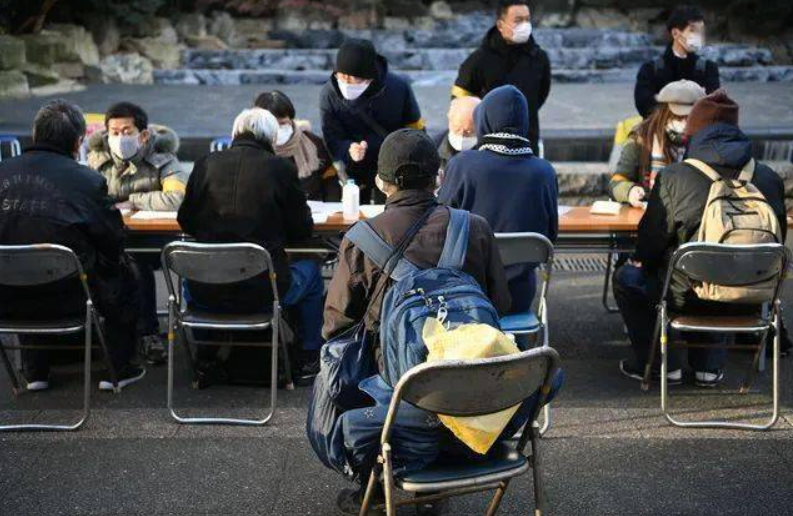

# 医保卡少了几十元，为啥年轻人焦虑了

_没了年轻人去创造财富，谁来支撑老后体面？_

**撰文 | 龚 正**

**编辑 | 脸 叔**

2月9日，平时阅读率不到1万的武汉医保（武汉市医保局官微），当日阅读率突破了10万+。这一天官微上发布了围绕当地医保改革的政策释疑，对民众关切进行了一次集中回应。

大众关注医保改革，直接原因是关注自身医保卡里的钱变化，而更深层次原因是伴随老龄化和人口趋势变化，人们对确保老后生活质量的财源稳定性存有忧虑。

不少年轻人担心自己在退休后，社会创造的财富难以支撑自己老后的体面，会如东亚邻国出现老后贫困问题，这形成了隐藏在当下社会氛围中的一种微妙空气。

**01**

**医保改了什么**

家住汉口80岁的陈爹爹，十分关注这一次本地的医保改革。医保改革前，每月入袋陈爹爹医保账户资金的钱是200多元，改革后，将只入袋80元左右。

陈爹爹说，自己体认改革，原因是他觉得之所以这样调整是相关方面“没钱了”，过去3年抗疫公家每天花的不少，但自己目前身体尚可，对于医保卡的平日使用，有病了就拿去看病；有余钱，会每年做点检查。偶有住院，一般自费2、3000元就出院了，自身医疗负担相对较轻，能接受调整。

“自己身边反应比较大的是那些家里无病的人。”以前卡里对他们来说是一笔可供支配的钱，改革后，卡里的钱减少，他们觉得自己“吃亏了”。陈爹爹说，这部分人是没有了解政策的全貌。

今年28岁的当地女孩嘉嘉也对医保改革十分关注。她说自己倒不会每月去查医保卡有多少钱，因为很少用到，只是看到今日会想到自己的老后，是不是也会为这一点儿钱去敏感。现在房价、物价摆在那里，也没了房地产去实现个人财务杠杆，担心自己老后的生活无足够财富去支撑品质。

针对这次改革的原因，当地医保局解释为，医保出现了“有病的不够花，没病的用不了”情况。

具体而言，就是“全市60%以上的个人账户沉淀资金趴在年轻和健康群众的账户中；另一方面，退休和患病群众的个人账户结存不够使用，门诊个人自费负担较重”。

有关注医保政策的专家，将这种情况用“苦乐不均”四个字来形容。

针对这种局面，当地医保采取的改革措施是，在不另外筹资、不新增单位和个人缴费负担的前提下，通过调整资金存量的使用结构，活化资金使用效率，来缓解这一矛盾。

可以一定程度上理解成，将健康人群日常不怎么使用的医保钱，划拨一部分到医保统筹账户，用来去帮助真正有需要的患病或常往医院跑的群众，达到医疗保障互助共济的目的。

举个例子，改革前一位当地市民医保卡里的资金，一部分来自个人缴费，一部分来自职工单位缴费。

这一制度可追溯于1998年，我国颁布了《关于建立城镇职工基本医疗保险制度的决定》，开始在全国建立城镇职工基本医疗保险制度，采用实行社会统筹与个人账户相结合的模式，两者分别承担不同的医疗费用支付责任。统筹账户支付住院及部分慢性病，个人账户支付门诊等。

改革后，市民医保卡里的钱，只能分配到自己的个人缴费，来自职工单位的缴费，会计入医保统筹账户。

如此一来，医保统筹账户的钱就变多了，能够通过账户内的资金结构优化，为包括病患以及常跑医院的患者在内的全民，提供更多保障服务。

此次当地医保改革，就计划将此前不能报销的门诊常见病、多发病门诊医疗费等，纳入到医保统筹账户的支付范围。

按照当地医保局的说法，这次改革，名义上发到职工医保卡里的钱会变少，但一旦参保人员生病或患有慢性病，享受的权益实际却是增多的。

_▲图 | 武汉医保局发布_

有着如此初心的改革，之所以引发了较大的民众关注，分析声音指出可能跟改革与民众的提前沟通和宣讲不到位有关，导致部分群体一看到曾经发给自己的医保钱变少了，直观认为自己的生活质量受损，出现了群体性的担忧。

而按照当地医保局出台的医保改革政策全貌，客观而言，确实出台了很多新的保障措施。

比如除了新增门诊常见病报销等外，还实现了职工医保个人账户家庭共济，也就是个人账户的适用范围，从此前的只能用于参保职工本人，拓展到本人及配偶、父母、子女。

同时，还拓展了职工医保个人账户使用范围，改革后除了可以用个人账户支付在定点医疗机构就医和药店买药产生的费用外，还可以用个人账户为配偶、父母、子女等支付城乡居民医保的个人缴费。

“客观而言，这一改革总体有利于患病群众以及社会整体的利益。”关注改革的专家表示。

**02**

**人们在担忧什么**

围绕武汉医保改革，社会的一个隐藏担心是，
“此次改革是否是因为医保基金不够用”。大众一般来自直觉的判断依据是，本地不断升高的老龄化，花费在医疗上的钱会越来越多。

据武汉市2021年发布的第七次人口普查结果显示，截至2020年11月1日零时，60岁及以上人口212.44万人，占比17.23%，比2010年上升4.55个百分点；其中65岁及以上人口145.62万人，占比11.81%，比2010年上升3.68个百分点。

与此同时，年轻人口增速却不及老龄化速度。0—14岁人口160.81万人，占比13.05%，比2010年上升3.07个百分点。15—59岁劳动力人口859.40万人，比2010年增加102.66万人，占比69.72%，比2010年下降7.61个百分点。

对于人们的担忧，当地医保局也给予了公开答复：“参保群众没有必要担心，总体来看，我市医保基金收支是平衡的，收支规模与经济发展水平相适应，基金保障能力稳健可持续。”

武汉的医保改革在全国并非个例。开年之后，陕西、湖南、山东等地医保也迎来变化，改革方向与武汉一致。

此次改革的溯源，来自于2021年4月印发的《关于建立健全职工基本医疗保险门诊共济保障机制的指导意见》。

在这份指导意见中，概述了医保改革的目标，列出了增强门诊共济保障功能、改进个人账户计入办法、规范个人账户使用范围等原则措施。

总体而言是将更多着力点用在活化基金使用效率上。根据2021年度全国医疗保障事业发展统计公报，2021年末我国医保个人账户的累计结余资金达到了11753.98亿元。有声音认为，确实如此一笔巨额资金，需要进行更合理的使用。

不过另一方面，人们还是会对时下不断展开的另一个事实而忧虑——即不断加速的老龄化和人口增长趋缓。未来不管是养老还是看病，人们担心的是支撑未来老后生活的财富创造速度会受到影响。

2022年，国家卫健委官网发布了《2021年度国家老龄事业发展公报》。公报称，截至2021年末，全国60周岁及以上老年人口26736万人，占总人口的18.9%；全国65周岁及以上老年人口20056万人，占总人口的14.2%。全国65周岁及以上老年人口抚养比20.8%。

这个比例的意思是，在当下有能力劳动的年轻人中，每100人需要承担21个65岁以上老年人的养老，也就是5名年轻人要赡养1位老人。而前些年这一比例还为8:1，年轻人的赡养负担在加重。

与此同时，用来创造社会财富的年轻人口比例却在不断下降。国家统计局数据显示，2011年，我国16-59岁劳动年龄人口达到峰值9.25亿人，从2012年开始下降。到2021年末，16-59岁的劳动年龄人口8.82亿人，占总人口的62.5%，比2011年减少了4300万。

更令人忧虑的是，承载着未来前景的新生儿人口不断下降。2011年，我国新生儿出生数量为1604万，2021年新生儿出生数量1062万，2022年末，国家统计局发布数据称，全年出生人口956万人，人口出生率为6.77‰；死亡人口1041万人，人口死亡率为7.37‰；人口自然增长率为-0.60‰。2022年全国人口减少85万人。

_▲网络图 | 人口趋势在深度变化_

对于人口下降带来的后果，一位观察人士称，过去几十年，社会上一直有个观点认为国家人口规模降一点，可能能与我国的资源禀赋与承载形成适配，但实则不然。

因为现在很多行业的产能可能是按照现有人口趋势或规模来设计。新生儿人口减少，意味着若干年后，数百万人口的需求将减少，产能一旦过剩，企业之间竞争将更加激烈，行业利润下降，而为了求生，企业缩减产能而减员，或将产能搬到人口增速较快的亚非地区，都有可能成为现实。这将最终会影响国内财富的创造以及各世代的利益。

武汉本地一位医药连锁行业从业者则认为，城市发展需要人口，特别是有质量的年轻人口。这才能支撑起城市财富的增长。

武汉2021年新增人口超120万，GDP在2022重回全国第八，这都是好的表现，但如果放在全省来看，其他城市人口都出现了一定下降，未来可能武汉尚因有外地人口的输入保持城市活力，那其他人口下降的城市的老后生活会如何，值得提前思考。

**03**

**邻国在发生什么**

作为邻国的日本，超高的老龄化和少子化所形成的局面，正在被更多人当作可能需要去面对的未来去思考。

最近在社交媒体上，2020年11月发生在东京涩谷的一件真人真事，又开始被人们翻出来重新审视。

当月16日，一名名叫大林三佐子的64岁女性在涩谷附近的巴士站被人打死，起初人们以为只是单纯的凶杀案，后来人们发现她是一个无家可归者，虽然她衣着整洁、举止体面。

再后来日本广播协会（NHK）通过采访调查了大林女士的青春时代，上过大专，年轻时是话剧团员，来到东京结婚后又离婚，有过演员梦，但没成功。

年轻时没运气，马上迎来老去。据说她曾在超市当过试吃推销员，但疫情袭来，客人没了，自己失业，晚上客宿室外车站，事件发生后警方只从她身上搜出8日元。之后，当地出现了女性集会，人们举着“她就是我”的牌子。

2022年9月，日本总务省发布的人口统计数据显示，日本65岁以上的老年人有3627万人，与前一年相比增加了大约6万人，老龄化率已经达到29.1%，刷新了历史最高纪录。

与此同时，老年人的贫困化率不断在加剧，冲击着长寿是福的东亚儒家观念。日本总务省统计局2019年的数据显示，日本65岁以上老人的贫困率达到27%，即每4个老年人家庭中就有一个处于贫困状态。

按照日本的标准，当地的贫困标准指的是年收入低于国民平均收入50％。按照日本年收入250万日元计算，年收入低于125万日元（按时下汇率为6.4万人民币）的即为相对贫困人口。

造成贫困的原因包含多样，比如年轻时不努力、年轻时赚到的钱遇到人生危机，越来越多的啃老族出现，经济长期低迷，工资多年不涨全社会需求紧缩等。

多年前，日本拍摄的一部纪录片《老后破产：名为“长寿”的噩梦》，引起了巨大的反响。片中展示了老龄化背后的社会现实，年轻时年收入超过 1000
万日元（按时下汇率，约为52万人民币）的中产精英，最后也因为经营失败，成为老后破产大军的一员。

_▲图 | 日本老龄化剧烈_

伴随着人口进一步老龄化以及新冠疫情，日本2021年的国民医疗费达到44.2万亿日元（约合人民币2.17万亿元）。

日本国内认为，目前日本的国民医疗是负担偏重于适龄劳动者，但给付偏重于老年人。随着老龄化加剧，75岁以上的人均医疗费将达到75岁以下的约4倍。如果不进行相关改革，此医疗保障制度难以持续。

如何才能让老后也能有一份保障，同时缓解因年轻人口不足而带来的劳动力危机，2021年4月，日本正式实施修订后的《老年人雇用安定法》，要求企业通过返聘、延长聘期等方式确保70岁以内人员的就业机会。

据统计，日本现在有25.1%的65岁以上老人还在工作。如果只统计65-69岁还在工作的老人，其比例则高达50.3%。

《日本经济新闻》的调查发现，认为自己“打算工作到70岁以上”的受访者，在70岁世代有45%、60岁世代为54%。

至于为何不想退休，回答“对晚年感到不安”者高达76％，至于为何不安，71%的人选择健康因素，68%的人选择生活资金等原因。

近期，全国多地传2023年将公布渐进式延迟退休方案，2055年前后将实现65岁男女同龄退休。

其实这在日本的退休发展史上也能看到。20 世纪 70 年代前，日本实行的是 55 岁退休制。1986 年，日本将退休年龄由 55 岁延迟至 60
岁；2006 年，退休年龄正式定在了 65 岁；2021年4月，日本正式进入70岁退休时代。

对于日后日益让人不安的环境，仅靠医保或养老金，来维持老后体面，可能存在较高的不确定性。现在一些年轻人已经开始想，“工作到人生最后一刻”或许将会成为维持老后体面的选择。

