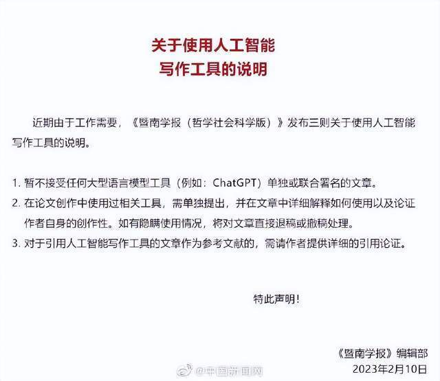
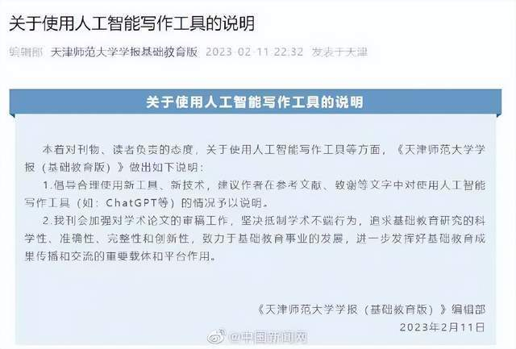

# 国内C刊声明：隐瞒ChatGPT使用情况将被退稿或撤稿

近期，《暨南学报（哲学社会科学版）》发布关于使用人工智能写作工具的说明。说明提到，暂不接受任何大型语言模型工具（例如：ChatGPT）单独或联合署名的文章。在论文创作中使用过相关工具，需单独提出，并在文章中详细解释如何使用以及论证作者自身的创作性。如有隐瞒使用情况，将对文章直接退稿或撤稿处理。对于引用人工智能写作工具的文章作为参考文献的，需请作者提供详细的引用论证。此外，《天津师范大学学报（基础教育版）》也发布相关声明，建议作者在参考文献、致谢等文字中对使用人工智能写作工具（如：ChatGPT等）的情况予以说明。（袁秀月）

来源：@中国新闻网

