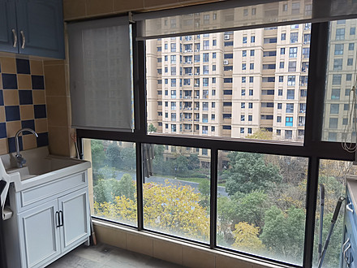

# 杭州83平方米“凶宅”170万起拍引关注，盘点那些拍卖的“凶宅”

近日，司法拍卖平台上，杭州上城区丁桥的融景公寓小区的一套法拍房引发了不少人的关注。瑕疵介绍中标注该房曾于2020年4月发生凶杀案，主卧内墙因有血渍局部采用墙纸粘贴。北京青年报记者发现，在司法拍卖网络平台上，类似这样的“凶宅”还有不少，有的已经拍卖出去，有的则处于流拍状态。这些拍卖的“凶宅”价格普遍要比一般房产低上不少。

**83平方米 “凶宅”拍卖引发关注**

据介绍，该房屋建筑面积为83.09平方米，土地使用权面积为5.6平方米，用途为城镇住宅用地/住宅，权利类型为国有建设用地使用权/房屋（构筑物）所有权，权利性质为出让/存量房产，登记日期为2018年11月26日，使用期限至2080年12月17日。

值得注意的是，拍卖方用红色加粗字体对该房屋的瑕疵进行了说明：该房产于2020年4月曾发生凶杀案，主卧内墙因有血渍局部采用墙纸粘贴。也就是说，这是一套“凶宅”。

拍卖页面显示，这套房屋将于3月13日10时至3月14日10时进行司法拍卖。起拍价为1700000 元，评 估 价
为2427700元。虽然目前距离拍卖还有28天，但已有317 人设置提醒。

**拍卖平台“凶宅”有的已成交有的流拍 售价普遍比市场价低**

北青报记者以“凶宅”作为关键词在司法拍卖检索发现，类似这样的房产还有不少，有的已经拍卖出去，有的则处于流拍状态。

比如，上海市闵行区的一套86.73平方米的公寓房屋，拍卖页面提醒该房屋曾发生过人员非正常死亡的事件。北青报记者检索某房产交易平台搜索该小区的成交价格发现，该小区与拍卖房产差不多面积的房屋最终成交价格普遍在730多万到780多万之间。而这套房屋最终经过54次出价，以690万的价格成交，比市场成交价低了至少40万元。

温州市鹿城区一套2022年7月拍卖的建筑面积137平方米的房屋，起拍价为216万元，评估价为383万余元。该房屋的瑕疵介绍同样用红色字体标注着2013年9月，该房屋内发生过跳楼自杀事件，介意者慎拍。某房产交易平台成交记录显示，最近成交的一套与被拍卖房屋面积差不多的房屋最终成交价格为328万余元。最终，经过31次延时，这套拍卖的房产以281万余元的价格成交，比普通房屋便宜了40多万元。

司法拍卖平台上，苏州市吴江区拍卖的一套面积为82平米的房屋，市场价为170万，起拍价为96万。拍卖页面中直接标注该房屋为凶宅，并提示该房屋内发生过烧炭自杀死人事件，购买者购买视为接受该状况。这套房屋经过多次出价和16次延时，最终以128万元的价格成交。某房产交易平台该小区的交易记录显示，同时期该小区与被拍卖房产面积差不多的房屋成交价格普遍在140万以上。

除了拍卖成功的，还有一些凶宅，虽然价格较市场低了不少，但最终因为无人出价，最终流拍。比如，杭州市余杭区一套被拍卖的房屋，拍卖页面提示该房屋原产权人在房屋中自杀，该房屋起拍价为450万，市场价则为600多万。

**中介：与一般房产比 “凶宅”普遍不好卖**

一名房屋中介告诉北青报记者，他之前在卖房的时候也曾经碰到过
“凶宅”这样的房屋，当时房主主动把房子的情况告诉了他，他带客户看房的时候就把情况如实跟客户说了，最终这套房屋没有成交。根据他的经验，这类房子普遍不太好卖，即使价格差距非常大。

**有犯罪分子通过编造“凶宅”消息犯罪 买到“凶宅”可要求撤销购房合同**

2月11日，北青报记者以凶宅检索中国裁判文书网发现，相关搜索结果显示有658个。

在一些刑事案件中，犯罪分子通过编造“凶宅”进行诈骗或者盗窃。安徽省天长市人民法院审理的一起案件中，吴某、姚某以看风水、可施法破解凶兆为名，先后骗取三名被害人钱财共计一万余元。其中，他们以被害人家是凶宅，影响被害人儿媳的胎儿为由，骗取被害人5000元。

而在河南省洛宁县人民法院审理的一起案件中，被告人谎称被害人家的房屋是凶宅、需要做法事消灾，让被害人将现金放在屋内的桌子上，用毛巾盖住并要求被害人在天黑前不能将钱取出，后趁被害人在地上跪拜时，被告以掉包的方式将压在毛巾下的现金盗走。

而在涉凶宅的民事案件中，多为买房者在不知情的情况下买到“凶宅”，进而起诉要求撤销购房合同。北青报记者检索多个案例发现，这种情况下，如果确认卖房人在出售房屋时未向买方如实披露相关情况，那么就有违诚信原则以及公序良俗原则，法院普遍会支持买房人撤销购房合同的诉求。

比如，在重庆江北法院近日宣判的一起涉“凶宅”案件中，法院依法判决撤销原告和被告签订的《房屋买卖合同》，被告返还原告陈某房屋定金，并支付保全担保费、律师费等。
法官表示，人们通常所说的“凶宅”，是指发生过自杀、凶杀等非正常死亡事件的房屋。一般情况下，公众会对“凶宅”产生避讳心理，导致房屋贬值或影响买受方的购买意愿，进而对房屋买卖产生重大影响。择善而居、趋利避害，是一种善良无害的传统风俗。公众对于“凶宅”的避讳心理属于公序良俗的范围，应予尊重。依据诚实信用原则及对传统风俗的尊重，在二手房交易过程中，若是房屋曾发生过非正常死亡事件，出卖方负有向购房人如实披露相关信息的义务，未履行该义务则构成消极欺诈，购房人有权主张撤销购房合同。

而在天河法院宣判的一起案件中，法院认为被告在出售涉案房屋时未向原告如实披露该房屋曾发生非正常死亡事件有违诚信原则以及公序良俗原则，双方就涉案房屋签订的买卖合同属于因重大误解而订立的合同，依法判决撤销《房产买卖合同》。法官表示，虽然法律没有对“凶宅”进行准确界定，“凶宅”属性也不影响房屋的实际使用价值，但却会严重影响购房者的心理感受。所以，在房产交易过程中，出售者要充分履行合同披露义务，对房屋的情况进行如实、全面的介绍；购房者也应对房屋的相关情况进行全面深入的调查，不仅要清楚房屋权属登记情况、有无共有人、是否属于共同财产等，还要向物业公司、邻居了解该房屋是否发生过特别事件等情况，充分考虑各种因素后再决定是否签订购房合同，避免不必要的纷争。

**律师说法**

**法律未对“凶宅”进行准确界定 卖方应告知**

陕西恒达律师事务所律师赵良善认为，“凶宅”的概念并无权威官方界定，法律也没有对“凶宅”进行准确界定。对凶宅的定义，应当遵从普通民众的通常认知，即曾发生自杀或凶杀等人为因素致人非正常死亡的房屋，具体包括发生他杀、自杀以及意外事件等情形。如果有人在房屋内正常死亡的，则不属于凶宅。

在房屋销售时，卖方或中介方有告知的法定义务。因为凶宅系房屋的重大瑕疵，会影响房屋的正常使用，是影响合同订立、履行、房屋价格的重要因素，因此，如果卖方或中介方未履行告知义务，在合同订立过程中刻意隐瞒凶宅这一事实，卖方或中介方则构成民事欺诈。

赵良善建议，购房人如果买到凶宅，可以先与卖方或中介方协商处理，如协商不成，可诉诸法院，要求法院判决撤销双方的合同，维护自己的合法权益。

文/北京青年报记者 李铁柱

