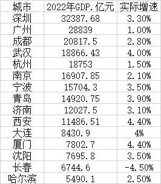

# 15个副省级城市2022年GDP：三城超2万亿，武汉超杭州

副省级城市在行政级别上仅次于直辖市，是我国中心城市体系中的重要一环，在引领区域经济发展方面起到重要带动和辐射作用。2022年，这些城市的经济发展表现如何？

第一财经记者通过整理统计了15个副省级城市2022年GDP及增速后发现，目前已有深圳、广州、成都三个副省级城市GDP超过2万亿，比上一年增加一个。从位次变化来看，2022年，武汉近三年来首次反超杭州，厦门连超长春和沈阳。

**深圳连续11年领跑**

目前，全国共有15个副省级城市，包括广州、武汉、南京、成都、西安、杭州、济南、哈尔滨、沈阳、长春这10个省会城市以及深圳、厦门、宁波、青岛、大连这5个计划单列市。

15个副省级城市中，深圳和广州作为一线城市，稳居GDP前两名。其中，深圳自2012年超过广州后，已连续11年在副省级城市中位居第一。数据显示，2022年深圳市GDP为32387.68亿元，同比增长3.3%。

工业是深圳傲视群雄的关键。数据显示，2022年，深圳全市规模以上工业总产值超过4.5万亿元，连续四年位居全国城市首位；全部工业增加值超过1.1万亿元，首次位居全国城市首位。也因此，深圳首次成为规模以上工业总产值、全部工业增加值“双第一”城市，工业第一大市地位更加稳固。增速方面，2022年深圳全市规模以上工业增加值同比增长4.8%，高于全国、全省，在一线城市和工业大市中保持领先水平。

同时，2022年，深圳固定资产投资同比增长8.4%，跃居一线城市第一，以较大幅度高于全国和全省。深圳工业投资继续保持良好增势，增长19.2%，其中，制造业投资增长15.4%。

深圳社会主义学院副院长谭刚教授对第一财经分析，深圳的制造业占比在一线城市中是最高的，这几年深圳一直坚持以工业为立市之本,坚持“制造业当家”。

谭刚分析，深圳的一大优势是能够把创新成果迅速就地变成生产力、变成产业产品、变成市场。深圳在创新链与产业链方面结合得比较好。深圳建立的全过程创新生态链把深圳最有竞争力的研发成果就地产业化，在这个基础上向前延伸做基础研究、攻关，向后延伸做金融支撑服务和人才引进。这个生态链把创新和产业很好地结合在一起，形成深圳自己的特色和优势。

深圳之后，广州的GDP以28839亿元稳居第二，总量与深圳的差距拉大到了3548.68亿元。在全国所有城市中，广州多年来首次被重庆超过，位居全国第五。

广东省体改研究会执行会会长彭澎对第一财经分析，广州的三产比重较高，去年受疫情影响明显。随着疫情防控措施的优化，今年广州的第三产业会有比较明显的恢复。但广州面临的压力不光是三产的问题，目前广州还需要在新兴制造业发力，要在技术、产业链等方面提升。

位居第三的成都2022年GDP实现了新突破，全市实现GDP达20817.5亿元，首次突破2万亿大关。至此，已有3个副省级城市GDP突破了2万亿大关。

近年来，成都的高新产业快速发展。据成都高新区消息，该区2022年高新技术企业认定申报数突破2000家，达到2253家，增长54%；同时，净增高新技术企业超过1000家，创下历史新高，全区有效高新技术企业总数突破4000家，达到4320余家，增长30.4%。

**武汉近三年首超杭州**

前三名之后，武汉和杭州两个城市2022年GDP也都超过了1.8万亿元，正在向2万亿大关迈进。

从名次上看，今年副省级城市的一大变化是，武汉在2019年之后，三年来首次超过杭州，位居副省级城市第四，杭州则退居第五。

从近年的变化来看，2020年之前，武汉GDP位居杭州之前。数据显示，2019年，武汉GDP比杭州高出850亿元，2020年，受疫情影响，武汉GDP总量被杭州超过，两地相差490亿元，这一位次上的领先延续到了2021年；2022年，武汉GDP三年来首次超过杭州，领先杭州113.43亿元。

数据显示，2022年武汉实现GDP18866.43亿元，比上年增长4.0%。同期杭州GDP为18753亿元，比上年增长1.5%。从数据上看，武汉第二产业增加值6716.65亿元，增长7.3%，占GDP比重为35.6%。同期，杭州第二产业增加值5620亿元，增长0.4%，占GDP比重为30%。可见，武汉的二产占比更高，且增速更快。

数据显示，2022年，武汉规上高技术制造业增加值增长16.3%，增速快全市规上工业11.3个百分点，年内始终保持两位数增长；增加值占全市规上工业的比重为17.1%，比上年提高1.0个百分点；对全市规上工业增长的贡献率为55.7%，比上年提高19.0个百分点。

杭州规划委员会专家委员会副主任委员汤海孺对第一财经分析，武汉是中部地区的中心城市，对整个中部地区的带动作用很强，其第二产业发展十分突出。相比之下，杭州这些年抓住了互联网的风口，在数字经济发展方面成绩较为亮眼。但在这个过程中，怎么样进一步保持、发挥优势，怎么样进一步从消费互联网走到工业互联网、进一步推动智能智造的发展，杭州还有不少短板。

“深圳的创新链和产业链齐头并进，创新链又赋能到产业链的发展。”汤海孺说，杭州的创新链走在全国前列，但创新链与产业链之间的关联度比较弱。因此杭州需要把产业链进一步补足，让创新链和产业链有更好的对接。

南京、宁波、青岛、济南、西安位列副省级城市第6至第10位。其中，宁波的GDP首次突破1.5万亿元大关。

与上一年一样，15城中GDP超万亿的城市仍为10个。5个尚未超过万亿大关的副省级城市为东北4市以及来自东南沿海、土地面积和人口总量最小的厦门。也就是说，目前整个东北地区中，尚无一个GDP万亿城市。

从这几个城市的位次来看，去年，厦门连超长春和沈阳两市，上升至副省级城市第12位。数据显示，2022年厦门实现GDP7802.7亿元，增长4.4%，增速与西安并列副省级城市第一位。

厦门大学经济学系副教授丁长发对第一财经分析，一方面去年长春等受疫情影响较大，厦门相对来说受疫情影响比较小；另一方面，去年厦门投资、消费等方面的增速都比较快。他预计，未来几年厦门有望赶超大连，进而完成对东北4个副省级城市的全面赶超。

数据显示，2022年，厦门固定资产投资增长10.2%，分别高于全国、全省5.1个和2.7个百分点，为全市稳增长促发展发挥了关键作用；社会消费品零售总额增长3.1%，高于全国3.3个百分点，增速较去年上半年回升2.8个百分点。

