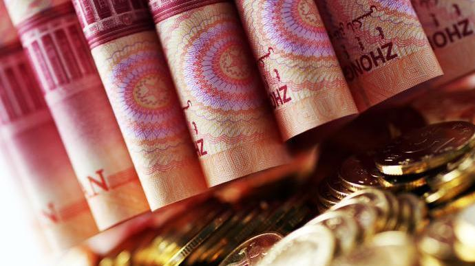

# 1月新增居民存款超6万亿创新高：超额储蓄从哪来，有望向哪释放

随着1月居民存款新增规模创下单月新高，“超额储蓄”现象再度引发关注。

中国人民银行2月10日发布的数据显示，1月份人民币存款增加6.87万亿元，同比多增3.05万亿元。其中，住户存款增加6.2万亿元。居民存款多增在2022年表现已经非常明显，去年住户存款增加17.84万亿元，远远高于2021年（当年住户存款增加9.9万亿元）。

居民存款为何持续多增，超额储蓄是否会迎来转化，消费、地产、资本市场等领域是否会受益，成为市场关注的焦点。

超额储蓄从何而来

尽管对超额存款的规模测算不一，但机构普遍认为，2022年存在明显的“超额储蓄”现象。

央行《2022年第四季度城镇储户问卷调查报告》也显示居民的储蓄热情高涨，去年四季度倾向于“更多储蓄”的居民占61.8%，这一比例为有统计以来的最高值。

中信建投证券首席经济学家黄文涛测算认为，2022年超额存款7.8万亿元，超额储蓄上升的主要原因中，消费、地产、理财赎回占比约4:3:1。具体来说，消费方面，约有4万亿减少，从消费支出缺口结构上看，主要缺口来源是居住支出、教育文娱支出和医疗保健支出，分别对应地产和服务消费。净储蓄上行的第二个贡献项目是购房需求，不考虑产业链消费，仅房地产销售一项减少约3万亿。理财向存款转移，约为净存款增加贡献1万亿元。

中金公司林英奇、许鸿明等在研报中指出，2022年居民存款同比多增8万亿元，但居民“超额储蓄”规模约为8万亿元的观点存在高估，因为并未考虑银行理财产品赎回和收入增加的影响，其估算2022年居民“超额储蓄”规模可能在3万亿元左右，而居民存款多增中约4万亿元由理财产品转为存款贡献，1万亿元由居民收入自然增长贡献（假设居民储蓄率与2021年持平）。

“不同定义下的‘超额储蓄’的规模并不一致，但无论是将理财余额纳入统计，亦或是计算居民收入与支出的同比增速差，均反映出2022
年存在明显的‘超额储蓄’。”中信证券首席经济学家明明在报告中认为，超额储蓄的来源包括三方面：一是资产价值与收入水平的不确定性增大，居民倾向于更多的储蓄；二是受房地产行业风险等影响，居民部门的购房意愿有所降低，潜在的购房配置资金向储蓄转移；此外，受疫情影响，消费场景的缺失也使得2022年以来居民消费支出显著低于潜在规模。三是随着2022年末防疫政策优化、地产支持力度加码、经济预期好转，债市收益率大幅上行，理财净值普遍受损，导致投资者纷纷将理财赎回至存款。

华创证券也指出，2022年居民17.8万亿的存款增长主要体现为定期存款的明显多增，其背后或反映了2022年房价回落+股票熊市+理财赎回的情境下，居民被迫以定期存款作为资产配置的选项。

“定期存款大幅多增的背后可能是居民资产配置的更改。居民的资产配置可以简单分为房地产、股票、证券投资基金、理财、定期存款等五大项。2022年，以70大中城市新建商品住宅价格为代表的房价同比转负，结束了2016年-2021年的房价持续抬升；上证综指回落550点，结束了2019年以来的三年牛市；开放式的公募基金净值从2020年和2021年30%的年度增长回落至0%；理财则面临赎回扰动，破净率明显抬升。”华创证券首席宏观分析师张瑜认为。

不过，市场也有不同的观点。中金公司研究部首席宏观分析师张文朗等在研报中指出，居民存款的上升，财政与准财政的支持是主要因素。

该机构通过对M2的拆分发现，去年M2同比增速相比2021年底上升2.8个百分点，其中财政直接贡献了1.9个百分点（包括央行利润上缴），如果其将7400亿元政策性金融工具也纳入“财政”的口径来考虑，那么财政的贡献将达到2.2个百分点，这还没有考虑其他政策性信贷、普惠金融对于M2的支持。

居民高储蓄如何转化

在1月创下单月最高记录后，居民存款是否会继续走高，以及可能向哪些领域释放成为市场关注的焦点。

光大证券指出，除去银行贷款等资产业务派生存款以外，春节错位因素也是形成1月多增的一个重要原因。去年1月末恰逢春节假期，大量存款转化为现金；今年1月末时春节假期已结束，现金陆续回流银行体系并形成存款。值得一提的是，这也是今年1月M0增速大幅下降至7.9%的主要原因。春节因素也造成了居民户存款的多增。今年春节在1月，较多企业有春节前支付年终奖、过节费的习惯，因此1月会有大量企业存款转化为居民存款。

招商证券则指出，回顾历史来看，春节当月居民存款与企业存款一直存在此消彼长的关系。后续居民存款走势仍需持续观察。

“展望2023，宏观经济政策与居民行为的改变都会影响居民存款。我们认为不应该将居民存款看作一个等待着开闸泄洪的‘蓄水池’。除了静态地考虑当前已累计的居民存款外，也需要判断货币、财政政策对于货币体系的影响。”上述机构认为。

对于消费、地产与金融投资等潜在的消化路径，明明认为，其一，不宜高估超额储蓄对消费的提振；其二，向地产释放仍需观察预期修复，超额储蓄能否顺利向地产行业释放、刺激房地产销售，关键在于居民对于交付问题的信心改善以及对房地产财富效应的预期判断，目前政策有所支持，但房地产财富效应与房价增速仍然是一个长期制约，预计超额储蓄向房地产行业释放的规模有限。其三，资本市场也是重要流动方向，居民超额储蓄在短期内无法大量进入消费、地产领域的情况下，考虑到目前金融资产在经历了调整后具备了一定的配置价值后，一部分超额储蓄后续很可能流入资本市场。

国盛证券则认为，消费、楼市与金融市场均有望受益，具体消化路径与节奏将取决于居民意愿修复和资产回报预期。从存量视角出发，防御性储蓄更多源自对未来收入的悲观预期，这将直接制约居民的房产、耐用品购置，以及潜在消费升级可能也会阶段性转化为消费降级，因此存量储蓄的释放将更多流向消费与楼市；从增量视角出发，历史经验表明，新增储蓄与投资的关联度往往更显著，而与消费的关联实则相对较弱，反映出储蓄意愿的边际调整可能与居民投资意愿调整挂钩更为直接。投资意愿修复的具体体现则往往依赖于赚钱示范效应，本轮预计股市或率先受益。

浙商证券首席经济学家李超等预计，2023年居民存款搬家，将分流至实体部门及资本市场，其中，部分“被动储蓄”将随疫情形势改善而逐步释放，主要体现为居民消费及购房活动的回暖；而“预防性储蓄”主要源自居民悲观预期及产业结构转型。对比1998年后的居民储蓄释放，当前我国经济领域各项政策核心在于围绕共同富裕、为民生领域降成本，打击相关高杠杆、高收益行业过度扩张，包括抑制房价过快上涨、限制平台公司垄断运营、整治教培行业乱象、推进医疗体系集采等，推动全体人民共同富裕。也因此，居民超额储蓄在无法大量进入消费、地产领域的情况下，资本市场将是核心外溢方向。

