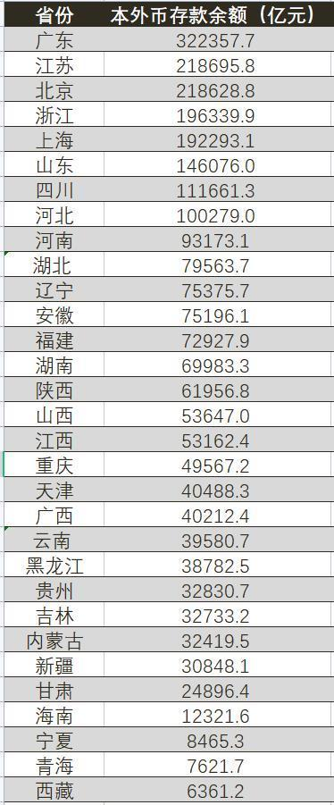
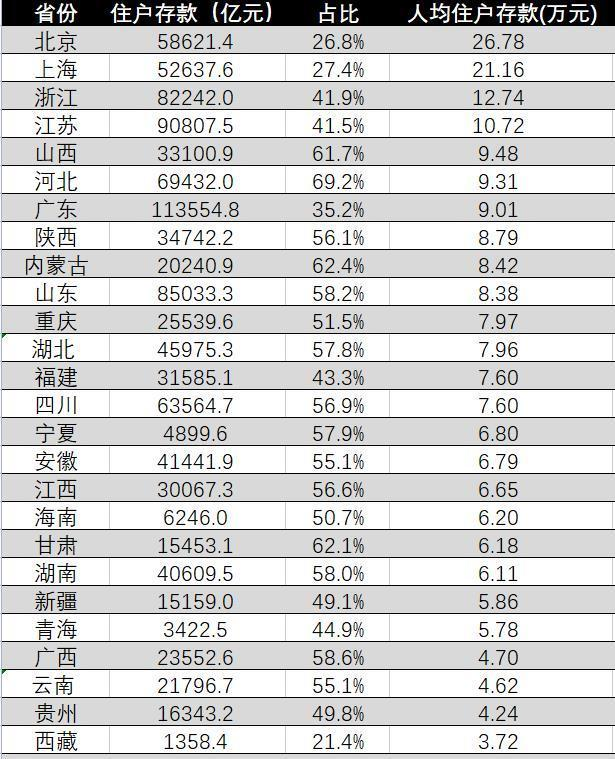

# 31省市存款盘点：广东突破30万亿大关，京沪人均住户存款超过20万

**21世纪经济研究院研究员吴文汐 作者王帆**

在GDP之外，资金总量，即金融机构本外币存款余额往往也被作为地区发展的一个重要参考，一般而言，资金总量越充足，也意味着地区的“吸金”能力更强。

根据统计口径，金融机构本外币存款余额分为境内存款和境外存款，其中后者的份额较小，而前者一般又分为住户存款、非金融企业存款、机关团体存款、财政性存款以及非银行业金融机构存款。

来自中国人民银行的数据显示，2022年12月末，本外币存款余额264.45万亿元，同比增长10.8%。2022年全年，人民币存款增加26.26万亿元，同比多增6.59万亿元，其中尤其值得关注的是，住户存款增加17.84万亿元。而作为对照，2021年全年住户存款增加9.9万亿元。这意味着，2022年新增居民储蓄对比上一年有了大幅增长。

21世纪经济研究院梳理了全国31省2022年末本外币存款余额情况，其中重点关注当中的住户存款情况。

在经济研究人士看来，受收入预期转弱的影响，居民消费支出增速下滑，且居民部门减少了购房和理财等投资性支出，这是2022年居民部门超额储蓄的主要来源。

21世纪经济研究院认为，居民部门超额储蓄的合理释放，将成为今年中国经济扩内需的其中一个重要基础，但如何实现，依赖的是居民收入的增加，收入预期的修复以及收入结构的优化。

**广东存款余额突破30万亿**

整体而言，各省份的本外币存款数据与经济体量有着高度相关性，GDP越高的省份，存款余额往往也更高。

2022年末，中国经济第一大省广东一枝独秀，本外币存款余额突破30万亿，达到32.24万亿元，也是全国唯一一个突破30万亿的省份。而GDP排名第二的省份江苏，存款数据为21.87万亿，位列全国第二。

北京的存款余额直追江苏省，位列第三，但北京的GDP与江苏有着不小的差距。这也反映出，存款余额数据除了反映地区的产业实力、人口规模、居民收入水平等之外，同时也很大程度取决于地区的定位与级别。

同为直辖市的上海，其存款余额位列第五，仅与第四名浙江有小幅差距，而上海的GDP与浙江同样差距甚远。

这主要是因为，北京、上海是全国金融机构最多的两大城市，这些金融机构包括证券交易所、公募基金、私募基金等。两地的数据显示，北京、上海非银行业金融机构的存款余额分别为3.9万亿元和3.4万亿元，这已经相当于云南、黑龙江、贵州、吉林等省份的存款余额之和。

因此，金融机构众多的地区，尤其是拥有证券交易所的地区，在资金总量上往往有着较大优势，而除了虹吸资金之外，也能够更加有利地推动当地企业上市融资。

以广东省为例，除了有着全国最大的经济体量之外，广东还拥有深交所、广州期货交易所等，2022年非银行业金融机构的存款余额为3.3万亿，与北京、上海相差不远，而大幅超出江苏省的1.3万亿。

与此同时，北京、上海两地的总部经济发达，这亦是资金量雄厚的重要基础。2022年末，北京、上海的非金融企业存款分别达到了7.1万亿和7.3万亿，已经相当于安徽、福建等省份的总量存款余额。

浙江省的存款余额位居全国第四，位居GDP更靠前的山东省之前，且拉开了约5万亿元的差距。分部门来看，浙江和山东的住户存款分别为8.2万亿和8.5万亿，但需要注意的是，根据第七次全国人口普查数据，两地常住人口数量分别为6456.8万人和10152.7万人，浙江仅约为山东省的63.6%，这也意味着，浙江的人均住户存款较高，佐证了浙江广为人知的“民富”实力。另一方面，非金融企业存款项目下，浙江和山东分别为7.2万亿和4.2万亿，也反映了浙江非金融企业的实力。

再往后，诸多省份的存款余额在2022年迈上了新的台阶，四川、河北超过了10万亿，河南超过了9万亿，湖北、辽宁、安徽、福建超过了7万亿，湖南、陕西超过了6万亿，山西和江西则超过了5万亿。

这很大程度得益于各地较快的存款增速，包括江苏、浙江、山东、河北、河南等存款数据位居前列的省份，其存款余额均实现了双位数的增速，且超过了全国同期增长10.8%的水平。

**2022年末31省本外币存款余额情况**

_（数据来源：中国人民银行各分行及中心支行，其中湖南的数据截至2022年11月底。）_

**京沪人均住户存款超过20万元**

在存款数据中，住户存款与居民个人息息相关，同时也是地区存款的重要组成部分。

在已披露住户存款数据的20余个省份中，从住户存款占总存款余额的比例来看，北京、上海、西藏占比低于30%，广东为35.2%，其他省份则均在40%以上，山西、河北、内蒙古和甘肃甚至达到了60%以上。这一方面部分反映了不同地区的储蓄意愿、资产持有方式偏好，另一方面也受到不同地区经济活力的影响。

从地区住户存款总量的角度来看，其主要受到人口数量、人均可支配收入、储蓄意愿等因素的影响。人口净流入的地区，往往意味着有着充足的工作岗位的吸引力，从而拥有更高的住户存款。

以广东省为例，除了是全国第一经济大省之外，广东亦是全国第一人口大省，其住户存款规模达到了11.4万亿元，高居全国之首。

但在人均住户存款指标中，广东在已披露数据的20余个省份中仅位列全国第七位，为9.01万元。不能忽视的是，广东仍然存在省内区域发展不平衡的情况，部分地区的人民富裕程度还有待提升。另外需要强调的是，人均住户存款高，并不一定绝对等同于人均财富多，以广东为代表的东南沿海地区，其资产往往以更多元的形式存在，存款只是其中一个方面。

整体而言，北京的人均住户存款高居榜首，达到了26.78万元，其次为上海的21.16万元，浙江以12.74万元领衔除直辖市外的其他省份，其次为江苏10.72万元，山西9.48万元，河北9.31万元。

中国人民银行数据显示，2022年，全年人民币存款增加26.26万亿元，同比多增6.59万亿元。其中，住户存款增加17.84万亿元，非金融企业存款增加5.09万亿元，财政性存款减少586亿元，非银行业金融机构存款增加1.38万亿元。在不同类别的存款当中，住户存款增加的贡献最大。

21世纪经济研究院认为，一方面，住户存款的增长，增强了居民抵御风险的能力，并且一定程度上需要居民可支配收入增长的支撑。但另一方面需要看到的是，这一现象也意味着居民更倾向于持有现金的趋势，而相应地减少了消费与投资。从2022年全年的情况来看，疫情此起彼伏导致消费场景受限，理财收益不稳定，投资性消费减少，对未来的收入预期趋弱,收入结构恶化等，皆是居民储蓄增加背后可能的原因。

从住房消费的角度观察，国家统计局数据显示，2022年，全国商品房销售额133308亿元，下降26.7%，其中住宅销售额下降28.3%。

来自银行方面的数据显示，截至2022年6月末，6家国有大行的个人存款总余额约为62.34万亿元，较2021年年底增加5.20万亿元。其中，定期存款增长是个人存款增长的主要原因，2022年6月末，6家国有大行个人定期存款较2021年年底增加4.47万亿元，每一家的定期存款增速均在10%以上。

2022年，全国居民人均可支配收入36883元，比上年名义增长5.0%，扣除价格因素，实际增长2.9%。对比可知，2022年，住户存款的增速远高于人均可支配收入的增速。

21世纪经济研究院认为，在2023年经济复苏的背景之下，扩内需变得至关重要，这其中主要包括消费和投资，超额储蓄的释放将成为今年消费复苏的一个重要基础。但如何真正促成居民消费乃至投资，并不能依靠简单的呼吁，而是要切实让居民恢复消费和投资信心，包括对中国经济增长的信心，就业的信心，未来预期收入增长的信心等。

此外，对于居民部门而言，低收入群体的边际消费倾向往往较高，但消费能力受到收入的制约，高收入群体持有超额储蓄规模大，但边际消费倾向相对较低。从全国各省的对比来看，不同地区之间的人均住户存款差距悬殊，切实提高欠发达地区的居民收入水平，亦是促进扩内需的根本。

**2022年末各省住户存款情况**

（数据来源：中国人民银行各分行及中心支行。其中计算人均住户存款时，所用人口数据来自于第七次全国人口普查，湖南的住户存款数据截至2022年11月底。个别省份尚未披露截至2022年12月底的住户存款数据。）

