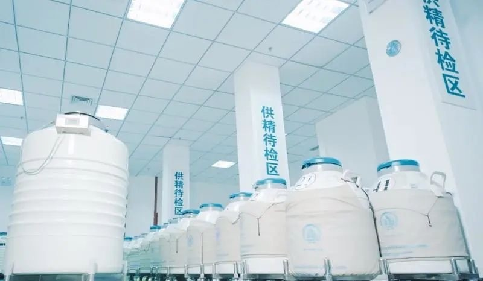

# 不再神秘的“捐精”：多地发布倡议书背后的需求、捐助与讨论

“冬去春来，高校陆续开学。我们倡议，广大在校学生能献出一份爱心！”连日来，多地人类精子库向大学生发出捐精倡议书，在网上引发广泛关注和讨论。捐精从幕后走向台前，变得不再神秘。

这背后有着一定的需求。2月12日，广东省人类精子库主任张欣宗告诉南都、N视频记者，全国已婚夫妇中不孕不育的比例约15%-18%，其中50%是因男性精子问题。

在捐精志愿者中，最终的合格率只有20%左右。因为要求严格，即使有过生育经验的男性也未必能成为合格的捐精者，可谓优中选优。历经重重筛选，正式成为捐精者之后，又将会面临什么？南都记者采访了捐精者，38岁的杨先生去年完成捐精，“我留意到网上有关于后代可能近亲结婚的讨论，这种概率就跟中彩票一样低，我完全不担心”。同龄的贺先生15年前就完成了捐精，“虽然我现在还没结婚，但一想到可以帮助这些家庭就很开心”。

**优中选优**

“冬去春来，高校陆续开学，往年，来精子库捐献的志愿者朋友中，相当一部分是青春灿烂的在校大学生。去年以来，由于疫情，精子库缺少了你们宝贵的身影，我们倡议，广大在校学生能献出一份爱心！”

连日来，陕西、北京、山东、云南等多地人类精子库向当地大学生发出捐精倡议书，迅速在网上引起热议。

倡议背后是广泛的需求。张欣宗向南都记者介绍，全国已婚夫妇中不孕不育的比例约15%-18%，其中50%是因男性精子问题。人类精子库的精液不直接提供给不育家庭，只供给各医院有资质的生殖中心，由生殖中心为婚姻内的夫妇做辅助生殖技术助孕。

事实上，筛选捐精者的标准并不低。根据多地发布的捐精倡议书，捐精者需符合相关条件，如无乙肝、色弱等传染病、遗传病，身高在165cm、168cm或170cm以上，年龄在20至45周岁。部分地方规定捐精者应有大专及以上学历或在读。北京人类精子库还特别提到，捐精者五官端正，无明显脱发等。

张欣宗以广东省人类精子库为例介绍，“我们对捐精志愿者的年龄要求是20-45周岁，但捐精主力人群在20-30岁之间，且该年龄段的志愿者合格率也相对较高”。在报名参加筛查的捐精志愿者中，包括在读大学生、研究生、博士生在内的人群占比为35%左右。

捐精志愿者除了要满足年龄、身高、学历、健康等基本条件外，还要进行严格的健康筛查，包括体格检查、性传播疾病、遗传病检查以及精液质量评估等。

合格比例低到令网友们吃惊。“筛选完毕后，最终志愿者的合格率只有20%左右。大学生群体稍微好一点点，但是没有太大差异。”张欣宗解释，捐献精子不达标准是志愿者被淘汰最主要的原因。

实际上，人类精子库对捐精志愿者的精液质量评估标准远远高于正常生育人群的标准，如精子浓度大于60x106/ml，存活率大于60%，其中前向运动精子大于60%等。“虽然很多人生育过小孩，具备生育能力，但不一定能达到这个标准，能成为合格的捐精志愿者，都是优中选优。”

**做出决定**

今年38岁的贺先生，早在15年前就完成了捐精。前年，他曾出于好奇打电话给浙江省人类精子库询问五份精子的使用情况，工作人员称只要是合格的精子一定会被使用，市场供不应求。

贺先生向南都记者笑道，“虽然我现在还没结婚，但可能已经有五个素不相识的孩子了哈哈”。

2月12日，他向南都记者回忆起捐精的历程。2008年，恰逢浙江省人类精子库在开展捐精宣传，他打电话咨询之后决定报名，“觉得好玩，想去探探秘，而且这本身是公益事业，国家提倡、社会需要。作为年轻人，应该对新鲜事物保持更开放的态度”。

捐精对年龄、身高、体重和学历有要求。“我当时23岁，身高175cm，这些硬性指标没问题。”贺先生第一次到浙江省人类精子库时，需要体检、验血、签署捐精同意书。工作人员采集照片后，对相貌进行评估。

江苏南京的杨先生和贺先生同龄，多年前从一所985高校硕士毕业后成为了一名律师，每月要前往上海出差两三次。去年，他偶然路过上海市人类精子库，很快就做了决定，并顺利完成了捐精。

“我身边也有一些朋友饱受不孕不育的困扰，就当作为国家做贡献，中国还有句老话叫作‘多子多福’嘛。”在杨先生看来，捐精并没有特别之处，就跟献血一样正常。

“第一次需要测量身高、体重、血压、精子质量等，还要带上学历证书。第二次再来验血，检查有无基因疾病，最终我顺利通过了筛查。”杨先生作息规律，每天晚上12点前睡觉，第二天早上7点前起床，每周坚持锻炼。

医生曾向他介绍，由于许多年轻人作息不规律，喜欢熬夜，有时候精子活力检测通过率甚至比不上30岁左右的人。“像我们这个年纪，经济相对独立，一般是基于对自己的身体状况比较了解，才决定去捐精。有些大学生可能是为了拿到几千元的补贴去捐精，但事先没有做充分的判断，所以会被淘汰。”

杨先生和贺先生均是硕士毕业，近日全国多地发出的捐精倡议书，也几乎都要求捐精者具有大专及以上学历。

“事实上，国家层面对捐精志愿者并没有学历方面的要求。但是各个精子库具体运行时发现，患者在选择精子的时候会对学历有偏向性，比如学历低的，患者就不愿意用。”张欣宗向南都记者解释，正因如此，各个精子库才会对捐精者的学历有适当的要求。

**“取精”之路**

顺利通过筛查后，便进入了正式捐精流程，捐精者大约需要在半年内进行约10次取精。

杨先生说，每次取精前要禁欲3-7天，虽然医生没有要求戒烟戒酒，但自己捐精前尽量不饮酒，平时也不抽烟。

他介绍，上海市人类精子库要求十分严格，每次登记要录指纹，取精前还要再录一次指纹，两次指纹比对成功才能开始取精，以防有人冒充捐精者，“每次取精五六毫升，最终要达到50毫升左右”。

四五平方米的取精室内，架子上摆着几张照片营造氛围，显示屏有USB接口，供捐精者播放U盘视频，床上铺着一次性垫子。

杨先生从南京前往上海出差时，便顺道去了精子库，“有三四个捐精室，基本每次去都有空房间，不用排队，每半小时有两三名捐精者过来”。

贺先生则提到，浙江省人类精子库的捐精室和医院诊室没什么区别，但多了块屏幕，基本都是关闭状态，墙上贴着一张非裸露的女性画像，此外还有沙发和洗手池，“和很多人想象的环境有挺大区别，我听说一些城市的捐精室屏幕可以播放科教片”。

取精结束后，工作人员会跟他约好下次取精的日期。每次取精还会发放150元的现金补贴，采够数量后，一次性发放一笔2000-3000元的补贴，加上交通补助和营养费，整体算下来有4000-5000元。

上海市人类精子库的补贴更高一些，“取精每毫升50元，等流程全部完成后一次性打尾款，一共有7500元。”杨先生说，“几千块钱的补贴对我不算什么，每次50元的路费补贴甚至不够打车，我是把它当成一项公益事业去做。”

捐精结束后，不同地区的要求不同。部分地区要求志愿者停止捐精后，仍需与精子库保持联系，提供最新的健康及遗传信息资料。张欣宗告诉南都记者，以广东省人类精子库为例，由于HIV的潜伏期一般不超过半年，因此捐精结束半年后，捐精志愿者还需抽血进行HIV检测，检测通过之后精液才能使用。

**伦理讨论**

多地发布捐精倡议书受到关注后，也引发网友们对于伦理的讨论，捐精之后是否会有子代近亲结婚的风险？

在中国，一位男性只能在一家精子库进行精子捐献。张欣宗解释，这是因为我们国家对捐精生育后代的数量控制得非常严格，一名捐精志愿者的精液最多只能让5名妇女怀孕。

“我们国家人口基数大，捐献的精液在全国各地使用，将来生育的子代也是分布在全国各地。所以捐精之后，后代近亲结婚的概率几乎为零。精子库还可以免费为他们的后代提供婚姻咨询，排除近亲结婚的可能性”。

对此，杨先生表示十分认可，“我完全不担心，从概率学上来说，这种可能性就跟中彩票一样，非常低。”

贺先生同样很乐观，“毕竟中国人口基数那么大，而且我现在还没有生自己的孩子。即便真的机缘巧合撞上了，两个孩子也差了十多岁，应该不那么适合”。

南都记者了解到，杨先生育有一子，家人对他捐精一事并不知情，“我离婚了，多一事不如少一事，捐精的事情我没有跟父母孩子说过，但父母比较开明，知道也没关系”。

“现阶段可能很多人对捐精还存在一些误解，我觉得随着时间或者学历、阅历的增长，应该会慢慢消除，捐精在未来也会越来越常见。”在他看来，捐精可以为一个家庭带去希望，是一项公益事业，无需藏着掖着，他甚至还会劝朋友去捐，“有两三个朋友去了，反正抱着可以免费检查身体的心态，可惜最后没有通过筛选”。

对于受助者所生的小孩，会不会好奇，是否会设想他（她）的情况？“好奇归好奇，但只能停留在好奇层面。当捐精结束后，我的参与也到此为止了，之后就是另外一个家庭的故事。”杨先生理性地说。

贺先生也会好奇他们长什么样，是什么性格，过得好不好，可基于双盲原则和伦理道德，或许这辈子都没有见面的机会，“但一想到可以帮助这些家庭就很开心，就当是留了一段奇妙的念想，希望他们过得幸福”。

出品：南都即时

采写：南都记者 韦娟明 冯奕然

