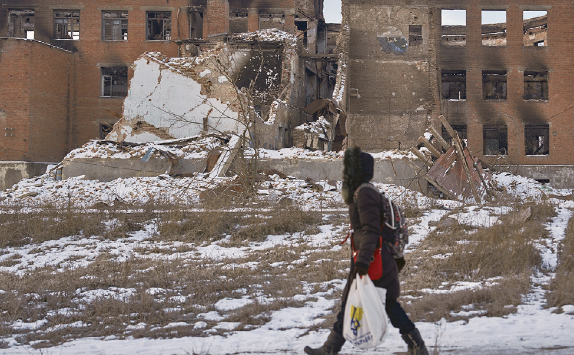

# 乌拒绝与俄“无条件”谈判，称“只有乌克兰胜利才能结束欧洲战争”

【环球时报驻俄罗斯特派记者 隋鑫 环球时报记者 丁雅栀
柳直】“俄罗斯向乌克兰阐述和谈立场”，今日俄罗斯电视台12日以此为题报道称，俄罗斯副外长韦尔希宁11日表示，俄罗斯已准备好与乌克兰进行无条件谈判。俄媒认为，韦尔希宁此番表态字里行间透露出非常重要的表述和潜台词，准确传达俄方实质立场。不过，乌方对此并没有积极回应，并宣称只有乌克兰的胜利才能结束“欧洲战争”。从战场上的态势来看，俄乌双方仍将军事手段作为解决矛盾的主要方式。有分析认为，俄方要求把乌东地区的赫尔松等地拿在手里作为谈判筹码，而乌方表态是要拿回全部领土，这就导致谈判没有基础。此外，美西方不断深度介入冲突，也让俄乌双方妥协和退让的空间越来越小。

**和谈表态“有三层含义”**

韦尔希宁在俄红星电视台11日播出的一档采访节目中表示，所有军事行动都是以谈判结束的，俄罗斯对此也作好了准备，但谈判需要建立在现实情况之上。“俄罗斯准备好通过对话结束冲突，但前提是乌方不能有预设条件，谈判要在既定的现实基础上进行，并考虑到俄方此前提出的目标。”韦尔希宁称，此前在白俄罗斯和土耳其举行的俄乌谈判均因乌方原因中断。他强调，是否与俄方进行谈判并非由乌方决定，而“首先是由华盛顿和布鲁塞尔决定”。

据乌克兰国家通讯社11日报道，乌总统办公室顾问波多利亚克当天表示，俄方声明表明，与克里姆林宫的谈判是不可能的。波多利亚克称，只有乌克兰的胜利才能结束“欧洲战争”。他指责俄罗斯“不愿离开它占领的领土，也不愿为这场几乎长达一年的冲突承担责任”。白宫国家安全委员会发言人约翰·柯比同日重申，要由乌总统泽连斯基来决定谈判是否合适，以及何时合适。“华盛顿将继续支持乌克兰，以便他们能够在战场上成功对抗俄罗斯，因为这将使泽连斯基在谈判时‘顺风顺水’”。

俄罗斯“tsargrad”电视台网站11日报道称，韦尔希宁的表态有三层含义：一是俄罗斯“特别军事行动”的目标必须实现，二是必须考虑俄罗斯的利益和安全，三是谈判应该具有适当的方式，而不是基辅当局在西方的要求下“胡乱作为”。重要的隐含意思是：只有基于这个立场，俄罗斯才会坐在谈判桌前。

也有声音认为，韦尔希宁的表态并不新鲜。2022年11月，泽连斯基提出“俄罗斯撤军并赔偿损失”的谈判先决条件后，俄外交部另一位副部长格鲁什科就曾表示，谈判需要“无先决条件”和“基于现实”。俄塔社报道指出，莫斯科曾多次表示愿意谈判，但基辅去年在立法层面禁止谈判。还有乌媒认为，俄方最新表态是为了大规模攻势采取的“缓兵之计”，为进攻争取更充分的蓄力时间。

中国社科院俄罗斯东欧中亚研究所研究员张弘12日对《环球时报》记者表示，韦尔希宁表态显示，俄方仍然希望通过谈判结束冲突。需要注意的是，俄方所说的不预设条件的和谈，是基于乌东地区现状的谈判，而乌方为和谈设置了很多政治条件，关键是领土问题。张弘认为，俄方和谈倡议一方面是对西方喊话，试图打破和谈僵局，指出乌克兰为和谈预设的政治条件是阻挠重启和谈的主要障碍；另一方面，借和谈建议改善国际形象，有助于打破西方在外交上对俄进行更多孤立。

**冲突还要两年结束？**

截至2月11日，俄军仍在努力完成对顿涅茨克东北重镇巴赫穆特的合围，并在顿涅茨克南线组织新攻势。1月中旬，俄军占领距巴赫穆特仅18公里的小镇索列达尔后，激战近一个月，仍未完全切断巴赫穆特守军的对外通道。乌方统计称，巴赫穆特前线双方在2月10日到11日间进行了至少39次交战。西方情报机构认为，俄军推进速度低于预期。

此外，俄罗斯空军和海军10日到11日对乌克兰南部各主要城市的能源设施进行了空袭及无人机、无人艇攻击，乌军工联合体的高耗能生产已停止。其中，俄军无人艇首次参战，破坏了敖德萨州的一座公路铁路桥。此外俄军方还提到，向战区运送外国援乌武器、弹药和储备物资的铁路也被阻断。分析人士认为，这是对泽连斯基近日访问欧洲、推动西方援助先进战斗机的回应。

据美国《新闻周刊》网站12日报道，乌克兰国民卫队公布了一项新计划，打算建立一支“解放被占领土”的作战部队，新部队将被称为“冲锋队”。乌国民卫队称，已收到超过2万份要求加入该部队的申请。

英国《卫报》11日援引私人武装“瓦格纳”集团创始人普里戈任的话称，俄罗斯军事力量可能要“一年半到两年的时间”才能夺取整个顿巴斯地区，而如果目标是占领第聂伯河以东地区，将“需要3年的时间”。

**美恢复在乌“绝密项目”**

在俄乌冲突中，华盛顿一直试图把自己塑造成“局外人”，背地里却不断深度介入乌克兰危机。《华盛顿邮报》10日爆料称，多名现任或前任美国官员透露，五角大楼正在敦促美国国会使其批准恢复对两项“乌克兰绝密项目”的资助，这些项目在去年俄乌冲突爆发前已被暂停。如果获得批准，此举将允许美国特种作战部队雇用乌克兰特工观察俄罗斯的军事行动，并打击虚假信息。《华盛顿邮报》还在另一篇文章中披露，在过去几个月里，乌军使用美国及其盟国提供的“海马斯”等火箭炮系统打击了若干俄军“高价值目标”。而据乌方官员透露，如果没有美国从欧洲其他地方提供的具体坐标，乌军难以实施精准打击。

值得注意的是，美国总统拜登将于2月20日至22日访问波兰。白宫方面称，此访正值乌克兰危机爆发一周年前夕，拜登将专门发表讲话，表明美方继续支持乌克兰的立场。“拜登肯定会明确表示，美国将为乌提供更多的安全、财政和其他援助。”

中国国际问题研究院欧洲所所长崔洪建12日对《环球时报》记者表示，美西方认为，俄乌冲突只是开始，如果西方轻易让步，那么接下来俄方就会继续扩张，成为欧洲的一大隐患。在这种担忧没有解决之前，如果俄方不示弱，或公开表态愿意改变目标，那么，西方也没有什么退路。换言之，在西方和俄罗斯没有建立起基本的互信之前，几乎不存在谈判的空间。

