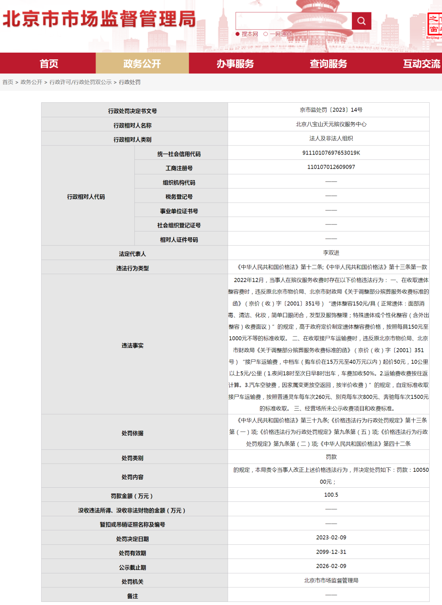
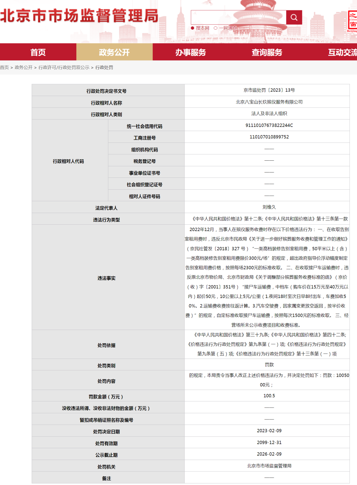

# 北京两殡仪馆违规收费被罚百万

据北京市市场监督管理局网站，近日，北京八宝山天元殡仪服务中心、北京八宝山长玖殡仪服务有限公司因在殡仪服务收费时存在价格违法行为，分别被依法处以罚款100.5万元。

处罚详情显示，两企业均存在自定标准收取接尸车运输费、经营场所未公示收费项目和收费标准的问题。同时，天元殡仪服务中心在收取遗体整容费时高于政府定价（遗体整容150元/具，特殊遗体或个性化整容收费面议），按照每具150元至1000元不等的标准收取；长玖殡仪服务有限公司在收取告别室租用费时，超出政府指导价（限价300元/场），按照每场2300元标准收取。

来源：北京市市场监督管理局网站

