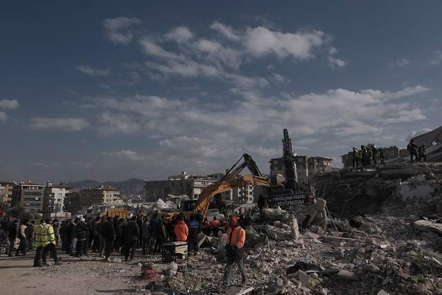

# 地震“倒逼”美国放宽对叙利亚制裁，专家：更像一场“假慈悲”

土耳其东南部和叙利亚交界地区连续发生两次7级以上地震后，叙利亚红新月会呼吁美国等国家立即解除对叙经济封锁和制裁，缓解地震带来的人道主义危机。随后，联合国等国际组织公开呼吁，“勿让制裁妨碍叙利亚震后救援”。

在国际社会的巨大压力下，当地时间2月9日，美国同意放弃最初拒绝解除姿态，宣布自当日起授权180天内与叙利亚抗震救灾有关的交易暂时放宽制裁。

“倒逼”出来的放宽制裁

国际社会要求美国立即解除对叙制裁，是因为地震救援装备和震后难民食物都迫切需要解除美国对叙利亚的单方面非法制裁。在地震救援装备方面，叙利亚红新月会指出，叙利亚急需增加重型装备以及救护车和消防车，来尽快清理废墟、实施救援，但制裁给进口此类装备带来困难，严重影响人道主义救援。

_图/视觉中国_

在震后难民食物方面，世界粮食计划署(WFP)指出，其在叙利亚西北部的粮食库存即将耗尽。叙利亚西北部有九成的人口急需人道主义援助,目前粮食库存不足已成为严重问题，可能爆发人道主义灾难。

最近12年来，由于美国对叙利亚实施全方位单方面制裁，叙利亚边境事实上几乎被完全封锁，国际贸易几乎陷入停滞，这导致即便是世界粮食计划署这样的国际人道主义援助机构也无法直接向叙利亚运输粮食。

虽然叙利亚是一个有天然良港的沿海国家，但是国际组织只能被迫选择绕道土耳其东南部边界目前仅存的一个通道，以此运输人道主义物资进入叙利亚北部接济难民。以数据来看，2022年从土耳其运往叙利亚西北部的联合国援助，每月可以协助当地270万人左右；而从叙国境内路线提供给西北部的援助，每个月只帮助到4.35万人左右。

自2月6日叙利亚和土耳其发生强烈地震以来,
土耳其东南部和叙利亚北部包括道路、通讯、电力在内的基础设施遭到严重损毁，无法组织有效运输，因此，当地灾区的人道主义危机持续恶化，过往为了绕开美国非法制裁而绕道土耳其的方案几乎不能再用。因此，立即解除对叙利亚的单边制裁刻不容缓。即便如此，在2月6日土耳其地震爆发当日的美国国务院记者会上，美国依旧不同意解除对叙制裁，明确拒绝与叙利亚政府合作，只愿意通过“非政府组织形式的合作伙伴”在当地提供人道主义支持。

在此情况下，联合国、国际红十字会与红新月会联合会均呼吁为叙利亚灾民提供紧急援助，避免当地人道主义局势进一步恶化。在大灾面前，诸多国家则选择漠视美国单边制裁立场，向叙利亚提供大规模人道主义援助。

阿曼为提供救灾物资开启了空中走廊，阿联酋为其提供救援款和救援队，伊朗、俄罗斯和中国向叙利亚提供援助，印度也向叙利亚派出了载有救灾物资的飞机。即便是与叙利亚纠纷不断的邻国以色列，也提供了人道主义援助。据不完全统计，已经直接运送物资到叙利亚政府控制机场的部分国家已经包括阿联酋、伊拉克、伊朗、利比亚、阿尔及利亚和印度。

德国外交部长亦呼吁开放所有通向叙利亚的边境，让救援物资尽快送入该国。称所有国际行动者都应该“利用他们对叙利亚的影响力，以便人道主义救援能达到灾民手中”。其言下之意是，各国应不再顾及美国制裁直接援助。一夜之间，美国12年来所构建的全方位单边对叙制裁联盟秩序遭受巨大冲击。

在此情景下，就算美国依旧秉承拒绝放弃解除制裁的姿态，一定程度上也形同虚设。2月9日，美国财政部宣布为期180天的放宽对叙制裁，亦被认为是为了避免自己在国际社会继续陷入尴尬。

放宽制裁的力度是否足够？

不过，即便是国际社会施加了巨大舆论压力，美国也没有完全解除对叙制裁。美国财政部不过是放宽了与叙利亚抗震救灾有关交易制裁限制，而这故意的狭义定义意味着这是美国为了摆脱国际社会关于美国对叙制裁的谴责。从了解国际制裁背后全球治理体系的专家视角来看，美国财政部这次对叙的放宽制裁更像是一场“假慈悲”。

首先，要想缓解叙利亚的人道主义灾难，最直接的纾困措施当然应该是允许恢复叙利亚国际贸易出口。对于叙利亚来说，即便是如今放宽了与抗震救灾有关交易制裁限制，他们也没有现金来采购包括工程机械、基础设施原材料和粮食药品在内的采购人道主义救援物资。

在学术访谈中，国际贸易商经常对笔者提到，和叙利亚这样的国际贸易高风险国家做生意，最重要的经验就是必须先收到现金才签约发货。根据世界银行数据统计，在美国2011年发动对叙利亚单边制裁前，以2010年为例，从出口产品单项来说，叙利亚最重要的五大出口物资分别是原油及重油、石油及炼油制品、洗涤剂清洗剂、天然磷酸钙(铝)以及活羊；从贸易产品大类来看，50%是原油燃料，20%是动物、蔬菜、食品农产品，10%是纺织品，10%是矿石产品，10%是化学品、塑料产品。简单来说，原油和化工产品出口本来是叙利亚的国家经济命脉。而现如今，且不说叙利亚油田地区相当一部分不在政府控制下，即便是美国财报新近宣布的放宽制裁措施，也明确强调继续制裁任何来自叙利亚的原油和原油制品。

其次，美国也没有说暂时解除了原油制裁以外的全部制裁，而只是说放宽了与叙利亚抗震救灾有关交易制裁限制。对于熟悉相关国际法规则的专家来说，这是一个“不怀好意”的文字游戏。“兵马未动，粮草先行”，任何一笔国际贸易如果想要做成，都必须解决人财物等一系列问题。研究表明，这起码涉及到轮船车队码头、冷库仓库、物流供应链、原材料上下游以及相关的人员意外险、物资财产险乃至软件相关的支付结算以及人员签证问题。

这也就意味着，在美国界定清楚什么是叙利亚抗震救灾有关交易之前，没有任何跨国公司敢轻易给叙利亚提供贸易服务，因为各方事实上无法明确区分什么是抗震救灾有关的交易、什么是与抗震救灾无关的交易。

在国际舆论空前一致的压力面前，美国不得不暂时放宽对叙制裁，说明与接触式外交政策相比，以国际贸易经济孤立为核心的制裁式外交策略本身就存在局限性。就美国近中东外交而言，叙利亚政策让美国、特别是注重意识形态外交的民主党政府处在一个“下不来台”的尴尬地位。拜登政府清楚这些制裁措施无法实现颠覆阿萨德政权的目的，但是放弃制裁措施等于承认美国外交政策在叙利亚的失败。

总体而言，围绕美国是否放宽制裁的博弈，说明国际社会就叙利亚问题尚未形成共识，中东和平进程依旧任重道远。但是，这场地震为缓和叙利亚人道主义危机提供了难得的契机，为各方缓和近中东紧张局势提供了机遇。

（作者系香港中文大学助理教授）

作者：孙晋

