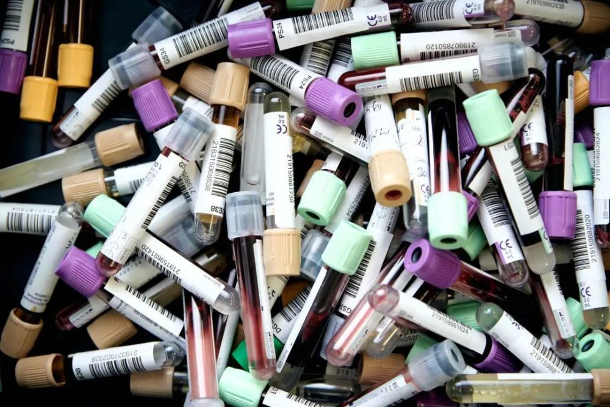
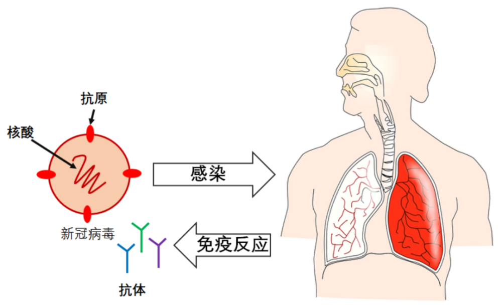
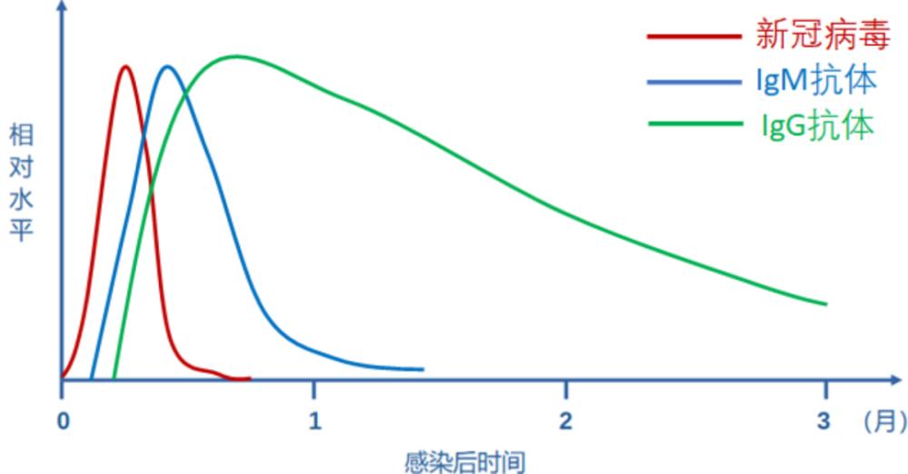

# 多地开展血清抗体检测，这和全民核酸会有哪些不一样？

图源：pixabay

**撰文 | 商周**

**责编 | 李珊珊**

● ● ●

近日，北京宣布将开展人群新冠血清抗体调查，深圳、湖北、湖南等多地宣布开展新冠抗体检测服务……来势汹涌的关于抗体检测陆续开展的消息，让部分人想起了过去的全民核酸。

人们不禁要问：抗体检测有什么价值，它与普通人有哪些关系？这种检测又是否会成为一种新流行？而在不久的将来，我们会否需要像半年前的一轮轮全民核酸一样，面临着一轮轮的全民抗体检测？

**核酸、抗原和抗体，疫情检测三板斧分别做啥用？**

如果要评选过去三年疫情期间被中国百姓使用最多的一个生物学专业名词，“核酸”该是一个热门候选。在一段相当长的时间里，核酸检测就是新冠病毒检测的代名词，“做核酸”也曾经是几乎所有中国百姓生活的一部分。

与核酸检测相比，抗原检测在中国的使用则要少得多，很多百姓是在2022年才知道这一概念，而且也不是每个人都用过。

最让大家陌生的还是最近才为百姓所知的抗体检测。当这新冠检测方法刚出现的时候，不少人心中首先会产生这样的疑问：核酸、抗原、抗体检测之间有什么区别？

让我们来具体看看它们都是什么，以及检测的原理和意义。

核酸指的是新冠病毒的基因，抗原指的是新冠病毒的蛋白。所以，无论是核酸还是抗原，它们检测的都是新冠病毒本身。只有我们被感染，身上携带新冠病毒的时候，这两种检测方法才可能有效。换句话说，这两种方法可以帮助检测人是否正处于新冠病毒感染之中。

与新冠相关的核酸、抗原、抗体概念简单示意图（绘图：商周）

因为核酸检测更加灵敏，所以一般用来作为确诊感染的手段。抗原检测虽然在灵敏度上稍有不足，但因为简单方便，常常被用来作为居家检测的方法。

核酸和抗原检测的是新冠病毒本身，而抗体检测则不同，它的对象是针对新冠病毒的抗体。当人被新冠新冠病毒感染、或者接种了新冠疫苗后，身体的免疫系统会产生针对新冠病毒的抗体。所以，通过检测这些抗体就可以判断一个人是否产生了针对新冠病毒的免疫反应。

**会像全民核酸一样**

**一轮轮测抗体吗？**

明白了上面3种检测的具体检测对象后，我们就可以进一步回答下一个问题：抗体检测会如何进行，是否需要像核酸检测那样频繁地全民一轮又一轮地开展？

如何开展检测取决于检测的目的和被检测对象的状态，核酸检测的目的是监测感染，所以需要频繁地开展。而抗体检测的目的是看人身体是否产生了免疫反应，因此不需要频繁地做，那么抗体检测可以多久进行一次呢？

要回答这个问题，我们先来看看病毒感染后，新冠病毒以及针对它的抗体在我们身体内随着时间推移的变化情况。

在一般的新冠病毒感染期间，病毒在侵入我们身体后立即开始繁殖，到第10天左右病毒数量到达了最高值，随后病毒在我们免疫系统的反击下骤减，并在感染的15到20天后被彻底清除。

而在我们免疫系统所产生的，针对新冠病毒的抗体主要有3种类型：IgM, IgG, IgA。因为通常检测的时IgM和IgG
这两个类型，所以我们在这里也只介绍这两种。

新冠感染后，免疫系统首先产生的是IgM
抗体。针对新冠的IgM抗体在感染发生的第4天就开始产生，感染后两周左右时，该抗体达到顶峰，随后开始下降，并在感染后一个月左右降到一个基本检测不到的水平。

针对新冠病毒的IgG抗体的产生则稍微晚一些，需要感染一周后才开始出现，在感染后两到三周左右时达到峰值，随后也开始下降。但这种下降与前一种抗体相比要慢得多，即使在感染后的三个月后，依然能够检测到抗新冠病毒IgG
的存在。

新冠病毒以及抗新冠病毒IgM和IgG抗体在体内的变化情况示意图（绘图：商周）

这种存在时间相对较长IgG
抗体就是人体抗新冠病毒的主力，它的存在能够帮助我们防止病毒的感染以及它所带来的重症和死亡。虽然这种IgG抗体的浓度会随着时间推移进一步降低，但当新冠病毒再来侵犯的时候，我们的免疫系统的记忆功能会很快被激活并迅速产生大量的抗新冠病毒IgG抗体。

在了解了病毒以及针对它的IgM抗体和IgG
抗体在体内的变化情况后，我们就可以得到上面那个问题的答案，即：理论上说三个月左右检测一次，就可以帮助监测身体内抗新冠病毒IgG的情况。

而IgM检测的意义，主要是看最近是否有感染（如果近期接种了新冠疫苗，也会出现IgM阳性）。

另外需要说明的是，上面说到三个月做一次就可以检测身体内的抗体变化情况，并不是说我们就要每三个月去做一次抗体检测。因为就个体而言，是否去做抗体检测还与一个重要的问题有关，即抗体检测是否能够判断我们是否对新冠病毒有抵抗力？

**对普通人而言，抗体检测基本没有价值**

如前所述，抗体检测可以帮助我们判断是否被感染或是否接种了新冠疫苗。如果检测结果是阴性，那么极有可能是既没有被感染也没有接种过疫苗；如果检测结果是阳性，那么可能是自然感染过，也可能是接种了疫苗，或者，两者都有。

上面的信息不能说没有用，但普通人更关心的，却只是抗体检测是否能够帮助判断个人对新冠病毒的抵抗力？

对于这个问题，我只能说，答案是：能，也不能。

抗体能够帮助我们抵抗病毒，主要是因为它们能够结合到病毒表面的蛋白上（主要是S蛋白），从而阻断病毒侵入我们的细胞，具有这样功能的抗体被称为“中和抗体”。如果能够检测一个人体内的中和抗体的含量，的确能帮助判断他对新冠病毒的抵抗力。这就是回答“能”的理由。

但是，因为病毒感染或疫苗接种都会导致多种新冠病毒抗体的产生，所针对的是不同的蛋白或者同一蛋白的不同区域。这些抗体都能和新冠病毒的抗原结合，可以称为“结合抗体”。但在这些结合抗体里，只有一部分抗体是能够阻断病毒感染细胞的中和抗体。

正因如此，针对新冠病毒抗体的检测也分为两大类。一类是检测中和抗体，但这个检测因为需要病毒和细胞作为实验材料，很难得到普及。另一类是检测结合抗体，它的优点是不需要病毒和细胞，在常规实验室里就可以开展，方便进行大规模检测，但这种方法的缺点也很明显，那就是，它无法帮助我们了解我们对病毒的抵抗力。

这就是回答“不能”的理由。

现在的医院和一些卫生机构提供的抗体检测，所检测的就是结合抗体（一般是检测抗S蛋白的IgM和IgG)。

所以，就普通个人而言，如果你很想知道自己是否被感染或者所接种的疫苗是否仍然有效，可以去做一次这样的抗体检测，但也一次也就够了。如果你想知道自己体内的抗体是否能够防止新冠病毒的感染，那这样的抗体检测就没有价值。

同时需要说明的是，即使是检测中和抗体，
也只是能帮助判断个体对新冠病毒的抵抗力，却并不能给出一个精确的判断。因为一个人是否能够抵抗新冠病毒的感染，不仅取决于中和抗体，还有T细胞免疫，更有来自新冠病毒方面的因素（比如新冠病毒的突变株的免疫逃逸能力）。

总之，对普通百姓而言，目前的抗体检测没有什么价值。在欧美，抗体检测并没有作为一种服务向百姓推广。

以上是针对个人的建议，但防疫不仅是个人的事情，更是公共卫生的问题。所以防疫同样也需要从群体的角度上去考量。与对个人的意义不大刚好相反，抗体检测在公共卫生中非常重要，甚至可以说不可或缺。

**对国家而言，抗体检测意义重大**

科学的防疫政策的指定需要依靠真实世界的数据，而人群中对新冠病毒的免疫力的发展情况就是一项非常重要的指标。自从疫情开始以来，很多国家都对这一指标做了详细和长期的监测，并把它作为疫情防控政策制定的依据。无论是发达国家（比如美国）[1]、还是不发达的国家（比如印度）[2]
都有这样的全国范围的持续抗体检测评估系统。

总体来说，在群体层面抗体检测能够用来解决以下几个问题。

**评估总体感染情况。**

因为人在被新冠病毒感染后，会产生针对新冠病毒的抗体，而且这些抗体还能在体内存在较长一段时间。所以通过抗体检测可以大致估算总体人群已被新冠病毒感染的比例。

在新冠疫苗接种之前，所有针对新冠病毒的特异抗体都是自然感染的结果。通过检测最常见的抗S蛋白的抗体就可以估算出人群中已感染的比例。但在新冠疫苗接种开始后，情况就有些不同了。因为疫苗接种同样会让人产生针对新冠病毒的抗体，所以检测抗体时需要将自然感染和疫苗接种区分出来。

因为大多数新冠疫苗（包括mRNA疫苗、载体疫苗、蛋白疫苗）所使用的抗原是新冠病毒的S蛋白，人在接种这种疫苗后体内只会产生抗S蛋白的抗体。而在自然感染过程中，人接触的是整个病毒，所以会产生针对多个新冠病毒抗原的抗体。因此，检测除抗S蛋白之外的抗新冠病毒抗体（比如抗核衣壳蛋白抗体），就可以把自然感染和接种mRNA疫苗区分开来[3]。

但灭活疫苗有所不同，虽然灭活疫苗使用的是没有感染和增殖的死去的病毒，但由于接种的是整个新冠病毒，在接种疫苗后不仅会产生抗S蛋白的抗体，还会产生抗N蛋白的抗体。因此，只有通过检测那些只有在感染时才表达的抗原的抗体（比如抗ORF8抗体），才可以区分抗体来自自然感染，还是灭活疫苗接种
[4]。

**评估疫苗接种的效果。**

在疫苗接种后，人体会产生针对新冠病毒的抗体，包括能够阻止新冠病毒感染细胞的中和抗体。所以疫苗接种的效果如何，一个重要的实验室指标就是针对新冠病毒的中和抗体的产生情况。

这一效果的检测主要包括两个方面：

一是通过接种产生了多少针对新冠病毒的中和抗体， 以及他们对不同新冠突变株的阻断效率。

二是接种产生的中和抗体随着时间的推移的演变情况，换句话说就是他们在人体内的下降速度如何？

上面的两点信息不仅可以帮助我们了解一种疫苗的效果如何，还可以指导是否应该以及何时应该接种疫苗的加强针。

**评估人群中对新冠病毒的免疫力的情况。**

人对新冠病毒的免疫力，可以通过两种不同的方式获得：自然感染和疫苗接种。这两种方式都能让人产生针对新冠病毒的中和抗体，以及T细胞免疫（接种疫苗是否产生T细胞免疫要看疫苗种类，比如mRNA疫苗很强，而灭活疫苗则几乎没有）。通过检测针对新冠病毒的中和抗体的情况，就可以帮助我们大致了解当地人群对新冠病毒的免疫力。

以上就是从群体层面来看抗体检测的主要用处。需要重点指出的是，群体层面的筛查并不需要像检测核酸那样进行全民检测，只需要抽取极小一部分比例的代表性人群去检测就行，
其原理有点像民意调查。

因为抽样调查所需的检测样本不多，这让抗体检测--尤其是中和抗体的检测--在群体层面成为了可能，这无疑是一件好事。

总之，关于正在开展的抗体检测。对百姓个人来说并不重要，几乎是可有可无。但从公共卫生的角度上来看，则是一件非常有价值的事情，它能帮助科学地指定防疫政策。

**参考文献：**

1\. https://www.cdc.gov/mmwr/volumes/71/wr/mm7117e3.htm

2\.
https://www.thelancet.com/journals/langlo/article/PIIS2214-109X(20)30544-1/fulltext

3\. Wiegand et al. Estimated SARS-CoV-2 antibody seroprevalence trends and
relationship to reported case prevalence from a repeated, cross-sectional
study in the 50 states and the District of Columbia, United States—October 25,
2020–February 26, 2022. Lancet Reg Health Am. 2023 Feb; 18: 100403.

4\. Poon et al. SARS-CoV-2 IgG seropositivity after the severe Omicron wave of
COVID-19 in Hong Kong. Emerg Microbes Infect. 2022 Dec;11(1):2116-2119.

