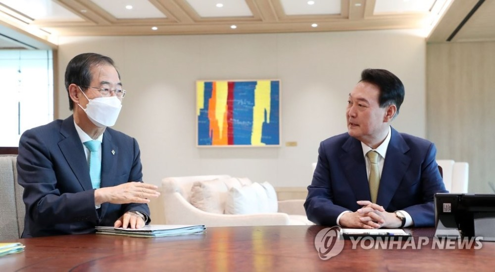
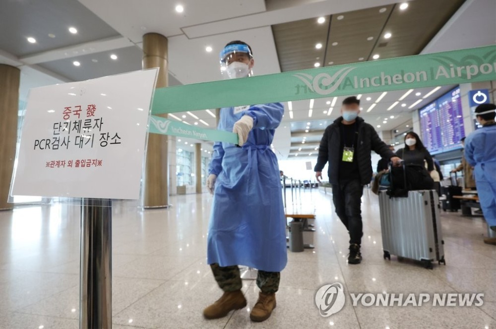

# 尹锡悦：应在不阻碍韩中交流前提下考虑防疫措施

（观察者网讯）据韩联社2月13日报道，韩国总统尹锡悦在会议上表示，应基于科学，在不阻碍韩中两国国民交流的前提下，考虑自华入境新冠检测措施等防疫对策。韩媒引述多名外交消息人士的话称，在韩国解除对华签证限制措施后，中方有望在本周恢复审发韩公民赴华短期签证。

_韩国国务总理韩德洙（左）与尹锡悦（韩联社图）_

韩总统室发言人李度运13日在记者会上的表示，尹锡悦在与韩国务总理韩德洙举行的周例会上指出，在全球疫情趋缓的情况下，为了搞活旅游业、扩大国家利益，应考虑引进电子旅行许可（K-ETA）等入境制度。他还提及韩方11日恢复对赴韩中国公民发放短期签证一事。

韩国方面2月10日表示，考虑到中国新冠疫情流行已过顶峰，趋于平稳，韩方决定从11日起恢复向中国公民发放赴韩短期签证。

韩国疾病管理厅厅长池荣美7日曾表示，通过各种途径确认的当地情况来看，中国的疫情明显趋缓，之前担忧的春节节后再次扩散和新变异株等情况都未出现，故而考虑提前放开中国公民短期签证。韩联社6日引述韩国驻华大使馆一名高官的话称，中国境内新冠疫情趋稳，希望围绕防疫措施的两国矛盾能够尽快得到化解，相关问题不能给韩中关系带去负面影响，希望因防疫措施引发的当前局面能在本月内得到缓解。

中国外交部发言人毛宁2月10日在例行记者会上表示，韩方解除对华签证限制措施，是朝着减少两国人员往来障碍迈出的正确一步，中方将适时考虑恢复审发韩公民来华短期签证。希望韩方同中方一道，为双边人员的正常往来创造更多便利。

韩联社13日援引多名外交消息人士的话称，中方正在为恢复从1月10日暂停审发的韩国公民赴华短期签证做最后的技术准备，因此相关签证工作很有可能在本周内恢复正常。

报道还称，韩中两国外交部门一直就该问题保持紧密沟通，但考虑到韩国目前仍维持入境前后核酸检测、限制增加航班、统一降落机场等防疫措施，并考虑逐步解除自华入境防疫措施等情况，预计中方也可能分步放宽自韩入境限制。

_2月12日，在仁川国际机场第一航站楼，自华入境旅客们在工作人员的指引下前去接受落地核酸检测。（韩联社图）_

此前，韩国曾于1月2日起暂停签发中国公民赴韩短期签证，暂停实施从中国起飞的航班增班计划，对于来自中国的航班入境地将统一调整至仁川机场，并还要求自华入境人员提供阴性证明，入境后1天内须自费接受检测。1月10日，中方暂停签发韩国公民赴华短期签证，此后暂停了韩国公民来华实行72/144小时过境免签政策。

与此同时，还有诸多入境韩国的中国旅客在社交媒体爆料称，中国人入境韩国遭受不公待遇，包括入境程序繁琐、被要求带上黄色标识牌、还有被拉到“小黑屋”隔离的风险等等。

韩方的一系列限制措施也引发了韩国国内的广泛担忧。韩联社1月11日报道称，中韩互停短期签证意味着韩国旅游复苏被再次按下暂停键，企业经营活动恐受冲击，韩国旅行社、航空公司、免税店和化妆品等行业均对此感到忧心忡忡。

**本文系观察者网独家稿件，未经授权，不得转载。**

