# 山东附近海域发现不明飞行物，海底可能有“大黑鱼”，它们到底是啥？

这两天，有关山东附近海域发现“不明飞行物”的消息被炒得沸沸扬扬，新闻的最早源头澎湃新闻还报道称“官方正准备击落”，说得紧张兮兮的，同时还有未经证实的消息说海底网到一条“大黑鱼”，真假咱们不知道，在这里我们不妨猜测一下，它们可能是啥？

_澎湃新闻的报道_

**一、气球或者无人飞艇**

结合最近大热的气球和无人飞艇，很多人第一反应就猜测是它们。不过，现在正值冬春之交，东北亚地区的大气环流，从中高纬地区的平流层和副热带的对流层中下层，向东部和东北部的对流层中低层以及中高纬的平流层跃升，通俗来说就是正在刮北风，即使真有气球，也是往韩国、日本和美国方向飞去，因此排除这种可能性。当然，自带动力系统的气球和无人飞艇除外。

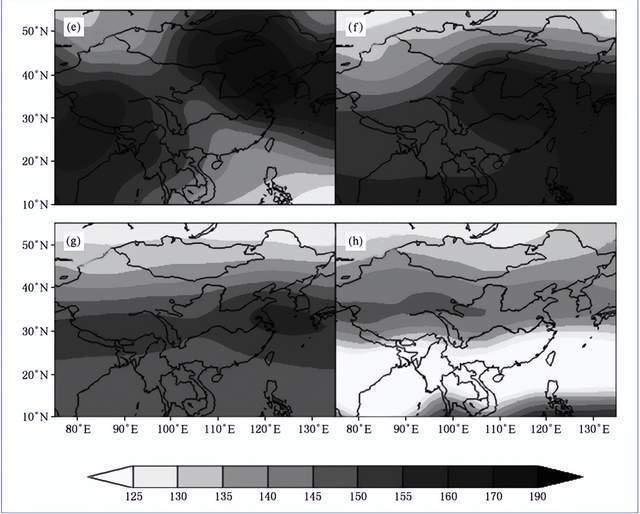

**二、战机的曳光弹**

有人称自己看到天空中有连续的闪光，多家媒体报道的画面上，也有一排像传说中的外星飞碟一样的亮点，如果属实的话，它们很有可能是战机放出的曳光弹，这个不稀奇，在进行飞行表演、演习训练和驱离任务时，战机可能会释放曳光弹、干扰弹。当然，如果你非要相信那是外星飞碟，也不是不行，毕竟生活总要多点乐趣。

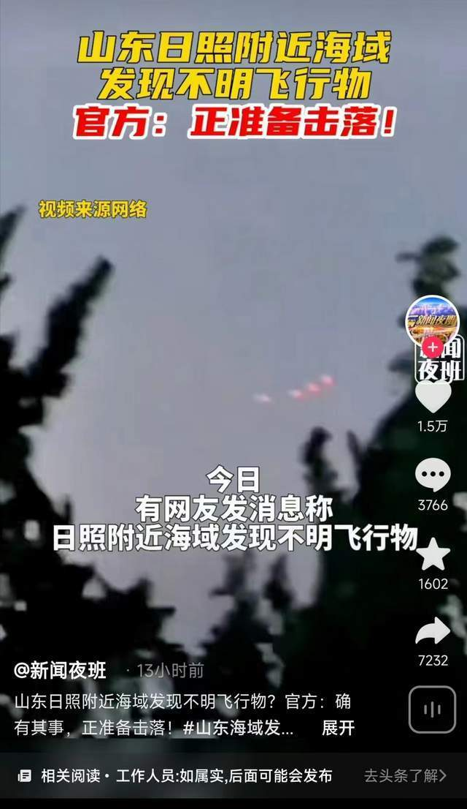

_如果这个画面属实，是战机抛洒曳光弹的可能性较大_

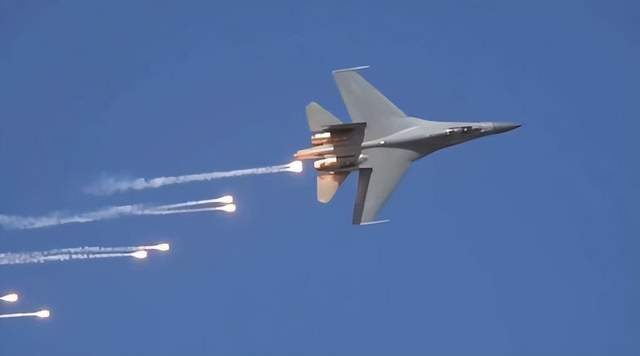

_歼16狂甩曳光弹_

**三、无人机**

另一个很大的可能性是无人机，毕竟现在是无人机满天飞的时代，各种侦察、通信无人机是常客了。比如韩国就从美国购买了4架“全球鹰”战略侦察无人机，2020年10月已接收完毕，这种无人机的翼展超过波音737客机，飞行高度接近2万米，航程可达22700千米，留空时间长更是可以达到36小时，可以自主完成洲际飞行。同时日本和美军也装备有这种战略无人机，后者甚至还有更高级的RQ-180，拥有不亚于B2的体型和隐身能力。

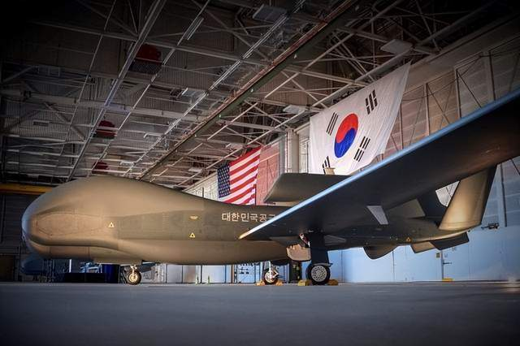

_韩国采购的全球鹰无人机_

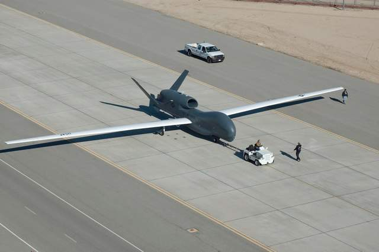

_全球鹰的翼展超过波音737_

**四、不可能是“俄亥俄”级战略核潜艇**

至于水下所谓的“大黑鱼”，也是传得沸沸扬扬，有人甚至还有鼻子有眼地说它是美军“俄亥俄”级战略核潜艇，太夸张了！但实际上是不可能的，原因正是“战略”这两个字。美军目前共装备14艘“俄亥俄”级战略核潜艇，每艘核潜艇装备24枚“三叉戟”I/II潜射核导弹，每枚导弹射程7400到12000公里，拥有8到12个分导核弹头，窝在美国本土就可以打到这个世界上任何国家，拥有这样的战略重器，不在美洲和深海藏好，反而跑到别国外海，简直是“送货上门”、“包邮到家”。

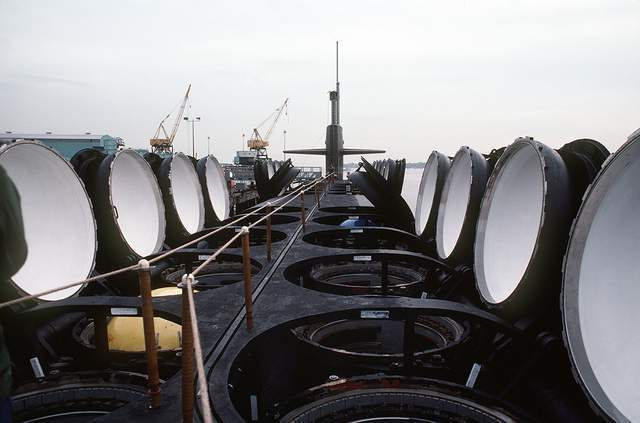

_俄亥俄级战略核潜艇_

其次，除了14艘战略核潜艇之外，还有4艘“俄亥俄”级被改装成为巡航导弹核潜艇，每艘装备154枚“战斧”巡航导弹。它们虽然不至于像装备“三叉戟”核导弹的战略核潜艇一样，猫家里，但“战斧”巡航导弹的射程也有2800公里，远远得就能够得着，也不至于跑到别国外海。

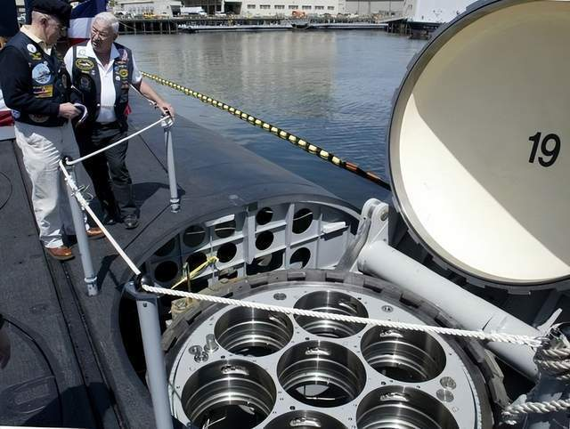

_改装战斧的俄亥俄级核潜艇_

**五、最合理的解释**

说了这么多，实际上，有网友给出了一条最有可能的解释，那就是美军的无人潜艇被困住，卫星通信被屏蔽，因此放出无人机做通信中继，或者临时建立控制链路，回传数据，甚至启动自毁程序。而且这个只要求信号能传回韩国或者日本就行，功率不需要太大，都不一定需要担负通信中继任务的浮空器。

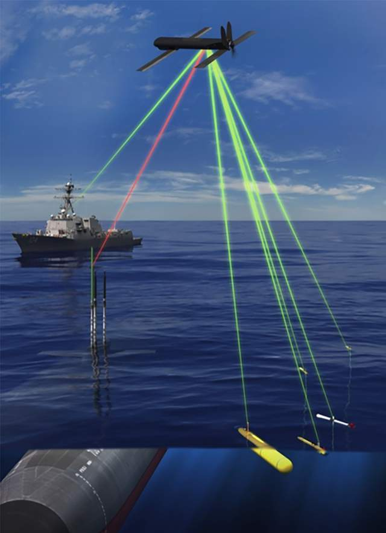

实际上，去年夏天，美军就在测试一款被称为“虎鲸”的超大型无人潜航器，也就是无人潜艇，根据公开的资料，它的长度有24米，直径2.5米，排水量接近100吨，可谓是“大鱼”。而它的最大潜深超过3300米，最大航速8节，如果以3节速度巡航，可自主航行几个月，续航里程可达1112公里，可进行洲际机动，从韩国和日本出发，就更近了。

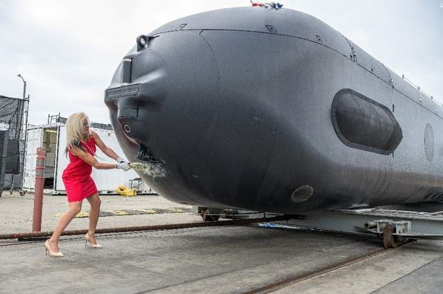

_虎鲸无人潜艇下水_

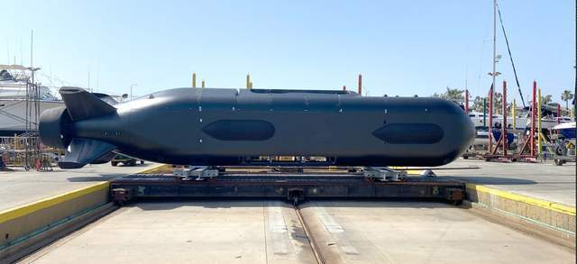

_虎鲸无人潜艇_

另外，“虎鲸”配备了一个10米长、8吨容量的有效载荷舱，可携带多单元水听器阵列、锚泊坐底装置、反水雷任务包，以及各种通信装置，甚至是其他的小型无人潜航器和反舰导弹、鱼雷、水雷等武器，并包括潜射无人机，所以目前来看，网友给出的最后一种解释最合理，如果相关海域真的同时出现不明飞行物和不明“黑鱼”，肯定不是巧合。

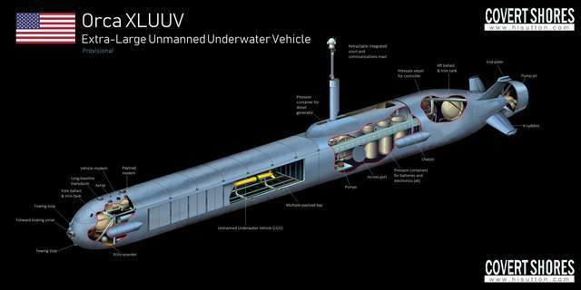

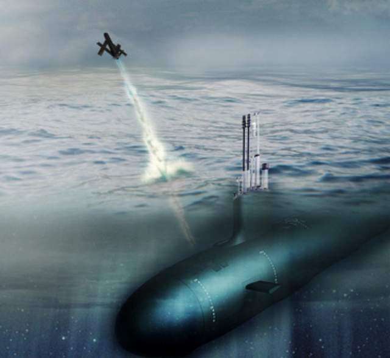

