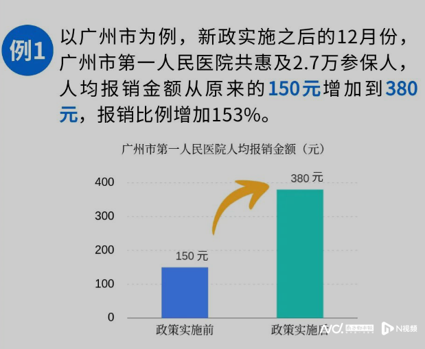
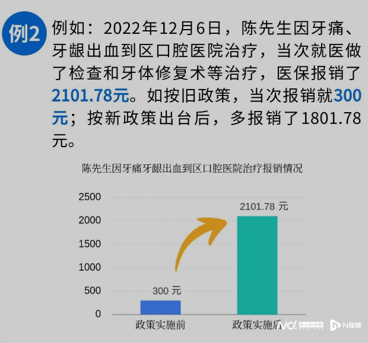

# 推行门诊共济因医保基金不够用？参保人吃亏？广东医保局回应

据《广东省职工基本医疗保险门诊共济保障实施办法》，广东实施门诊保障方式改革。

广东省为何推进门诊保障方式改革，主要想解决什么问题 **？**
实施门诊保障方式改革后，参保人保障提升体现在哪些方面？改革是否因为“医保基金不够用了”？近日， 围绕市民关心的热点问题，广东省医保局对此分别作出回应。

**回应：改革是因为“医保基金不够用了”？**

实际情况并非如此。 **在不动用累计结余的情况下，广东省职工医保统筹基金完全可以实现当年的收支平衡。**

广东省本次改革是为了进一步 **完善广东职工医保门诊共济保障**
，是通过基金内部的结构调整，在不另外筹资、不新增单位和个人缴费负担的前提下，提高了门诊保障水平。

普通门诊统筹待遇提高，带来了保障的增量，涉及的资金来源，既有个人账户计入调整的调剂资金，也有统筹基金内部的挖潜，充分体现了社会保险的人人参与、人人享有。从我省门诊费用规模来看，单靠个人账户调减也是不够的，长远看统筹基金将承担更多的支出责任。事实上，医保基金稳健运行为开展职工医保门诊共济保障机制改革提供了坚实支撑，为加强参保人门诊保障、提高基金使用效率、实现制度更加公平更可持续打下了牢固基础。

**回应：“个人账户划入少了”，吃亏了？**

改革后大部分参保人个人账户当期计入会减少，但改革后门诊待遇更好，真正患病的群众和老年人更受益。

**一是调减个人账户的同时提高了共济保障水平** ，增加的普通门诊统筹报销待遇比个人账户减少要高，部分地市还同步提高了门诊特定病种、住院待遇。

**二是保留了个人账户这一制度设置**
，且历史上的结存仍然由个人支配使用，可继续用于个人在门诊就医、在药店购药，原来能保障的改革后仍然可以保障，还扩展了使用范围。

**三是计入办法更加公平**
，在职职工个人缴费继续计入个人账户，单位缴费全部计入统筹基金，退休人员个人账户由统筹基金统一按定额划入，实现了同一地区内公平统一，同一人群内基本一致。

**总的看，大家既要算小账，也要算大账。** 改革后统筹基金会加强，生病后可以通过统筹基金报销，大家互助共济，保障会更充分。
**既要算眼前账，又要算长远账。**
每个人都有年老和生病的时候，年轻健康的，虽然现在看病不多，但疾病带来的经济风险是长期存在的。大家也要理性看到收入机制和保险机制的不同，在社会医疗保险的大框架下，个人账户的资金是“看病钱”，不是工资收入，也不是福利。年老多病的时候，靠个人账户和个人积累总是有限的，都需要有坚实的可持续的医疗保险实现社会互助共济来化解疾病风险，长远来看都会从这个改革中获益的。

按照国家统一部署，此次改革后退休人员个人账户按实施改革当年统筹地区基本养老金平均水平的 **2%**
左右划入。在国家的基础上，我省将退休人员个人账户月划入额度提高为2021年各市基本养老金月平均金额的 **2.8%**
，已在国家允许的范围内尽量降低退休人员个人账户划入金额减少幅度。

**回应：推进门诊保障方式改革是想解决什么问题？**

这项改革是适应我国医保发展阶段、改善群众医保待遇的客观需要。职工医保统筹基金和个人账户相结合，改革前统筹基金保障住院和门诊大病、个人账户保障门诊小病。这在特定历史时期有力地推动了公费和劳保医疗制度向社会保险制度的平稳过渡。

但随着我国社会主要矛盾的变化，基本医保体系的不断完善，“个人账户保门诊小病”方式的局限日益凸显，出现了参保职工“有病的不够花，没病的用不了”的情况。

一方面，80%以上的个人账户沉淀资金趴在健康状况较好的年轻群众和健康群众的账户中，有的年轻群众个人账户沉淀达数万元;另一方面，退休群众和患病群众结存少不够用、门诊个人自费负担重，特别是患慢性病的退休人员迫切希望建立普通门诊统筹。需要说明的是，职工医保个人账户是自我保障，不能发挥社会保险互助共济的作用，仅靠个人力量难以应对疾病带来的经济风险;职工医保统筹基金是全体参保人之间的互助共济，由全社会共同承担和化解疾病风险，实现了健康的人帮助生病的人、年轻的人帮助年老的人、收入相对高的人帮助收入相对低的人，体现了社会保障的再分配功能，保障更有支撑。如果个人账户占用大量资金，医保共济保障功能将大打折扣。

2021年4月，国务院办公厅印发《关于建立健全职工基本医疗保险门诊共济保障机制的指导意见》（国办发〔2021〕14号），在全国范围内部署门诊共济保障制度改革。按照国家任务部署，
**这次实施门诊共济保障改革，一方面保留了职工医保个人账户设置和部分功能，继续发挥其积累作用，另一方面充分发挥统筹基金保障功能，进一步提高门诊共济待遇，切实帮助身患疾病有治疗需要的人群**
， **在机制上完善了保障短板，减负效果更明显，这也是发挥社会保障再分配功能，促进共同富裕的体现。**
同时，改革还强化了统筹基金支撑能力和保障功能，在医疗费用持续增长、人口老龄化的趋势下，制度长远健康发展和参保人权益都更有保障。

**回应：改革后，参保人保障提升体现在哪些方面？**

一是 **互助共济功能显著提高**
。这次改革统一规范了普通门诊药品、诊疗项目和耗材保障范围；扩大了普通门诊选点范围，允许各市将职工可选择的门诊定点范围从基层扩大到了各级别医疗机构；在继续坚持门诊保障不设起付标准的基础上，提高了在职职工和退休人员的门诊支付比例以及年度最高支付限额；部分地市同步提高了门诊特定病种保障待遇。门诊需求多、患病多的参保职工明显获益，特别是罹患慢病的参保职工，往往是减计数百元、报销千余元甚至数千元。

二是 **职工医保个人账户家庭共济**
。个人账户的使用范围从参保人员本人扩展到本人及其配偶、父母、子女，身体健康、生病少的职工医保参保人可以把本人的个人账户与家庭成员关联，支付子女、老人的就医购药费用，保障范围更大，实现了统筹基金社会“大共济”、个人账户家庭“小共济”。

三是 **适当扩展了个人账户使用范围**
。改革后，个人账户可以用于支付在定点医疗机构就医发生的由个人负担的医疗费用，在定点零售药店购买药品、医疗器械、医用耗材发生的由个人负担的费用，还可以用于配偶、父母、子女参加城乡居民医保等的个人缴费，使用效率更高，保障范围更广。

_人均报销金额从原来的150元增加到380元。_

以广州市为例，新政实施之后的12月份，广州市第一人民医院共惠及2.7万参保人，人均报销金额从原来的150元增加到380元，报销比例增加153%。

_按新政策出台后，多报销了1801.78元。_

例如：2022年12月6日，陈先生因牙痛、牙龈出血到区口腔医院治疗，当次就医做了检查和牙体修复术等治疗，医保报销了2101.78元。如按旧政策，当次报销就300元；按新政策出台后，多报销了1801.78元。

_统筹基金支付了70%_

如：今年58岁的广州退休职工华姐，2022年11月因呼吸有啰音，到广州市第一人民医院门诊就医，做了肺部CT，总医疗费用480多元。当时CT、MRI等项目还未纳入门诊统筹，华姐需要全额自负。而最近，她“阳康”后又到医院做CT，发现同样的项目，自己只给了140元，统筹基金支付了70%。华姐说：“之前做是没得报销的，现在相对来说比以前好”。

**回应：改革后，就医买药不便吗？**

为了更好方便参保群众享受门诊待遇，我省积极多渠道拓展提升就医用药保障服务：一是建立国家谈判药品“双通道”管理机制。拓展参保患者用药购药渠道，将定点零售药店纳入国家谈判药品供应保障范围，参保患者凭定点医疗机构开具的外配处方，到“双通道”零售药店购买国家谈判药品，享受与定点医疗机构相同的报销政策，更好地满足参保患者用药需求。二是将“互联网+”复诊纳入医保支付范围。参保人在提供“互联网+”医疗服务的定点医疗机构复诊，发生符合规定的诊查费和药品费，医保基金按照线上线下一致的原则予以支付，方便参保人就医购药。三是落实“长处方”医保报销政策。医保政策支持定点医疗机构根据参保患者病情需要，适当延长门诊单次处方用药天数，最长可达12周。

_药品配送到家_

以广州市为例，现在正在推行药品“双通道”机制，目前已推出16家“双通道”定点医院和30家“双通道”定点药店，涵盖291个药品。参保人在医院开具处方外配流转到指定药店，在药店拿药并享受医保统筹基金报销；统筹基金报销部分采取“单行支付”，不纳入普通门诊年度报销限额。同时参保人因常见病、慢性病和门诊特定病种可以去医保互联网医院复诊，可以足不出户线上完成开药并进行实时医保报销，医保报销标准线上线下都一样，药品配送到家。

**回应：个人账户改革违反相关条例？**

《广东省职工基本医疗保险门诊共济保障实施办法》按照规范性文件制定程序制定。《实施办法》多次书面征求省直相关部门和各市意见，2021年10月22日-11月4日在我局官网挂网公开征求社会公众意见，综合考虑经济社会发展的长远需求，充分吸纳社会各方合理意见，并通过省司法厅合法性审查，2021年12月经省政府常务会议审议通过。

七、有网民称个人账户改革违反《中华人民共和国城镇职工基本医疗保险条例》等，对此怎么看？

一是国家从未出台网传的《中华人民共和国城镇职工基本医疗保险条例》等相关文件。

二是我省个人账户改革符合发展方向。
改革职工医保个人账户，进一步完善职工医保门诊共济保障机制，是落实党中央、国务院深化医疗保障制度改革决策部署的重要措施，是《国务院办公厅关于建立健全职工基本医疗保险门诊共济保障机制的指导意见》（国办发〔2021〕14号）》的重要内容，在全国范围内统一部署开展。推进这项改革有助于进一步健全互助共济、责任共担的职工医保制度，减轻参保人员门诊医疗费用负担，实现制度更加公平可持续。

采写：南都记者 伍月明 通讯员 粤医保

