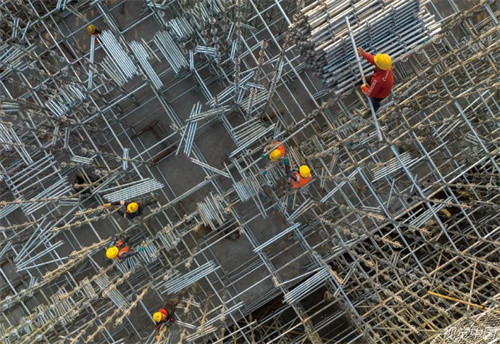

# 经济大市立下“军令状”：拼到毫无保留

《中国经济周刊》 记者 杨琳｜北京报道

2023年经济走向备受关注，而作为中国经济的重要城市单元——包括成都、苏州、南京、广州在内的多个经济大市的开年动态也牵动着外界的目光。

在一系列刺激经济的动作中，它们均在“三驾马车”方面发力，但又各有特色。

**拼到毫无保留：立下“军令状”、拿出真金白银补贴**

2022年，部分经济大市在经历复杂严峻的挑战后，增速放缓。其中，不少城市将2023年的经济目标增速下调，但多数维持在5%以上。

有专家表示，调低经济增长目标，主要是国内经济发展仍面临不少困难和挑战。不同城市面临压力不一致，例如，部分外向型城市外贸动能可能受海外需求放缓影响，并且外贸基数也会影响2023年增速。

在多重冲击下，各地2022年的增长来之不易。对于今年的情况，多地统计局均表示，当前，国际环境更趋复杂严峻，国内经济“三重压力”犹存，经济发展基础仍需加强巩固，面临的挑战不容低估。

面对压力和困难，市委书记们纷纷表示要带头往前冲，还有人立下了“军令状”。

1月28日，新年开工第一天，杭州市领导干部会议上，杭州市委书记刘捷强调，全市各级各部门务必以等不起、慢不得、坐不住的紧迫感夺取开门红、打好翻身仗。要努力到没有遗憾、拼搏到毫无保留。同日，广州市召开高质量发展大会，广州市委书记林克庆表示，今年全年固定资产投资、社会消费品零售总额、外贸进出口总额“三个一万亿”支撑全市地区生产总值突破3万亿元、增长6%以上。

各种阶段性利好措施也纷纷出炉，用真金白银补贴企业和项目。

1月30日，苏州市政府印发《关于推动经济运行率先整体好转的若干政策措施》，推出12个方面55条含金量十足的“干货”政策，包括对产业创新集群工业企业当年度设备投入2000万元以上的项目，按项目设备投资额给予6%至15%的奖励；对引进重大创新团队、创新创业领军人才分别给予最高5000万元、1000万元的资助；支持企业参加超150个境外线下重点展会，对出境参展企业展位费给予最高80%的补助等。

1月12日，深圳市多个部门相继发布阶段性稳经济措施。

深圳市商务局发布《阶段性支持商贸经济运行若干措施》，支持上半年举办消费电子、新能源汽车、数字能源、高性能医疗器械和食品工业高水平专业展会，按照主办方实际办展成本的50%给予资助，最高不超过500万元；对在2022年12月1日至2023年1月21日期间开业的重大商业项目，积极举办节庆促销活动的，按照企业发放消费券总额的30%给予最高100万元补贴。深圳市文化广电旅游体育局发布《关于实施阶段性推动文体旅游市场活力恢复措施的通知》，一季度通过体育场馆“一键预约”平台发放800万元体育消费券；安排2000万元资金发放10万个数字人民币红包，用于留深过年市民购买文艺演出、电影等门票和图书消费……

**经济大市的开年动态：紧盯招商、促进就业、聚焦“大企业”……**

今年以来，“三驾马车”——投资、消费、出口成为各个城市抓经济工作共同的重要抓手。具体怎么干？不同城市也有自己的“特色动作”。

文和友、坡子街、海信广场、茶颜悦色……这些网红标签已经成为长沙这座城市的名片。今年开年，长沙将招商的目光放在了“湘商回归”上。

1月19日，长沙市市长郑建新主持召开市长办公会，会议研究了“湘商回归”工作。郑建新指出，招商引资是经济高质量发展的“源头活水”。要更高层次推动“湘商回归”工程，打造“迎老乡、回故乡、建家乡”升级版，充分发挥首批招商大使、招商顾问、招商专员及委托招商代理机构的力量，奋力推进“大招商”实现新突破。

农历新年过后，1月30日，湖南湘江新区举办湘商新春恳谈会暨重大项目签约仪式，180余位湘商、企业精英参加，15个重点项目集中签约，签约总金额达488亿元。“湘籍企业家是家乡的宝贵财富和资源，湖南湘江新区将一如既往当好大家发展的最强后盾，为企业营造稳定可预期的发展环境，让广大湘籍企业家想回来、敢回来、能回来、快回来。”长沙市委副书记谭勇表示。

2月3日，长沙举行2023年“迎老乡 回故乡
建家乡”新春座谈会暨项目签约活动，近百名海内外异地湖南长沙商会会长、湘籍企业家参与。其间，38个项目成功签约，总投资超千亿元。

2022年，杭州生产总值比上年增长1.5%，增幅低于浙江省1.6个百分点。1月28日的“新春第一会”，杭州聚焦打好经济翻身仗。

大众熟知，杭州的特点之一是创新基础好、技术交易量大、成果多、企业需求旺盛，有吸引全国乃至全球科技成果前来交易的基础。从去年开始，沿海省市外贸人率先出国“抢订单”，让全国看到了他们敢干敢拼的魄力。在春节开工首日，杭州再次走在前列，这一次，杭州打响了跨省招工第一枪。

1月28日，20家杭企招聘负责人踏上了外出招聘的旅途。他们来自不同的行业，奔赴湖南省湘西州。此行，杭州共计为湘西州带去2600余个就业岗位，其中既有普工、操作工、搬家员、保洁员等岗位，也有不少质量工程师、工艺工程师、品质工程师等高层次人才需求。接下来，杭州将分批带领企业前往河南、贵州、湖南、山西等地，密集开展劳务协作招聘活动，帮助企业招工纳才。

郑州也非常重视就业招聘问题，选择在开年密集举办招聘会。1月29日，郑州举办2023开年首场大型人才招聘会”，提供8600余个就业岗位。从2月2日到2月17日，半个月时间，“郑州2023春风行动系列人才招聘大会”持续举行，共为求职者准备6场招聘会，约提供3.7万余个就业岗位。在成都，自2023年“春风行动”暨“就业援助月”活动启动至今已举办招聘会202场，组织5138家企业发布岗位16.71万个，为3.71万人提供公共就业创业服务，2月份，成都市人社局还计划开展248场招聘活动……

2022年，成都地区生产总值20817.5亿元，正式迈入了“2万亿元俱乐部”。在四川政府工作报告中，仅看2023年工作建议内容，成都就出现了18次。包括深入落实成都都市圈发展规划，支持成都创建国际消费中心城市，支持成都、德阳、绵阳、宜宾制造强市试点，支持成都、自贡等打造千亿级无人机产业集群，支持成都、绵阳、眉山打造世界级新型显示产业集群，深化成都市国家城市更新试点，支持成都开展国家服务业扩大开放综合试点等。成都对于四川的重要性不言而喻。

今年，各地都在招商引资上下“狠功夫”，成都也决心抢先机。1月初，成都启动开展以“抢先机、抓项目、促发展”为主题的全市招商引智重大项目系列签约活动，投资14亿元的普华永道全国数智创新中心项目、德赛西威成都研发中心项目等纷纷落地。2月2日，成都绿色食品产业链招商小分队赴宁波招商，被拜访的企业表示，成都招商小分队是节后企业接待的第一批省外客人。

开年，深圳非常重视总部经济、总部企业。

1月29日，深圳市高质量发展大会上，福田区委书记黄伟表示，不断巩固拓展“总部经济、服务经济、楼宇经济”。龙华区委书记王卫表示，积极对接世界500强、总部企业和细分领域龙头企业，力争招引重点项目100个，投资额超1000亿元，实际利用外资2.5亿美元。

此前，2022年的最后一天，深圳市前海管理局发布了《关于服务深港合作鼓励总部企业发展的实施办法》，真金白银支持总部企业在前海发展。该办法中，落户奖励设定为200万～1000万元；团队奖励按照贡献越大、奖励越高原则，明确“总部企业上一年度利润总额3亿元以上30亿元以下的，给予300万以上3000万元以下经营团队扶持；利润总额30亿元以上的，给予3000万元经营团队支持”。

新年收假后，1月28日至30日，深圳市委书记孟凡利带队先后走访了华为、比亚迪、腾讯、中国平安、中国电子、招商银行、正威集团、深投控、顺丰速运、万科10家总部在深世界500强企业。

孟凡利强调，深圳的高质量发展，必须有一批能够体现国家实力和国际竞争力乃至引领全球科技和行业产业发展的世界一流企业做支撑。

广东省2023年政府工作报告为全省敲出了重点——坚持制造业当家。广州市2023年政府工作报告中，2023年重点工作的第一点就是坚持产业第一、制造业立市，加快构建现代化产业体系。

2022年11月，工信部公布了45个国家先进制造业集群名单，广东共有7个集群入选，数量排在全国前列，入选集群集中在深圳、广州、佛山、东莞、惠州5个珠三角城市。同月，工信部直属单位赛迪研究院赛迪顾问发布《先进制造业百强市（2022）研究报告》，对全国293个地级市进行综合评估，深圳、苏州、广州位列前三。

作为两个经常被拿来比较的城市，广州和深圳在先进制造业可能又要迎来新一轮“比拼”了。

那么，广州实现突破的底气、支撑点在哪里？

广州市发改委相关负责人对《中国经济周刊》记者介绍称，今年以来，全市先后举行了重大项目开工签约等一系列活动，在活动现场，上百家企业经营者代表纷纷表示对广州充满信心，将坚定不移立足广州、投资广州。

该负责人介绍，广州制造业地位不断加固，先进制造业增加值已突破3000亿元，占规模以上工业增加值的比重提高至61.6%。其中，汽车制造业发挥了重要支撑作用，2022年实现规模以上工业产值6472亿元，同比增长6.3%；汽车整车年产量突破300万辆，达到313.68万辆，占广东省汽车产量的2/3以上、全国的1/10以上。

包括发展智能与新能源汽车、生物医药与健康、智能装备与机器人、量子科技等在内的新兴产业体系也为广州发展提供了动能。

上述负责人介绍，广州市战略性新兴产业集群成为全省唯一连续3年获得国务院督查激励的产业集群。2022年，全市战略性新兴产业增加值达8879亿元，占地区生产总值的比重提升至30.8%，对GDP增长的贡献率约1/3。

2023年，广州将着力打造智能网联与新能源汽车等8个万亿级产业链群，现代高端装备、生物医药及高端医疗器械、半导体和集成电路等13个千亿级产业链群，以及一大批百亿级产业链群。“广州将进一步擦亮‘广州制造’‘广州创造’品牌，以高质量发展挺起现代化经济体系建设的产业‘脊梁’，在大国博弈、大城竞争中牢牢把握战略主动权。”该负责人说。

责编 | 郭霁瑶

（版权属《中国经济周刊》杂志社所有，任何媒体、网站或个人未经授权不得转载、摘编、链接、转贴或以其他方式使用。）

