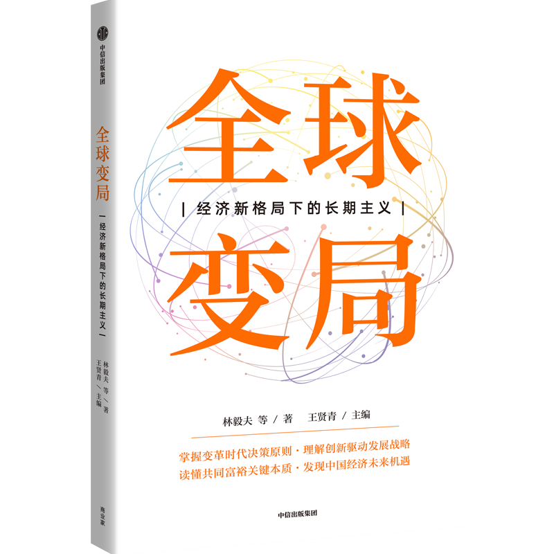

# 要解决生育率下降问题？北大教授：要减少对女性的就业歧视

人口负增长真的来了。国家统计局发布最新人口数据显示，2022年末全国人口为14.11亿人，比上年末减少85万人，人口自然增长率为-0.60‰，正式进入负增长区间，且这一拐点的到来远早于此前有关机构预期的2028年前后。面对提前到来的人口负增长，我们需要再一次思考老龄化、高龄少子化、生育率降低以及未富先老等社会问题。北京大学国家发展研究院教授雷晓燕在最新出版的
**《全球变局：经济新格局下的长期主义》** 一书中给出了如何应对这一趋势的思考。

**中国老龄化的三个突出特征**

我国的老龄化至少有三个比较明显的特征：

**第一** ， **人口老龄化的速度加快。**
将2010年“第六次人口普查”和2020年“第七次人口普查”结果进行对比可以发现，我国65岁以上人口占比从8.9%上升至13.5%，增长了大约1.5倍。

**第二** ， **老年人口规模庞大** ，2020年65岁以上人口数量已达1.9亿。

**第三** ， **生育率已经非常低。** 2020年总和生育率为1.3%，已处于超低生育水平。

综合以上三点，可以看出我国的老龄化呈现出“老龄少子化”的突出特征，准确地说是“ **高龄少子化**
”特征，而未来我国80岁以上人口的增长速度要比65岁以上人口快两倍以上。

**“未富先老”最让人担心的两个问题**

“未富先老”最让人担心的问题主要有两个。

**第一** ， **对经济发展的冲击。**
“未富先老”是指经济水平还没有发展到一定程度，但人口已经先老化了。老龄化和经济发展会相互影响：一方面，当经济发展到一定水平，人的寿命会更长，生育率会自然下降，所以经济发展会加剧人口老龄化；另一方面，老龄化对经济发展可能会产生负面影响，而且其影响会表现在多个方面。我和赵波对比了100多个国家和地区的数据，发现老龄化对经济发展存在一定的负面影响，并且主要通过三个渠道发挥作用：

**一是减少劳动力供给。** 老龄化发展导致劳动力减少，直接影响经济发展。 **二是减少资本积累**
。老龄人口增多会降低社会的储蓄率和资本形成率，资本要素不足会影响经济发展。有些人觉得老年人喜欢储蓄，但这有个前提就是有收入可存，一旦退休后收入减少，也就没钱可存了。有的老年人存的是子女给他们的钱，因为舍不得花，但减少消费对经济发展同样会有负面影响。况且，子女给的钱实际上是年轻劳动力创造的收入，它们被存起来并没有用于消费。
**三是改变经济结构。** 随着人口老龄化，第三产业（服务业）增加，经济结构会从以第二产业为主转变为以第三产业为主，也可能影响经济发展。

**第二** ， **对养老的影响。**
人老了需要被照料，当经济还没有发展到较高水平，我们的经济资源能不能支撑社会养老服务体系建设？从经济上看，养老的钱够不够？从资源上看，有没有时间和人来照料老人？这两方面问题应特别引起重视。老年人多了，参与社会生产的人少了，同时养老的需求增加了，需要劳动力投入。我们面临“老龄少子化”或“高龄少子化”，传统的“养儿防老”方式就成了问题。

**老龄化引发的社会问题**

老龄化还会引发一些社会问题，主要表现在三个方面。

**首先会加剧社会不平等。**
人口结构在地区之间、城乡之间不同，养老制度和医疗制度安排存在地区和城乡差异，所以老龄化会加剧社会不平等。就拿退休制度来讲，强制退休只是城市居民才会面临的问题，农村里的基本观念是“活到老，干到老”，并没有“退休”的概念。这些年农村也推行了养老金制度，即建立了新型农村养老保险（新农保）制度，这方面的城乡差距在缩小，但是老年人无人照料的问题在农村就比较凸显，老龄化会加剧这类不平衡问题。

**其次是社会“适老化”问题凸显。**
一方面是我们的基础设施需要“适老化”。老年人行动不方便，容易摔伤导致失能甚至致命，但很多小区没有建设满足老年人生活需求的基础设施，比如没有电梯等。另一方面是数字化建设需要“适老化”。我们的社会在快速老龄化，也在快速数字化，老年人在这一过程中很容易被落下，包括线上购物、缴费等。如果掌握不了这些数字技术，不但会影响老年人参与社会活动，还会影响他们独立生活。前两年国家在数字化建设中也推出了一些照顾老年人需求的过渡性措施，比如在银行、医院等自助机旁安排专人为老年人服务，未来在“适老化”建设方面还应更加重视。

**最后是医疗支付用于看病太多，防病太少，资源错配。**
以前大家追求“有病可医”，但实际上更重要的应是“预防疾病”。生病除了给人带来不适甚至痛苦，还会带来很大的医疗和照料成本。如果我们提前把重点放在预防上，日常生活中多加注意，让老年人的身体更健康，后续的医疗和照料成本自然会减少。因此，预防疾病从金钱和时间上来衡量，都是应对老龄化更有效的措施。重视预防疾病，光是宣传引导还不够，还需要有制度保障，比如把一些健康行为纳入医疗保险，从源头上降低医疗支出。

**老龄化会给社保和医保带来的两个挑战**

老龄化会产生更多的社保、医保开支，退休老年人口要领养老金，而且比以前领的时间长，老人看病也比年轻人多。人口老龄化意味着劳动力减少，交社保的人越来越少。这是我们现在面临的两个非常重要的问题，即社保制度和医保制度的改革问题。

**第一，关于社保制度。**
“年轻人少了，老年人多了，社保交钱的人少了，开支多了”，这句话形象地总结了我国现在实行的社保“现收现付制”，即把当期年轻人的钱收起来付给当期的老年人作为养老金。但社保体制还可以是“积累制”，即当期年轻人把钱积累起来作为自己以后的养老金。这两个制度有差异，一个是横向解决问题，一个是纵向解决问题。

“现收现付制”下养老金是否足够与人口结构有很大关系。老龄化问题出现之前，我国年轻人很多，老年人少，当期年轻人养当期老年人很容易甚至还有结余。但随着人口结构变化，老年人越来越多了，“现收现付制”就不可持续了，会造成养老金缺口，且我国一些老龄化严重的地方已经出现了这一问题。

养老金“积累制”则不受人口结构影响，它类似于“个人储蓄”，只不过它的规模很大，需要从国家层面来统筹。养老金制度设计中最重要的就是将社保由“现收现付制”转换成“积累制”。目前，我们缴纳社保有个人账户制和社会账户制，其中个人账户制就是“积累制”，你存在里面的钱累积起来就是未来可以花的钱。今后要把个人账户这块做大做实，将“现收现付制”转换成“积累制”，减小社保受人口结构老龄化的影响。

从“现收现付制”转化到“积累制”，现在有很多提法，包括用国有企业资金来支付当期老人的养老金，让当期年轻人的钱积累起来以后用，由此逐步实现由“现收现付制”向“积累制”转化，且经由研究评估，该方案能发挥较大作用。这是社保改革中很重要的一步。同时，还需要更好地管理社保资金，这个盘子非常大，可以交给专业机构，进行规模化的社保理财并取得更高收益，以弥补养老金缺口。

**第二，关于医保制度。**
近年我国的医疗保险制度建设取得快速发展。首先从覆盖面看，原先只有城市正式职工享有“城职保”，2003年后“新农合”覆盖了规模庞大的农村人口，2007年“城居保”又解决了主要针对老人和小孩的城市无业居民的医保问题。至此，我国三大主体基本医疗保险覆盖人群已达到95%。

其次，医保的深度也在推进。比如“新农合”报销的比例最开始特别低，后来也在逐渐增加。医保制度建设快速发展，带来的积极影响是很明显的。第一，医疗服务的使用率提高，减少了老百姓有病不能看的问题。第二，有研究发现“新农合”“城居保”不同程度地提高了老百姓的健康水平。第三，医保有效减少了老百姓的后顾之忧，大家敢去花钱了，促进了消费，进而促进了经济发展；此外，研究还发现医保大大降低了死亡率。

当然，医保制度也引发一些问题。比如由于大家看病不用完全自费，导致医疗费用支出过度等问题。近年来为控制医保开支，国家实行了疾病诊断相关分组（DRG）和病种分值付费（DIP）等医保支付制度改革，力求在保证服务质量的同时控制医疗费用。目前这些改革已全面铺开，相信未来还会做得更好。

关于医保的资金来源，目前不同类型的医保资金的来源不一样。“城职保”是从个人工资中扣缴一部分，企业缴纳一部分；“新农合”和“城居保”则是有不同性质的政府补贴。“新农合”最初是个人或家庭出10元钱，地方政府补贴10元，中央政府再补贴10元，一年只需要缴费30元。这些年缴费和报销额度都在不断上涨，有的地方已经涨了10倍以上，但资金来源还是个人、地方政府和中央政府三方面，同时由县级政府层面来统筹。“城居保”的资金来源与此类似，只是由市级政府层面来统筹。

最后还要特别强调一下，应尽量实现健康的人口老龄化，只有越多的老年人身体健康，才会从根本上减少养老和医保的压力。

**如何解决生育率下降问题**

我国之前实施的计划生育政策对生育率的下降肯定有影响，主要表现为它导致生育率过快地降至一个较低水平，而不是正常的缓慢下降的过程。实施二孩、三孩政策后，收效并不是特别大，因为还有“三座大山”：
**生育成本、养育成本和教育成本** 。

面对生育、养育、教育问题的叠加影响，只放开生育政策显然是不够的。刚开始实施二孩政策时，生育率曾有微弱回升但后来又下去了，现在三孩政策的效果还没显现，但预计影响也不会太大。因为很多调查显示，即便没有生育政策限制，大家愿意生二孩的意愿也不强，愿意生三孩的人更少，特别是年轻人，生育意愿越来越低。

因此，在放开生育政策的同时，必须想办法系统地把生育、养育、教育的成本都有效地降下来。只有这样，才有可能比较明显地促使生育率回升，至少结束当下的过快下滑趋势。有人建议把女性的产假延长，但这也是治标不治本，同时还可能加重企业对女性的歧视。

从国际经验来看，可以增加丈夫的陪产假。目前我国男性的陪产假最多为一个月，如果将陪产假延长至与女性产假同等的时间，一方面可以减少企业对女性的歧视，另一方面也能促使男性更多地参与抚育小孩的过程，避免现在所谓的“丧偶式育儿”，即育儿过程中爸爸的缺位。爸爸对小孩的成长非常重要，让爸爸参与育儿对国家未来人力资本的提升也会有益。建议在延长男性陪产假的同时，由政府来负担产假、陪产假期间的工资，减少企业成本，以此减少企业对生育小孩员工的歧视。

另外，随着数字技术的发展，特别是疫情期间居家办公给我们带来启示，可以鼓励企业让需要照顾小孩的员工实行弹性工作制，比如爸爸每周二四、妈妈每周一三五居家办公，在工作的同时可以兼顾照料小孩。

特别要强调的是，要解决生育率下降的问题，一是要减少对女性的就业歧视，否则不仅会导致生育率继续下降，还会形成一个恶性循环，政策不能只是简单地延长产假。二是推进养老金制度向“积累制”转化。第七次人口普查结果和研究预测显示我国的老龄化速度会非常快，因此我们一定要更快采取行动建立养老金“积累制”，否则未来可操作的空间会越来越小。

**虽然老龄化会带来一些负面影响，但老龄化本身其实是社会发展进步的结果。**
国家统计局的数据显示，我国城乡居民人均预期寿命从新中国成立初期的35岁提高到2019年的77.6岁。其中，中国男性平均寿命为73.64岁，中国女性平均寿命为79.43岁。同时，老龄化也能对经济和社会发展带来积极正向的影响，比如会促进“银发经济”发展。“银发经济”的核心就是要在社会发展中积极发挥老年人的作用。

作者：雷晓燕（北京大学国家发展研究院教授、学术委员会主任， 教育部长江学者特聘教授）

**本文摘自《全球变局：经济新格局下的长期主义》**

