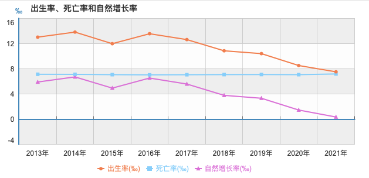
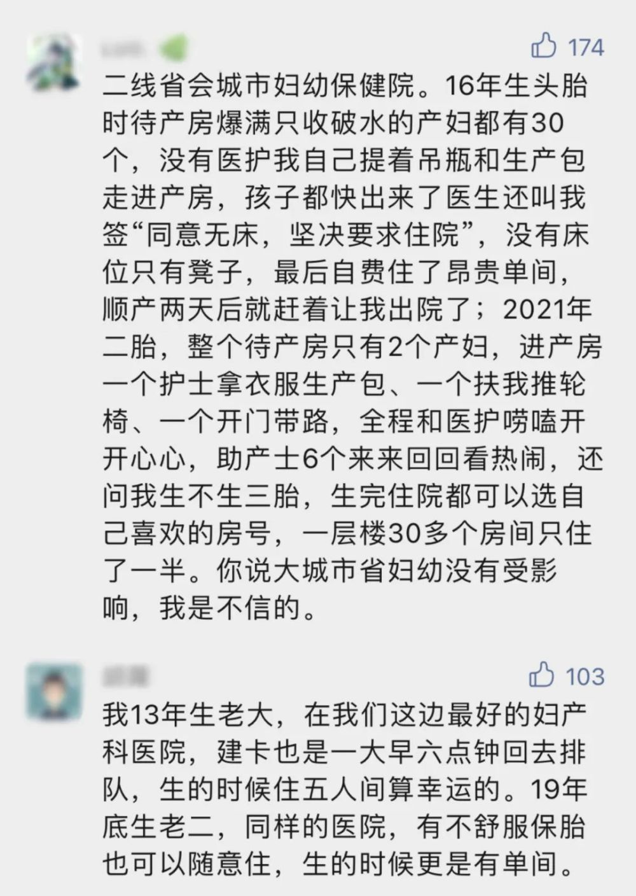
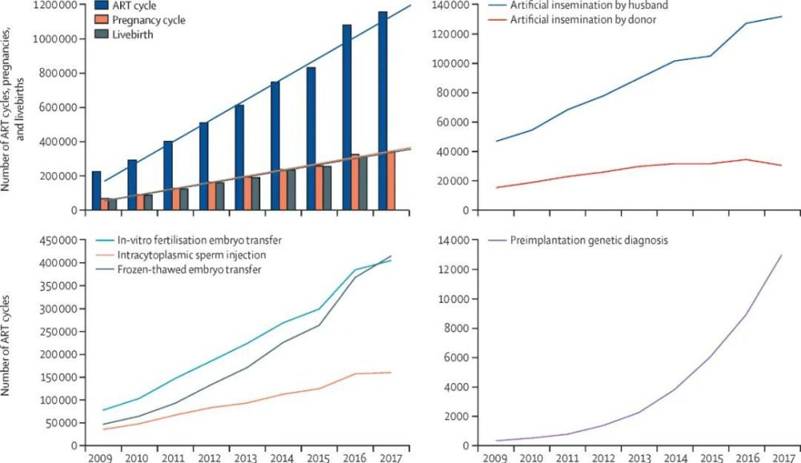

# 产科寒冬：分娩量近乎腰斩，有医院直接取消科室

产科比以往更少了几声啼哭。

「以前本院各科的医生护士都会来产科生，这几年来问的人都没几个了。」建档人数变少、新生儿数量下降，苏丽娜明显感觉到，产科显得有些安静。

全国各地的产科一同经历的这场寒冬，在数据上得到了清晰的印证。

国家统计局最新公布的数据显示，2022 年全年出生人口 956 万人，人口出生率为 6.77‰；死亡人口 1041 万人，人口死亡率为 7.37‰。
**人口自然增长率为 -0.60‰，这是 61 年以来我国首次出现人口负增长。**

**分娩量下降近半，从「没床位」到「床等人」**

春节过后，各科室的手术量和门诊量都逐渐回升甚至激增，但上升的暖风似乎并未吹进产科，新生儿数量仍在持续减少。

苏丽娜所在的是河北省某民营医院，上个月的分娩量大约 60 多例， **「月初统计的时候发现，这个月预产期的人比上个月还要少。」**

上海浦东新区某三级医院产科医生伊然表示，浦东新区总分娩率的大概少了
3%，各个医院因为疫情的影响有的减少，有的增多。「比如疫情期间，定点医院的分娩率就明显减少、腰斩甚至下降
70～80%，但同时非定点的专科医院和私立医院都有一定升高。」

疫情如同掉落在房间里的针，愈发凸显了产房近几年的空旷。

苏丽娜回忆，十几年前初来产科的时候，科室里一共两个医生，每天门诊量 50～60，一天下来就要建十几个档。

**2016 年起，二孩政策正式开始实施，当年新增人口达到新世纪峰值，那一年 1786 万个孩子在中国降生。** 17
年，苏丽娜所在医院的新生儿数量达到了近 2000 例。但下滑的迹象也从此刻初显，「18 年的时候差不多一年新生儿的数量是 1400 个，19 年就只有
1000 出头，去年差不多 900 多，平均下来每个月不到 100 个新生儿。」

不仅是苏丽娜个人的感受，全国多地医院产科都出现类似趋势。自 2016 年以来，我国新生儿数量持续下降，出生率从 13.57‰ 一路滑落至今年的
6.77‰，全国新生儿数量不过千万。

_2013～2021
年我国人口出生率、死亡率和自然增长率变化 图源：国家统计局_

国家卫健委 2021 年公布的数据显示，「十三五」时期，我国生育旺盛期妇女（20～34 岁）年均减少 340 万，目前中国育龄妇女（15～49 岁）大概
3.3 亿，到 2050 年预计下降到 2.0～2.4 亿。

宏观数据的变化，也体现在产科的病床周转率中。

生育高峰那几年，匆忙和紧张是产科的主旋律。「连轴转上下手术台，病人生完孩子也没见到医生」、「在电梯门口和病例讨论教室加床」、「危重孕妇跑遍全市都找不到医院收」等现象时有发生。2012
年，苏丽娜自己的孩子降生，回想那一年的产科，「病房很满、想有个床位都很难」是她最深的印象。

加快床位周转率以容纳更多产妇安全生产，是当时产科的应对之法。伊然说，「以前差不多顺产 1～2 天、剖宫产 3 天左右就会让产妇出院了。」

**而这几年，不少二胎妈妈们都感叹床位的宽裕。** 单人间可能还略抢手，但双人间基本都能住上，三人及以上的病房更是不用排队，常常有空床。

_丁香园用户的评论_

「现在也不着急办出院，产妇如果恢复慢，可以酌情再住一段时间。」伊然说，「目前基本上顺产的 3 天左右、剖宫产 5 天左右出院。」

**基层医院受到冲击，大医院开始「抢」病人**

「建档一号难求」是生育高峰期的产妇们的集体记忆。每日限号、早起排队，想要在口碑好一点的大三甲医院建档生产，难度甚至不亚于抢到一张春运回家的火车票。

而现在，伊然觉得「已经完全不一样了」。 **不仅建档非常方便，以往人满为患的大医院，也不得不开始为争取更多病人而努力。**

以上海为例，目前上海建档实行「大小卡」制度。小卡，即上海市孕产妇健康手册，确认怀孕后在社区医院建立档案，记录下基本资料；大卡，即孕妇在产检、生产医院的建档记录，通常在小卡办理后再前往医院挂号登记办理大卡。

伊然说，这几年，部分医院为了能够聚集更多的病人，常常在孕产妇「小卡」还没来得及办时，直接在做检查之后给建「大卡」。

**整体分娩量减少，高等级医院更倾向于积极争取，病人向上转诊加强，基层医院则更可能因为技术、服务水平不足而流失病人。**

天津一家基层医院产科医生张理然举了个例子，「我们有个病人有脊髓损伤史，在我们医院做剖宫产其实完全没问题，做全麻就可以。但她的家人一说想到市里，市里马上就把住院证给他开好、预约住院了，我们都就觉得非常吃惊。之前我们的病人有往市里转的，经常转
10 个病人会回来 4 个。」

对基层医院来说，分娩量是产科主要的营收手段。当建档更方便、向上转诊更容易、产妇向更高等级的医院流动，寒冬里的基层医院受到了更大的冲击。

公开数据显示，2016 年，全面二孩政策开放时，天津当地助产机构数量为 92 家，去年仅为 60 家。
**「有些技术水平偏弱的基层医院，甚至直接将产科取消，只留下妇科科室。」** 张理然表示。

苏丽娜观察到，这几年产科的人员流动比以前更加频繁，一些老员工也纷纷离职。「整体的分娩量都下降了，收入相比以前也没那么理想。」

**而妊娠周期又意味着，这样的影响在一段时间内可能仍然会持续。**
伊然解释，去年上半年上海封控期间，很多外地产妇无法来上海建档建卡，「那八九个月之后，她们也就不会在我们这里生产。」对于这次感染潮给产科带来的影响，医生们都表示还需要长期观望。

**生育结构改变，生育困难增加**

**生育率下降的同时，我国的生育结构也在发生变化，高龄、再生育产妇比例明显增加。**

调查数据显示，全国适龄人口初婚年龄不断推迟，女性平均初婚年龄 26.3 岁，初育年龄推迟至 27.2 岁。育龄妇女生育意愿持续走低，2021
年平均打算生育子女数为 1.64 个，低于往年。

苏丽娜观察到，产妇中一胎的比例明显减少。「以前科室里可能一半都是初产妇，现在大部分都是来生二胎、三胎的。」

孕妇建档后，根据妊娠风险高低会被赋予不同颜色的标签。绿色代表没有妊娠合并症及并发症，妊娠风险低。而黄色、橙色、红色则意味着妊娠风险的递进。每个月产科报质控时，苏丽娜发现有差不多五分之一都是
35 岁以上的高龄产妇，「四十岁以上的，每个月也都能遇上几个。」

35 岁是女性生育能力的一个分水岭，女性的生育能力在最佳年龄过后会逐渐下滑，医学上也称为「折棍现象」。

**而随着有生育意愿的女性年龄逐渐升高，「生育困难」成了绕不开的话题。**

北京大学第三医院乔杰院士、国家卫生健康委妇幼司司长宋莉、四川大学全国妇幼卫生监测办公室朱军教授团队 2022
年在柳叶刀发表了《中国女性生殖、孕产妇、新生儿、儿童和青少年健康特邀重大报告》。报告中指出，1990 年，中国约有 9%
的夫妇被诊断为不孕（指一年以上无保护性行为中仍不能怀孕），86 项全国生殖健康调查数据显示， **中国不孕患病率从 2007 年的 11.9% 上升到
2010 年的 15.5%。**

_2009～2017
年中国辅助生殖技术变化趋势 图源：参考资料_

「一方面是年轻女性生育意愿降低，目前临床比较愿意生的高龄、再生育产妇，则可能面临生育困难的问题。」上海新华医院生殖医学中心副主任医师陆小溦介绍。

门诊统计的数据显示，寻求辅助生殖技术帮助的女性平均年龄在逐渐增加，「最开始大概是 30 出头，现在慢慢朝 35 岁靠拢了。」

陆小溦接诊过一个想做试管婴儿的病人，41 周岁时初婚后想要一个孩子，而此时受限于卵巢功能，自然怀孕困难，试管婴儿也经历了好几轮失败。

另一个病人，10
年前怀孕时没有留下宝宝，觉得还没做好准备。患者近期妇科检查时发现了子宫内膜病变，「她担心可能失去生育的能力，就来门诊找我想办法。这时候她已经 43 岁了。」

对于建议将不孕不育治疗纳入免费医疗的提案，此前国家医保局回应称，将逐步把适宜的分娩镇痛和辅助生殖技术项目纳入医保基金支付范围，努力减轻不孕不育患者医疗负担。

辅助生殖技术中，试管婴儿技术是服务和收入的大头。一次试管婴儿包括促排卵、取卵、体外受精、胚胎移植、冷冻、复苏、囊胚培养等过程。陆小溦回忆，在生殖医学领域工作
20 年以来，相关项目的价格不升反降， **「最开始一轮下来的助孕费用需要 3～4 万，现在病人花 2～3 万、甚至 2
万不到左右就能做一轮。但由于困难患者增加，1～2 轮搞不定的病人多了，总体费用可能是上升的。」**

「实验室项目的费用基本是固定的，主要的差距在于促排卵方案和用药。」陆小溦介绍。国家医保局在回应中表示，目前已将符合条件的生育支持药物，如部分促排卵药品纳入医保支付范围。

**目前全国大部分省市，辅助生殖仍然属于自费项目。** 以上海为例，生殖医学中心从挂号开始就使用自费卡，全流程都没有可以报销的项目。

随着女性年龄的增长，辅助生殖的成功率逐渐降低，超过 42 周岁的女性每移植周期成功率可能不到
10%。陆小溦说，「生一个孩子的成本越来越高，这可能也是大家希望进医保的原因。」

文中 张理然、伊然 为化名

策划：yuu. | 监制：gyouza

题图来源：视觉中国

本文作者：吞吞

参考资料：

Qiao J, Wang Y, Li X, Jiang F, Zhang Y, Ma J, Song Y, Ma J, Fu W, Pang R, Zhu
Z, Zhang J, Qian X, Wang L, Wu J, Chang HM, Leung PCK, Mao M, Ma D, Guo Y, Qiu
J, Liu L, Wang H, Norman RJ, Lawn J, Black RE, Ronsmans C, Patton G, Zhu J,
Song L, Hesketh T. A Lancet Commission on 70 years of women's reproductive,
maternal, newborn, child, and adolescent health in China. Lancet. 2021 Jun
26;397(10293):2497-2536.

