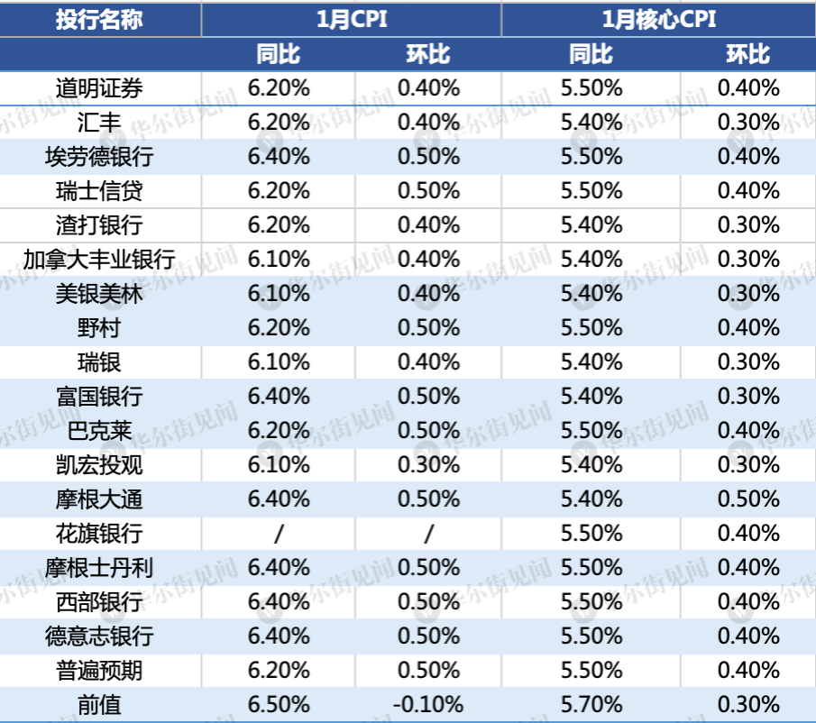
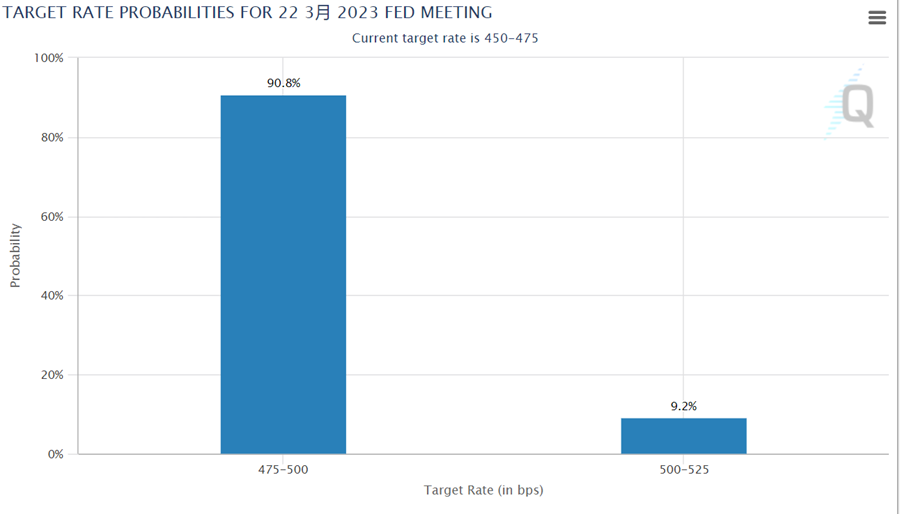
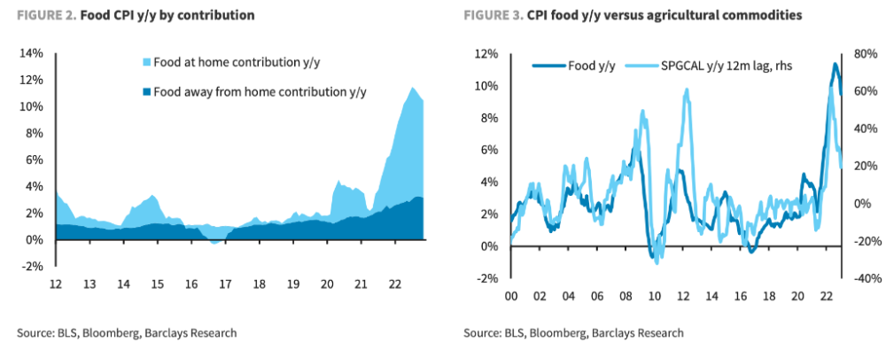
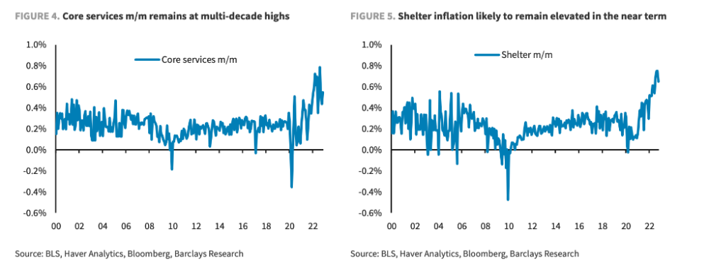
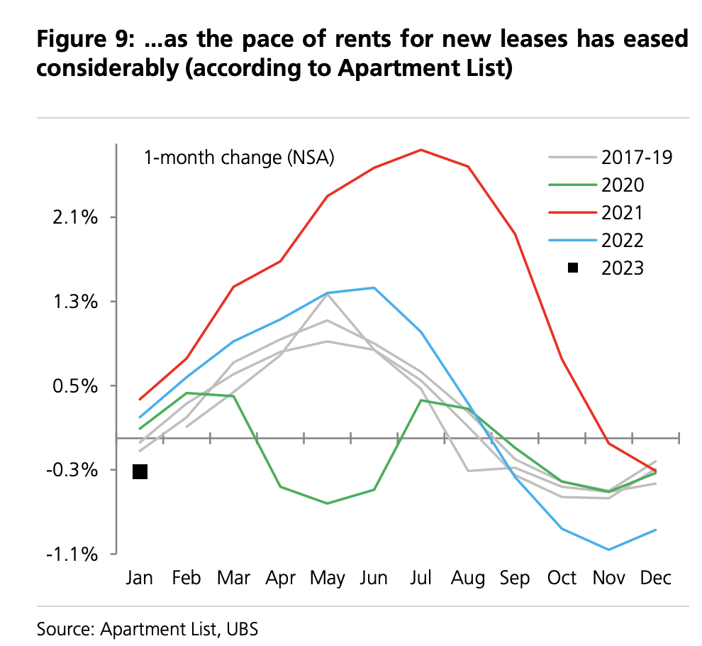
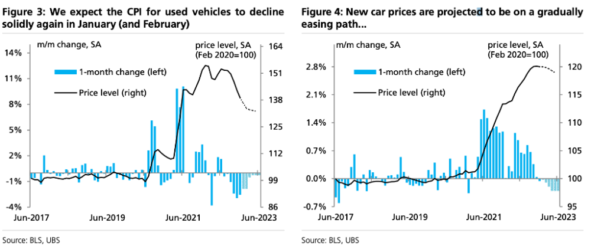
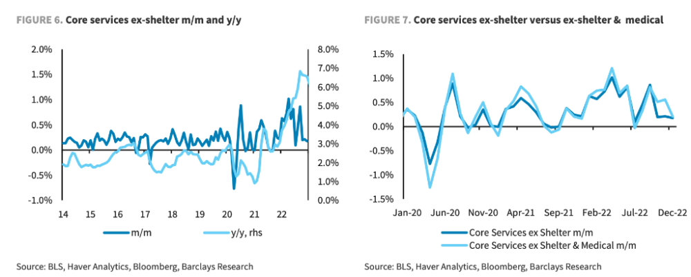
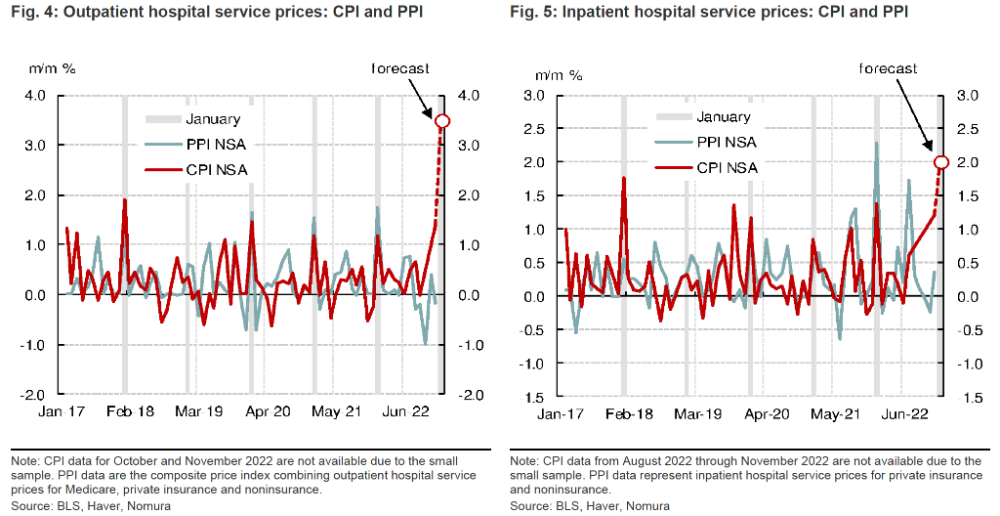

# 今晚，所有人都在等待美国1月CPI，核心通胀势创三月最大涨幅？

核心通胀势创三月最大涨幅？美联储何时才能停止加息？当地时间2月14日情人节，公布的美国通胀数据会给市场带来惊喜还是惊吓？

目前市场普遍预期，美国1月CPI同比增速将持续回落， **但受汽油价格推动，美国1月CPI环比或上涨0.5%，创三个月来最大涨幅；**
核心CPI同比增速有望继续回落，但环比或上涨0.4%，较12月的0.3%小幅回升。

这表明美联储仍需要进一步加息，直到确保消灭通胀压力。

不过令人安慰的是， **分析师普遍认为1月CPI同比增速将放缓至6.2%，连续第七个月下降，**
核心CPI同比增幅将从12月的5.7%进一步降至5.5%，创2021年末以来的最小涨幅。

华尔街分析师认为， 2月密歇根短期通胀预期意外反弹，让市场对此次公布的CPI数据感到隐隐不安。

根据CME美联储观察工具，联邦基金期货交易员目前预计，市场认为美联储3月加息25基点基本上板上钉钉，可能性为90.8%，高于一个月前的45%；利率在今年年底之前保持在5%之上的可能性为45%，高于一个月前的3%。

此外即将公布的CPI数据将是权重调整后的首次数据， **此次调整将给1月份的核心通胀率带来上行压力，不过有助于压低其后的通胀率。**

2月10日，美国劳工统计局公布了消费者价格指数（CPI）分项的最新权重。该机构将下调二手车权重、略微上调居住——主要是业主等价租金——权重。

媒体分析指出，即将发布的CPI或许会对美股造成重大冲击。债券、期权市场均暗示着，此次CPI数据可能比预期更火热，恐将引发美股与黄金进一步下行，同时提振美元。

汽油价格上涨成为重要推手 商品通胀势头放缓

多家机构指出， **1月汽油价格的上行成为推动整体CPI环比转涨的重要因素** ，预计1月CPI环比上涨0.5%，12月环比下降0.1%。

巴克莱在报告中指出，根据数据统计，美国1月汽油平均零售价格环比上涨4.4%，这意味着其将推动1月份CPI环比上升3.5%，但商品通胀增幅将继续放缓：

根据我们的预测，食品通胀率可能环比上涨0.2%，略低于12月的水平，同比增速下降至9.7%，低于去年8月11.4%的峰值。

最近几个月的农产品价格已大幅下降，鉴于成本传导到食品零售价格的滞后性，我们认为这预示着食品通胀在环比及同比角度都将进一步放缓。

摩根士丹利分析师Ellen
Zentner在一份报告中写道:由于核心商品降幅较小，核心通胀率应会走高。但鉴于目前商品整体价格没有明显上涨，价格压力应该仍低于（去年）夏季和秋季的峰值水平。

核心服务通胀仍然强劲

虽然市场普遍认为，通胀已从去年的历史高位逐步放缓，但美联储将重点关注核心服务通胀的表现，来判断紧张的就业市场对通胀的影响，分析师认为，
**1月服务价格的增速或将放缓，但依然强劲，预计环比将较12月的0.3%小幅回升至0.4%** 。

巴克莱在报告中指出， **受住房通胀水平依旧保持在高位的提振，核心服务通涨的增幅仅会小幅放缓**
，报告解释称：我们预计核心服务通胀率将略微下降，环比增长0.6%，尽管住房通胀会明显的缓和，但因为滞后性的原因，缓和的趋势这不太可能体现在1月份的核心服务通胀方面。

瑞银在报告中指出，他们认为 **1月住房及租金通胀增速将放缓，但因滞后性的影响，或许放缓幅度并不会符合他们的预期** ：

我们预测本月的核心CPI中的住房租金都将放缓，根据租房市场的数据显示，我们确信住房租金将在未来6至12个月内稳定下降，但确切的时间无法确定定的。

因此我们不会惊讶于看到核心CPI增幅比我们目前预测的环比增长0.26%，高10至15bp，但我们会惊讶于看到核心CPI增幅比我们预测的低10至15bp。

美国资管公司Infrastructure Capital Management首席执行官杰Jay Hatfield表示，
**二手车的波动，可能使核心服务通胀可能比预期更热** :

我们认为，推动通胀增速放缓的因素是二手车的波动。但根据我们近期数据显示，二手车通胀实际上是在上升而不是下降，与此同时，劳工统计局计算住房成本的方式往往会导致数字更高。

但瑞银认为1月至2月的二手车价格将继续成下降趋势，且新车价格也将处于逐渐放缓的状态：

Horizon的首席投资官Scott
Ladner表示，美联储本身已发出信号，表明住房通胀将保持粘性，因此不太可能对此给予太多关注，他主要关注与住房服务无关的核心通胀，认为其“显然正在下降”。

巴克莱则认为，除住房外的核心服务通胀1月仍将略微上升，环比上涨0.3%，
**因机票价格的下降趋势正出现转折，叠加医疗保险通胀的提振，会给核心服务通胀造成上行压力** ：

野村证券分析师也指出，因医疗服务价格的不确定性增加以及美元疲软导致进口价格上涨，使得1月核心CPI环比增速保持在0.4%的相对高位：

根据我们的计算，即将到来的CPI重新加权使1月份的核心CPI通胀率
提高了几个基点。虽然我们预计二手车价格在本月继续下降，但与租金有关的部分可能仍然存在上升趋势。

从美联储的角度来看，核心CPI的弹性可能会提醒我们，实现2%通胀目标的道路并不平坦。

彭博经济学家Anna Wang等经济学家表示：我们预计，1月份 CPI 指数的环比变化将冲淡3个月来的反通胀（disinflation）趋势。

汽油价格上涨、商品通胀势头放缓、服务价格仍然强劲上涨，这些因素应该会提振整体和核心CPI，并支撑市场押注美联储将利率上调至高于市场现已消化的利率峰值，或高于去年12月点阵图所指示的水平。

市场对于通胀将降至2%左右或许过于乐观

美国“真实”通胀水平可能已经回到5%左右，且我们预测到二季度，CPI和核心CPI同比分别降至3%和4%左右，而增长压力届时将会增加，美联储可以在之前先停止加息。

华尔街见闻此前提及，数据或将证明， **服务业通胀将比商品通胀更加顽固更加难以抑制** 。ISI Evercore 的分析师 Peter Williams
向媒体表示：我们仍然认为，从一系列指标来看，经济数据正朝着美联储期望的方向发展，但放缓速度可能没有之前那么快。

在我们看来，鉴于我们所看到的数据变化，市场可能也应该会继续朝着“高利率持续更长时间”的方向重新定价。

我很惊讶，市场现在已开始押注经济上行，通胀放缓，美联储将于今年下半年转向降息，我们认为这种乐观情绪，同时，投资者们已经开始预期会利好风险资产的宏观经济背景。这种情绪忽略了全球发达国家市场的通胀粘性，以及或将迈入衰退的经济前景。

此外，无法降温的劳动力市场，使得市场对一年后通胀水平的押注不断增加。根据 Refinitiv
的数据，投资者对美国一年后通胀水平的押注从远超预期的非农就业报告发布前的2.4%左右，升至上周五的3.9%。

巴克莱认为，2023年12月整体CPI将降至2.6%，2024年12月将进一步下降到2.3%。同时，该行上调了对2023年的核心CPI数据的预测，巴克莱认为，到2023年12月，核心CPI将放缓至3.2%，到2024年12月进一步降至2.6%，分别上调0.3个百分点及0.1个百分点。

市场将如何反应？

分析认为，即将发布CPI数据，或许会对美股造成重大冲击。一场重新定价的可怕信号来袭，债券、期权市场均暗示着，此次CPI数据可能比预期更火热，恐将引发美股与黄金进一步下行，同时提振美元：

如果CPI超预期的趋势持续下去，可能会带来相当大的风险。根据通胀掉期市场显示，对通胀的预期总体呈上升趋势，1月份掉期同比增幅从1月10日的低点5.88%上升至2月9日的6.2%，这与分析师的普遍预期一致。

根据数据统计，在去年12次CPI数据发布日 **，标普500指数有7次下跌。根据彭博汇编的数据，在过去六个月中，标普500在CPI 发布当天的平均波动约
2.6%——接近 2009 年以来的最高水平** ：

投资者们仍然记得9月13日CPI报告给市场的巨大震荡，导致标普500指数暴跌4.3%，创下2023年3月以来最糟糕的 CPI 交易日。

越来越多的迹象显示，美国的通胀可能比投资者预期的更为顽固。美国银行策略师Michael
Hartnett表示，下周公布的美国通胀数据有可能成为美股由涨转跌的转折点，标普500指数已经逼近他给出的目标价4200点。

摩根大通交易室对CPI公布当天具体的市场反应预测情形如下：

如果 **1月CPI同比增长超过6.5%** （几率为5%）， **标普500会下跌2.5%** 。

如果 **1月CPI同比增长在6.4%到6.5%** （几率为25%）， **标普500会下跌0.75%到1.5%。**

如果 **1月CPI同比增长6.0%—6.3%** （几率为65%）， **标普会涨1.5%到2%** ，然后涨势消退。

如果 **1月CPI同比增长低于6.0%** （几率为5%）， **标普会涨2.5%到3%**
。这种程度的CPI可能令创重新定价市场对美联储的预期，预期将联储从还需要加息两次完成这轮加息变为，只需要再加息一次。

