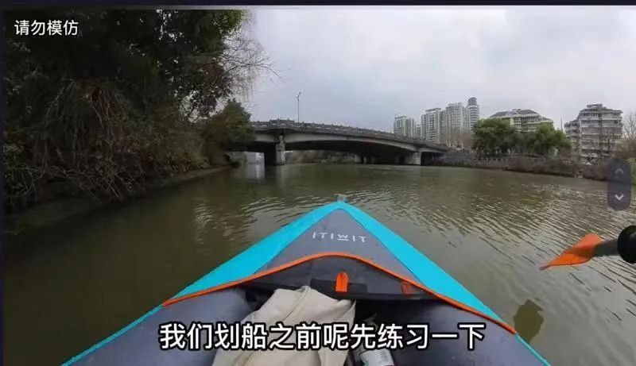
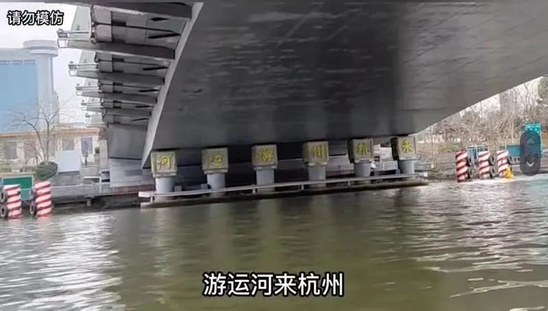
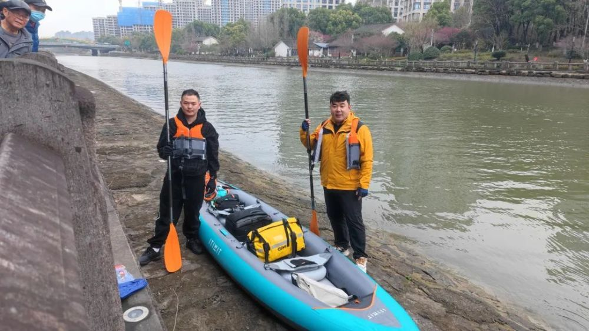
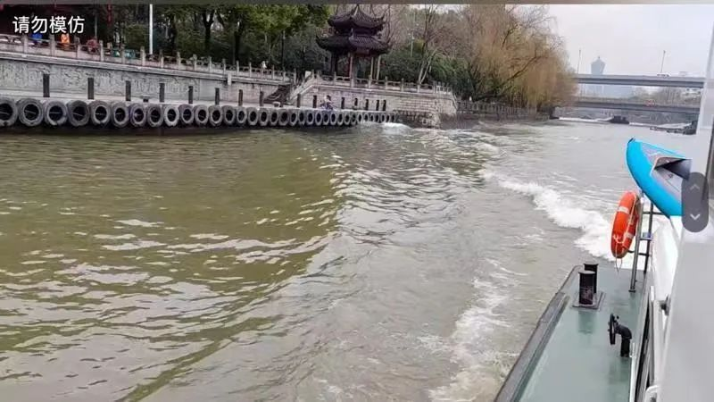

# 从杭州沿运河划船去北京可行吗？博主6小时划了5公里后被执法队拦截

这两天， **一则《两个大冤种从杭州沿京杭大运河划船去北京》的视频广泛流传，在B站等平台播放量加起来已超100万。**

视频里，两位完全没有划船经验的小伙子—— **大明和“猪猪侠”，买了充气船、救生衣，计划用一个半月的时间，从杭州沿京杭大运河划到北京。**

2月10日上午，他俩从杭州三堡附近下水，中午划到西湖文化广场附近， **划了不到6公里，就被杭州市交通运输行政执法队拦截。**
两人还接受了安全教育，写了检讨。

网友评论得很欢乐：

“你俩闹了半天拱宸桥都没划过去。”

**“6小时划了5公里，被抓了哈哈。”**

“按这个速度，今年能出浙江吗？”

“这技术和运气没三五年到不了。”

“兄弟！我住天津北运河边，一直有这个想法，没想到真有人去实践。”

“济宁老乡有过同样的想法，谢谢你帮我实践了一下。”

“做了我想做的事，从京杭大运河到北京。”

不少人看了视频也蛮好奇：从杭州真的可以划（坐）船去北京吗？

**想法是美好的**

**现实是残酷的**

记者联系上大明，问他为什么会有这个想法。大明说，去年看到一个新闻，说是京杭大运河全线开通，就萌生了这个想法。

大明是山东济宁人，自由职业者，爱好骑行，充气船并没专业练过。计划之前大明做过考察，先是到北京，本打算从北京往杭州划，但此时北京河道正结冰，所以计划从杭州出发。

2月9日，大明和朋友来到杭州，充气船是从网上买的，再加上一些装备， **总共投资4000元，** 10日从钱塘江和大运河交汇处下河，
**计划一个半月划到北京，但按照实际速度可能要半年才能到。**

大明说：“还没划出城区就被拦住了，说大运河是不可以划船的，大运河经常有货船经过，这种充气船根本经不住大船掀起的浪，不安全。”

大明说，由于自己之前不是很了解，已经认识到这么做是不对的。

执法队解释， **运河是杭州的主航道，有货船、水上巴士通行，未经审批不可以下水划船。**
充气船被大船撞到、被螺旋桨割到或被风浪掀翻的情况都可能发生，太危险啦！

**从杭州坐船真的可以去北京吗？**

虽然这两个小伙未能实现“壮举”，但不少人看了视频也蛮好奇：从杭州真的可以坐船去北京吗？

去年，长达1789公里，连起北京与杭州的京杭大运河，在时隔百余年后再次实现了“全线通水”。这让很多人觉得，这是否意味着走京杭大运河，从杭州到北京已经具备了可行性？

这可画不上等号。京杭大运河虽已“全线通水”，但还未“全线通航”。

昨天，我们对着地图研究了各种可能性，也咨询了多位业内外人士，最终的结论是， **目前从杭州坐船，沿着运河一路北上，最远可以到达山东境内的黄河南岸。**

这之后，穿越黄河是我们坐船北上的第一只“拦路虎”；若能成功穿越，接下来还有一群“拦路虎”是部分运河河段未实现通航，可能就得自己时不时冒着风险划小船，才能继续前进到达北京呢！

**让我们模拟一下**

**这一路“奇幻漂流之旅”**

在杭州走京杭大运河去北京，这一路会是怎样的“奇幻漂流之旅”？

我们来模拟一下。

目前除了只在杭州市内航行的游船和水上巴士，杭州运河上很少有客运船只航行，因此，我们的旅程要从乘坐货船开始。

**从杭州沿运河一路北上，出了杭州后，经过湖州、嘉兴，进入江苏境内，一路上会路过苏州、无锡、常州和镇江。**

运河在镇江城东部的谏壁一带汇入长江。运河与长江是“平交”，在谏壁的运河与长江交汇处，建有一座船闸，通过船闸，船只便可驶入长江。

进入长江后，船只在长江上向西航行一段，来到“京口瓜洲一水间”的扬州瓜洲以东的运河河口，向北转弯即可驶入运河，通过施桥船闸之后，便可继续向北航行。

在坐船沿运河北上的过程中，长江是第一条与其相交的大江。可能有人会感到好奇：为什么运河与长江不是呈现十字交叉，而需要在长江中行驶一段？

中国水利水电研究院工程师陈兴章告诉我们，这充分体现了古人的智慧和大自然的选择：“古代修建运河时，更多考虑的是由北向南的航行需求，运河呈一定夹角过长江，可以让运河上的船只从长江北岸进入长江后，借助东流的江水为船只助力，船只就可以顺势驶入长江南岸的运河中。”

**运河与淮河入海水道交汇处**

**可以走水上立交桥**

到达扬州后，船只会穿过扬州城，路过高邮、宝应，到达淮安城的南边——这里是运河与淮河入海水道的交汇处。

由于运河的水位比淮河高，为了让运河跨过淮河入海水道，这里修了一座水上立交桥，也就是淮安水上立交枢纽，采用“上槽下洞”结构，让运河与淮河入海水道“各自独流”，各行其道，互不干扰。

运河水与水上的船只，通过水上立交的上部“桥梁”，跨过淮河入海水道，船队浩荡，往来如梭；下部15孔巨大涵洞没入水中，自西向东沟通了淮河入海水道。这成为苏北平原上一道独特的景观。

乘船跨过淮河之后，沿着运河继续向北，穿过淮安城，再经过宿迁、徐州等地，出江苏省，进入山东境内。

**沿着运河北上的货船**

**被高耸的黄河堤坝拦住去路**

继续向北，经枣庄、济宁和泰安等地，运河就来到了济宁市梁山县附近的黄河南岸。

黄河是一条“地上河”，水位比运河要高出很多，这使得运河无法直接与黄河交汇，船只在此处被高耸的黄河堤坝拦住了去路。

**所以我们说，目前从杭州坐货船出发，沿着运河北上，最北端就只能到达这里了——黄河成为运河船只北上的“拦路虎”。**

陈兴章说，虽然历史上运河曾经跨过黄河，但那时的黄河和今天的黄河早已不同，走向、水位等因素都不一样了，当黄河的水位越来越高，并形成目前的走向之后，便把运河“拦住了”。

为了让运河跨过黄河，让两条河实现有效贯通，上世纪70年代，我国曾修建运河入黄船闸，后来发现黄河泥沙淤积对船闸影响太大，出现渗水隐患，于是停用拆除了。

事实上，运河穿越黄河的各项工程研究至今还在进行中。有的方案提出建设运河穿越黄河的隧道；有的方案提出利用升船机，将运河上的船只从黄河上部拖过……

**黄河以北的运河曾长期断流**

**一些未通航河段需自己划船**

无论采用何种方案，假如能让运河的船只顺利穿越黄河，那么接下来的旅程就要换船了。坐货船或是相对较大的船只，估计不行了，要做好自己划小船的准备。

从黄河以北至北京的运河河段总长约707公里，所在的海河流域属于资源性缺水地区，上世纪70年代以来，水资源呈衰减趋势，部分河段长期断流。

虽然去年通过优化调度南水北调水、黄河水、本地水、再生水及雨水等多水源补水，让运河全线实现了通水，但一些河段由于泥沙淤积、水位、河道功能及桥梁高度等多重因素，依然是无法通航的。货船、客船等船只都无法在河道内航行。

所以，假设要继续沿着运河去北京，就得随机应变了，比如在已经通水但不通航的河段自己划一划小船之类……当然，只是假设，危险性极大。

黄河以北的运河也有部分河段实现了通航。比如河北沧州中心城区段，开通了航行在沧州城内运河上的游船；从北京通州至河北香河的河段也实现了通航，河北的游船已经可以通过运河开到北京通州。

此外，天津等运河沿线的城市也都提出要实现运河河段的通航功能。

**或许，在不久的将来，从杭州一路坐船直达北京，真的会实现。**

橙柿互动·都市快报 记者 黄煜轩 王海峰

