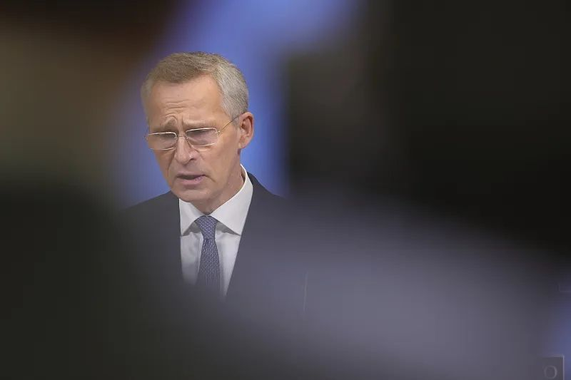
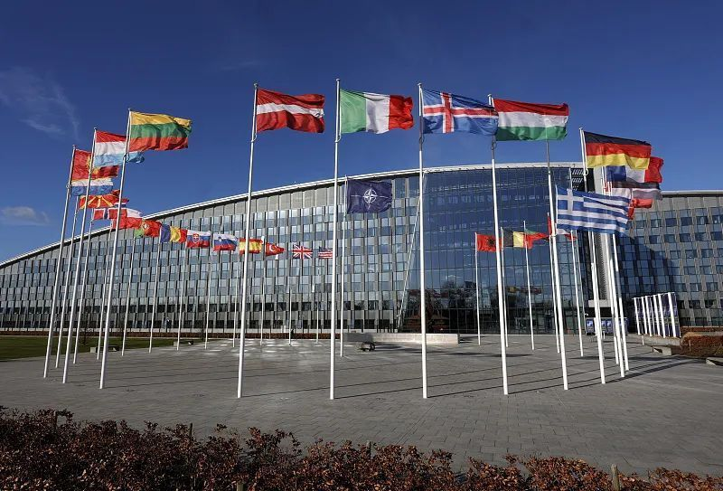

# 俄乌冲突近一周年，北约弹药库存告急

俄乌冲突爆发即将一周年，北约成员国弹药库存告急。

2月13日，北约秘书长斯托尔滕贝格坦言，乌克兰危机正在耗尽北约军事装备库存，成员国军事工业面临巨大压力。

斯托尔滕贝格承认，乌克兰目前的弹药支出率比北约成员国的生产率高出很多倍，造成北约防务工业生产力吃紧。目前大口径弹药的等待时间已从12个月延长到28个月。

_当地时间2月13日，斯托尔滕贝格在北约总部举行记者会。图源：视觉中国_

斯托尔滕贝格指出，北约国家需要提高军事装备和弹药产量。他预计今年北约防务开支将进一步增加，同时强调北约将继续向乌克兰提供军事装备和训练。

路透社当天的报道也指出，乌克兰军队每天发射多达1万枚炮弹，向乌克兰加速运送弹药已经耗尽了西方国家的库存，并暴露了供应链和人力方面的漏洞。

“如果欧洲要与俄罗斯作战，一些国家的弹药会在几天内耗尽。”一名欧洲外交官说。

报道指出，在俄乌冲突爆发前，许多北约成员国的弹药储备就没有达到标准，它们认为大规模炮战已成为历史。

一名防务消息人士举例称，仅德国一个国家，在俄乌冲突爆发前，其弹药储备与北约的要求就相差了200亿欧元。

_去年2月，布鲁塞尔北约总部。图源：视觉中国_

对于北约成员国来说，军事装备库存中还有多少炮弹是高度机密，北约的储备目标同样高度保密，这些目标因成员国而异。

一般来说，北约会要求每个成员国提供某些战力，以便在冲突爆发时加以利用。

例如，北约会在冲突爆发时要求某个成员国提供一个装甲师，包括大约1万至3万名士兵，在装备齐全、弹药充足的情况下，在一定时间内以一定的强度作战。

为了满足上述条件，该成员国必须提前储备一定数量的弹药、坦克、榴弹炮以及其他装备。

一名不愿透露姓名的北约官员称，目前最为短缺的是起决定性作用的弹药，例如155毫米口径炮弹、“海马斯”火箭炮，以及IRIS-T、爱国者等防空系统所需的弹药，这些都是乌克兰军队大量消耗的弹药。

_2月9日，北约部队在罗马尼亚举行军演，测试“海马斯”火箭炮。图源：视觉中国_

长安街知事（微信ID：Capitalnews）注意到，近日，包括美国、英国在内的多个北约成员国宣告弹药库存告急。

美国战略与国际问题研究中心（CSIS）最近发布的一项报告指出，假设乌克兰一个月发射14万3千枚炮弹，相当于每天约4800枚，而美国的月产量只有3250枚。“这可能会成为一场危机。”

报告还指出，美国已经向乌克兰提供了100多万枚155毫米炮弹，但美国目前的年生产量仅为93000枚，由于美军训练还需要这类炮弹，美国已无力恢复库存水平。

英国《每日邮报》12日报道，由于国防开支不足以及向乌克兰提供大量武器，英国军方目前在人力、弹药和武器装备方面存在严重短缺的问题。英国军队可能在开战几天内甚至几小时内耗尽弹药。

为了加速弹药生产，一些国家开始向军工企业施压。

在美国，五角大楼要求两年内把炮弹产量提高到原来的6倍，从每月生产1.44万枚非制导炮弹，提高到9万枚或更多。

在法国，马克龙去年7月提出进入所谓“战争经济”时期，要求国防承包商加快弹药生产速度。法国官员拒绝透露弹药生产的具体数字，但法国今年已经订购了价值约20亿欧元的弹药，其中约11亿欧元的弹药将在年内交付。

北约成员国弹药库正在耗尽的同时，乌克兰方面呼吁加快武器供应。

9日，乌克兰总统泽连斯基访欧，他在欧盟特别峰会上指出，乌克兰需要比俄罗斯更快获得大炮、弹药、坦克、远程导弹和战斗机。他还呼吁进一步制裁俄罗斯，包括俄无人机行业和信息产业部门。

俄乌冲突将满一年，地面冲突仍未出现缓和迹象，谈判进程也陷入停滞。

11日，俄罗斯外交部副部长韦尔希宁表示，此前在白俄罗斯和土耳其举行的俄乌谈判均因乌方原因中断。俄罗斯准备好在乌克兰不预设前提条件，以及考虑到当前现实的情况下进行谈判。

白俄罗斯外交部发言人格拉兹12日指出，俄罗斯与乌克兰去年春季进行的谈判受到了西方国家的阻挠。白俄罗斯方面“从可靠来源”了解到，泽连斯基当时收到了西方国家要求停止和谈的消息。

