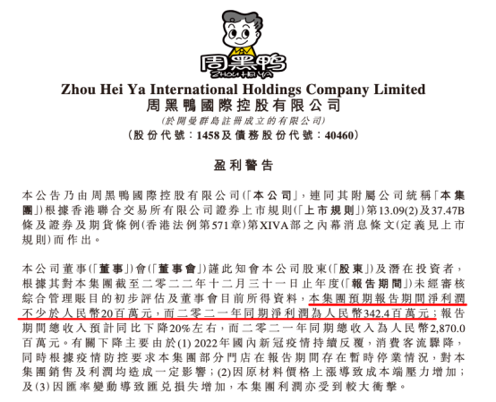
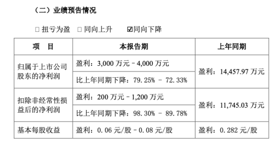
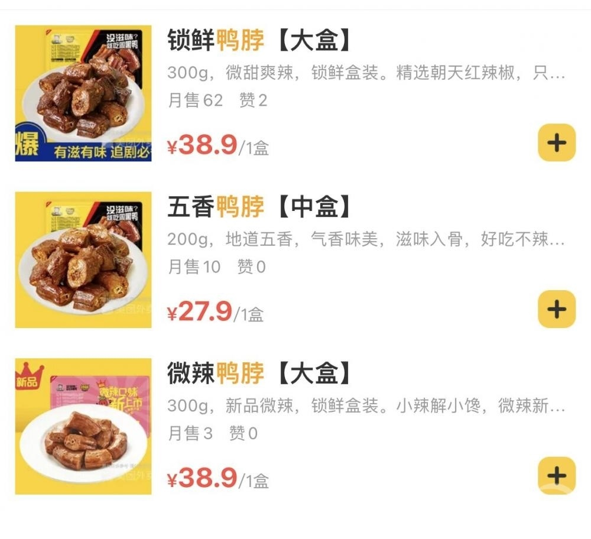

# 周黑鸭业绩大降超90％！网友：不是不爱吃，而是吃不起

2022年，卤味巨头们的日子并不好过。

近期，被称为“卤味三巨头”的绝味、周黑鸭、煌上煌相继公布了业绩预告，曾经创造辉煌业绩的三巨头却处于面临业绩下滑的困境之中。

周黑鸭业绩大降超九成

2月13日晚间，周黑鸭发布的盈利警告显示，预计2022年公司总收入同比下降20%左右，2021年公司总收入为28.7亿元。预计2022年净利润不少于2000万元，较2021年同期的3.42亿元大幅下滑。

_△周黑鸭发布盈利警告_

周黑鸭表示，利润下降的主要原因包括2022年国内新冠疫情反复，消费客流骤降，根据疫情防控要求，公司部分门店存在暂时停业情况。其次是原材料价格上涨导致成本端压力增加，以及汇率变动导致汇兑损失增加。

今年1月，有消息称周黑鸭在业绩交流中披露了业绩预测值，预计公司2023年净利润仅为1.5亿-2亿元，预测范围远低于多位分析师发布的预测值。受该消息影响，1月11日，周黑鸭闪崩跳水，当天跌幅接近30%。

1月12日，周黑鸭就此发布澄清公告称，公司业务运营一切正常，高管团队稳定。但周黑鸭也承认，公司业绩面临来自各种不利因素的影响。

周黑鸭表示，2023年，公司将努力实现2亿元的年度利润，并强调，这是一个目标而非预测。但这一利润指引仍远低于2021年3.42亿元的年度利润。

“三巨头”业绩集体掉队

长久以来，卤味市场都有着“三国杀”的说法。无论是品牌影响力还是渠道门店，绝味、周黑鸭和煌上煌一直牢牢站稳前三的位置，也被称为卤味市场的“三巨头”。

而2022年，三巨头的日子都不太好过。

卤味龙头绝味食品1月份发布的业绩预告显示，预计2022年公司净利润为2.2亿元至2.6亿元，同比下降73.49%至77.57%。扣非净利润2.5亿元-2.9亿元，同比下滑约60%至65%。

_△绝味食品2022年业绩预告_

绝味食品披露的业绩下滑原因，与周黑鸭基本一致。公司表示，2022年为响应国家新冠疫情防控的要求，公司部分工厂及门店暂停生产与营业，对公司销售收入及利润造成一定影响。

且公司在新冠疫情期间加大了对加盟商的支持力度，导致销售费用增加较大。而原材料成本上涨幅度较大，对毛利率造成负面影响。

不过，虽然净利润下滑明显，但绝味食品收入基本保持了稳定。公司预计2022年度实现营业收入66亿元至68亿元，较上年同期上升0.78%至3.83%。

A股另一家卤味食品企业煌上煌业绩预告显示，2022年公司预计盈利3000万元至4000万元，较上年同期下降72%至79%，扣非净利润预计下滑超过90%。

_△煌上煌2022年业绩预告_

煌上煌披露的信息更为具体，一方面，疫情期间人流量的下降，使得公司门店的单店收入一直未能恢复；疫情持续反复也导致公司关店数量增加。

2022年，煌上煌门店数量首次出现负增长，公司肉制品业营收同比下降了16%。米制品业务则受经销、团购等渠道订单量减少及生产能力不足影响，营收同比下降18%。

从门店数量来看，截至2022年6月30日，周黑鸭、煌上煌、绝味食品国内门店分别为3160家、4024家（肉制品加工业）、14921家。绝味食品门店数量尚遥遥领先。

“鸭脖刺客”刺瘪钱包

现在的鸭脖到底有多贵？

_△美团上，周黑鸭的鸭脖价格_

在美团APP上，就消费者喜爱的鸭脖单品而言，周黑鸭销售的微辣鸭脖、锁鲜辣脖均为一份38.9元(300g)，绝味销售的招牌鸭脖一份22.9元(210g)。综上来看，卤鸭脖的价格大多在五六十元一斤。

除了鸭脖，“卤味家族”的其他鸭货的价格也不便宜。比如，绝味的鸭肠每斤约98元、鸭舌约198元，素菜将近30元；周黑鸭的鸭锁骨每斤约75元、鸭掌约77元；久久鸭的鸭腿每个10元、鸭头8元。随便买一点解馋，几十块钱就花掉了。

_△消费者分享自己的购物体验_

此前，“年轻人为何不爱吃鸭脖了”这一话题曾登上微博热搜，有不少年轻消费者在话题中留言“并不是不爱吃鸭脖，而是吃不起”“不许这么说，我爱吃得要命，只是无法实现‘鸭脖自由’”“今天又被‘鸭脖刺客’刺伤了”……网友纷纷表示，不买绝味和周黑鸭等品牌鸭脖的原因，主要是价格越来越贵。

消费者的选择不只有鸭脖

卤味市场门槛本身不高，越来越多的新势力正在“跑步”进场。

卤味行业如何分类？卤制品一般可以分为佐餐卤制食品、休闲卤制食品和新式热卤。

_△紫燕百味鸡（图源央广网）_

佐餐卤制食品的消费人群以组建家庭的人群为主，满足了家庭成员佐餐消费的饮食需求，代表品牌有紫燕百味鸡、廖记棒棒鸡等；休闲卤制食品的消费人群多为年轻女性，作为休闲零食满足了寻求轻松愉悦、自我奖励的需求，代表品牌有周黑鸭、绝味、煌上煌等。而新式热卤消费人群侧重于更为年轻的Z世代，主打新鲜、现卤现卖，门店选址主要在购物中心及热门商圈内部，满足了逛吃消费、寻求自我愉悦的需求，代表品牌有盛香亭、研卤堂、卤大妈等。

三大巨头遭遇的流年不利，并不妨碍我国卤制品行业的发展。艾媒咨询的数据显示，2021年中国卤制品行业规模达3296亿元，预计2023年将达到4051亿元。

逐渐增大的市场，也吸引了不少新兴品牌入局。据天眼查不完全统计，在2021年，有21家卤制品企业发生25起融资事件，包括主打线上零售的王小卤、馋匪，新式热卤品牌的盛香亭、卤大妈、研卤堂，预制卤味品牌菊花开等。

这些品牌的崛起，绝味食品、周黑鸭、煌上煌“三足鼎立”的格局或将生变。

上游新闻综合自证券时报、澎湃新闻、中新经纬、羊城晚报

编辑：郑亚岚

责编：张松涛

审核：冯飞

