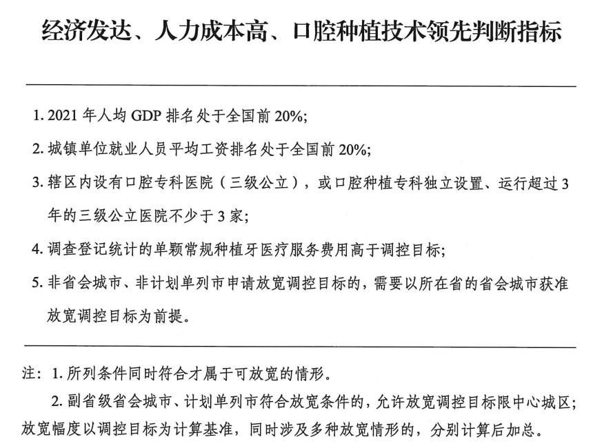

# 四川医保局规定种植牙单颗服务价不超4400元 医疗机构称已有不同程度降价

每经记者：陈星 每经编辑：杨夏

今年1月，四川医保局牵头的种植牙耗材集采刚落下帷幕。2月，种植牙价格规范动作延伸到了服务价格上。

根据四川医保局2月13日发布的通知，将从严确定种植牙全流程医疗服务价格调控目标。四川省单颗常规种植牙医疗服务价格全流程调控目标为不超过4400元（不含允许放宽情形上浮值），调控系数n统一取值为97，即调控总价为“调控目标”乘以“97%”。

通知还规定，将分类规范口腔种植医疗服务收费；开展口腔种植医疗服务收费治理等。

在传统种植牙收费中，耗材费用和服务费为两大构成部分。据《每日经济新闻》记者了解，种植牙耗材集采后，四川当地的公立及民营医疗机构的种植牙收费均有不同程度下降，但多家机构宣称，由于采取的是打包收费，未来一段时间内服务类目收费不会有明显下降。

种植牙服务价格不超过4400元 不同价区设置不同调控价

继1月，被称为“史上最难集采”的口腔种植体系统集中带量采购在四川成都开标后，2月13日，四川医保局再发布《关于做好口腔种植医疗服务收费专项治理有关工作的通知》（以下简称《通知》）。

图片来源：四川省医保局官网

此举意味着，四川种植牙价格规范动作从耗材进一步延伸到服务。

《通知》要求，从严确定种植牙全流程医疗服务价格调控目标，并确定四川省单颗常规种植牙医疗服务价格全流程调控目标（以下简称调控目标）为不超过4400元（不含允许放宽情形上浮值，下同），并作为第一价区三级公立医疗机构调控目标，第二价区及第三、四价区三级公立医疗机构调控目标分别为不超过4300元及4200元。根据我省《关于建立医疗服务价格动态调整机制的实施意见（试行）》分级定价规定，确定第一价区、第二价区及第三、四价区的二级及以下公立医疗机构调控目标分别为不超过3667元、3584元及3500元。

在此基础上，各市（州）在确定调控总价时，调控系数n统一取值为97，即调控总价为“调控目标”乘以“97%”。各地拟定公立医疗机构单颗常规种植牙医疗服务价格全流程总价时不得超过相应价区调控总价。

图片来源：四川省医保局官网

针对“种植牙服务全流程”如何界定，《通知》也给出了明确定义。按照《专项治理通知》中对“诊查检查+种植体植入+牙冠置入”的单颗常规种植牙医疗服务价格实施整体调控的要求，调控目标包含单颗常规种植全过程的诊查费、生化检验费、影像检查费、麻醉费、种植体植入费、牙冠置入费、医学3D建模（口腔）、医学3D模型打印（口腔）、医学3D导板打印（口腔）和药品费，不包括拔牙、牙周洁治、根管治疗、植骨、软组织移植、即刻种植和即刻修复加收、颅颌面部种植体植入加收、临时冠修复置入等服务费用及种植体系统及牙冠（义齿）医用耗材费用。

公立重指导、私立重规范 技术领先、成功率高等机构可放宽10%

针对不同机构、不同服务，《通知》加以了细化指导。

如按照国家医疗保障局相关规定，符合经济发达、人力成本高、口腔种植技术领先的地区可向省医疗保障局申请放宽调控目标，最高放宽幅度不超过10%。属于国家口腔医学中心或口腔种植专业列入国家临床重点专科的医疗机构，以及口腔种植成功率高、公开服务质量信息、承诺接受监督和检查的医疗机构，可分别向医疗保障部门申请放宽10%。放宽调控目标部分主要在种植体植入和牙冠置入两个项目的价格水平上体现。

图片来源：四川省医保局官网

针对公立与私立牙科机构，《通知》也做出了不同指导。

针对公立机构，《通知》提出要加强对其的政策指导。各市（州）医疗保障局要根据价格管理权限梳理相关公立医疗机构开展单颗常规种植牙全流程医疗服务项目清单，结合本地区调控总价，在考虑已定价的诊查费、生化检验费、影像检查费、麻醉费等通科项目总费用的基础上，合理制定种植体植入费、牙冠置入费、扫描设计建模费等新增的专科项目价格，且不高于同等级省管公立医疗机构价格。

对于全牙弓修复种植、颅颌面种植、复杂植骨等技术难度大、风险程度高的项目，允许与常规种植牙手术价格拉开适当差距。

针对民营机构，则要引导其规范收费行为。民营医疗机构口腔种植牙服务价格实行市场调节，定价应遵循公平合法、诚实信用和质价相符的原则，对比本地区公立医疗机构，制定符合市场竞争规律和群众预期的合理价格。

对于区域内种植牙集采中选产品使用率高、主动承诺接受价格全流程调控、口腔种植费用经济性优势突出、评价排名靠前的民营医疗机构，由各地医疗保障部门在官方网站上展示价格和费用情况，为患者就医提供指引；对价格高、采用“介绍费”、“好处费”买卖客源引流的，予以公开曝光。

为加强口腔种植医疗服务收费治理，《通知》还明确规定医疗机构应严格执行价格公示和明码标价制度；建立口腔种植价格异常警示制度并加强各类各级医疗机构监测检查。

种植牙价格已有不同程度下降 牙科宣称“打包收费服务费降价空间不大”

前述《通知》的出台，实际上是四川省调控种植牙价格从耗材到服务端的延续。

今年1月，口腔种植体系统集中带量采购在四川成都开标。在国家医保局指导和协调下，四川省医保局牵头形成口腔种植体系统省际采购联盟。全国近1.8万家医疗机构参与集采，采购需求量共287万套，约占国内年种植牙数量（400万颗）的72%。

根据《每日经济新闻》记者此前从国家医保局获取到的信息，此次拟中选产品平均中选价格降至900余元，与集采前中位采购价相比，平均降幅55%。国家医保局相关资料显示，预计2023年3月下旬到4月中旬，种植牙费用综合治理结果落地实施，患者将全面享受到降价后的种植牙服务。

而近期，河南、安徽、广东等多省也陆续发布了开展种植牙医疗服务价格调控的相关通知。

如河南省方面发布通知，要求自2月10日起，河南单颗常规种植牙医疗服务价格全流程调控目标为4300元，单颗常规种植全流程费用不高于调控目标的97%。价格调控后，河南省口腔种植医疗服务价格平均降幅近50%。

安徽省要求省属三级公立医疗机构单颗常规种植牙全流程医疗服务及药品总费用不超过4280元，所标注价格为省属三级公立医院最高政府指导价。该政策将于3月1日起执行。

广东省医疗保障局官网1月20日发布《关于做好口腔种植医疗服务收费专项治理有关工作的通知》，明确全省21个地市口腔种植类医疗服务价格分为3个价区，单颗常规种植牙医疗服务价格调控目标为不超过4500元（不含种植体系统、牙冠等医用耗材），自3月1日起实施。

目前已经发布或落地相关政策的省市，均将种植牙服务价格调控在4000元上下的范围内。

14日下午，《每日经济新闻》记者咨询了位于成都的多家公立和私立牙科机构。

其中，一家私立连锁牙科机构的工作人员告诉记者，他所在的机构今年2月1号才刚刚对种植牙进行过调价。以瑞士ITI种植体为例，其中价格较贵的型号调价前为18800元/颗，降价后约为15000元/颗。价格稍低的型号降幅更大，原价15800元/颗，降价后单价约为10000元/颗，

该工作人员表示，上述价格均为种植牙耗材集采后的优惠价，也是打包收费。当记者问及调整种植牙服务收费后，前述价格是否还有降价空间时，该工作人员表示，“我们是打包收费，没有额外的服务收费，所以后续应该不太有降价空间”。

另一家公立医院牙科的工作人员给出了更低的报价。前述ITI种植体中价格较高的型号从约20000元/颗降到了13000元/颗，价位稍低的型号从14800元/颗降到了约9000元/颗。该工作人员也表示，医院采取的是打包收费，没有单独加收服务费，只有没有骨粉、骨膜等单独项目不会另外加钱，“等几个月来做应该也是跟现在差不多的价格”。

可以看到，在四川带头开展种植体集采后，公立及民营牙科机构种植牙整体价格已经有不同程度下降，但服务价格能否进一步明确和规范，还有待进一步厘清和落地。

每日经济新闻

