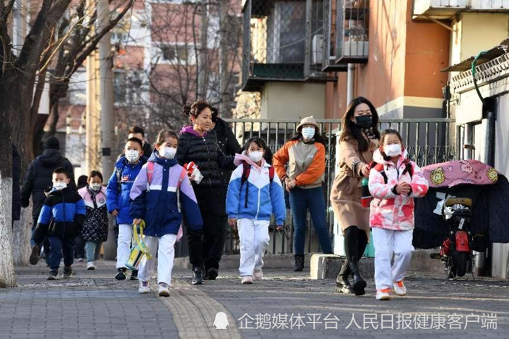
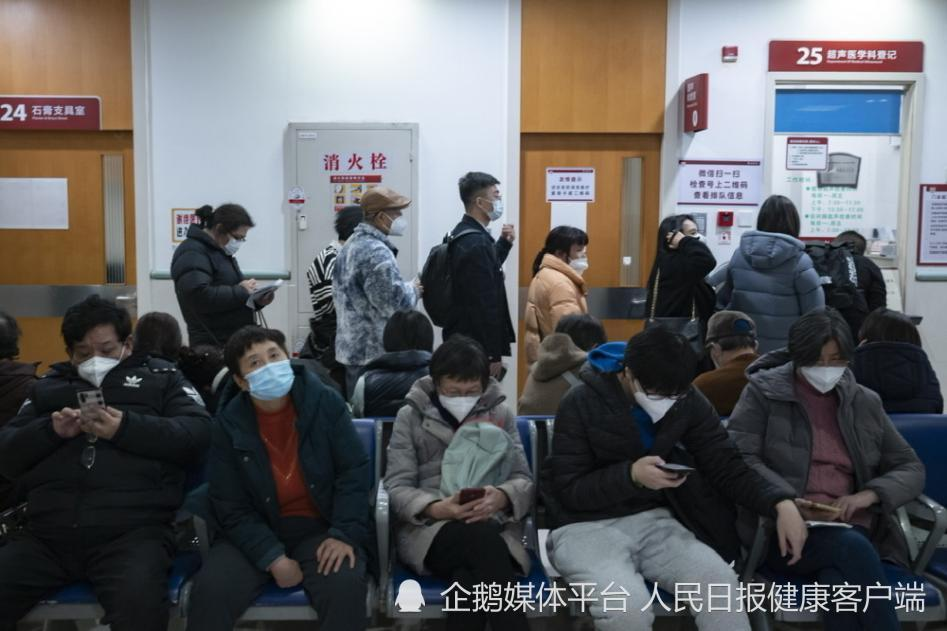

# 多省份发布2022年卫生健康支出，防疫是重要支出项

**健康时报 武星如**

近期，多省份陆续公布了2022年预算执行情况。根据各地公布的预算报告，2022年的卫生健康支出中，疫情防控是重要支出项。

值得注意的是，各省份披露的统计口径有所不同，有些是省级财政，有些是全省总投入支出。

**北京卫生健康支出264.2亿元，主要用于疫情防控等领域**

2月1日，《北京市2022年预算执行情况和2023年预算的报告》对外公布。根据报告，2022年，北京市卫生健康支出264.2亿元，主要用于疫情防控，落实首都公共卫生应急管理体系三年行动计划，加强公共卫生体系建设。

_2月13日，北京市中小学2023年春节开学首日，北京小学天宁寺分校的孩子们在上学途中，进入学校前再没有长长的测温队伍。健康时报记者牛宏超摄_

**广东各级财政疫情防控资金711亿元**

2月9日，广东省人民政府公布了广东省2022年预算执行情况和2023年预算草案的报告。其中2022年全省一般公共预算在卫生健康领域支出2075亿元，完成汇总调整预算的116.2%。各级财政累计投入疫情防控资金711亿元，全面保障疫苗接种、核酸检测、医务人员临时性工作补助等疫情防控必要支出。

**浙江全省安排疫情防控资金435.09亿元**

1月12日在浙江省第十四届人民代表大会第一次会议上，浙江省财政厅公布了2022年预算收支执行情况，2022年全省安排疫情防控资金435.09亿元，保障免费核酸检测、隔离点建设及运行、防控物资采购等重点领域。综合考虑各地疫情影响情况，下达疫情相关补助资金6.65亿元。下达预补助15.89亿元，支持重症救治床位和亚定点医院建设，并向山区26县适当倾斜，进一步提升医疗救治能力。落实8.10亿元助推提高基本公共卫生服务标准和水平。

**江苏423亿元直接用于疫苗接种、核酸检测等支出**

1月19日，江苏省公布了2022年预算执行情况与2023年预算（草案）的报告（摘要），其中提到2022年江苏省各级财政直接用于疫苗接种、核酸检测、患者救治等支出423亿元，全力保障人民群众生命安全和身体健康。

**陕西各级投入疫情防控资金190亿元**

1月28日，陕西省人民政府公布陕西省2022年财政预算执行情况。2022年全省各级投入疫情防控资金190亿元，全力保障新冠肺炎患者免费救治、核酸检测、一线医务人员临时补助、定点医院补助等经费需要；累计拨付医保基金专项资金37.8亿元，保障9588万人次免费接种新冠疫苗。

**安徽全省财政投入疫情防控资金179.2 亿元**

安徽省财政厅2月3日发布安徽省2022年预算执行情况，在2022年省级一般公共预算中，卫生健康支出 33.3 亿元，完成预算的
88.8%，主要是省属公立医院事业发展补助、医疗服务与保障能力提升政府采购项目等跨年度实施。全省财政投入资金179.2
亿元，支持做好全省疫情防控救治工作，并将市县防疫相关资金纳入“三保”范围。

**辽宁2022年全省疫情防控支出143.9亿元**

据辽宁日报报道，1月12日，辽宁省财政厅在辽宁省第十四届人民代表大会第一次会议上作了关于辽宁省2022年预算执行情况和2023年预算草案的报告。报告中指出，2022年全省疫情防控支出143.9亿元，有力保障了疫苗免费接种、核酸检测、防控物资补助以及隔离点、方舱医院建设和运行等需要。坚持急事急办、特事特办，省财政采取“先预拨后结算”方式，高效保障防疫医疗物资采购，以及驰援吉林省、上海市生活物资购置和调运等。

**上海市级支出167.7亿元支持疫情防控**

上海市财政局1月31日印发关于上海市2022年预算执行情况和2023年预算草案的报告，2022年市级一般公共预算支出2985.7亿元，其中卫生健康支出381.9亿元。2022年，市级安排支出167.7亿元全力以赴支持疫情防控，用于医疗救治、发热门诊改造、疫苗接种、定点医疗机构开办运营、方舱医院建设、购置诊疗设备、发放医务人员临时性工作补助、服务保障外省市援沪医疗队、提升核酸检测能力等。

_1月28日，复旦大学附属华山医院年后开工首日，线下门诊量已全面恢复。上观新闻
图_

**福建各级财政投入130.43亿元用于疫情支出**

2月1日，福建省财政厅公开了关于福建省2022年预算执行情况及2023年预算草案的报告。2022年，全省卫生健康支出611.05亿元，增长14.5%。全省各级财政投入130.43亿元，用于疫情处置和防控能力提升、核酸检测、疫苗及接种费用补助等支出，有力保障各地疫情防控资金需求。

**贵州各级用于疫情防控直接投入达74.88亿元**

贵州省人民政府网站1月31日公布了贵州省2022年预算执行情况。2022年，全省各级用于疫情防控直接投入达74.88亿元（其中省级投入23.61亿元），全力保防控、保供应、强诊疗、防重症，支持防控能力提升和重点区域重点人群疫情防控。

**江西卫生健康支出35.6亿元，疫情防控经费增加较多**

据江西日报报道，1月11日，在江西省第十四届人民代表大会第一次会议上，江西省财政厅厅长朱斌向大会报告2022年全省和省级预算执行情况与2023年全省和省级预算草案。2022年省级一般公共预算支出1034.6亿元，其中卫生健康支出35.6亿元，增长68.3%，主要是公共卫生体系建设和疫情防控经费增加较多。

**青海下达10.3亿元保障疫情防控支出**

据青海日报报道，1月19日，青海省第十四届人民代表大会第一次会议审查了省人民政府提出的《青海省2022年预算执行情况和2023年预算草案的报告》。报告中指出，2022年全省下达资金10.3亿元，全力保障疫苗接种、患者救治和医务人员临时性工作补助等疫情防控支出。

