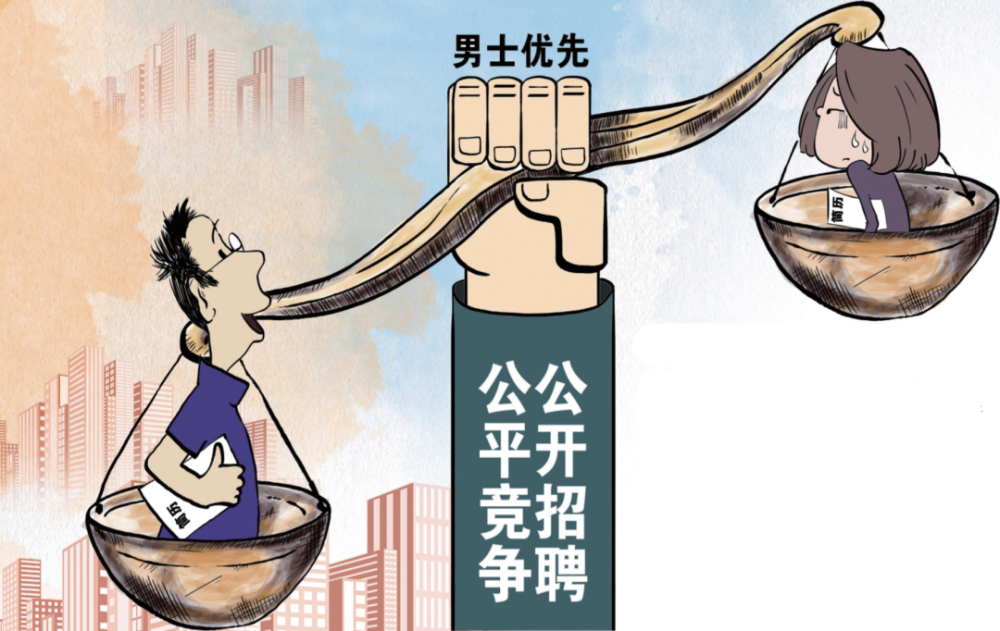

# 女性求职市场的性别歧视：HR反复盘问婚恋情况，是否愿意3年不生娃

**■ 调查动机**

近日，北京市人力资源和社会保障局印发的《北京市人力资源社会保障行政处罚裁量基准表（涉及妇女权益保障法部分）》明确，用人单位在招录（聘）过程中，以性别为由拒绝录（聘）用妇女或者差别化地提高对妇女录（聘）用标准或因结婚、怀孕、产假、哺乳等，降低女职工的工资和福利待遇等行为，最高可处五万元罚款。

一石激起千层浪，女性遭遇职场性别歧视现象再次引发社会热议。有人看到了希望，认为有了这个“裁量基准”，执法部门对侵害妇女劳动权益的违规用人单位如何开罚单，就有了明确的指导标准；有人则提出，无论是职场妇女还是有关部门，识别显性的劳动侵权行为比较容易，但如何防止隐性侵权或者变相侵权，仍然值得进一步重视和探索。

**现实职场中，存在哪些隐性侵权或变相侵权？又该如何从根源上消除性别歧视？围绕这些问题，记者进行了调查。**

_漫画：李晓军_

“你公公婆婆身体还好吧？”“你家那边的幼儿园学费贵吗？”“我们公司会发儿童节福利，你需要几份呢？”……

这些问题不是朋友间的寒暄，而是今年30岁的北京求职者张梅在过去半年的面试中常常被问到的问题。

根据国家现有规定，企业面试时不得询问妇女婚育情况。但张梅回忆，她所应聘的企业几乎都会通过旁敲侧击来得到想要的答案。

来自浙江杭州、陕西西安多家企业的HR（即人力资源）也向《法治日报》记者透露其“对策”：不要从正面问，而是像唠家常一样从应聘者生活状态、家庭成员、业余爱好等情况获取；招聘表里有婚育情况，如果求职者拒绝填写，那就让对方回家等消息，这往往意味着面试失败。

事实上，妇女遭遇职场性别歧视现象存在已久。智联招聘发布的《2022中国女性职场现状调查报告》显示，61.2%的女性在求职中被问及婚育情况，高于上一年的55.8%；38.3%的女性表示婚育影响职场前景；11.9%的女性因性别升职加薪不顺。

基于此类现象，相关法律政策为女性职工撑起“保护伞”。如去年修订通过、今年1月1日起实施的妇女权益保障法，将就业性别歧视纳入劳动保障监察范围。北京市人力资源和社会保障局近日印发《北京市人力资源社会保障行政处罚裁量基准表（涉及妇女权益保障法部分）》，明确用人单位在招录（聘）过程中，以性别为由拒绝录（聘）用妇女或者差别化地提高对妇女录（聘）用标准或因结婚、怀孕、产假、哺乳等，降低女职工的工资和福利待遇等行为，最高可处五万元罚款。

然而现实中，举证职场中的歧视行为与性别相关仍是女性职工权益保护的痛点和难点。不论是求职者还是HR，都向记者表达了这样的担忧——企业完全可能用其他看似正当的理由，拒绝女性求职者、将女员工辞退、降低女员工应得的福利待遇。

**面试被HR反复盘问，性别歧视肉眼可见**

记者随机采访了10位来自北京、天津等地正在找工作的应届女性毕业生和往届女性求职者，发现性别歧视似乎是绕不开的坎。

北京某高校硕士研究生林鱼将于今年6月毕业，在刚刚过去的一波面试中，她体会到了“肉眼可见”的性别歧视：“面试环节，女生被详细问了婚恋情况，男生完全没提到这个话题。同样的岗位和工作内容，单位承诺的待遇也有差别，男生每月多2000元，有年终奖，而女生只有交通补助。”

同样将于今年毕业的硕士研究生李庄除了被问及自身婚恋规划外，还被一家互联网企业的HR“盘问”了至少5分钟关于其男友的未来规划，“比如他的职业规划、双方老人是否退休等，可能是想评判女性求职者未来生育后的家庭负担问题”。

去年从天津某高校本科毕业的刘清在面试时遭遇的问题和李庄有些相似。“HR面试时问一个女孩子跑这么远，家里人同意吗？为什么来这里找工作？我说是因为朋友在这边，他直接说‘是男朋友吧’，然后又问‘感情好吗，在一起几年了’，还问我打算什么时候结婚生子。外貌、身高、婚育，这些基本都是女性会被问到的，男性求职者则很少涉及这些。”

北京市民林华根据自己两年前刚毕业未婚求职和现如今已婚求职的经历，总结出用人单位在面试时的一些“套路”：

未婚时，刚毕业的外地女孩，一般从“怎么想到来北京找工作，这边有亲戚朋友吗”开局，然后问“租房子是合租吗”，如果回答“和男朋友合租”就会跳到第3个问题“房租贵不贵，两室的房租应该在××元吧”。说到房租，就能谈到能否支付开销，开始聊“男朋友是做什么的？你们的通勤时间大概多久”。渐渐的，这个刚毕业未婚女性的婚育规划也就被摸清了。

已婚后，一般不再涉及租房问题，而是围绕生育，先问“你这个年龄，对于之后的发展是怎么考虑的”。对于这个问题，求职者的回答并不重要，HR紧接着会自嘲说“家里会催我恋爱啊生小孩啊，家里人有没有催你呀”，从中套出求职者的生育规划。

**有一孩防将来二胎，有二孩忧无暇工作**

张梅在面试时曾听到过不少诸如“这个人30岁了还没结婚生小孩，肯定是哪里有问题，不能要”“27岁了还没结婚生孩子，这个不行”之类的评价。

“在一些有着拍板权的HR眼中，30岁的单身女性肯定有心理问题，招进来对团队的影响不好。即使她是面试者里最优秀的一个，即使她的业务能力、资历和背景都符合岗位要求，对薪资的要求也能谈拢，也会因为年龄、性别和婚姻状况遭到拒绝。”张梅说。

但是结婚了就可以了吗？答案可能依旧是否定的，甚至是个更大的“×”。

已婚未育者面对的招聘条件，可能更加苛刻，这是林华近几年参加了20多场招聘后总结出来的。她曾在面试现场多次被问及是否有生育打算，还曾被委婉询问过是否愿意承诺3年内不要孩子。

“已婚未育者在招聘市场上肯定存在劣势，因为大部分企业都是以营利为目的的，怀孕生育期间的女性对于企业工作安排比较被动，处理不好还有劳动风险，会隐性增加人力成本。”浙江杭州某民企HR柳煦告诉记者。

那么已婚已育呢？张梅吐槽道，生育一个孩子的女性，在职场会被贴上“这是个随时生二胎的定时炸弹”的标签；已经生完二胎的女性，职场上的标签变成“没有精力投入工作”。

陕西西安某民企HR陈玲向记者透露，放开三孩后，已婚已育成了公司招聘考察的重点，公司要求HR通过面试技巧，询问出求职者婚育的意愿强烈性。“已婚未育，企业会担心员工随时生育；已婚一育，员工年龄若不大，企业会担心员工随时二育；已婚二育，企业还会担心员工心系家庭，无暇顾及本职工作。”

对于从事了7年人力资源工作的钱月来说，面对求职简历上“已婚、已育、一子一女”等字眼时，已不会再像最初那样“会意一笑”。“以前在外企筛选求职简历时，经常看到女性应聘者对子女情况作介绍。近两年，在国内企业的应聘求职简历中，也开始出现这样的介绍，言外之意很清楚——已经有了两个孩子，不会再生了。”同样身为女性的钱月，看到这样的变化有些无奈，“可见现在就业性别歧视并没有得到根本解决。”

“用人单位要考虑求职者是否有固定情侣、是否已婚，是否生育。如果已婚未育，不论年龄，对于用人单位来说，都有很大的用人风险。如果已育，用人单位则要考虑是否有老人帮忙照看孩子，要考虑员工因为孩子请假的频率。国家放开三孩后，还要考虑求职者对于二胎三胎的意向程度。”钱月说，这很现实。

**性别歧视屡见不鲜，费时费力鲜有维权**

“虽然法律规定，企业在招聘时不得询问女性员工的婚育情况，但HR担心招进来的员工‘只有投入，没有产出’，最后给企业带来沉重的负担，所以不少HR在招聘环节时常扮演着‘侦察兵’的角色，通过了解员工的社交动态、姻亲关系、下班时间的分配以及交流育儿经验等打探对方的婚育情况。”曾供职于劳动仲裁系统的北京海润天睿律师事务所律师孙鹏说。

值得注意的是，尽管女性遭遇职场性别歧视现象屡见不鲜，但现实中鲜有维权者。受访专家分析，对求职者个人来说，考虑到与用人单位发生劳动纠纷可能会影响未来的求职，同时很难拿到录音或录像来证明企业的歧视行为，加上职场中性别歧视现象较为隐蔽，走司法程序的成本较高等，让大多数人望而却步。

撰写了《我国女性就业歧视问题研究》的上海锦天城（郑州）律师事务所律师褚清瑶告诉记者，性别歧视在招聘过程中具有隐蔽性。即使是因性别歧视原因拒绝劳动者，招聘单位给出的书面理由一般也是不符合岗位要求。

“单纯的歧视纠纷很难形成具体的案件，或者说面对这方面的纠纷，很少有求职者想到寻求法律帮助。用人单位因性别歧视侵犯个人权益的属性不是很明显。如果有明确证据证明用人单位存在性别歧视，则可以用侵犯名誉权来起诉，但是走这个程序的人并不多。究其原因，还是大多数求职者的目的为找到工作，而非耗费大量的时间和精力寻求一种公平正义，所以走司法程序取得有效结果的人也不多。”褚清瑶说。

**明确处罚裁量基准，精准保障妇女权益**

今年1月，北京市人力资源和社会保障局印发《北京市人力资源社会保障行政处罚裁量基准表（涉及妇女权益保障法部分）》，明确以性别为由拒绝录(聘)用妇女，最高可处五万元罚款。

多名受访专家指出，有了这个“裁量基准”，执法部门对侵害妇女劳动权益的违规用人单位如何开罚单，就有了明确的指导标准，既能避免处罚过轻，也能防止处罚过重，进而体现法律的公平性和执法的严肃性。这对落实妇女权益保障法、保障妇女就业权益、规范劳动执法等，都非常重要。期待更多地方能够积极作为，结合本地实际，及时制定类似的处罚裁量基准表，让修法成果早日惠及更多女性劳动者。

在中国劳动关系学院法学院副教授张丽云看来，北京此举对于消除女性就业歧视有积极作用。“现代女性的法律素养和学历层次有所提高，对职场歧视的认知和判断较为清晰，招聘过程中若存在歧视问题，女性可以向劳动监察部门投诉，一经查实劳动单位将面临处罚。”

对于罚款问题，张丽云提出，对短期内被多次投诉的企业作出的一次性处罚，可以适用最高罚款五万元数额。最高罚款可能适用于企业系统性歧视所有女性员工的问题，比如企业为解雇大批女性员工进行的逼迫或隐蔽性的操作。

值得注意的是，现实中应该由谁来发现招聘中是否出现了性别歧视？谁来界定应聘不成功是否因为性别原因？

中国劳动关系学院法学院院长沈建峰解释说，秉持“谁主张谁举证”的原则，需要求职者本人发现招聘中的性别歧视，并向相关部门提供初步的证据。具体问题则需由法官界定，同时要根据执法实践和典型案件，进一步认定企业存在就业歧视的客观标准。

“劳动者可借助工会系统反映问题、向律师事务所寻求法律咨询、去基层法院的咨询窗口寻求帮助。上述渠道都可以帮助劳动者发现招聘中是否存在性别歧视。在应聘过程中遇到歧视问题，劳动者可在掌握一定证据的情况下，向劳动监察部门投诉。”张丽云说。

张丽云同时提出，监察部门可以主动实施监察，现场调查用人单位的招聘是否规范。接到劳动者的投诉之后，辖区内的监察部门应积极调查企业是否存在相关问题，若存在则及时对用人单位进行行政处罚。

对于如何从根源上消除职场性别歧视，沈建峰建议，适当提高企业对男性的用工成本，如延长男性的陪产假，以此来分摊企业的男女用工成本，进而减弱企业针对女性求职者的歧视问题。也可以通过社会化机制分担女性的功能，除生育、哺乳外，社会可以发展与家政服务、幼儿托育相关的产业，进一步减轻女性的职场压力和家庭负担。

“求职者在应聘时所遭遇的性别歧视问题，根源在于大部分企业是盈利性机构，以追求利润为目的。若想减少性别歧视，需从社会角度出发，考虑由国家承担一部分成本，转嫁企业压力，提高企业的积极性。”褚清瑶说。

多位接受记者采访的HR提出，社会应该营造一个相对公正的环境，为女性多提供一些就业岗位或者技能培训，尤其是效益较好的大企业，应该承担更多的社会责任。

在张丽云看来，国家目前正采取措施保障女性的生育权益并承担一部分育儿成本，各地政府也在探索相应的激励政策，如降低住房成本、提高生育保障、投入教育资源等。国家对企业所承受的负担非常了解，对企业的减税降费措施也下放到位。并且，国家进行的基础设施建设便利了企业发展，培养的人才也大都输送到了企业。因此，对于女性职工生育问题的关照，是企业应当承担的社会责任。

“在现代企业中，男女比例的协调有利于职场环境稳定。同时，在企业决策和管理过程中，也需要女性的思维方式。因此，若考虑到长期利益，企业需要多关注女性劳动者在职场中所发挥的作用和价值。”张丽云说。

**（文中柳煦、陈玲、钱月均为化名）**

来源：法治日报全媒体记者 赵丽

