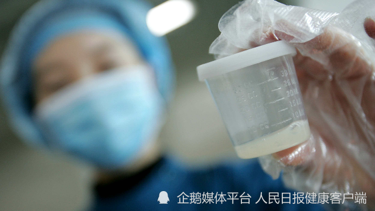

# 捐精合格率仅20％，不等于80％的人生育有问题

**健康时报 刘颖琪**

近期，北京、陕西、山东、湖北、云南等多地的精子库发布捐精倡议书招募志愿者。与此同时，“捐精精子的合格率仅为20%”的消息也备受关注。2月13日，健康时报致电上述各地人类精子库，工作人员表示目前捐精志愿者在排队等待接待，业务比较繁忙；其中多家精子库的客服微信也标明近期报名数量激增。对于捐精合格率20%的消息，泌尿外科和男科医生也表示，因为精子库对捐精的质量，本身远远高于正常生育人群的标准。

_冷冻精子样本 新华社图_

复旦大学附属华山医院泌尿外科副主任医师陈善闻在2月13日接受健康时报采访时指出，辅助生育技术纳入医保意味着精子需求量的增加，而作为捐精主力军的大学生们，疫情后回归就读学校所在的城市使得捐精更为便利，也是近期多地倡导市民捐精的主要原因。

不过，与捐精热情形成鲜明对比的是，较低的捐精精子合格率。江西省人类精子库官方公布的数字显示，目前江西省捐精精子的合格率大约为20%。

广东省人类精子库主任张欣宗向健康时报表示，捐精志愿者筛选合格率20%，不能简单理解为有80%的人群精液不合格，因为人类精子库对捐精志愿者的精液质量评估标准，远远高于正常生育人群的标准。

中国性学会常务副会长、福建医科大学附属第一医院男科主任周辉良向健康时报表示，精子检验不合格可以分为生活习惯问题和生理问题，生活习惯如吸烟、喝酒、熬夜，以及不健康的性生活（过高频率、频繁手淫），都会导致的精子质量不合格；生理问题是指少精、弱精等问题。通过精子捐赠严格的检查可以尽早筛查出相关问题，早发现早干预，对于后续有生育计划的男性而言，这反而有助于提升个人的孕育几率。

另外也有人担心是否受此前新冠感染的影响。陈善闻表示，新冠感染康复后，精子质量的暂时下降是正常，经过3-6个月恢复期后，精子质量一般可以恢复正常，无需过度恐慌。

张欣宗建议，一些特殊人群及时到人类精子库进行自精保存，为自己存下一份“生殖保险”。这些人群包括男性在接受致畸剂量的射线、药品、有毒物质或病原微生物、绝育手术之前；从事某些高风险职业，如从事雷达作业、放射科医生等需保存精子以备将来生育者；夫妻为未来生育需求，要求保存精子者；接受辅助生殖技术时，有合理的医疗要求，如取精困难者和少、弱精子症者等。

