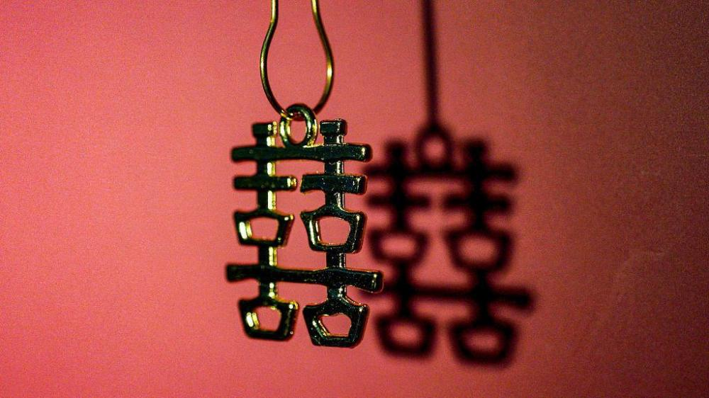

# 新研究剖析“天价彩礼”：一场农村男性婚姻市场的恶性竞争

【编者按】

2011年至今，我国生育政策已从“双独二孩”发展到“全面三孩”。历经10年嬗变，“让不让生”已不再是问题，取而代之的是“想不想生”和“生了怎么养”。

回顾政策历程，10年间，从2011年的“双独二孩”，到2013年的“单独二孩”，再到2016年实施“全面二孩”，2021年放开“三孩”，这表明政府提高人口生育水平的决心。

事实上，生育背后还有诸多复杂的社会因素相互牵扯，“说生就生”并不容易。

基于此，澎湃新闻推出“生育的细节”系列报道，精选国内外新刊发的人口研究，将后人口转型时期人们的生育决策及行为置于“显微镜”下，以人为本，探究细节。

今日适逢“情人节”，本系列推出第十四篇，关注“天价彩礼”。“天价彩礼”已成为众多农村男青年成婚的“拦路虎”，这种陋俗是怎么来的？

“‘天价彩礼’是中国社会经济发展新涌现的民生问题，是婚姻缔结与人口再生产的又一抑制性因素。”在今年1月发表的《透视‘天价彩礼’：现状、成因与治理》一文中，作者如此写道。

该文发表于《山东女子学院学报》，作者为西安交通大学公共政策与管理学院教授、性别与发展研究中心主任靳小怡及该院博士研究生段朱清。

该文作者注意到，在我国快速城镇化的大背景下，作为婚姻支付重要组成部分的彩礼不断攀升，“天价彩礼”成为农村地区存在的社会问题，其成因复杂，导致很多适婚青年不得不推迟婚龄，甚至“恐婚、不婚”，还有部分家庭因“天价彩礼”而“因婚致贫、返贫”。

研究基于2018年全国11个省份的抽样调查数据分析发现，城镇化发展深刻地影响了当前我国农村地区的婚姻实践，中国农村男性婚姻成本在构成与金额方面呈现出新的特征。

如，研究发现，2018年，11省农村男性的婚姻总成本均值是当年我国农村居民人均可支配收入的16倍;
男性为婚姻成本的主要承担方，婚姻总成本持续保持在女性的三倍左右。

作者分析，“天价彩礼”的主要动因是性别失衡及人口流动导致的男性婚姻市场恶性竞争，以及城镇化、市场经济和现代观念的冲击，如资本下乡使城市生活标准渗透进农村，结婚需求向城镇生活标准靠近。

作者提出，对于“天价彩礼”的治理，既要承认婚俗、明辨适当彩礼与“天价彩礼”的区别，也要从提升农村教育水平、加强小城镇建设等根本途经入手。此外，作者特别提出，要保护农村大龄未婚男性的生存发展权益，满足其养老需求，减轻对被迫未婚的大龄男性的社会排斥。

**农村婚姻成本特征：西部重彩礼、东部重婚房**

对于该研究的源起，作者提出，改革开放以来，中国经历了快速城镇化。中国已由过去以农为本、以土为生、以村而治、根植于土的乡土中国，转变为乡土变故土、乡村变故乡、城乡互动的城乡中国，这将是中国未来一个时期的基本结构特征。

在城乡中国的社会结构下，婚姻缔结特征也在悄然发生变化。近年来，作为婚姻支付重要组成部分的彩礼不断攀升，“天价彩礼”成为农村地区普遍存在的社会问题。“天价彩礼”的出现是乡村社会失序的体现，凸显了加强乡村社会治理的重要性与紧迫性。

作者提出，农村男性婚姻成本畸高问题成为城市发展过程对农村的又一次剥夺。为揭示当代中国农村男性婚姻成本的新特征及城镇化的影响，西安交通大学新型城镇化与可持续发展课题组（以下简称“课题组”）开展了大规模专项社会调查，并进行了系统的定量研究。

2018年1-2月，课题组在全国11个省份开展了全国百村抽样调查。根据2017年中国各省区市人口城镇化率排行，调查最终选定山东、湖北、河北、江西、安徽、四川、甘肃、河南、山西、陕西和湖南11个省份，涵盖东、中、西部的经济发达地区和经济欠发达地区，人群包含婚前没有或具有流动经历的农村成年人口，共获得有效样本5004个。

课题组主要使用描述性统计分析、多元线性回归分析、潜在剖面分析（Latent Profiles
Analysis，LPA）与分层多元回归分析等方法进行统计分析。

课题组将农村男性婚姻成本概念由主要包括彩礼花费的单一内涵，拓展至包含媒人中介费、彩礼花费、婚礼花费、婚房花费的四要素（以下简称“四要素”），并通过对11省的数据分析揭示了中国农村男性婚姻成本在构成与金额方面的新特征。

研究发现，首先，农村男性婚姻成本的四要素近40年来涨幅较大，总金额增速远超农村女性婚姻成本（主要是嫁妆）、全国人均GDP与全国农村居民人均可支配收入。2018年，11省农村男性的婚姻总成本均值是当年我国农村居民人均可支配收入的16倍;
男性为婚姻成本的主要承担方，婚姻总成本持续保持在女性的三倍左右。就婚姻成本四要素的构成来看，婚房花费已成为成婚的刚性需求，且占比最大，其金额远远超过彩礼花费，基本维持在五成至六成之间（彩礼占二至四成）。

其次，农村男性婚姻成本的地区差异显著。东、中、西部地区的结婚总成本均值分别为8. 69
万元、9.06万元、7.30万元，西部的婚姻总成本最低，这与经济发展水平和人均收入的地区差异相匹配。

但就彩礼在结婚总费用中的占比来看，西部占比最高。调查显示，彩礼金额及其在结婚总费用中的占比分别为：东部2.27万元（26.19%）、中部2.72万元（30.02%），西部2.80万元（38.36%）。其中，甘肃省的“天价彩礼”问题尤为严重，彩礼均值高达4.41
万元，占结婚总费用的52.88%。

就彩礼与农村居民年人均可支配收入比值来看，依然是西部比值最大。根据《中国统计年鉴
2018》，2017年度东、中、西部的农村居民年人均可支配收入分别为1.68万元、1.28万元、1.08万元，彩礼与年人均可支配收入的比值在东、中、西部分别为1.35倍、2.13倍和2.59
倍。

作者指出，由此可见，彩礼对于东部农村居民而言尚可承受，在西部就成了“天价彩礼”，成为农村男性成婚的“拦路虎”，也是部分偏远落后西部农村家庭“因婚致贫、因婚返贫”的重要原因。

作者分析道，从各项婚姻成本占总成本的比重来看，表现出“西部重彩礼、东部重婚房”的特征。中西部农村男性“成婚难”最直观的表现为“天价彩礼”——这是可婚配女性资源稀缺的“市场表现”。与此同时，受东部地区较高房价的影响，东部农村男性主要面临较大的婚房购买压力。

**为娶城镇女性，农村男性要付出更多结婚成本**

该研究还发现，婚前外出务工男性的婚姻总成本约为婚前未外出务工男性的三倍，他们婚姻支付能力更强，更倾向于在家乡县城或更靠近县城的地方购买婚房，更可能与异地且个人和家庭资源更好的女性婚配，均推高婚姻成本。与户籍内通婚者相比，跨户籍通婚（婚娶城镇户籍女性）显著提高了农村男性的婚姻成本，其婚姻成本是前者的两倍。

对跨户籍通婚成本高的原因，作者分析，由于农村户籍和城市户籍意味着巨大的社会资源差异，跨户籍通婚的男性农民工需要支付更高的婚姻成本（主要是彩礼和婚房）来弥补自身的户籍劣势，从而实现户籍阶层的向上流动。

此外，该研究对农村男性婚姻成本进行了分类分析。

通过对11省数据的潜在剖面分析可识别出农村男性婚姻成本的潜在类型。该研究把中国农村男性婚姻成本主要分为四类:“偏重婚房型”的婚姻总成本均值最高，达到17万元以上；
其次是“彩礼婚房并重型”，超过8万元; 再次是“偏重彩礼型”;
最后是“混合型”的，其婚姻花费最低，两万多元。在各类型中，彩礼婚房并重型最为流行。城镇化进程中婚房花费在婚姻成本中的重要性上升，且金额最高，是农村男性成婚最主要的经济压力源。

在微观影响因素分析中，作者发现，跨户籍婚姻会增加“偏重婚房型”的概率，进一步证明
跨户籍婚姻对婚房的刚性需求。就地城镇化群体（县内务工）的婚姻总成本普遍低于异地城镇化（县外务工）群体，前者的婚姻成本类型多为“混合型”，后者的婚姻成本类型越有可能为“偏重彩礼型”。

在宏观影响因素分析中，作者发现，户籍地第三产业占比越高，当地农村男性婚姻成本类型更有可能为“偏重彩礼型”，人均GDP则与“彩礼婚房并重型”的可能成正比，随居民消费价格指数的增加，农村男性的婚姻成本类型更有可能是“混合型
”。

作者分析，由于经济较落后地区往往深受男权思想、祖辈责任伦理的影响，“偏重彩礼型”较多，如甘肃与陕西；城镇化率较高、经济发展较好的地区能够吸引更多农村男性流入并定居，增加了个体对婚房的刚性需求，婚房重要性凸显，例如东部的山东省。

作者总结道，跨户籍婚姻与异地城镇化的农村男性承担了更为沉重的成婚经济负担。

**性别失衡、女性外流、物质化观念等催生“天价彩礼”**

农村“天价彩礼”是如何形成的？

对此，作者分析道，观察我国农村彩礼的变迁可发现，彩礼伴随社会发展经历了形式货币化、内容丰富化、金额攀升较快的变化，这均与我国通婚圈状况与社会经济条件密切相关。

具体来看有两方面。其一，男性婚姻挤压与婚姻市场恶性竞争。作者指出，“天价彩礼”的成因多被归咎于性别失衡导致的男性婚姻挤压。婚姻市场中适婚男性绝对数量多于适婚女性会加剧男性对有限可婚配女性资源的竞争，使女性处于相对有利的地位，女方彩礼“要价”逐渐攀升。

同时，人口迁移流动加剧了经济相对落后地区男性的婚姻挤压。经济发展较好的地区吸引了更多劳动力特别是适婚女性，使得流出地可婚配女性资源匮乏，这些地方的男性就会被动陷入婚姻市场的恶性竞争。大量农村青年来到城市，城乡通婚圈得以融合，适婚青年有了更多
选择，对潜在配偶的接受范围不断拓展、要求不断提高，同时也卷入城市婚姻市场竞争，资源较差的农村男性劣势地位加剧。

作者总结道，在婚姻挤压与城乡通婚圈融合导致竞争加剧的共同作用下，“天价彩礼”大多由贫困地区个人家庭条件较差的农村男性承担。

其二，城镇化、市场经济与现代观念的冲击。作者指出，在市场经济的影响下，越来越多的人在婚姻实践中追求自身利益最大化。其次，城镇化进程中的资本下乡使城市生活标准渗透进农村，因结婚产生的农村消费需求逐渐向城镇生活标准靠近，如在城市购房、买汽车等。资本下乡改变了人们的思维方式，催生了“物质化”的思想观念，错误地将高价彩礼与“有
面子”画上等号。

此外，作者也关注到，在社会关系相对稳定、圈子文化浓重的乡村社会中，婚姻实践极易受
到攀比、从众心理的影响。有对华北农村的调查显示，当地存在“上层示范、中层跟进、下层挤压”的婚恋竞争格局，逐步推高了婚姻成本。

作者进一步提出，目前农村“天价彩礼”成因要综合考虑，婚姻市场性别失衡、代际责任观
念较重、市场经济冲击较大、女性人口流失严重等均是造成“天价彩礼”的重要因素。

**从农村教育、地区经济等根本问题出发破解“天价彩礼”**

农村“天价彩礼”该如何治理？

作者指出，我国就农村地区“天价彩礼”问题的治理态度是明确的，治理内容经历了逐步明晰的过程。2017年至2019年中央一号文件均强调，彩礼是提高农村家庭成本的陋俗，要引导群众树立抵制婚丧嫁娶大操大办的意识、消除“好面子、人情债”等陈规陋习。

2021年5月31日，中共中央政治局审议《中共中央
国务院关于优化生育政策促进人口长期均衡发展的决定》，指出要将婚嫁、生育、养育、教育一体考虑，加强适婚青年婚恋观、家庭观教育引导，对婚嫁陋习、天价彩礼等不良社会风气进行治理。

作者还提到，现阶段，农村地区的“天价彩礼”为农村家庭带来沉重的经济负担，让农民陷入持续性贫困或脱贫再返贫的困境，也会严重损害我国来之不易的脱贫攻坚成果，成为阻碍乡村振兴、城乡进一步融合发展，全体人民共享社会经济发展成果的绊脚石。因此，坚决打击“天价彩礼”，是保护农村家庭、新婚夫妻主体成婚权益，维护并巩固脱贫攻坚成果的重要举措。

对于政策建议，作者提出，彩礼是中国婚姻习俗中的重要内容，一方面我们需要对这一传统习俗给予尊重与承认，另一方面这也对政策制定的“温度”与“力度”提出了更高、更精的要求。地方政府需明确辨别适当的彩礼实践与“天价彩礼”的区别，实现对陈规陋习的精
准打击与治理。

此外，作者建议，应加强教育、就业、医疗、社保等优质资源在城乡间、区域间的合理配置，
促进中西部农业转移人口就地就近城镇化，避免跨省迁移和大城市高昂的生活成本给生活带来的压力，缓解过高的彩礼费用给父辈造成的经济负担。如，加大中西部中小城镇建设，促进农业转移人口在靠近老家的中小城镇生活下来，将有效降低其生活成本，从而大大降低彩礼费用。

作者特别建议，提升农村人口教育水平与职业保障，积极推进中西部农村居民的教育投入，释放人才红利，是破解中西部“天价彩礼”、使正确的婚恋观得以有效传播并被广泛接纳
的有效途径。研究表明，农村男性的高教育水平与高彩礼之间存在显著的替代效应，而女方受教育程度越高，较高婚姻要价的动机越弱。

作者还就人口现状提醒道，人口性别结构失衡难以快速转变，须切实保护欠发达农村地区大龄未婚男性的生存发展权益。通过加强社会保障制度的覆盖面与支持力度，满足欠发达农村地区大龄未婚男性的基本生活需求和养老需求;
营造更宽松的社会环境，减轻对被迫未婚的大龄男性的社会排斥。

作者指出，伴随教育与生产力发展，现代社会对不婚群体的包容度将继续提升，不管这种不婚是被迫还是自愿，完善社会保障与社会支持政策才是解决其现实需求的合理途径。

