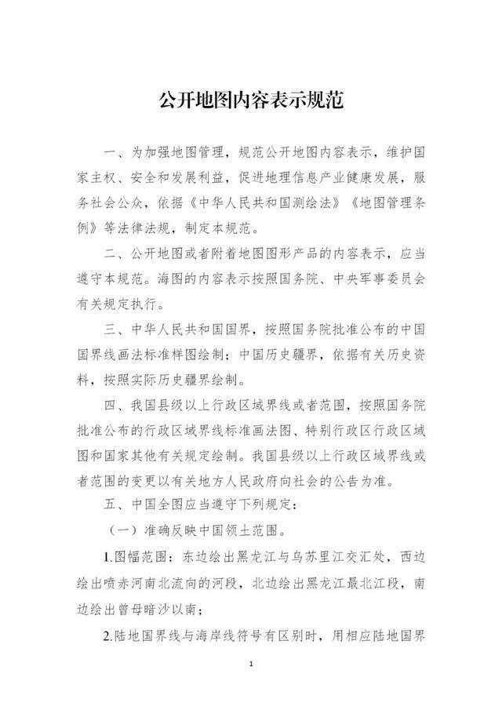
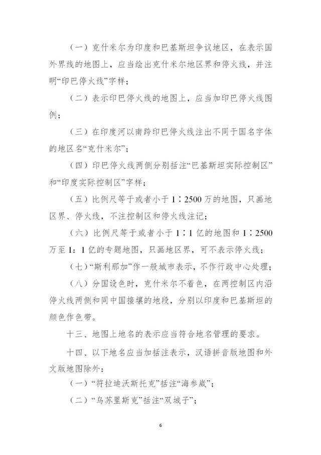

# 最新地图规范发布！台湾省地图应当绘出钓鱼岛、赤尾屿

自然资源部近日发布了《公开地图内容表示规范》，其中规定台湾省在地图上应当按省级行政单位表示，地图的图幅范围应当绘出钓鱼岛和赤尾屿（以“台湾岛”命名的地图除外）。《规范》全文如下：

**自然资源部关于印发《公开地图内容表示规范》的通知**

各省、自治区、直辖市自然资源主管部门，新疆生产建设兵团自然资源局，国家林业和草原局，中国地质调查局及部其他直属单位，各派出机构，部机关各司局：

《公开地图内容表示规范》已经部审议通过，现予以印发，请遵照执行。

自然资源部

2023年2月6日

下面，请收藏这幅标准中国地图——

中国地图 1:740万 对开 界线版 有邻国 线划一 图片来源：标准地图服务网站

来源 北京日报客户端

编辑 赵司尧

流程编辑 严圣淼

