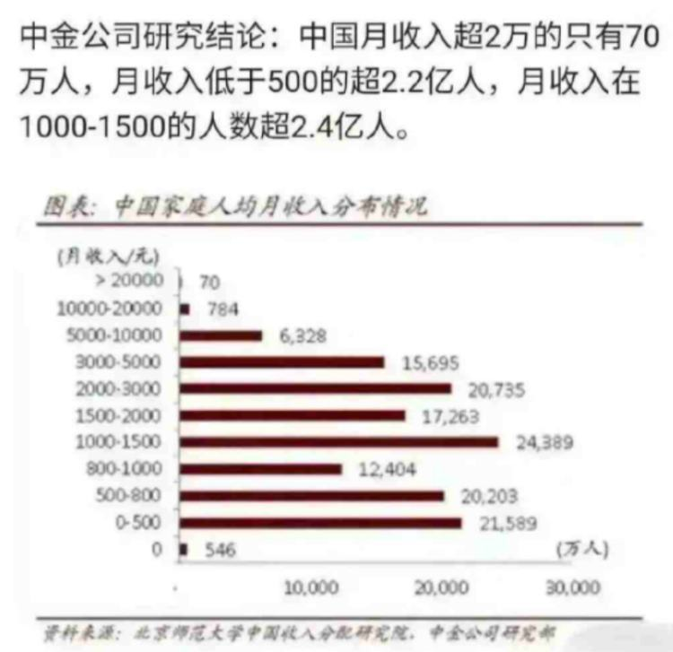
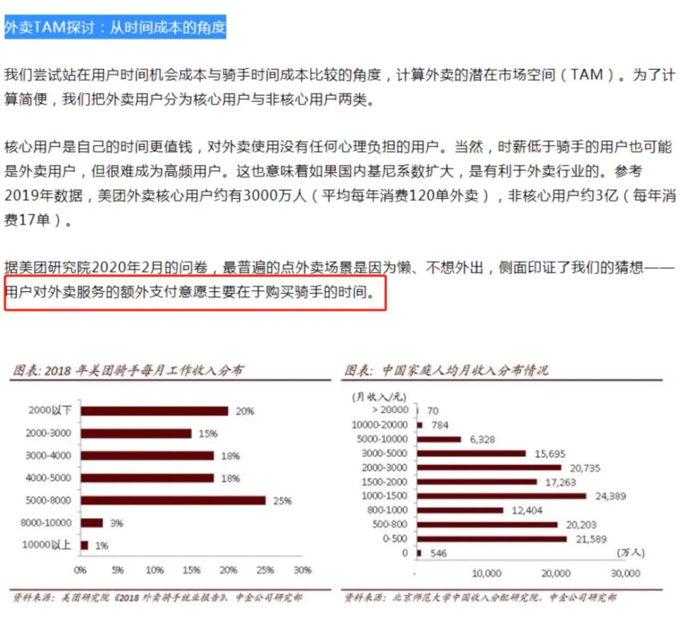
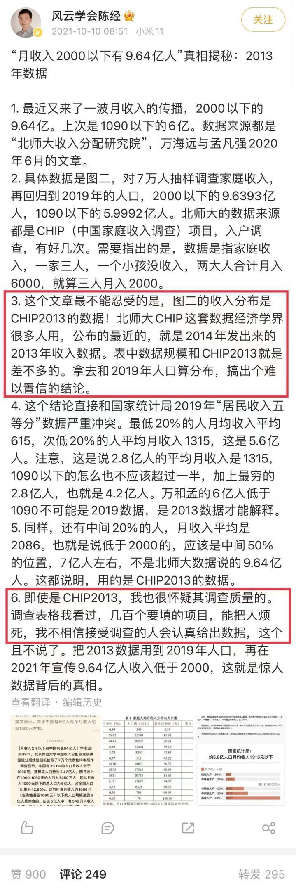

# 月入五千，能不能击败95％的人

**网民的情绪是真实的，挤掉水分之后，普通人真实的收入水平，依旧与互联网上“遍地是年薪百万”的浮躁风气相去甚远。**

最近，想必你也在网上看到过这样一条新闻。

“中金数据显示，月收入5000以下占总人口95%，累计13.28亿人，月收入在5000元以上即超过全国95%的人”。

在互联网信息茧房营造的普遍焦虑之下，如此接地气的数据显得尤为清新脱俗。很快，这则消息就通过视频、文字、图片等方式被广泛传播，辅之以各种耸动的标题——

“最权威收入分级出来了，你在哪个层次？”

“中金公司公布最新人均月收入，月入5000元以上就是富人。”

“中金数据：月薪五千以下占总人口95%，看完你还焦虑吗？”

有人对此表示认可，认为“这才是去掉互联网滤镜的、最真实的收入水平”，也有人提出质疑， **“全国月收入2万以上的只有70万人？光是半个深圳都不止这些”。**

然而，除了一张因反复保存传播而充满电子包浆的“中国家庭人均月收入分布情况”的图表，以及在此基础之上衍生出的各色讨论，你很难在中文互联网上找到更多有价值的内容。

看到这，你大概也会产生一连串的疑问：这个数据真的是中金公司出具的吗？原始数据的出处在哪里？以及更重要的—— **在中国，月入五千到底是什么水平？**

“开局一张图，内容全靠编”

**先说结论，这个所谓的“中金数据”，是一个乌龙。**

通过图片识别检索，不难发现，该图表的最早出处，是2020年11月由中金公司出具的一份研报，标题为《交易类平台研究框架：基于“多快好省”的模型》。值得注意的是，在中金公司官网上，该研报的分类为传媒&互联网，并非经济金融。

报告中，与“中国家庭人均月收入分布情况”一同列出的数据，是“2018年美团骑手每月工作收入”。结合上下文，该段落意在论证一个猜想模型：外卖软件的核心用户是时间比骑手更值钱的用户，即时薪高于配送员的用户更倾向于点外卖。

因此，报告中引用的“家庭人均月收入分布情况”仅为论证外卖软件的商业模式和增长潜力的手段，而非目的。

_中金研报中涉及“中国家庭人均月收入分布情况”的内容。/《交易类平台研究框架：基于“多快好省”的模型》_

沿着这条断章取义的线索往下挖，我又发现了一个好消息和一个坏消息。

好消息是，这个数据虽然与中金公司没关系，但来源是与国家统计局有着密切合作的北京师范大学中国收入分配研究院，依旧是比较值得信赖的数据。

**坏消息是，这个数据大概率是十年前的。**

月入五千，真的很难击败95%的人

具体来说，中金公司这篇报告所使用的数据，援引自北京师范大学中国收入分配研究院的两位研究员发布在《财新周刊》上的一篇文章，发布于2020年6月。

文章称，这是北京师范大学收入分配研究院课题组基于国家统计局的16万户样本，分层线性随机抽取了7万个代表性样本，进行的分析数据。/《月收入不足千元，这6亿人都在哪》

文章中公布的数据，曾引起过多轮争议，只不过，比起“月收入5000元就超过95%的人”，之前人们更加关心的是“月入超过两万元的居然只有70万人”和“有9.46亿人月收入低于两千元”。

近年来，也不断有财经博主对于这一数据的真实性表示怀疑。

2021年，“风云学会陈经”发布微博质疑该数据出自CHIP2013（由北京师范大学中国收入分配研究院发起的中国居民收入调查项目）的数据，明显带有滞后性，且信息采集主要依靠受访者自主填报，有较大主观性。

_CHIP项目的最新报告为CHIP2018，但当时尚未对外公布，许多研究是基于CHIP2013的数据。/微博_

关于居民收入水平，另一个常用数据是国家统计局公布的居民可支配收入。可支配收入是指居民可用于最终消费支出和储蓄的总和，既包括现金收入，也包括实物收入。

可支配收入有四种来源。一是工资性收入（除工资外，还有奖金、津贴、过节费、来自单位的实物收入等）；二是经营净收入（从全部生产经营收入中扣除生产成本、固定资产折旧和税金后的净收入）；三是财产净收入（家庭从拥有的动产、不动产所获得的收入，包括存款利息、股票红利、房屋租金等）；四是转移净收入（养老金和离退休金、社会救济和补助、赡养收入等）。

CHIP大体沿用了这一思路，但在部分细节上有所区别。

比如，国家统计局使用的统计方法是“五等份分组”（即按照人均收入水平，将所有样本平均分为五个等份），每份占20%，处于最高20%的收入群体为高收入组，其下为中间偏上收入组、中间收入组、中间偏下收入组、低收入组；CHIP则是“十等份分组”，每份占10%，从低到高分别为最低组、第二组、第三组……第九组和最高组。

而无论是国家统计局还是CHIP统计口径的居民平均收入，都是“家庭人均可支配收入”，
**人均可支配收入5000元，相当于一个标准的三口之家中，夫妻每人每月收入7500元，或者家有二孩时，夫妻每人每月收入1万元。**

通常来说，CHIP的样本抽取自国家统计局城乡一体化住户调查大样本库，与同年官方公布的数据出入并不大。

而按照国家统计局历年公布的“居民收入五等分”的数据，在2013年，人均月收入在3954.75元就可以超过90%的人，到了2019年，想要超过90%的人则需要月入6366.75元。

_历年中国居民五等分分组人均年收入数据。/《中国居民收入的五档划分与差异对比》_

因此，北京师范大学在2020年发布的“使用2019年数据”制作的图表，显然与2013年的国内居民收入水平更加接近。也就是说，那个火爆全网的让你感到安慰的“最新权威收入分级”，用的可能是十年前的收入数据。

综上所述，我们似乎可以这样说， **月收入在5000元以上，你就超过了95%的来自2013年的中国人。**

那么，问题来了，放到社交平台上“年薪百万遍地走”“月薪两万不如狗”的今天，月入五千又是个什么水平？

月入五千，到底是什么水平

根据国家统计局上个月公布的2022年居民收入和消费支出情况，2022年，全国居民人均可支配收入36883元，比上年名义增长5.0%，其中城镇和农村居民人均可支配收入分别为49283元和20133元。

**据了解，在住户调查中，高收入人群参与调查的配合程度可能更低，导致这部分人群占比偏低，进而导致收入差距被低估。**

国家统计局公布的居民收入，是在住户调查数据的基础上结合个人所得税信息，校正高收入人群代表性不足的情况之后得到的。

**而比起容易被少数高收入者拉高的平均数，更具有代表性的则是中位数。**
中位数是按顺序排列的一组统计数据中居于中间位置的数，超过中位数，就意味着你超过了一半以上的人。

2022年，全国居民人均可支配收入中位数31370元，其中，城镇居民人均可支配收入中位数45123元，
**农村居民人均可支配收入中位数17734元，平均到每个月，分别约为3760.3元和1477.8元。**

2022年，按全国居民五等份收入分组，低收入组人均可支配收入8601元，中间偏下收入组19303元，中间收入组30598元，中间偏上收入组47397元，高收入组90116元。平均到每个月，分别约为716元、1608.58元、2549.83元、3949.75元和7509.67元。

因此，当一个人的月可支配收入超过7509.67元，他就达到了高收入组的平均数，又因为平均数会被少数高收入者拉高，居民收入的平均数大概率大高于中位数，
**这意味着7509.76元/月的收入，超过了20%的高收入组的一半人，即在总人口中排进前10%，超过90%的人。**

以此类推，3949.75元的可支配月收入可以超过70%的人、2549.83元可以超过50%的人、1608.58元可以超过30%的人、716元可以超过10%的人。

结合家庭成员来算，一个拥有两个子女的四口之家，两个成年人每月可支配收入之和为10199.32元（平均每人每月5099.66元），就能超过50%以上的家庭。

总的来说，尽管“月收入5000元以下占95%”的新闻多少有些断章取义、以讹传讹之嫌，但网民的情绪是真实的，挤掉水分之后，
**普通人真实的收入水平，依旧与互联网上“遍地是年薪百万”的浮躁风气相去甚远。**

不过从另一个角度看，抛开地域、家庭、工作性质等因素等不谈，单看收入数字，其实没那么多可比性。
同样月薪5000元，在县城和省会城市的生活水平显然不可同日而语；而即使同样是一线城市，在北京和广州月薪8000元的体验也一定大相径庭。

“一出生就有人告诉我们，生活是场赛跑，不跑快点就会惨遭蹂躏，哪怕是出生，我们都得和3亿个精子赛跑。”十多年前的高分印度电影《三傻大闹宝莱坞》里的这句名台词，早早地为我们当下的生活写下了最好的注脚。

对于不少人来说，应试教育下的排名已经远去很久，但这种思维留下的烙印，似乎仍然在深刻地影响我们。

**人生不只一个维度，不去想自己的收入击败了多少人，又被多少人所击败，我们的幸福感可能会超过更多人。**

文中未注明来源图片出自《浪漫速成班》《爱情的理解》《逃避虽可耻但有用》剧照。

**作者 | 陆一鸣**

**编辑 | 晏非**

**校对 | 黄思韵**

**排版 | 顾朴**

[1]《中国居民收入的五档划分与差异对比》|《财经》

[2]《中国居民收入差距变动分析(2013—2018)》| 罗楚亮、李实、岳希明《中国社会科学》2021年第1期

[3]《国家统计局公布居民人均可支配收入数据时，一些网友感慨自己“拖后腿”，对此应如何看待？》| 国家统计局

[4]《2022年国民经济顶住压力再上新台阶》| 国家统计局

