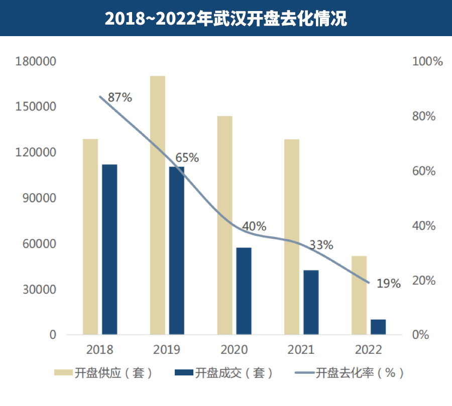
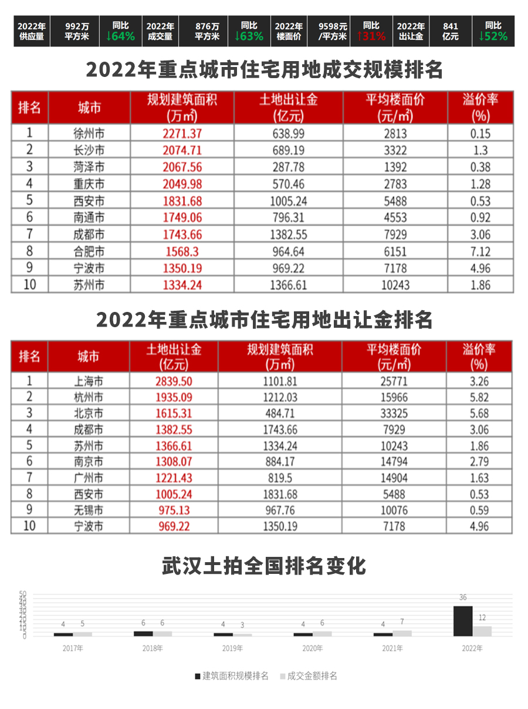

# 武汉定性房地产为困难行业背后：成交量创近8年新低，拖累了GDP

2022年底，武汉市汉阳区一楼盘开盘时销售不佳；春节后，推出几十套特价房，吸引了大量看房客户，扭转了营销局面。唐军/摄）

房地产对经济拉动作用毋庸置疑，但近年来大家对于如何发展定位房地产业有些摇摆，不想过度依赖，把重点转向了科技创新与实体产业上。

**唐军/发自武汉**

武汉房地产市场正深陷舆论漩涡中。

2月6日，武汉市人民政府出台《关于激发市场主体活力推动经济高质量发展的政策措施》，提出支持居民家庭合理住房消费，结合房价和新房库存情况动态调整住房限购范围，在武汉市住房限购区域购房的居民家庭可新增一个购房资格。值得关注的是，文件中还把房地产行业列为困难行业，要加大纾困支持力度。

多年来，武汉房地产市场的交易量始终位居全国前列，对城市经济的拉动作用更为显著，武汉本次明文将其列为困难行业，让各界人士颇为费解。

武汉市房地产主管部门相关负责人回应媒体时表示：“我们是动态地使用调控政策，二环内主城区核心板块一旦房源紧张或供应不足，我们会立刻收紧限购范围。实际上，目前全国对于首套房贷款利率下限的认定也是动态的，我们思路与此相同。”

厦门大学管理学院教授、博导戴亦一在获悉该政策后也在自己的头条号上直言：武汉市用心良苦。限购是特殊时期不得已而执行的一种计划经济时代的调控手段，本来就不适合常态化使用，更何况武汉楼市现在非常萧条，需要刺激、需要维稳。

有购房者却吐槽说：“我是缺那个购房资格吗？缺的是首付和还贷的钱！”

一位不愿具名的资深专家告诉记者：“本次武汉把房地产业特别定位为‘困难行业’，明显是抢抓政策机遇窗口，以便更大力度地纾困地产，为全年经济发展打好开局。”

成交量创近8年新低

武汉新建住宅市场年度走势：2022年武汉商品住宅供求双双下滑50%，年度供应999.28万平方米，成交1093.22万平方米；成交金额1753.15亿元，年度成交均价16037元/平方米。数据来源：武汉同策

武汉市房地产业确实步入了至暗时刻。

武汉市住房保障和房屋管理局数据显示，2022年，武汉新建商品住房共计成交11.63万套、1316.5万平方米，同比分别下滑42%和43%，是近8年来成交量最低的一年。

同策武汉房地产市场报告也显示，2022年，武汉市新建住宅平均价格同比下滑4%，全年新建住宅开盘平均去化率仅19%；截至2022年12月，全市新房库存近1800万平方米，去化周期16.4个月。

2020年，武汉房地产顶着疫情还创下了新房成交17.54万套的成绩，位居全国前三；2021年，武汉更上一层楼，新建住房成交超20万套，居全国第一。

武汉地产研究院院长殷跃建在接受记者采访时表示，前几年，武汉地产过猛过快的发展，严重透支了市场量能，引发供需失衡，叠加地产金融调控的过严，造成了行业的大滑坡。疫情的暴发，对基层低收入的刚需群体的冲击较大。武汉作为以刚需为市场主体的城市，相比全国其他城市，受疫情的影响会更大一些。

在武汉房地产行业发展多年的一位周姓总经理告诉记者：“从2021年底至今，我们眼看着市场不断萧条，行业信心几乎降至冰点。从市场表现看，政策刺激激不起成交浪潮，以价换量换不来市场复苏，项目开盘开不出良好去化，领跑大盘带不动冷清市场。我们就这样艰难地熬过了2022年。今年一季度能否恢复仍待观察。”

在市场表现不佳时，武汉市曾多次祭出宽松政策，以提振楼市。

2022年5月22日，武汉经开区的沌阳、沌口、军山新城区域从原限购区域调整为不限购区域。同年6月20日，武汉又在实操层面执行新的限购政策，户籍居民家庭名下若已有两套住房，可以再买一套房。

除此以外，武汉还有一些特殊的限购松绑政策：二孩或三孩家庭可买第三套房、父母投靠可买第三套房政策，此前户籍家庭通过这一系列政策最多可以购买四套房。而在武汉非主城区限购区域，楼市限购已经全面放开，武汉户口居民在此非限购区域的住房不计入家庭现有住房套数。

然而，对于地产宽松措施的实施，武汉市表现较为谨慎，没有印发具体文件，推行力度也不大，对市场的拉动效应非常有限。

武汉近几年开盘去化率直线下滑，据不完全统计，2022年开盘去化率不足2成，全年开盘去化率19%。数据来源：武汉同策

2022年12月8日，武汉市借助房交会让年终市场有所活跃，得以翘尾回升。但2023年春节期间，武汉楼市却依然呈现疲软态势。1月21日~1月27日，武汉市新建商品房成交网签备案77套，其中新建商品住房成交网签备案65套，同比2022年春节期间，分别下降了41%、49%。整个1月，武汉市新建商品住房网签成交6303套，成交量环比下降62%；同比下降48%。

“武汉地产市场如此糟糕的表现若不祭出强有力的政策，很难挽救行业颓势。”一位不愿具名的资深专家告诉记者，本次武汉把房地产业特别定位为“困难行业”，明显是抢抓政策机遇窗口，以便更大力度地纾困地产，为全年经济发展打好开局。

针对武汉房地产业是困难行业的各种评议，武汉地产研究院院长殷跃建在接受记者采访时却颇为冷静地回应：“2022年数据能不能真实反映武汉地产的发展水平要打一个问号！房地产真的是困难行业？是只武汉有困难还是全国都困难？这都要认真思考。”

发挥房地产业先导性作用 冲击2万亿元目标

2022年武汉土拍市场涉宅用地供求量下滑约60%，成交金额及成交规模在全国排名跌出前十。数据来源：武汉同策

“我感觉去年是行业最为暗淡、艰难的一年。”上述周总经理表示，有些世界500强、中国500强地产企业发生暴雷，导致市场恶化、极速萧条。同时，连续3年疫情，各行业都遭受重创，老百姓的钱袋子空了，又怕买到烂尾楼，观望情绪浓郁。

记者梳理国家统计局全国70个大中城市房地产月度数据发现，2022年初以来，武汉市房价环比已连跌11个月。

殷跃建分析称：“买涨不买跌，这是消费心理的使然。前几年，房价上涨较快的时期，很多家庭购房计划前置，让武汉住房消费超前透支；另外，武汉每年超20万套的住房巨大供应量，造成供大于求，市场供需失衡，这都为目前行业的困境埋下了伏笔，并进一步影响武汉财政收入。”

新房市场滞销不畅，让土地出让艰难。武汉土地市场交易中心数据显示，2022年度武汉土地出让成交仅约金额为940亿元，加上全市新建住房销售额约1800亿元，两项总额为2740亿元，同比跌幅52.2%。

2022年，武汉市GDP为18866.43亿元，按可比价格计算，比上年增长4%。有武汉市政府高层人士告诉记者，这个增幅虽然不低，但低于武汉原内定预期目标。

按照武汉市发展规划，武汉GDP于“十三五”末突破2万亿元大关，2019年武汉经济增长势头良好，GDP接近1.7万亿元，此后，其增长势头被疫情阻断，在2万亿元关口前止步不前。

殷跃建表示，如果去年武汉房地产没有发生断崖式下滑，这2000多亿元的缺口是可以弥补实现的。很明显，房地产拖累了武汉经济。

武汉市统计局的数据印证了殷跃建的观点，2022年，武汉市固定资产投资比上年增长10.8%，延续了平稳快速增长态势。从投资领域看，基础设施投资增长10.8%，工业投资增长19.3%；房地产开发投资仅增长5.5%，低于全市固定投资整体增幅5.3%。

前述武汉市政府高层人士表示，房地产对经济拉动作用毋庸置疑，但近年来大家对于如何发展定位房地产业有些摇摆，不想过度依赖，把重点转向了科技创新与实体产业上。

记者梳理2022年武汉市经济数据发现，武汉重点发展布局的光电子、新能源汽车等产业的东湖高新区、经开区的GDP分别为2800亿元、2000亿元，这两大区域产业对经济的贡献度均低于武汉房地产业。

“武汉市培育光谷、车谷光电子、新能源汽车等产业都已超过了30年，显然，目前要寻找能替代房地产业的支柱产业仍然比较难。我们在城市经济发展中，如何协调好房地产业与其他产业的关系，既发挥房地产业的先导性作用，又不过分依赖它，这不仅是武汉市面临的两难境遇，全国其他城市也都面临同样的课题。”殷跃建强调说。

**值班编委：马琳**

**责任编辑：温红妹 刘亚**

**审读：戴士潮**

**中国房地产报版权所有**

**未经授权不得转载以及任何形式使用**

