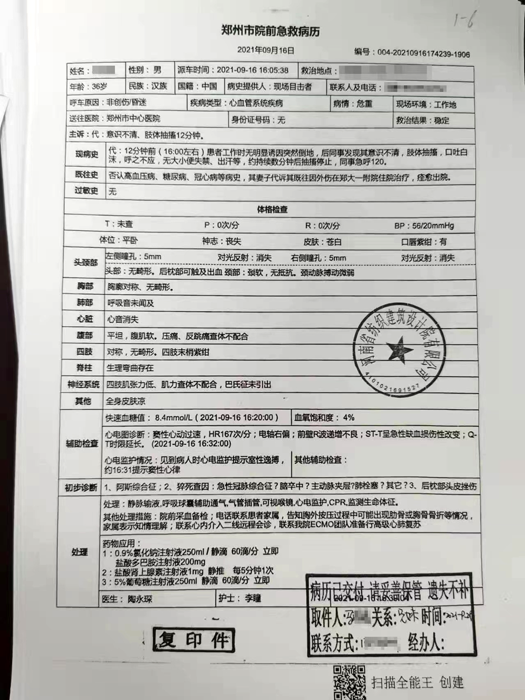
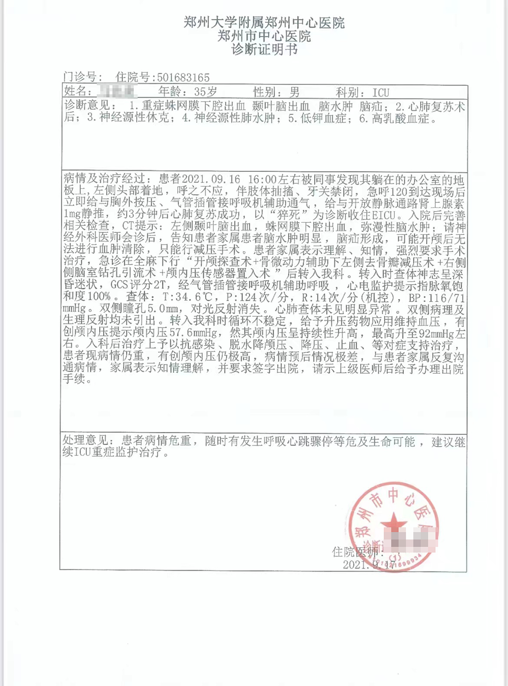

# 男子工作时倒地抢救多日死亡未被认定工伤，河南省高院提审

听到“咚”的一声响后，同事到龚明（化名）办公室查看，发现他已倒在办公室地上抽搐。因龚明是在独立的办公室，无人目击事发第一瞬间的情况。120急诊检查显示，龚明头“后枕部可触及出血”。

送医后，35岁的龚明一直昏迷，被诊断为重症蛛网膜下腔出血等。

其间，龚明单位提出工伤认定申请，未被郑州市中原区人社局认定。龚明经抢救多日后死亡，其家属起诉中原区人社局，并将龚明单位列为第三人，要求撤销人社部门不予认定工伤决定书，重作认定。一审、二审均败诉后，龚明家属向河南省高级人民法院申请再审，经开庭审理，河南省高院裁定提审本案。

2月9日下午，该案在河南省高院公开开庭审理，未当庭宣判。

龚明究竟是突发疾病倒地后造成脑后枕部出血，还是不小心绊倒伤到头部、不小心绊倒伤到脑后枕部诱使病发？这是该案争议的焦点之一。2月13日，两份龚明诊断证明书的签字医师均告诉澎湃新闻，他们对此无法判断。

无人目击的“倒地”

郑州铁路运输中级法院2022年6月作出的二审判决书显示，该院查明，2021年9月16日16时3分，龚明在办公室突发疾病跌倒，经120急救后送至郑州市中心医院救治，次日该院出具的出院诊断为:1.重症蛛网膜下腔出血、颞叶脑出血、脑水肿、脑疝；2.心肺复苏术后……转院后，河南省人民医院2021年9月17日出具的诊断证明书上入院诊断为：1.蛛网膜下腔出血；2.心肺复苏术后。

_中原区人社局作出的不予认定龚明（化名）工伤决定书_

2021年9月29日，龚明所在单位提出工伤认定申请，10月12日，中原区人社局作出不予认定工伤决定书。龚明经抢救救治48天无效后，于当年11月2日死亡。家属提起行政诉讼，要求撤销不予认定工伤决定书，重新认定，郑州铁路运输法院一审驳回了该诉请。

判决书显示，郑州铁路运输中级法院二审认为，龚明在工作岗位突发疾病跌倒，其所受伤害并非事故伤害所致，不符合“在工作时间和工作场所内，受到事故伤害”的规定。据《中华人民共和国民法典》规定，“自然人的出生时间和死亡时间，以出生证明、死亡证明记载的时间为准”。自龚明突发疾病至其送医经抢救无效死亡已远超48小时，因此，也不符合“在工作时间和工作岗位，突发疾病死亡或者在48小时之内经抢救无效死亡的，视同工伤”的情形。

龚明单位提出工伤认定申请时提交的刘某龙的证人证言显示，事发时，他在龚明办公室2米远的地方，听见“咚”的一声响，以为是哪儿桌椅倒了。随后看到同事王某大喊“龚工”，并见王某往龚明办公室里跑。他跟了进去，看见龚明倒在办公桌旁，头在桌子腿底部金属横杆旁。横杆和龚明头部旁边的地板砖上都有少许血渍。随后，他赶紧走出办公室拨打了120。

刘某龙告诉澎湃新闻，龚明的办公室是在一个大办公室角落隔出的单间，从外面无法看到里面，因此没人看到如何事发的。

收到二审判决后，龚明家属不服，向河南省高院申请再审，河南省高院裁定提审本案。2023年2月9日，该案在省高院开庭。

龚明家属认为，龚明生前曾体检，并没有相关疾病，事发前曾说工作压力太大了，龚明是不小心被绊倒致后脑受伤并最终死亡的。

庭审中，第三人、龚明单位代理人介绍，龚明有缴纳工伤保险。龚明是单位下属最大院所的副院长，同时兼任该院一专业所所长，下面带着三四十名员工，其工作任务确实比较繁重。龚明平时有锻炼，没听说有什么身体问题。

该单位代理人表示，同事们听到响声才去查看，确实无人目击事发第一情况。

关键的诊断证明书

_郑州市院前急救病历显示，龚明头后枕部可触及出血_

事发当日的郑州市院前急救病历记录记载，龚明的既往病史为“否认高血压病、糖尿病、冠心病等病史”；体格检查一栏中记载，龚明脉率0次/分、呼吸0次/分、神志丧失等，头颈部两侧瞳孔对光反应消失、头后枕部可触及出血等。

在河南高院的庭审中，中原区人社局诉讼代理人承认，人社部门并未去医疗机构调取过龚明事发前的医疗或体检记录。其称，龚明“头后枕部可触及出血”是突发疾病后倒地所致。因龚明是突发疾病，因此不符合“在工作时间和工作场所内，受到事故伤害”条款。其还表示，人社局做出不予认定工伤决定书，依据是医院的诊断证明书。两家医院的诊断证明书，都没有“创伤性”这三个字。“作为人社局，无法认定，也不可能认定他有外伤，或者是出血了就有外伤。”该代理人说。

法官当庭询问，如何理解急诊病历记录的“头后枕部可触及出血”？

对此，郑州市中原区人社局工伤认定业务工作负责人表示，120第一时间到现场，医护“可能是按照实际情况记录的”。（但）事发次日的郑州市中心医院诊断证明书并没有任何外伤描述，并且，人社部门在工伤认定过程中，最终会以诊断证明书为法定依据。治疗和检查过程中记录的一些细节，只是一个参考。若是外伤引起，诊断证明书会写明“创伤性（编辑注，如创伤性脑疝）”。

_龚明的郑州市中心医院诊断证明书_

澎湃新闻注意到，郑州市中心医院出具诊断证明书前，龚明已经做过去头骨瓣减压术等手术，部分头骨已被摘除。

2月13日，郑州市中心医院诊断证明书签字医师告诉澎湃新闻，龚明是突发疾病倒地后造成头后枕部外伤，还是不小心绊倒摔到头后枕部导致脑出血、不小心倒地摔到头后枕部诱发疾病，作为医生，他无法判断。要作出该判断，需结合视频监控、目击证人说法和死亡鉴定。他表示，不能直接排除某一种可能，弄清楚有一定难度。他曾接诊过小孩从一米高处摔倒伤到头部，致脑出血最终死亡的情况。此外，情绪过度激动等，也可能导致脑血管破裂。

河南省人民医院诊断证明书签字医师则向澎湃新闻表示，龚明被送到该院时，已处于弥漫性脑水肿状态。或许，首家医院通过检查和手术，医生能判断龚明事发前身体是否有相关疾病。即便如此，医生也难以判定龚明是突发疾病倒地后造成头后枕部外伤，还是因为不小心绊倒等原因伤到头后枕部诱使病发。

案例：不能排除外伤可能性，法院支持认定工伤

《最高人民法院关于审理工伤保险行政案件若干问题的规定》第四条第（一）款规定，“职工在工作时间和工作场所内受到伤害，用人单位或者社会保险行政部门没有证据证明是非工作原因导致的”，应予认定工伤。

澎湃新闻注意到，2020年10月，郑州铁路运输法院曾判决一起案件，支持认定工伤，因为用人单位“不能排除是外伤造成的可能性”。

判决书显示，经审理查明，王某法系郑市某公司职工。2018年8月17日，王某法在工作区域打扫卫生时，突然从垃圾车上摔倒，意识不清，被送医救治。2018年8月31日，王某法死亡。死亡原因：脑疝。2018年9月，其女儿王某娟向郑州市人社局提出工伤认定申请。2018年12月，后者作出不予认定工伤决定书。王某娟不服提起行政诉讼。2019年8月，郑州铁路运输法院作出行政判决书，判决撤销郑州市人社局作出的不予认定工伤决定书，责令重新作出。郑州市人社局不服该判决提起上诉，郑州铁路运输中级法院2019年11月作出行政判决书，认为在不能排除王某法脑疝的形成与因工作原因而摔倒受伤等可能性的情况下，郑州市人社局直接认定王某法脑疝的形成是其自身原因所致缺乏事实根据和法律依据，属认定事实不清。判决驳回上诉，维持原判决。2019年12月，郑州市人社局经过重新调查核实后，作出工伤认定决定书。王某法所在公司对此不服，又向法院提起诉讼。

法院认为，在工作时间和工作场所内，因工作原因受到事故伤害的，应当认定为工伤。公司方诉称王某法是因其自身固有疾病导致昏迷而摔倒，其死亡原因是疾病，而不是因为受伤。根据《工伤保险条例》第十九条第二款规定“职工或者其近亲属认为是工伤，用人单位不认为是工伤的，由用人单位承担举证责任。”公司方并未提供王某法不构成工伤的相关证据，且根据郑州市人社局的重新调查，可以得知王某法的死亡原因不能排除是外伤造成的可能性，郑州市人社局作出涉案工伤认定决定，并无不当，驳回公司方的诉讼请求。

“48小时死亡”争议

中原区人社局作出的不予认定工伤决定书，除认定龚明的情况不符合“事故伤害”外，还认定其不符合《工伤保险条例》第十五条——“在工作时间和工作岗位，突发疾病死亡或者在48小时之内经抢救无效死亡的，视同工伤”。

在法院对该案的三次审理中，龚明家属都提及，在医院救治期间，龚明全程处于深昏迷状态，依靠呼吸机维持生命，多名医生表示龚明的病症没有救治意义，但他们难以接受该事实，希望能出现奇迹。家属的诉讼代理人在庭审中指出，抢救期间，龚明瞳孔放大、无自主呼吸等症状，符合“脑死亡”。

“48小时死亡”的工伤认定标准曾备受争议。多位法律界人士认为，脑死亡时表明其死亡已具有不可逆性，工伤认定时应当以是否“脑死亡”为判断标准。

在《最高人民法院司法观点集成(新编版)·行政及国家赔偿卷III》中，最高法法官杨科雄在《突发疾病死亡的工伤认定问题研究》中指出，关于“48小时”是否要严格要求的问题，“我们认为，原则上超出48小时的，不能认定为工伤，但是连续抢救48小时，而后死亡的，亦可认定工伤。”此外，脑死亡应当是死亡的标准，对“48小时”内脑死亡、“48小时”后停止呼吸者予以认定为工伤。否则就会出现奇怪的现象：放弃治疗，太不人道，但是能够认定为工伤；继续抢救，一旦抢救无效，就无法认定工伤。

知名劳动法律法规专家、金诚同达律师事务所庞春云律师认为，《民法典》实施前，此类案件多严格执行“48小时标准”。《民法典》融合多部法律，同时加入了与时俱进的新内容，包括社会主义核心价值观、公序良俗等。法律不再像以前那么冷冰冰，不只法律需要被尊重，道德规范同样需要尊重。

2021年5月，最高检曾发布5件工伤认定和工伤保险类行政检察监督典型案例，要求各级检察机关切实加强劳动者权益保护。

其中一例为，一男子开会返回途中突发疾病，后送医抢救靠呼吸机维持生命，10天后家属放弃治疗，拔掉呼吸机5分钟后该男子死亡。人社部门一开始未认定工伤，家属起诉，一审法院认定属于视同工伤情形，人社部门不服上诉，二审认定不属于视同工伤情形。家属又向广西高院申请再审被驳回。后经检方抗诉，最终得以认定工伤。检方认为，在法律对死亡认定标准没有明确规定情况下，本案应从有利于保护职工的立场予以解释，认定视同工伤。

