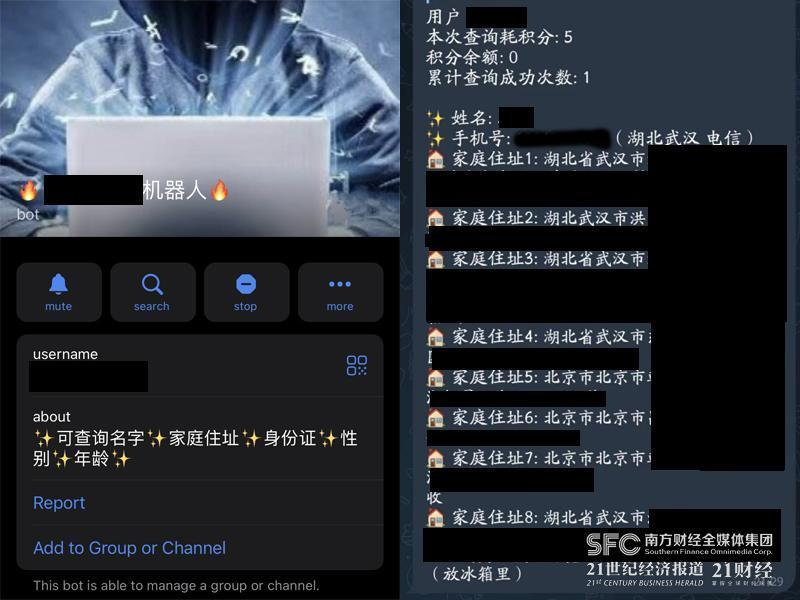

# 疑似45亿条国内个人信息被泄露 信息贩卖成暗网“潜规则”？

**21世纪经济报道 记者钟雨欣 见习记者郑雪 南方财经全媒体 见习记者严灿 北京报道**

步入数字经济时代，个人信息的重要价值不言而喻。随着互联网技术的快速发展，隐藏在水面之下的“暗网”，由于其隐蔽性、非常规性的特点，正逐渐成为个人信息泄露的“温床”，成为网络黑产交易等不法行为的暗角。

日前，有网传消息称，疑似约45亿条国内个人信息在“暗网”被泄露，包括真实姓名、电话与住址等，引发各界关注。受访专家表示，
**近年来侵犯公民个人信息、危害信息数据安全的行为呈现高发多发态势，API接口、供应链上的中小企业或成为易受攻击的薄弱环节。相关企业应重视供应链整体安全，不断完善数据合规建设。**

疑似大量个人信息被泄露

2月12日晚，Telegram各大频道突然大面积转发某隐私查询机器人链接。网传消息称该机器人泄露了国内45亿条个人信息,数据包大小达435GB，疑似电商或快递物流行业数据。
**用户仅需输入手机号,即可通过该机器人查询到姓名、手机号和详细的收货地址等隐私信息。**

21世纪经济报道记者在昨日上午10时至下午17时多次验证时发现，目前该隐私查询机器人已停用。网络安全专家冰尘（化名）在接受采访时表示，自己经过测试，通过该接口查到了个人信息，包括姓名、手机号以及多个家庭住址。“2021年11月份，我从武汉搬到了北京，最近一段时间也刚搬家，通过反馈的数据可以看到我在武汉、北京两个地方的地址，”冰尘说道，
**“以此分析，数据泄漏的时间不早于2021年11月份，最晚不晚于2022年12月份。”**

“Telegram，通常也称电报或TG，是国外一款即时加密通讯工具，类似于国内的QQ和微信，其加密性强、安全性高，难以被破解，同时因为法律难以管辖，平台上存在着大量色情、赌博、诈骗等信息，慢慢地就演化成为黑产的一部分。”

“这次其实就是在电报上创建频道
，类似于国内的公众号，通过公众号自动回复便可以查询到个人相关信息。”冰尘介绍，频道背后的不法分子，其实是将泄露的用户数据整合分析、集中归档到
“社工库”，通过社工库便可以获得相关信息。

“比如，我经常使用某购物平台购买生鲜，考虑到和快递员比较熟悉，会请他直接放在冰箱。在这次我查到的地址中，也出现了‘放冰箱里’这四个字。”他说。

冰尘还透露，正常情况下，可能只是某个企业的数据泄露，但此次的数据泄露较为广泛，类型较多，涉及多家平台的相关快递信息。由于信息泄露规模庞大，暂时无法判断其泄露具体原因。

记者就此次事件向顺丰、京东、淘宝等平台求证，前两者均表示未收到相关消息，淘宝方面暂无回应。

API接口、供应链中小企业或成薄弱环节

梆梆安全服务中心相关负责人告诉记者，实际上，个人信息被泄露贩卖的情况长期存在，而随着信息技术的快速发展，可利用的信息类型和数量日益增加，交易也从“地下”逐渐浮出水面，
**侵犯公民个人信息、危害信息数据安全的行为呈现高发多发态势。**

“作为网络安全从业者，平时我们会进行埋点测试，就我个人而言，在使用各平台时会使用不同的名字和号码，如果发生了信息泄露的情况，能够做出区分。
**据我们分析，如果App的接口权限过大，或者安全架构设计得过于复杂，就可能会产生薄弱点，出现漏洞导致数据泄露。** ”上述负责人表示。

据冰尘介绍，常见的数据泄露主要出于四个原因，
**一是API接口数据泄漏，二是运维不当或者内部管理不严，导致包含密钥或源代码泄露，三是内鬼泄露数据，四是企业内部的数据库被打穿。**

“随着网络安全发展迭代，渗透或者攻击的成本在逐渐增加，整个内网被打穿从而导致数据泄露的情况逐渐减少，但通过接口类的逻辑漏洞导致的数据泄露却在逐渐增多。”冰尘进一步分析道，正常情况下，Web网页或者应用App可以通过对应的功能API接口调取数据。接口常暴露于外网，若此时没有对请求该API接口的数据限制查询数据类型及方式，即可进行一些“看起来合法”的数据越界请求。

“因这类请求中无任何攻击语句，一般情况下很难被发现，除非通过专业的日志比对才可察觉。相关技术人员通过接口不断发送请求，数据通过滚动查询，一段时间下来，便得到了相关数据。”他说。

从多年网络安全红队（攻击方）的视角来看，冰尘特别提示， **需重点关注大企业解决方案中供应链上的中小企业**
。在多数情况下，中小企业的安全成本投入较低，数据安全往往难以得到完善的保障，但他们本身却是供应链中的关键一环。随着大企业愈发重视安全建设，攻击方的攻击成本也在增加，攻击往往会转向供应链上的中小企业来寻求突破。“需要重视供应链的整体安全，因为你不知道其中的哪个薄弱环节会出问题。”

警惕暗网成为个人信息泄露“温床”

记者梳理发现， **近年来，在“暗网”售卖个人信息的事件时有发生，大量个人信息被“明码标价”。**
北京、南通、盐城、兰州等地都曾出现过通过“暗网”非法倒卖个人信息的案件。

今年2月，甘肃省公安厅发布“净网2022”十大典型案例，其中之一是兰州新区“詹某某黑客攻击案”。在此案中，兰州市公安局网安支队侦查发现，网民詹某某在“暗网”打包售卖包含银行储户、学生学籍、出行数据等在内的12类公民个人信息。专案组最终查清詹某某利用黑客技术，大肆窃取公民个人信息进行贩卖的整个犯罪过程，并在广州将另一名同案犯抓捕到案，现场查获全国20余个省份的10亿余条公民个人信息。

所谓“暗网”，是利用加密传输、P2P对等网络等，为用户提供匿名互联网信息访问的一类技术手段，常使用比特币等作为交易货币。
**由于其具有隐蔽性、去中心化、非常规性等特征，容易滋生以网络为勾联工具的各类违法犯罪。**

有大量的“卖方”，意味着背后存在着“买方”需求。买方的目的可能有哪些？梆梆安全服务中心相关负责人分析，主要包括三大类，
**一是将信息用于电信网络诈骗，提高诈骗陷阱的真实度；二是依靠数据进行人物画像，对特定人群进行“精准钓鱼”；三是将信息用于广告营销推送。**

“网民在使用互联网时，动辄需要提供手机号等个人信息。不法分子利用技术手段获取个人信息的侵权成本很低，而个人发现信息泄露后的维权成本却很高，甚至很难察觉信息是在何时何地被泄露的。
**这种不对等的情况是个人信息泄露事件持续发生的重要原因之一** 。”浙江垦丁律师事务所程念律师表示，不法分子通过Telegram机器人等方式进行售卖操作，
**其背后数据库的拥有者更加隐蔽，犯罪或者侵权主体的锁定更加困难。**

此外，她还指出，目前正规的数据获取途径尚待完善，不少企业因数据监管严格而未将自己掌握的数据发展成数据产品在交易所内上架交易，而需求方也面临着资金、合规等方面的成本压力，因此可能会更倾向于交易所外的交易，这给不法分子非法交易个人信息提供了可乘之机。

“必须强调的是，技术本身具有中立性，但技术使用行为是需要监管规范的。
**应警惕暗网成为个人信息泄露的‘温床’，滥用新技术实施个人信息售卖行为的主体需承担相应法律责任。** ”程念表示。

根据《中华人民共和国刑法》及《最高人民法院、最高人民检察院关于办理侵犯公民个人信息刑事案件适用法律若干问题的解释》等相关规定，向他人出售或者提供公民个人信息，情节严重的构成侵犯公民个人信息罪。如果售卖的是真实姓名、电话与住址等信息的，达到五千条则构成犯罪。

如果没有达到入罪标准的，按照《中华人民共和国网络安全法》相关规定，“窃取或者以其他非法方式获取、非法出售或者非法向他人提供个人信息,尚不构成犯罪的,由公安机关没收违法所得,并处违法所得一倍以上十倍以下罚款,没有违法所得的,处一百万元以下罚款”。

相关企业应如何做好数据合规工作，保护用户个人信息？

程念指出，企业需要完善内部规章制度和人员管理，注意防止内鬼行为。采取数据加密等技术措施保障安全，同时对于存在数据往来的合作方的数据使用行为进行必要监督，加强包括合同签署、资质查看、义务履行情况汇报等具体制度的构建。此外，加强与监管部门之间的协同，除采取处置措施外，在必要时应及时上报安全风险。

梆梆安全服务中心相关负责人也表示，企业一是要做好内控，提升信息化处理相关岗位员工的安全意识，提高应急处置能力，当数据泄露事件发生时，要第一时间做好溯源工作，及时发现和解决问题；二是在外控方面，可以通过组织设备测试、攻防演练等方式，提高查看和修复漏洞的频率，及时优化系统。

