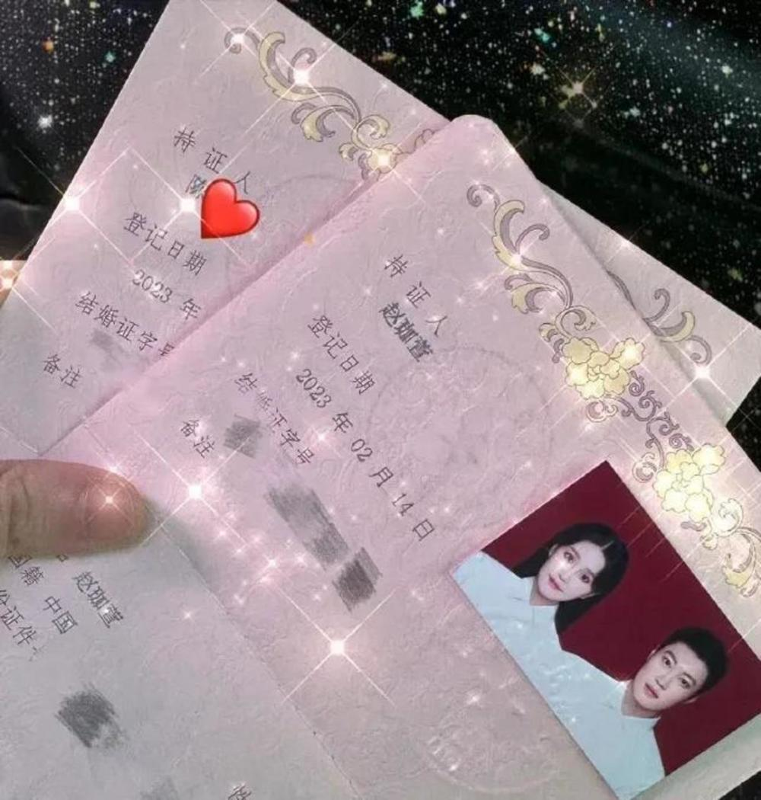
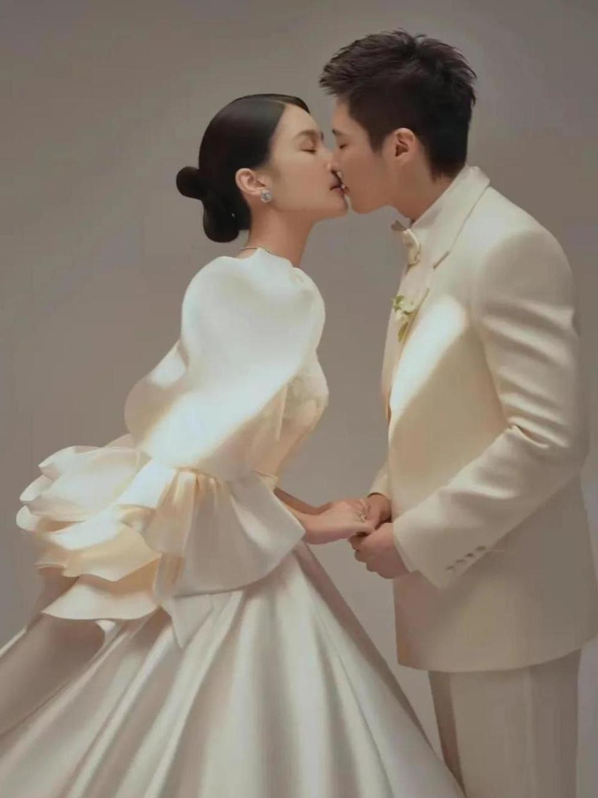

# 赵本山女儿晒结婚证并浪漫表白丈夫，回应：我们经过长时间了解并恋爱

封面新闻记者 杜恩湖

2月14日，赵本山女儿“球球”赵珈萱在社交平台上晒出了自己的结婚证，配文“余生漫漫皆是你”，官宣结婚，一时登上热搜，收到网友祝福。

当晚，封面新闻记者独家电话釆访了赵珈萱，向她送上祝福。赵珈萱在电话中证实说：“我们经过长时间的认真了解和相恋，今天已经办了结婚证，正式宣布结婚了。”

据了解，2月6日，赵珈萱曾曝光自己将在本月结束单身生活去领证，并在线甜喊男友小陈为老公。同时，她透露自己不会办婚礼，因为没有时间，也担心举办婚礼会有太多人写八卦：“我爸爸现在年龄也大了，不想折腾我爸。”

