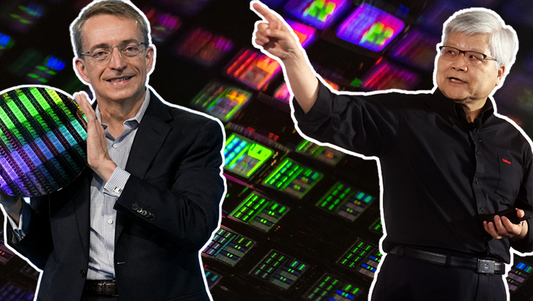
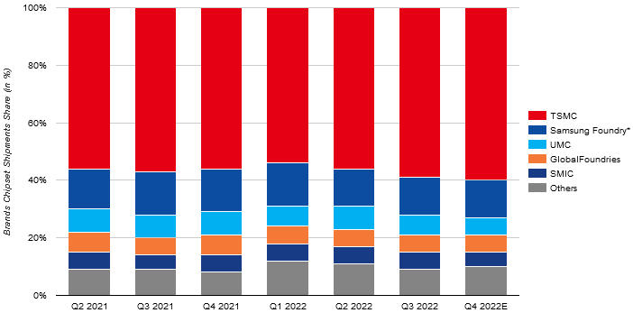
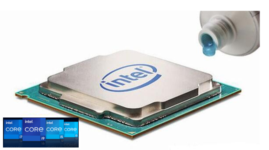
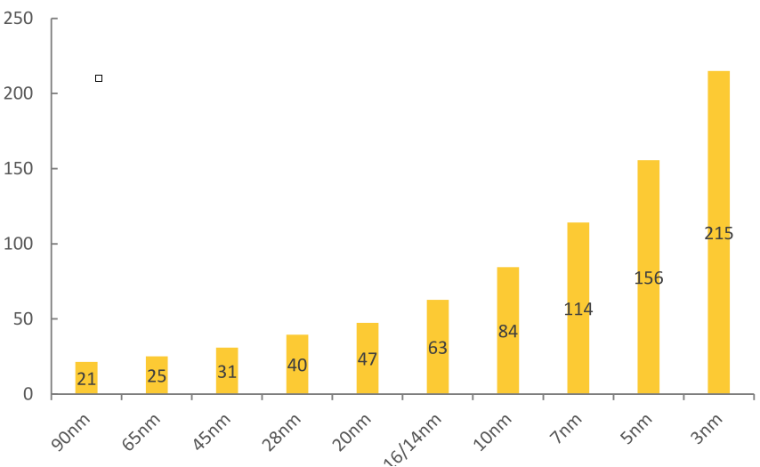
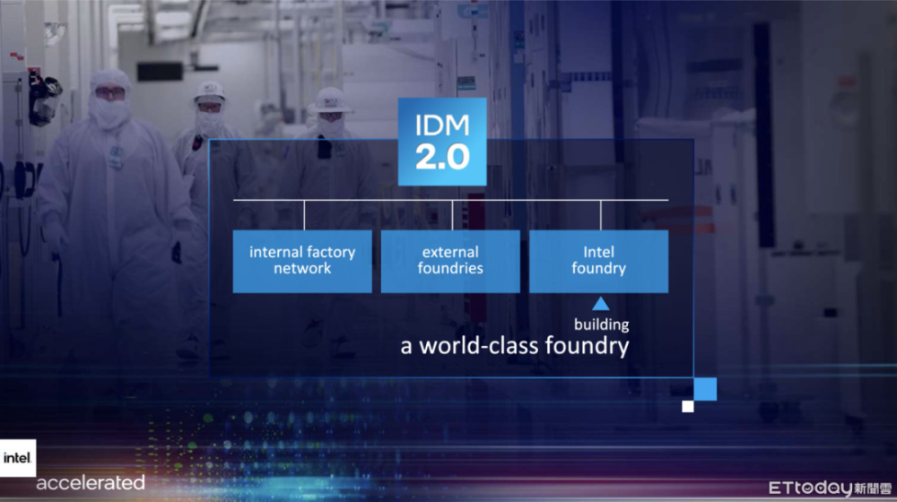

# 错失一个时代后，英特尔开始“抄袭”台积电

_“芯事重重”策划是腾讯科技《新产研》栏目重点研究的方向之一，本期聚焦芯片晶圆大厂英特尔的式微、台积电走强背后的产业发展模式的更迭。_

**划重点：**

  * _1_ 在芯片制造上，过去英特尔一直采用IDM模式，从设计、生产、封装、到销售全都自己操办，打遍天下无敌手。
  * _2_ 半导体行业是典型烧钱又耗技术的行业，技术和资金到达一个量级后，IDM模式反而成了前进的掣肘，10nm的失败成为英特尔下坡路的关键节点。
  * _3_ 台积电定位很明确：只做下游的制造，成功证明了半导体行业分工做得越细，在某个领域越拔尖，扎得更深，就能跑得越快。
  * _4_ 如今英特尔寄希望于IDM2.0战略复兴，但最大的挑战——客户是谁？目前苹果、英伟达、AMD们都不太可能。

**文 / 知勇，锦缎研究院**

“年年挤牙膏，终于挤不动了”、“英特尔这几年真是弱”，看到英特尔史上最糟糕财报之后，很多人的感受是，英特尔时代要落幕了。

英特尔日前发布2022年四季度财报，财报显示，英特尔营收同比大降超3成，净亏损6.6亿美元。财报发布后，投资者们果断用脚投票，盘后英特尔股价暴跌9.7%。

而就在此前半个月，台积电发布2022年四季度财报，营收同比增长42.8%，净利润同比增长78%。

同样都是在芯片行业大幅收缩、退烧的大环境下，为什么台积电和英特尔，交出了截然不同的成绩单？

_图：英特尔CEO基辛格和台积电CEO魏哲家_

01 英特尔向下，台积电向上

1、IDM模式缔造英特尔时代

在很多80后、90后的印象中，蓝色的“Intel Inside”标签是一种科技的象征。

在PC时代，英特尔毫无疑问是行业霸主，坐拥个人电脑和服务器的CPU市场。与此同时，市场上还有微软这位强大的同盟军在操作系统上为之保驾护航，使得英特尔引以为傲的x86处理器不可替代。（注：业内称为微软–英特尔体系，即WinTel）

在芯片制造上，过去英特尔一直以来采用IDM模式，即所有环节从设计、生产、封装、到销售全都自己一手操办。

英特尔的商业模式是把芯片设计和制造牢牢捆绑在一起，设计部门不断研发迭代，设计出更新、更快的CPU，制造部门则投资巨额资金，生产出一代又一代的新产品。

在WinTel时期，英特尔凭借IDM模式可谓打遍天下无敌手，稳稳当当地坐着头把交椅。

时至今日，尽管英特尔已经颓势日显，但IDM模式在行业里依旧占据较高权重。

根据Knometa
Researc的数据，截止至2021年底，全球IC晶圆的总产能为2160万片/月，其中三星、台积电、美光、SK海力士、铠侠，前五大公司合计占比57%，达到1221万片/月，这当中，除了台积电，三星（部分）、镁光、SK海力士、铠侠都是IDM模式。

对IDM模式，英特尔则仍然是恋恋不舍，在现任CEO基辛格的操盘下提出了IDM2.0战略，成立代工服务事业部，争夺台积电和三星的份额。

2、10nm成为分水岭

摩尔定律成就了英特尔，也困死了英特尔。

英特尔创始人戈登·摩尔上世纪60年代提出了摩尔定律的概念，即集成电路上可以容纳的晶体管数目大约每经过18个月，便会增加一倍。

过去的二十多年，英特尔处理器紧扣“摩尔定律”，从45nm、到32nm、再到22nm，一路都是水到渠成。

在14nm工艺节点之前，英特尔一直保持领先。不论是三星还是台积电，它们都跟随着英特尔的步伐，但是到10nm，英特尔突然无法延续摩尔定律了，两年一次升级的规律被按下暂停键。

英特尔最初的设想是在2017年实现10nm工艺，但此计划破灭，10nm工艺一直难产。为了对全球用户有个交代，英特尔就只能在14nm的字符后面标记字符“+”，也就是在14nm基础之上优化，最多的时候用上了3个加号——14nm+++。

有一段时间，14nm+++成为网友调侃英特尔最多的一个梗，“祖传的14纳米还能再战几年”、“英特尔14nm终极版不应该叫做14nm+++，要学下苹果手机的命名，叫14nm
Pro Plus Max……”

自家的工厂造不出设计部门的芯片，IDM模式受到前所未有的考验。对英特尔而言，制造环节受限，反过来又会进一步侵蚀英特尔的设计能力，形成蝴蝶效应。10nm工艺之败，也导致7nm芯片的进度大幅度落后。

2019年，时任英特尔CEO的鲍勃·斯旺这样回应10nm的困局，“英特尔对自己超过行业标准的能力过于自信，限制了自己的思维，措施了技术转型的机会，现在承受了后果。”

鲍勃·斯旺口中的后果，就是被竞争对手们赶超，并拉开差距。

2020年7月，英特尔宣布其采用7nm工艺的CPU将推迟半年发布，此举再次震惊行业。时年台积电和三星都已经在接5nm芯片的订单了。

_图1：英特尔芯片升级过程
来源：英特尔，中信证券_

另一方面，长期在英特尔阴影侧生存的“千年老二”AMD成功逆袭，开始与英特尔硬碰硬竞争。

2018年，AMD全面转向台积电，并发布了由台积电独家代工的面向计算市场的7nm显卡Radeon Instinct
MI60/MI50，性能超过同级别的英特尔产品。

最近几年，AMD的销量大幅提升，市占率也逐年提高，不断蚕食英特尔的地盘，而英特尔的衰退则是肉眼可见的。

继2022年二季报首次亏损之后，英特尔四季度净亏损6.6亿美元，毛利率也从2014年的超过60%掉到40%左右。最直观地对比，台积电的毛利率自2020年以来始终保持在50%以上，2022年四季度更是达到了惊人的62%。

过去几年，AMD和英特尔的市值多次出现交叉，不久之前的1月31日，伴随着英特尔的财报暴雷，AMD再次实现了市值对英特尔的反超。

3、台积电后来者居上

在台积电创办的二十余年里，一度是以英特尔”小弟“的角色存在。

与英特尔的IDM模式不同，台积电的商业定位从一开始就很明确：只做下游的制造，不和客户在芯片设计上竞争。

但是在英特尔“统治”下，台积电的起家并不容易。2014年“斯坦福工程英雄”讲座活动上，张忠谋这样回忆台积电的创业生涯，“单一的代工模式这种创新，在早期类似一种‘先有解决方案，再寻找需求’的概念，我们提供的是代工平台，但在当时没有人需要这样的平台，因为当初几乎少有无厂半导体公司，现有的无厂半导体公司也不需要台积电，而是更愿意去找日立、东芝、英特尔，这种现象直到90年代开始才有所改变，我们的存在，也极大加速了无厂半导体公司的诞生。”

台积电的发展过程中，不得不提到苹果公司。

从2014年开始，自研芯片的苹果开始将芯片代工订单交给台积电。收获苹果这个大客户后，台积电不但获得了技术快速进步的机会，还收获了今后十年的业务增长。

更重要的是，与英特尔分手后，苹果的业务仍然推进顺利，这给其它厂商一个很好的示范效果——我们不必非要在英特尔那里“买”芯片，可以试着找台积电代工。毕竟台积电的交付周期更短，成本更低，于是，台积电的订单纷至沓来，高通、英伟达、AMD等几乎所有芯片设计巨头都已和台积电合作。

公开数据显示，2014年台积电全年实现1482亿元人民币的营收，这个数字到2022年，达到了5025亿人民币。

至此，台积电开始有了和英特尔分庭抗礼的实力。如今，台积电已经成为全球最大晶圆代工企业，占据晶圆代工半壁江山。

在工艺节点上面，台积电已经宣布量产3nm工艺，足足领先英特尔一个身位。得益于高端制程芯片销量快速增长，其营收和净利润屡屡创下新高。

作为后来者，台积电顺利改写了世界芯片制造的权力格局。另一边，当年芯片霸主却成了追赶者。

_图2：晶圆代工市场格局 资料来源：Counterpoint_

02 半导体行业的更迭路径

过去几年，大家总是调侃英特尔是一家牙膏厂，每次提升的那点可怜性能总是被软件用光了。但是可能很多人并不知道，英特尔其实也是无可奈何，不是他实力不够，而是芯片设计和制造的难度远比想象中的高。

更重要的，对英特尔来说，IDM模式注定是一条越走越窄的路。

1、“双高”现象压倒英特尔

众所周知，半导体行业是典型烧钱又耗技术的行业，可以理解为“双高”现象，这个趋势目前已经越来越明显，也是压倒英特尔的关键因素。

先看技术维度，半导体技术进步主要遵循摩尔定律，即芯片上集成的晶体管数量平均每隔18个月就会翻一番，性能也提升1倍。在这种发展速度下，电路结构越来越复杂，加工工艺的要求也越来越高。

所以到最后行业呈现的割裂现象就是越到高端制程，行业玩家越来越少。在10nm工艺节点，已经只剩台积电、三星、英特尔。

可以说，芯片制造行业注定是一条英雄寂寞的道路。

_图：随着制程工艺提高，行业玩家逐渐减少
资料来源：英特尔，中信证券_

再看资金壁垒，随着工艺节点提高，新一代生产线所需的投资额成倍甚至数十倍地增加。举例来说，2020年台积电宣布在美国投建的5nm工厂投资额约合120亿美元，未来3nm产线的投资额预计将达到惊人的200亿美元。

_图：不同制程下每5万片晶圆产能的设备投资（亿美元）资料来源：天风证券_

为了更进一步理解半导体的资金壁垒，我们看下台积电的历年资本开支。2021年，台积电的资本支出再创新高，达到300亿美元，其中研发支出约为45亿美元。

一言以蔽之，芯片制造是一项需要大量资金维持的高难度技术动作。

_图：台积电历年资本开支 资料来源：中原证券_

2、分工模式成就台积电

回到英特尔身上，了解半导体“双高”现象，其实也就不难理解英特尔为什么会出现挤牙膏现象。诚然，英特尔这个巨无霸企业有大量的资金和技术人员，但是做芯片一条龙服务既要投入制造又要投入设计，还要做封测。

相比之下，台积电只用集中精力在制造环节，两者最终的表现可想而知。

专注制造环节的台积电，正是将代工技术做到极致，每年投入超百亿美元死磕制造环节，最终实现了制程工艺的全面领先，改变了行业规则。

专业分工这套逻辑在AMD身上也得到验证，在分拆掉格罗方德业务之后，定位变成了无厂半导体设计公司，将代工业务转交台积电，成功扭转下滑颓势。

MercuryResearch的最新调研数据表明，AMD在包括桌面处理器，移动处理器和服务器处理器的x86处理器整体市场当中，份额达到31.3%，而在2020年第一季度，AMD的份额还只有14.8%。

虽然英特尔沿用的IDM模式可以将所有核心环节掌握在自己的手中，但是当技术和资金到达一个量级后，即面临“双高”现象挑战时，反而成了技术进步的最大掣肘。类似地，在芯片设计环节，英特尔面临的高通、英伟达等顶尖对手，胜算同样不高。

实际上，半导体领域与工业领域的发展规律恰恰相反。大部分工业领域强调垂直一体化，比如光伏、动力电池行业。行业龙头先单点突破，某一个领域做大做强，再延伸补强其他产业链环节，最后打造产业链一体化，实现降本增效。

然而半导体行业已经形成术业有专攻的典型规则，分工做得越细，在某个领域越拔尖，扎得更深，就能跑得越快，行业地位自然更稳固。

其次，半导体行业的分工合作是更优的风险分担机制。台积电的高额资本开支由高通、英伟达、AMD等芯片设计公司共同分摊，而英特尔只能内部消化。

第三，代工模式的技术进步是最快的。台积电的客户是全球顶级芯片设计公司，可以更快更多地积累一流芯片制造能力。这也是为什么台积电可以在成本和技术上面降维打击其它晶圆厂，而IDM模式里面每个环节里只要有一个落后了，出现重大障碍，整个产品的进度都会受到拖累。

正所谓皮之不存，毛将焉附，没有制造能力，再高端的技术只是设计图纸。

不难发现，以台积电为代表的晶圆代工模式，可以更好地突破技术和资金壁垒。走IDM路线的英特尔比不上单押制造环节的台积电，有其必然性，并不是前者的研发能力不强，而是很难做到齐头并进、孤独一掷地投入，最后输出的是挤牙膏式技术创新。

未来分工合作这个模式，大概率会演化成为行业新路径，每个环节由单独的公司负责，然后几家公司携手制造出最优的芯片。

去英特尔大包大揽的时代正在成为历史。

3、英特尔进入衰退的长夜？

如今的英特尔，与昔日的辉煌相比，早已是另一番景象。在营收、净利润双双大幅下滑的颓势之下，资本选择夺路而逃。在过去12个月中，英特尔的股票已经下跌了近40%。

英特尔的成功很大程度上得益于对于个人电脑的把握，并在摩尔时代，引导行业往自己有利的方向发展。而在后摩尔时代，业务众多的英特尔已经跟不上技术进步的速度。在新的游戏规则里，台积电们显然抢到了和英特尔竞争的制高点。

实际上，早在2017年左右，英特尔跑不赢摩尔定律的隐患已经显现，只是财务的恶化滞后于业务已陷入泥潭这个事实，进而未在当年财报上面体现。从资本市场中可以看到，过去几年英特尔的股价已停滞不前，华尔街精英们对英特尔的信心已经不足，他们开始担心这颗奔腾的“芯”还能跳动多久。

_图：英特尔股价图
资料来源：谷歌_

如果拿当年的老对手对比，英特尔的衰落就更明显。英特尔的命运风雨飘摇，而“轻装上阵”的AMD蒸蒸日上。比如在服务器芯片领域，英特尔曾一度控制99%的市场份额。现在已经被AMD夺走了接近15%的市场份额。根据摩根大通的分析师预计，未来AMD的市场份额将继续增至30%以上。

值得注意的是，根据财报数据，英特尔2022年第四季度的库存金额达到了132亿美元，可谓内忧外患。

难道英特尔甘愿坐以待毙吗，对自己的危机毫无察觉？实际上，即便时光可以倒流，英特尔能更早意识到IDM模式的命门，仍然无法避免今日之被动，因为它内部的问题没法解决。

归因下来，英特尔家大业大，体系臃肿，加上涉及的产品类型非常广，很难一刀切换掉IDM模式，即船大掉头难。在2018年上任的CEO鲍勃·斯旺曾经主导英特尔走AMD的路线，也就是把制造部门独立出去，但最终他没能调整这艘巨轮的行驶轨迹。

_图：IDM2.0战略图解
资料来源：英特尔_

3年之后，新CEO基辛格上台后，希望扭转局势，制订了IDM
2.0战略。简单概括为三部分：主要产品依旧发挥IDM模式余热，自己设计、自己制造；部分产品采用无厂半导体公司模式（Fabless），由外部代工厂代工；自身的代工厂，开放一部分产能给第三方无厂半导体公司。

为落实IDM2.0计划，英特尔继续大开大合的动作。2021年3月，英特尔宣布投资200亿美元在美国亚利桑那州新建两座工厂；一年后，英特尔宣布将投资200亿美元在美国俄亥俄州新建两座工厂。

不过，这条路并非坦途大道，英特尔最大的挑战是要解决客户来源——什么样的客户愿意将芯片图纸交给英特尔，英特尔又能为客户提供什么样的工艺？与台积电还在合同蜜月期的苹果、AMD、英伟达们，目前看起来都不太可能。

用数据说话，2022年第四季度，英特尔代工服务收入仅为3.2亿美元，算下来还不到台积电两天的收入。

更严重的危机已经袭来，按照英特尔第一季度财报指引，其盈利能力还将进一步恶化，预期2023年一季度营收在105至115亿美元区间，毛利率降到39%，每股亏损0.8美元。（注：当前半导体行业景气度向下，台积电也难以独善其身，虽然现在的财报很亮眼，下半年同样会有压力）

截止目前，昔日“小弟”台积电的市值已达到4900亿美元，而半导体行业缔造者英特尔却仅剩下1200亿美元，前者是后者的三倍有余。具有象征意味的是，去年三季度以来巴菲特老爷子大举买入台积电，现已成为台积电第五大股东。

不可否认，过去很长时间英特尔不断地为全世界提供越来越好的处理器，直接推动了个人电脑的普及，但英特尔已经不是当年那个叱咤风云的公司了。

时代的车轮滚滚向前，不论当初多么辉煌，抛弃你的时候可能连个招呼也没有。拥戴新王的山呼海啸之声，已然湮没了旧王渐行渐弱的扼腕之叹。

