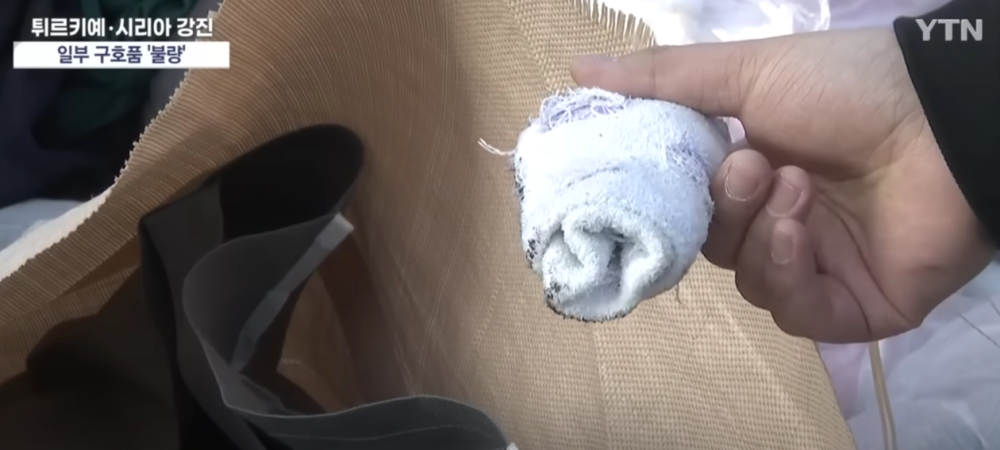

# 韩国民众向土耳其捐赠大量脏衣物、歪嘴水壶，韩媒：影响国家形象

（观察者网讯）据韩国YTN电视台今日（14日）报道，土耳其强震发生后，韩国民众积极向土耳其捐赠救助物资，但近日，一些救助物资中被发现有大量破旧且遍布污渍的衣物和无法使用的旧电器。韩媒称，考虑到脏衣物等影响韩国形象，目前，一些志愿者正在将这些“废弃物”挑拣出来。根据韩媒统计，送来的40吨救助物品中，有10%左右无法使用。

_韩国民众捐赠的部分衣物_

本月11日开始，韩国各地民众捐赠的物品陆续抵达仁川国际机场附近的物流公司，并将运往土耳其。

今天，YTN电视台参观了一家物流公司，一大早，装着快递箱的卡车不断进出物流站，还有当时市民亲自送来救助物品。考虑到土耳其目前仍是冬天，救助物品中包含有大量冬季外套等防寒用品，还有尿布等婴幼儿用品。

然而，记者注意到，胡乱堆放在一处的家电产品中包括一些旧的电风扇、旧电水壶，电水壶的壶嘴处已经歪斜。卫生隐忧加上考虑到这些产品送到当地后可能无法正常使用，负责捐赠的企业计划将这部分产品全部作为“废弃物”处理，不再运往土耳其。

众多衣物也存在相同的问题，一些衣物上存在明显的污渍，有毛衣上面布满了白色的毛球。

有单只鞋子、破袜子，甚至还有人送来了夏天穿的鞋子。

YTN电视台透露，由于担心韩国在土耳其的形象变差，无法使用的物品正在被一件一件挑拣出来。一位在土耳其的韩国留学生也给出了同样的说法，“感谢韩国人寄来了这么多东西，但是其中也有一些当地受灾民众无法使用的东西，必须把它们分拣出来。”

该物流企业介绍，截至目前，送来的救助物品接近40吨，其中10%左右是不能使用的，但也不能一律作为废弃物处理，所以只能暂时堆积起来，但随着时间的推移，如此处理这些产品也成为了摆在企业面前的难题。

有韩国网民指责那些捐赠破旧产品的人太自私，不为受灾民众考虑，只是捐赠了自己不用又不愿意扔掉的东西，还有网民表示，“感觉很羞愧”。

韩媒指出，目前，土耳其大使馆方面希望企业能克制捐赠旧衣物等。

**本文系观察者网独家稿件，未经授权，不得转载。**

