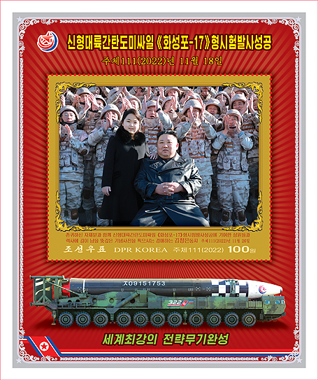
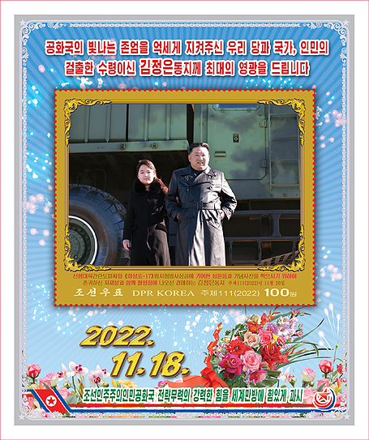
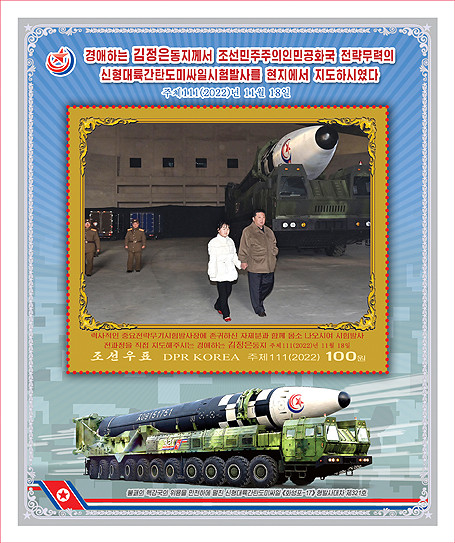

# 韩媒：朝鲜本月17日发行新邮票，金正恩女儿将首次“亮相”

【环球网报道】
据朝鲜邮票社14日消息，朝鲜民主主义人民共和国国家邮票发行局为纪念“火星炮-17”型新型洲际弹道导弹试射成功发行了邮票，发行日期为本月17日。对此，韩联社称，朝鲜劳动党总书记、国务委员长金正恩的女儿将首次“亮相”朝鲜邮票。

韩联社称，朝鲜邮票社公布的8种新邮票的图稿，主要为去年11月18日金正恩现场指导“火星炮-17”型新型洲际弹道导弹时拍摄的照片。金正恩女儿亮相其中的5种邮票，均为与金正恩以导弹为背景，或手牵手并排走，或挽着手臂摆拍，或与人民军士兵合影。其余3种中有2种是导弹照片，还有1种是金正恩照片。

_金正恩偕女儿和在“火星炮-17”型新型洲际弹道导弹试射中作出贡献的人员合影留念。图源：朝鲜邮票社_

_金正恩偕女儿访问武器试射场并指导试射全过程。图源：朝鲜邮票社_

