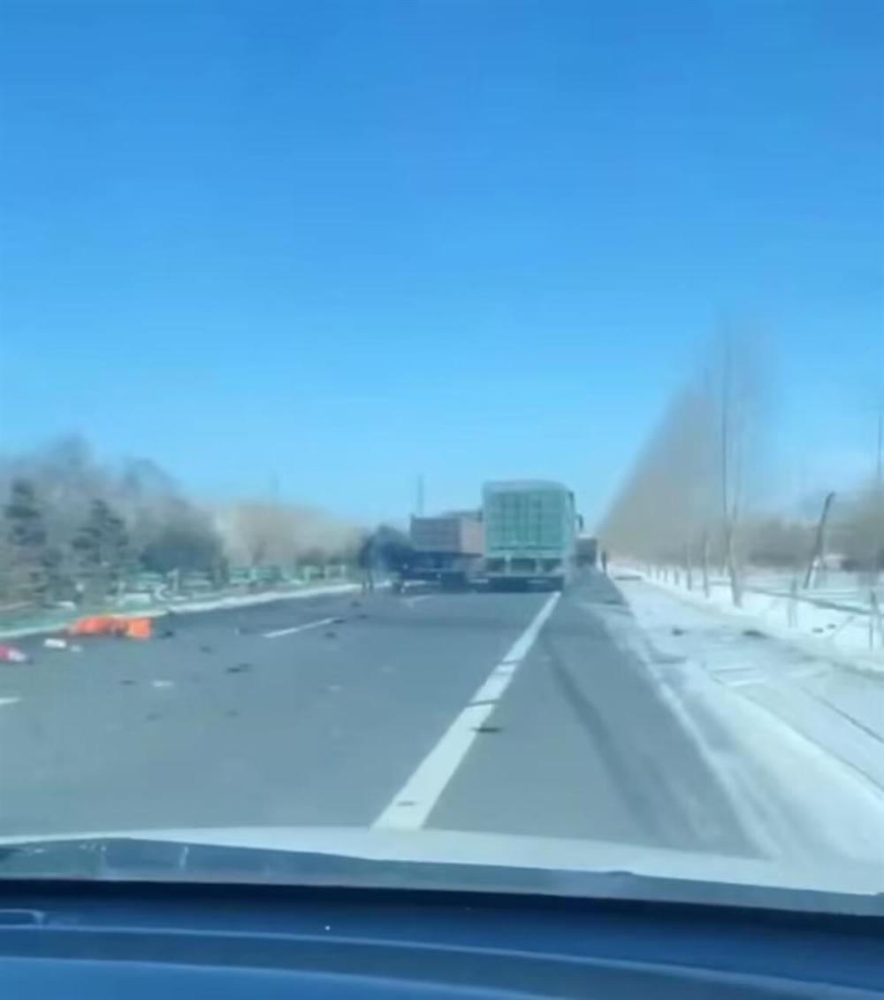
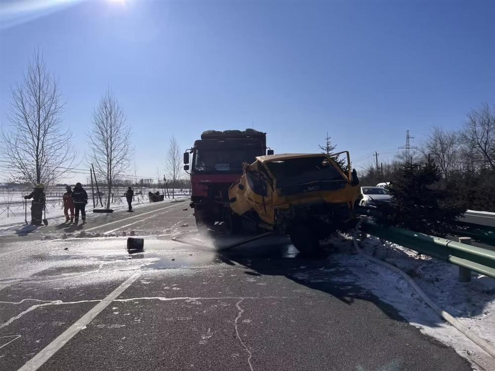
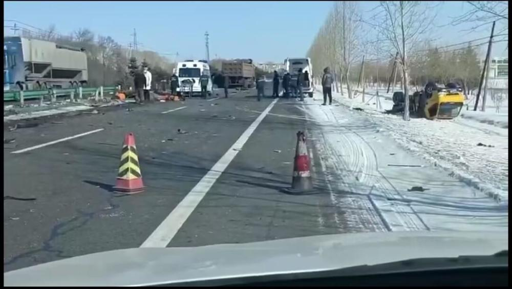

# 黑龙江鹤岗发生严重车祸，多名养路工人不幸身亡

极目新闻记者 刘孝斌 丁伟

2月14日上午，黑龙江省鹤岗市一条公路上发生大型车祸，有车辆被撞翻，多人倒地。有知情者向极目新闻记者证实，事故中有多人不幸身亡。据新京报报道，死者为养路段工人。

网传视频显示，一条双向4车道的公路上，路中间的隔离护栏被撞倒地，隔离带内和路面上均有身穿橘黄色工服的人员躺在地上，路外有积雪，一辆黄颜色的车仰翻在地，前方还有一辆货车停在路上，更前方还有一辆损坏严重的黄颜色车辆。

还有视频显示，有两辆救护车停在公路上，后门打开。有目击者在视频中表示，他现场看到被撞后倒地的人员有好几个。

极目新闻记者了解到，此次事故发生在黑龙江省鹤岗市市区到宝泉岭农垦分局去的公路上，时间是2月14日上午11时许。一位路过市民李进（化名）告诉记者，他中午12时40分左右乘车经过事发现场时，部分道路还处于管制状态。“路上还有被撞的车子零部件，一地狼藉。”李进说，据他目测，事故中可能有人员伤亡。

据百姓关注2月14日下午报道，宝泉岭交警大队称该路段确有事故发生，暂时不能通行，恢复时间还不清楚。另有知情者向极目新闻记者证实，事故中有多人不幸身亡。

14日晚，极目新闻记者多次致电宝泉岭交警大队，电话无人接听。当晚7时30分许，鹤岗前往宝泉岭需经过的北疆收费站工作人员称，目前双向均是正常通行。鹤岗市交警部门的工作人员称，白天的车祸事故现场早已处理完毕，不过其没有透露伤亡情况。

据新京报14日晚报道，事发时一辆翻斗车撞上多名养路段工人，致3名养路段工人死亡，另有5人受伤。

（图片为视频截图）

