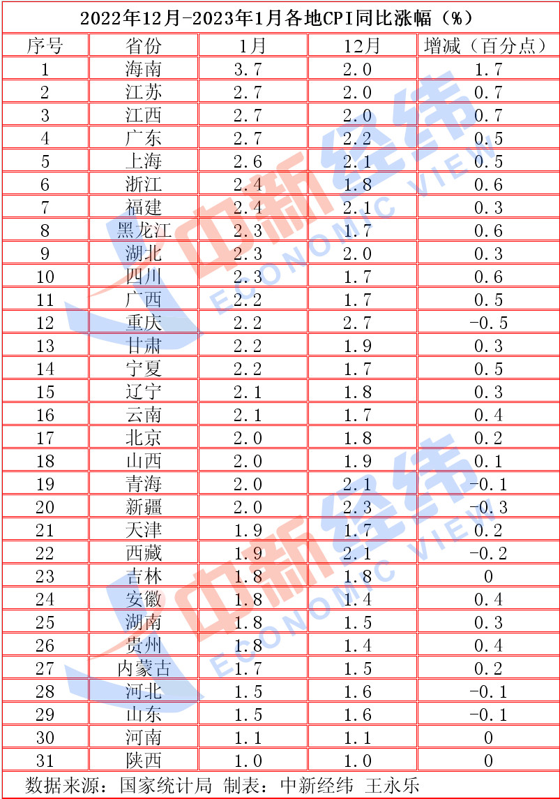

# 31省份1月CPI揭晓：14地涨幅超全国，海南进入“3时代”

中新经纬2月15日电
(王永乐)日前，国家统计局公布了31省份2023年1月居民消费价格指数(CPI)。中新经纬梳理发现，1月，22省份CPI同比涨幅高于上月。其中，海南最高为涨3.7%，陕西最低涨1.0%。

_图源：国家统计局网站_

**22地CPI涨幅扩大**

**海南进入“3时代”**

国家统计局数据显示，2023年1月份，全国CPI环比上涨0.8%，同比上涨2.1%。CPI同比增速上行，再次进入“2时代”，但略低于市场预期。

中新经纬梳理发现，31省份1月CPI同比均为上涨，涨幅高于或低于全国水平的省份分别为14个和15个，均较上年12月增加1个。从涨幅来看，海南等22省份涨幅高于上月，上月有21省份涨幅扩大；3省份与上月持平，上月持平省份也为3个；6省份涨幅低于上月，上月则有7省份涨幅收窄。

具体来看，海南、江苏、江西、广东、上海、浙江、福建、黑龙江、四川、湖北、广西、宁夏、甘肃、重庆等14省份涨幅高于全国水平；云南、辽宁涨幅与全国水平持平；北京、山西、青海、新疆、天津、西藏、安徽、贵州、湖南、吉林、内蒙古、河北、山东、河南、陕西等15省份涨幅低于全国水平，其中天津等11省份处于“1时代”。

另外，从增减幅来看，海南继续居首，增加1.7个百分点，重庆降幅最大为0.5个百分点。

东方金诚首席宏观分析师王青指出，1月猪肉价格环比下跌幅度较大，蔬菜价格大幅上涨，同比由负转正，充分对冲了猪肉价格下跌带来的影响，是推高1月CPI同比涨幅的主要原因。

**未来CPI怎么走？**

消费升温助推CPI上涨，机构普遍预计通胀短期无虞。

王青认为，猪肉收储即将启动，猪肉价格下跌对CPI的下拉作用有望减弱。不过，考虑到上年2月时值春节，菜价基数明显偏高，这意味着今年2月菜价同比将再度转负，并将带动食品CPI同比涨幅收窄。与此同时，上年2月国际油价大幅冲高，高基数下今年2月国内成品油价格同比将显著下行。另外，尽管当前消费修复势头持续，但市场商品和服务供给充足，短期内价格水平上涨空间有限。预计2月CPI同比将在1.9%左右，继续处于温和水平。

西部证券报告也分析称，“春节错位”推高1月CPI，也意味着2月CPI将快速回落。今年消费复苏将带动旅游等服务价格上涨，但当前经济仍处于潜在产出水平之下，预计CPI全面上涨风险不大。

粤开证券报告认为，1月CPI同比可能是上半年通胀的高点，若没有国内外突发的供给冲击，上半年通胀走势大概率将继续保持平稳，不会对货币政策形成紧缩压力，流动性将保持合理充裕。

光大证券首席宏观经济学家高瑞东团队也认为，随着春节效应的结束，以及补偿式消费空间收窄，核心通胀上行速度也会开始放缓。在一季度经历疫后消费脉冲式修复后，后续核心CPI上行高度，仍取决于整体消费复苏的高度，即居民收入恢复的情况。在预期今年消费温和复苏、房地产市场弱复苏的基础上，未来核心CPI同比大概率向疫情前水平逐步靠拢。参考2019年水平，核心CPI同比处在1.5%-2%区间。

平安证券首席经济学家钟正生表示，2023年通胀风险相对可控。一方面，疫情防控政策优化后，我国核心CPI上行风险可能低于海外其他国家。另一方面，“猪油”可能共振下行，也有利于稳定CPI读数。

中国民生银行首席经济学家温彬认为，核心通胀恢复性反弹可期，但“超调反弹”仍有待观察。未来核心通胀更可能保持温和反弹的态势，而随着能源、食品价格在保供稳价政策下保持稳定，预计未来的通胀压力相对有限。

东北证券宏观报告预计，2023年CPI主要拖累将来自于高基数下，猪价和油价的同比回落，主要支撑则来自于旅游服务等消费的修复。叠加基数影响测算，2023年CPI通胀全年大致呈V型走势，7月迎来年内低点，三四季度将趋势上行，但鉴于猪价和油价的拖累，全年CPI通胀高点未必触及3%政策目标。(中新经纬APP)

**(文中观点仅供参考，不构成投资建议，投资有风险，入市需谨慎。)**

**中新经纬版权所有，未经书面授权，任何单位及个人不得转载、摘编以其它方式使用。**

