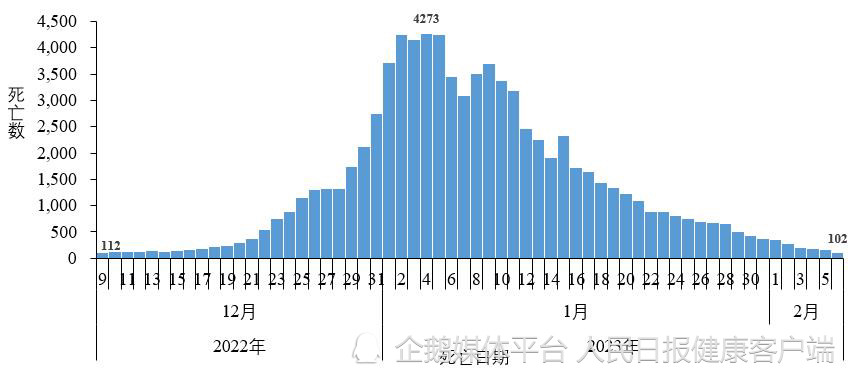

# 中疾控：在院新冠相关死亡病例超8万，阳性及死亡人数呈下降趋势

**人民日报健康客户端 记者 刘静怡**

人民日报健康客户端记者据中国疾病预防控制中心数据统计发现，自中国疾控中心公布数据以来，2022年12月8日至2023年2月9日，累计在院新冠病毒感染相关死亡病例超8万人。2023年以来，我国报告阳性人数及死亡人数呈波动下降趋势。

_1月27日，三亚市人民医院急诊科室内就诊人数寥寥。新华社记者刘邓
摄_

**90%以上为基础疾病合并新冠病毒感染导致病情加重死亡**

人民日报健康客户端记者据中国疾病预防控制中心数据统计，2022年12月8日至2023年2月9日，31个省（自治区、直辖市）和新疆生产建设兵团医疗机构累计在院新冠病毒感染相关死亡病例83150例。

其中，新冠病毒感染导致呼吸功能衰竭死亡6631例，占比约7.97%；基础疾病合并新冠病毒感染导致病情加重死亡76519例，占比约92.02%。

2022年12月9日至2023年2月6日，在院新冠病毒感染死亡病例数于2023年1月4日达到每日峰值4273例，随后持续下降，2月6日下降至102例，较峰值下降97.6%。

_全国在院新冠病毒感染死亡病例变化情况，数据来源于31个省（区、市）及新疆生产建设兵团报告。中国疾病预防控制中心
图_

**阳性人数和阳性率呈波动下降趋势**

2022年12月9日以来，各省份报告人群核酸检测阳性数及阳性率呈现先增加后降低趋势，阳性人数在2022年12月22日达到高峰694万人后波动下降，2023年2月6日降至最低，为0.9万人。

抗原检测阳性数及阳性率同样自2022年12月9日快速上升，在12月22日达高峰，阳性人数达到33.7万人，阳性率为21.3%，随后波动下降，2023年2月6日降至最低，阳性人数为784人，阳性率为0.4%。

**我国主要流行株为BA.5.2.48及BF.7.14**

2022年12月1日至2023年2月6日，全国共报送14515例本土病例新冠病毒基因组有效序列，全部为奥密克戎变异株，共存在31个进化分支。主要流行株为BA.5.2.48，占比为60.9%，其次为BF.7.14，占比达28.3%。

此外，共发现重点关注变异株13例，其中，1例XBB.1，5例BQ.1.1，1例BQ.1.1.17，4例BQ.1.2和2例BQ.1.8。

总体来看，北京、天津和内蒙古以BF.7及其子代分支为优势株；江苏BF.7及其子代分支和BA.5.2及其子代分支基本持平；其他省份均以BA.5.2及其子代分支为优势株。

