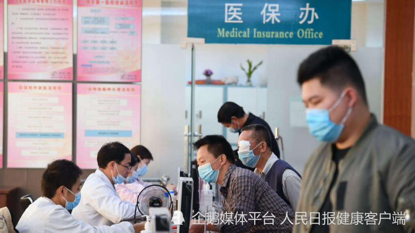
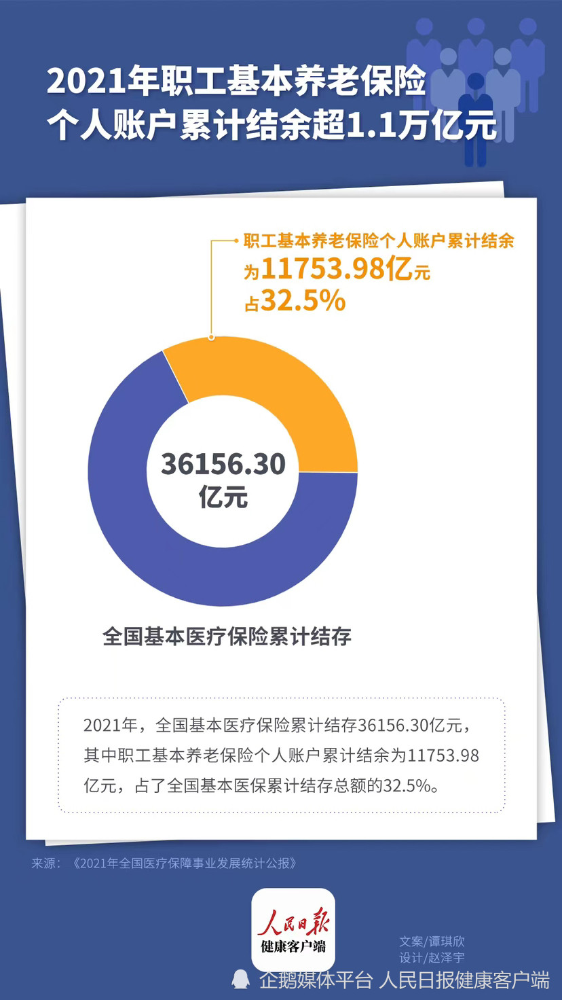

# 五问医保个人账户改革：“缩水”的钱去哪儿了？谁将从中获益？

**健康时报 记者 谭琪欣**

“个人账户里少的钱去哪儿了？”“个人医保账户的钱越改越少，是不是国家医保基金池子没钱了？”近日，江苏、黑龙江、江西等多地陆续启动职工医保个人账户改革，引发热议。

_医院医保业务办理窗口。新华社图_

**个人账户的钱“缩水”多少？**

健康时报记者梳理发现，目前，全国各省份都已就职工医保个人账户改革实施细则发文，不过个人账户划减的要求有别，“缩水”的幅度并不完全一致。

对于在职职工的个人账户，各省份的大体方向基本相同，用人单位缴纳的基本医疗保险费全部（8%）计入统筹资金，即将单位缴纳的8%中原计入个人账户的3.8%也计入统筹账户，而职工个人缴纳的2%仍计入个人账户。

针对退休人员个账的划转方式，部分省份按比例划入，每月向其个人账户划入全省市基本养老金平均水平的2%至3%不等，也有地方如广西、湖南、安徽等，按当地数据测算后采取定额，规定向其每人每月划入70元左右至120元不等。

而此前，退休人员个人账户的划入比例是其个人养老金的5%左右。

**个人账户里少的钱去了哪儿？**

“此次改革的核心关键词是‘权益置换’，即将原划转进医保个人账户的约一半资金，放入大的统筹基金池，共同提高门诊保障水平。”东南大学医疗保险与社会保障研究中心主任、江苏省医疗保险研究会副会长张晓教授向记者介绍，改革后，增加的统筹基金主要用于建立健全门诊共济保障，逐步实现门诊住院待遇水平的统一。

根据《关于建立健全职工基本医疗保险门诊共济保障机制的指导意见》，门诊共济保障将覆盖职工医保全体参保人员，改革后，门诊里多发病、常见病等过去由个人账户直接支付的范围，将纳入医保统筹基金报销，报销比例50%起步，此外，费用高、治疗周期长的疾病门诊费用也将逐步纳入医保统筹基金支付范围。

同时，除了在定点医疗机构就诊，参保人可以持医院外配处方，在定点零售药店结算和购药，符合规定的纳入统筹基金的支付范围，相应的定点零售药店也将纳入。

_医院医保服务窗口，曹建雄摄_

**为何要在此时推行改革？**

“我国的医保体系建立于1998年，设立的初衷是医疗互助共济，无论大病小病都能报销。在过去没有互联网的年代，设立个人账户是为了减少小病小痛报销的审核流程，有了个人账户，参保人遇到小病小痛就可以拿着医保卡自行支付，无需再走审核流程，而与之对应的，则是门诊疾病不纳入报销范围，因为个人账户就是用来支付这部分费用的。”张晓告诉记者。

据《2021年全国医疗保障事业发展统计公报》，
2021年，全国基本医疗保险累计结存36156.30亿元，其中职工基本养老保险个人账户累计结余为11753.98亿元，占了全国基本医保累计结存总额的32.5%,且呈现每年递增的趋势。

随着医保个人账户的资金积累越来越多，问题逐渐显现。

“医保个人账户资金个人无需使用时，别人也用不了，真正需要门诊医疗保障的人群得不到更好的保障，这笔资金积累越来越多，并不利于医疗保障的效率提高。而与此同时，统筹账户的资金过少，这直接导致医保的报销范围和报销金额都受到了极大的局限，大病的保障水平不能得到有效提高。”
张晓解释，此次改革的目标就是为了解决此前参保职工“有病的不够花，没病的用不了”的问题，把有限的资金盘活了，用在真正需要的患者身上，改革后统筹基金会加强，互助共济保障会更充分。

在张晓看来，“每个人都有年老和生病的时候，疾病带来的经济风险是会长期存在的，到年老多病时，靠医保个人账户和个人积累总是有限的，共济保障才是解决问题的关键。”

**改革后参保人亏了吗？**

“个人账户新计入的减少并不意味着整体保障功能降低，反而从制度上来说，共济保障更具有风险防范功能。”2021年4月，国家医保局原副局长陈金甫在新闻发布会上表示，改革个人账户，不是取消个人账户，而是调整个人账户的计入比例，通过制度的转换，建立、扩大、健全、增强门诊共济保障制度。减少了部分并不意味着个人的保障会损失，而是放到了共济保障的大池子里，形成了新的保障机制，这个新的保障机制总体上基金平衡转移，保障效能显著放大。

广东省医保局也就当地政策算了一笔账。以广州市为例，门诊共济改革实施后的12月，广州市第一人民医院共惠及2.7万参保人，人均报销金额从原来的150元增加到380元，报销比例增加153%。

今年58岁的广州退休职工李华（化名），2022年11月因呼吸有啰音，到广州市第一人民医院门诊就医，做了肺部CT，总医疗费用480多元。当时CT、MRI等项目还未纳入门诊统筹，李华需要全额自付。

而最近，她“阳康”后又到医院做CT，发现同样的项目，自己只给了140元，统筹基金支付了70%。

**谁是这场改革的最大受益者？**

“从个人账户改革政策目标和制度长远发展来看，参保人群均会从这次改革中普遍获益，特别是那些罹患慢、特病的参保职工、退休人员群体，其获益是远超个人账户减计额度的，因为共济保障的结果往往会是减计数百元个人账户，但会报销千余元甚至数千元费用，实现政策调整改革的真正作用。”张晓表示。

记者梳理发现，各地具体的改革方案中，往往对退休人员有所倾斜。

比如，四川在职职工起付线200元，退休人员起付线150元，报销比例方面，在职职工在二级及以下医疗机构报销60%，三级医疗机构报销50%，退休人员相应提高10个百分点。在最高支付限额层面，在职职工年度支付限额2000元，退休人员2500元。

2021年4月，国家医疗保障局待遇保障司负责人樊卫东于新闻发布会上表示，“初步估算，这一项制度可以为退休人员减轻门诊费用负担近1000亿元。”

