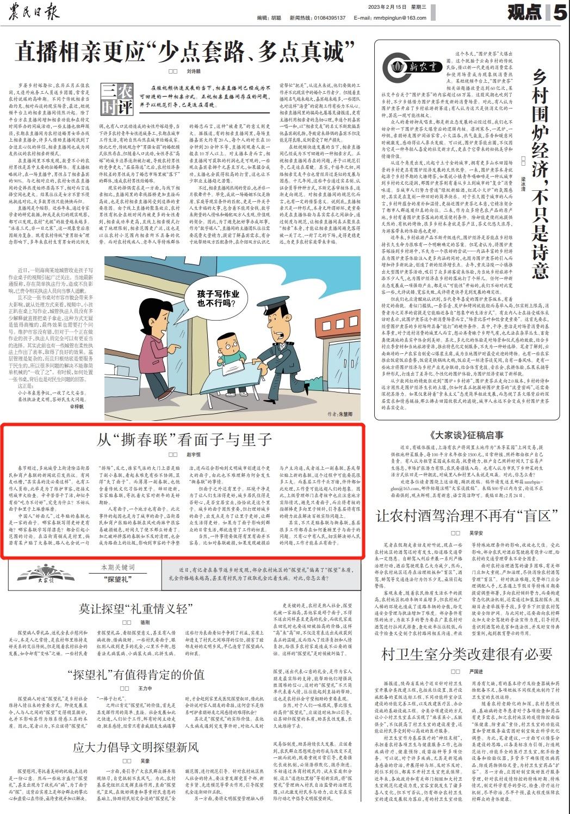

# 农民日报评：从“撕春联”看面子与里子

春节刚过，多地城管上街清除沿街居民和商户春联的新闻就引发热议。有网友吐槽，“其实真的没必要这样”。也有工作人员称，此举是为了维护市容，迎接文明城市大检查。辛辛苦苦干了活，却似乎有些“吃力不讨好”，究竟为什么？不妨从面子和里子上琢磨琢磨。

中国人“好面儿”，过年贴的春联也是一家的面子。哪家春联写得更好更有趣？哪家春联字写得漂亮？都会引起小范围的讨论。在沿街商铺或是村里，倘若有某户贴了大春联，路人也会说一句“排场”，反之，谁家气派的大门上若是贴了副小春联，看起来难免有些不协调，显得“失了面子”。而薄薄一副春联，也饱含着传统文化习俗的里子。辞旧迎新，家家贴春联，寄托着大家对新年的美好期盼。

人有面子，一个地方也有面子。此次事件的起因也是为了城市的面子，沿街居民和商户张贴的春联在风吹雨淋中很容易破损褪色，时间久了便不那么好看了。加之破碎掉落的春联如不及时清理，也会成为路面上的垃圾，影响到市容的干净整洁，进而还会影响到文明城市创建这个更大的面子，由此也不难理解为何会发生“撕春联”的事情。

但面子之外还有里子。环境干净是为了让人们生活得更好，城乡居民住得是否舒心，是否宜居宜业，恰恰就是这个里子。城乡的面子固然重要，但打理好城乡的面子，出发点是为了让里子更好，让群众生活得更好。如果为了面子影响到群众的日常生活，那就违背了工作的初衷。

当然，一件事情要做得有里有面并不容易。比如对春联破损，如果发现破损后与户主沟通，或者送上一副春联，甚或帮忙贴上新的春联，这个过程中可能要花很多工夫。而基层工作千头万绪，件件都如此处理，工作量可能远超人们的想象。因此，上级管理部门在考核中也应注意地方实际情况，避免只看面子，而应将考核的指挥棒更多向里子倾斜，引导基层将有限的精力放在解决百姓实际问题上。

其实，不只是贴春联与撕春联，基层很多工作都存在如何兼顾里子与面子的问题。只有心中有人民，切实解决好人民的问题，工作才能真正有面子。

