# 又一位，走了！93岁传奇女植物学家离世，生前被称“长了一颗老虎胆”

再多干两年

在抗原检测出阳性的前一个工作日，93岁的植物学家李恒还在照常上班。昆明植物研究所坐落于元宝山，早上8点，这位头发花白的老太太便从山脚的家里出发，不用拐杖，不要人扶，一步一步前进，半小时内抵达那间位于山顶的办公室。

作为昆植所里年纪最大、加班最狠、唯一一位退休后仍保有办公室的研究员，她每天都要工作到凌晨1点以后，有时凌晨3点还能收到她的邮件回复，以及朋友圈点赞。到了周五晚上，她放心地加班到凌晨4、5点——第二天是周末，不用早起。昆植所的36个保安都熟悉这位老太太，等她凌晨最后一个下班，值班保安就开着巡逻车送她回家。

在昆植所，一提老太太，人人都知道特指李恒。不仅因为她成就斐然——出版了44部专著，参与过超过5000万字的《中国植物志》的编研工作，发现了100多个植物新种，被国际天南星学会授予最高奖“H.W.Schott奖”——还因为她在整个学术生涯中，做了许多超出人们想象的冒险工作。她每年都会出野外考察，50多年来每年平均天数是100天，61岁的时候带着马队深入人迹罕至的高黎贡山，爬过大树、滚过雪山、坠过马、得过疟疾，70多岁时还作为负责人组织了高黎贡山大型野外考察，几次考察结束后直接进了医院。

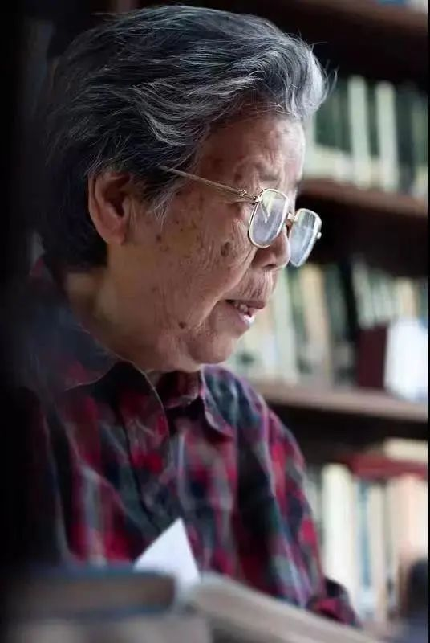

_李恒_

89岁那年，老太太摔了一跤，挺严重的，但她照样上班。直到一位细心的女同事发现，她的脚踝肿到鞋子都塞不进去了，有下肢静脉血栓的风险，李恒这才进了医院。这一年，一位比她小9岁的自然文学作家（就是说也80岁了）和她约好一起去参观重楼种植地。但台风“山竹”突然席卷，一路上山路崎岖，往返开车要8个小时，他以为会延期，结果老太太如期来接他，“别听他们瞎咋呼什么强台风……真下雨了，我把你们挨个儿背下去！”

李恒九十大寿那天，一位90后学生打来问候电话。电话里，老太太说这年准备春天去轿子雪山，秋天去碧罗雪山和高黎贡山。全都是海拔4000米以上的。学生听完表示服气。就在这年去高黎贡山的路上，遇到了轻度的山体滑坡，砂石哗啦往下掉，这位强悍过人的老太太淡定地对司机说，“冲过去。”

退休后，李恒每年还要和昆植所的在职员工一样写年终总结，哪些不足，哪些展望。几年前所里开会，请她上台讲话，老太太一语惊人，“呼吁大家绝不躺平！”台下有人连这个词都没听过。大家愣了一会儿，接着掌声雷动。

2019年，当90岁的李恒听说，她的好朋友、80岁的曾孝濂，这位“中国植物画第一人”检查出了恶性肿瘤，准备去北京做手术时，她让同事张全星开车载去他家。

一进门，没有寒暄，没有慰问，李恒对曾孝濂说，“我有个东西，你得赶紧给我画，你看你还没走。”陪同在旁的张全星感到不可思议，“我想怎么说得出这种话，人家是去做手术啊，回不回得来都不知道。”

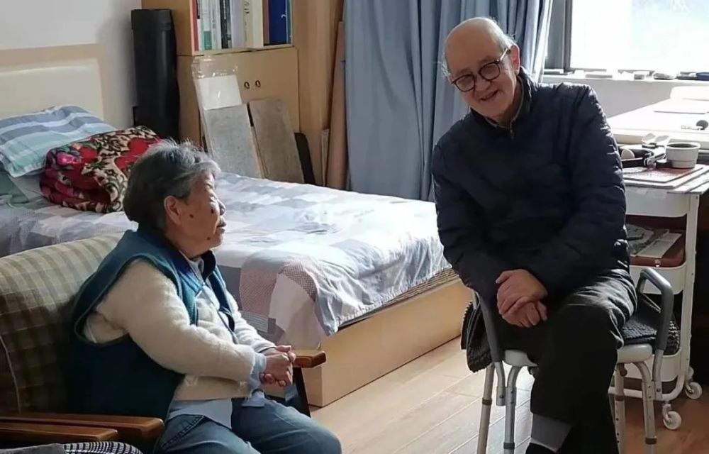

_李恒和曾孝濂_

“你要画什么东西？”曾孝濂并不诧异（“李恒要是讲客套，她就不是李恒了”），当他得知，这是李恒即将投稿给《Nature》的论文上的插画，立马就答应了（遗憾的是投稿失败转投了其他杂志）。整个昆明植物研究所，至今没有人在《Nature》这样的世界顶级期刊上发表过论文。

“我必须要支持她！”曾孝濂在电话里说。在住进医院的前两天，他完成了画作，把画快递给了在昆明等待的李恒。

“我们这一辈的人都是这样过来的，生死看得很淡，还是手上这个工作更重要。”李恒后来向张全星解释道。

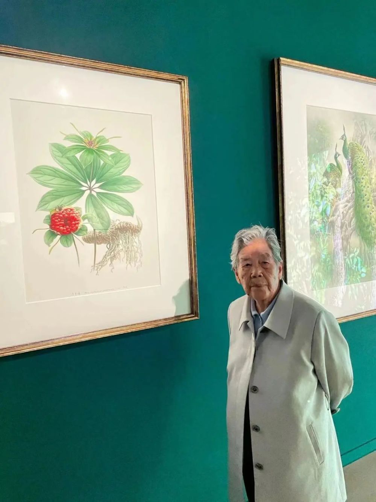

_李恒和曾孝濂合作的滇重楼_

去年11月，在昆植所食堂门前，李恒、曾孝濂，以及曾经昆植所所长、中国科学院院士孙汉董三人偶遇了。作为所里最著名的、还健在的三位老人（一位93岁，两位83岁），他们难得凑一块聊天，就愉快地合了一张影，临别前还达成共识：身体好好的，再多干两年。

但仅一个多月后，李恒确诊了新冠，腹泻不止，送去医院当天就住进ICU。在这前一天，她仍坐在家里的电脑桌前工作，像过往的每一天一样，用红笔在台历上对这一天做了记录——多云，阵雨，4~9℃，腹泻，没有恶化。那是她在台历上最后的笔迹。一切来得太过突然。李恒住院三个多星期，呼吸机插管，无法说话，不能探视，一声告别都来不及说，就因脏器衰竭，在今年1月12日下午5点离世。

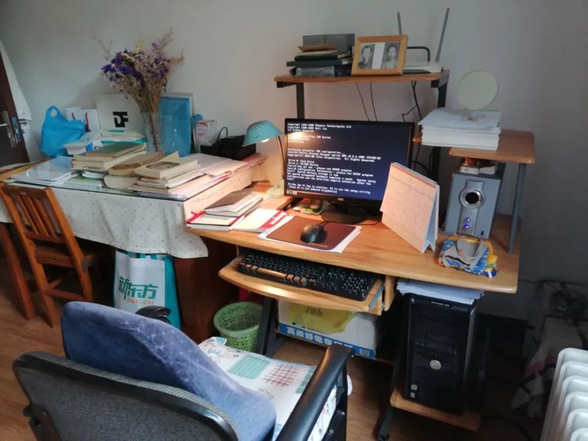

_工作的电脑桌_

有一颗老虎的胆

作为一位有着传奇色彩的植物学家，李恒的传奇经历开始得很晚。直到快60岁退休，她在昆植所里仍是一名副研究员，那些让人目瞪口呆的植物学冒险之旅还没有展开。她是半路入门，年轻时本是一名俄语翻译，32岁随丈夫从北京调任昆植所后，才开始转向植物学，又赶上十年“文革”，等到第一篇论文发表时，她已经47岁。

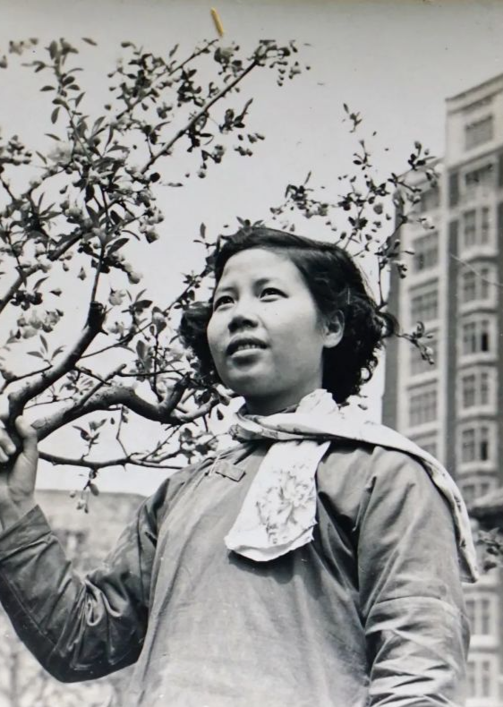

岁月当然蹉跎了，但对于当时这位还默默无闻的研究员，凡是蹉跎的，都成了内心积攒的火焰。李恒的硕士研究生、如今的中央民族大学教授龙春林记得，57岁的李恒给他的第一印象是：一位抽烟的女知识分子，这在当时既罕见，又霸气。

无论身在何处，李恒都是一个刚强之人。“文革”时，她被关进过“牛棚”。“打得满嘴鲜血，她头发一甩，就那样。”儿子王群路回忆道。当时昆植所停止了所有工作，时任所长吴征镒成了“牛棚”里的头号走资派。在那些没有自由、饱受屈辱的日子里，李恒就跟在吴征镒后头，认全了昆植所周围全部的杂草。吴征镒是天才型的植物学者，他可以一边烧开水炉，一边在碎纸条上凭记忆力写植物学著作。后来昆植所恢复工作，吴征镒作为《中国植物志》的主编，让李恒负责了其中几个科。

理论上，李恒会在60岁时退休。但在她退休前两年，1987年，吴征镒负责的全国第一号重大基金项目“中国种子植物区系研究”启动，项目分解成多个子课题，其中最难的两个课题之一是独龙江区系考察，李恒接下了它。

独龙江是云南省贡山县的一个乡，在独龙江和贡山县城之间，横亘着海拔4000米的高黎贡山。对一个区系的研究，需要有完整一年的考察。此前有过多次独龙江的夏季考察，但从未有植物学家在冬天进过独龙江。每年11月到次年6月，高黎贡山大雪封山，唯一一条可以进独龙江的路也被阻隔。而李恒要做的，便是史上第一次、长达8个月的独龙江越冬考察。

“吴先生把这两个硬骨头拿出来之后，她就义不容辞地把这个任务给接下来了，李老师当时跟我说，‘这不是我去做还能谁做？’她有一种豪气在里边。”龙春林说。

为了进独龙江，李恒光准备物资就花了2年。做标本用的大量报纸和木炭，各种食物和作料，一包菜籽（当地没有青菜），几箱蜡烛（唯一的照明工具），两百条烟和酒（当地硬通货），以及运输物资的马匹——整个贡山县只有十几匹，而李恒最终找来64匹。“两年了好多人都写了文章，我还没有去。”对此行，李恒后来有过回忆。

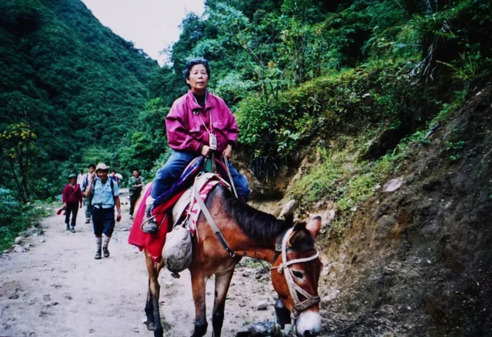

但就在出发去独龙江的前两天，李恒的丈夫、昆植所的园林设计师王今维突然病重，医院下了病危通知书。当时所里的领导建议李恒，不要去独龙江了，留下来陪一陪丈夫吧。

李恒拒绝了。“我在也不能让他好起来。”

儿子王群路当时完全不能理解母亲的决定，“这个家就丢给我和我姐姐，她就走了。”

对那时已经61岁的李恒来说，某种意义上，她过去所做的努力，都是为了此刻。她靠着母亲和妹妹做手工活挣钱，才得以读书，从一名中科院图书馆的办事员，拼了命地成了中科院专家处的俄语翻译。在一场翻译比赛里，她24小时接连不断地翻，比赛结束，手抖到连字也写不了。没多久中苏关系恶化，她的俄语没了用处，又从一名随夫南下的家庭妇女，拼了命地成了一名植物学家。现在到了退休前最后一项也最重要的工作，她无论如何都要拼到最后。

1990年10月29日，李恒和一个研究生、一个绘图师、一个派出所所长、64匹驮物资的马一起出发了。如同要上战场一样，她连遗书都提前写好了。

进独龙江的山路要走上三天。第三天从东向西，翻越3840米的高山。马队一路上穿过了常绿阔叶林、野核桃林、石橼、杜鹃矮林，抵达山脊处的风雪垭口，这里山势陡峭，如同鬼门关。在最为艰险的路段，他们偶遇了一位独龙族男子。看着队伍里唯一的女士，年过花甲、身形瘦弱的李恒，他表示从没见过像她这么年长的女性要翻山进独龙江。他对李恒说了一句独龙语，“你长了一颗老虎的胆。”

_1990年在独龙江走藤条吊桥过江_

山中无岁月，考察队沿着雪线采集标本，而雪线每天都在变化。高黎贡山的一天有四季。这里垂直高差4000米，山谷下雨，山顶下雪。晴天是这里的稀缺品，到了雨季，一个月有时只有4个晴天。他们扎营在山里，帐篷半夜也会被雨水淹没。

野生动物随时来访，黑熊、扭角羚、猫一样大的老鼠，还有响尾蛇，在500米内，李恒曾经碰到了72条。但艰险之外，对于植物学家，这里同样是一片迷人之境，40万公顷的山野之间，人迹罕至，但白垩纪时代就存在的秃杉林却在这繁衍了上亿年，这里还有世间罕见的大树杜鹃——几万朵红色的花盛开在几十米高的大树上，如同漂浮的红云。

8个月的独龙江越冬考察结束后，带着装在86个箱子里的3万份标本，考察队整整走了四天。第三天，李恒从马背上摔了下来，当即昏迷。醒来后，她的身体不能动弹，整个人趴在马背上，每颠一下就剧痛难忍。抵达贡山县城后，她没有去医院，而是去给县政府做报告，说这趟考察收获极大，请他们务必要好好保护当地生态。直到几天后回到昆明，去医院拍片，李恒才发现自己断了三根肋骨。

李恒没有住院，而是要了几张膏药，就回昆植所鉴定标本。标本室里，她僵直地站着或坐着，在显微镜下检视那些得之不易的标本，久而久之，她感觉肋骨愈合，活动自如。但6个月后，她突然咳出了血，医院的检查结果是，她吸入过量标本里的杀虫剂，中毒致血管破裂。

她的手机就挂在脖子上

透过那86箱来自独龙江的植物标本，李恒第一次读取出了独龙江的历史。千万年前，独龙江所在的地壳板块位于热带地区。在一次剧烈的地壳变动后，它向北推进了450千米，从热带来到了温带。造物的奇迹在此时显现。热带植物渐渐和温带植物融合，产生了许多新种和变种，这里植物的丰富程度，几乎涵盖了从海南到东北的所有植被。

一片全新的广阔天地，在李恒退休以后徐徐展开。1996年起，67岁的李恒重新率队，这次她带上了包括全球多个国家的科学团队，对高黎贡山进行了20多次、长达11年的大规模考察。根据她的考察日志，她在野外考察最久的一年有200多天。最后一次大规模考察结束时，她已经78岁。

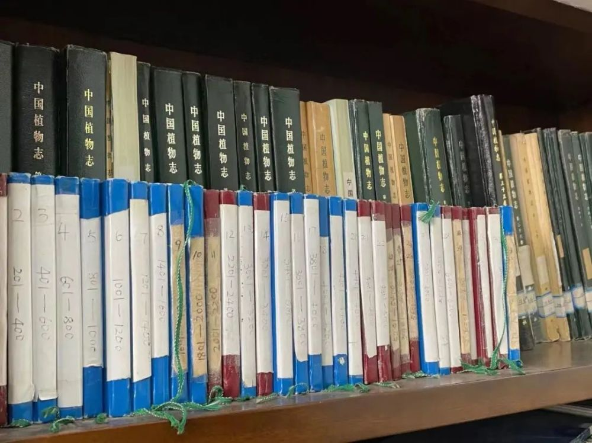

_李恒的野外考察笔记_

在野外，李恒有一种令人胆寒的魄力。去独龙江越冬考察时，李恒被马鹿虱子咬了，这是一种毒虫，咬上之后，头会埋进人的肉里。她先用盐巴搓死了马鹿虱子，用刀片划开了伤口，将它的尸体从她的肉里取了出来。那期间，李恒还染上了疟疾，高烧不退，一个星期都下不来床。当时他们才来独龙江两个月，昆植所的领导就来电让他们赶紧撤回昆明。李恒的回复是，“行前不是已写了遗嘱？”

一到野外，李恒就像一颗高度敏锐的植物雷达。一次她被一只躲在树叶后面吃东西的猴子吸引，再仔细一看，猴子藏身的树叶有点特别，不知哪来的力气，当时三四十岁的李恒猛地爬到了10多米高的树上，由此发现了她人生中第一个天南星科新种，绿春崖角藤。当她已经73岁，主持高黎贡山考察时，野外登高爬低采集标本的活儿大部分交给了团队，但一次她去给学生送食物，突然就在这帮学生每天进进出出的帐篷外面发现了天南星科新种，丹朱南星。

第一次独龙江越冬考察回来后，龙春林发现，李恒开始关注、谈论各种社会问题。过去她更多只关心自己工作中的一亩三分田，现在遇到谁她都会讲一讲高黎贡山的贫困问题，医疗资源匮乏，教育资源匮乏，交通闭塞等等。“她会有意识地说这些事情，然后也会努力去做，这个是一个很大的改变。”

1990年李恒进独龙江时，那里还像一个原始社会，以物换物，对钱没有概念。他们给李恒一只鸡，李恒给他们20块钱，钱当场成了擤鼻涕的面巾纸。李恒听不懂独龙语，但能感受他们待客的热情。她曾在多年前一次采访中提到，“我在山上采标本，知道我要来，我进去的时候，他们人不在，但是火塘边鸡蛋已经煮好了，皮都剥掉了。”李恒感激他们，但她并不浪漫化所谓边民的生活。当地人太爱喝酒，成天醉醺醺，有的人酒精中毒，“我觉得这个是最值得忧虑的。”聊起当地的教育，她也非常担忧，“里面大部分人都不读书，甚至乡长的、教师的孩子也不读书。”

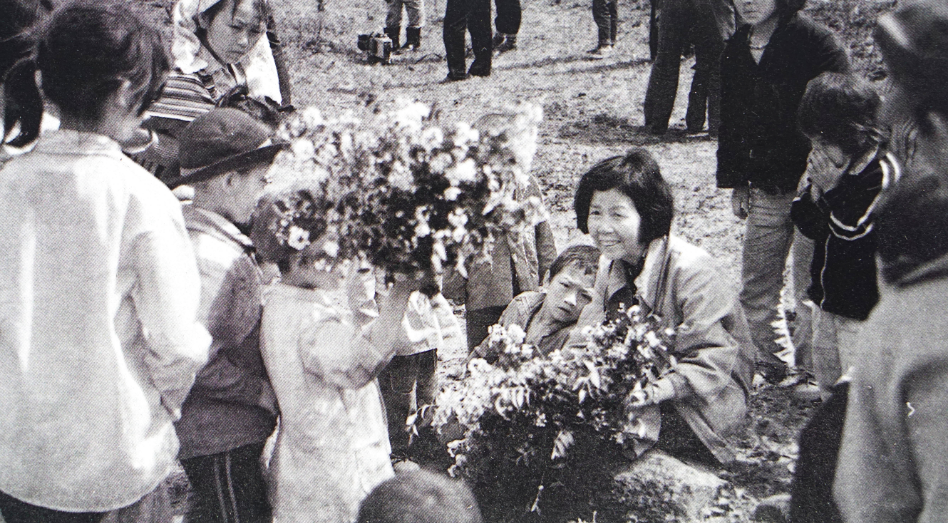

_独龙江越冬考察结束那天，当地孩子给李恒送花_

去年12月初，张全星去高黎贡山出差，从当地官员那里第一次听说了一件有关李恒的事。当年独龙江越冬考察回来后，项目成果在1995年获得了中国科学院自然科学奖一等奖，奖金两万元。李恒把这笔钱捐给了独龙江当地的学校，还和一位女企业家联合捐助了44名独龙江失学女童。但这件事情，李恒几乎没有声张过。

晚年，作为出版过重楼属植物专著的专家，李恒经常到现场指导种植户种重楼。重楼是云南白药的主要成分，但事实上，只有重楼属里的滇重楼和七叶一枝花才是有用的。很多种植户不懂，乱种，经常白费力气，又亏了钱。李恒为此在2016年写了一本重楼种植手册，免费分发给种植户。很多种植户都有她的手机号，她的手机就挂在脖子上，任何人打来电话她都会接。

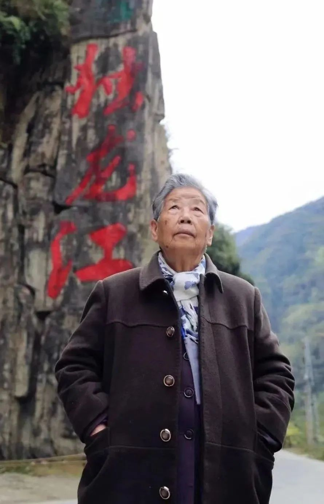

“好好休息，永动机该停了。”

李恒的葬礼非常简朴，没有遗体告别仪式，直接就在公墓落葬。老太太最讨厌大张旗鼓，更不想在疫情紧张时期给大伙添麻烦。公墓坐落在附近山上，在那里可以俯瞰整个昆明植物研究所，那个她为之工作了60多年的地方。

“好好休息，永动机该停了。”站在墓前，69岁的王群路对工作了一辈子的母亲说。他从2014年退休起，就变成李恒的“王大秘书”，无论出差还是开会，他都陪在母亲左右。父亲去世后，一直是他在给独居的李恒做好每天的饭菜，帮忙打扫家里卫生。

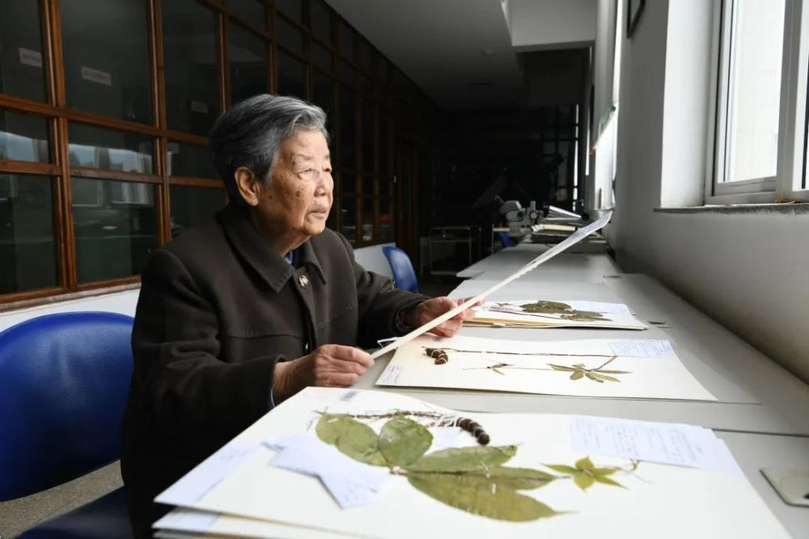

作为儿子，王群路并非没有怨言。自打记事，他就知道母亲是一个工作狂，不会做饭，不做家务，从来没参加过他小学的家长会。因为“文革”，王群路只读到小学四年级，又因为家庭成分不好，他当年被分配了一个最苦最累的工作，铸造车间里的清砂工。他在这个岗位干了8年，每天到家洗澡，水都是黑的。他向母亲抱怨过工作的辛苦，李恒却说，“人家能干你也应该干。”

在昆植所研究员罗吉凤眼里，晚年的李恒不再只是一个工作狂，“80岁以后才感觉她是那种有血有肉的老太太。”在这之前，她一心扑在工作上，也要求学生像她一样，谁要是提前下班去接孩子放学，老太太准要数落几句。现在老太太会对学生说，工作缺了谁都能做，得好好陪伴家人。罗吉凤猜测，是丈夫王今维的离世，才让她有了这么大的转变。

王今维离世前，依然是儿子王群路在医院照护。那年李恒已经79岁，工作忙到周末也在昆植所的办公室里度过。但自丈夫去世后，李恒主动放弃了周末在办公室的加班时间。每到周六，她就到儿子家里住，和孙辈们待在一起，周日晚上再回自个家——当然，工作照样要做，王群路家里有一台她的专属电脑。尽管很少表露自己的感情，但有一次李恒告诉儿子，每天从家走到办公室的路上，她会刻意在王今维题写的“标本馆”石碑旁驻足，那种感觉就像他还在身边一样。

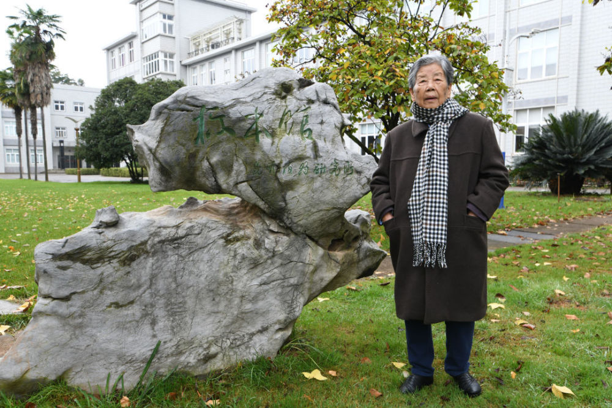

_李恒与丈夫王今维题写的“标本馆”石碑_

曾孝濂也是王今维的朋友。他说，对于李恒当年在王今维病危时，依然选择去独龙江，“王公心里很明白，应该成全她。”“她就是个亡命徒，为了自己钟爱的事业，她可以不要命……某种程度上，她是一个很孤独的人。这个孤独是一个有层次的孤独，因为知识的积累是在孤独当中升华的，思考问题在孤独当中效率最高，要保证科研的时间，她就必须要孤独。而跟李恒相处，要理解她很不容易。”

人生最后三十年，李恒都在拼命考察，研究，写书。最后一本书是出版于2020年12月、多达150万字的《高黎贡山植物资源与区系地理》。和李恒一起合著此书的是她的学生、昆植所研究员李嵘。在李恒住院的前两个星期，她兴奋地告诉李嵘，对高黎贡山植物区系的分析她又多了一点新认识。李嵘说，李恒生前仍在写一本关于高黎贡山的书，上一本只是对高黎贡山的植物多样性做了记载和罗列，而这本书是对高黎贡山更深入的分析，如今书已经写了100万字。

李嵘曾经问过李恒，她是不是真的对植物分类学感兴趣？“她给我的回答就是，在他们那个动荡的年代，能有份工作，有给吃饭，已经不错了，没想那么多。”她被命运牵着走，但也不完全屈从于命运。“用她的话来说，‘我干上它，我就喜欢它，就努力去做好它。’”

在李恒的学生里，和她最像的一个可能是龙春林。当然不是个性，今年59岁的龙春林待人极为温和，而是同样一颗事业心。33岁时，他已经是昆植所的研究员，在李恒所有学生里最早评上正高职称。但因为工作太狠，事情不干完就不吃饭、不上厕所，每天熬到凌晨，办公室里堆满方便面，大概20年前，他就已经腰椎间盘突出，动过手术。前几年又动了一次手术，手术不成功，导致他左脚神经受损。“现在我其实是非常非常难受的。”但和我打电话时，龙春林依然在外地出差。“很多人劝我，都快退休的人了，也都功成名就了，不需要这么拼命了。我跟他们说，如果我休息下来，我可能会短命的。我老师就是这样。”

89岁那年摔过一跤后，王群路雇了一个住家保姆陪着她。保姆50来岁，小学文化，每天陪李恒上下班的一路，老太太要教她认植物，第二天考她，说不出来就要被骂。起初保姆也郁闷。李恒在家还要让她抄写唐诗。但渐渐地，她认得出路上的植物，也觉得自己写的字挺好看。

前两年为了锻炼身体，晚饭过后，年过90的李恒就会换上跑鞋，让保姆陪她到昆植所在的山上溜达一圈——当然她绝不允许被扶着走，哪怕下雨天，保姆顶多只能给她撑个伞——一圈走下来有1.7公里，有的路段连个路灯都没有。

去年夏天，曾孝濂去山上采标本，路上碰见了李恒，告诉她要去采漾濞槭。那是一种在野外即将灭绝的植物，有人工种植，就在昆植所最高、最远的山头上。

到了晚上10点，李恒突然去曾孝濂家敲门，手里还拿着两三个漾濞槭的果实，绿色的果实有两个翅膀，挂起来一串串的。

曾孝濂很感动，但也吓坏了。当时天早黑了，93岁的李恒居然在山里高一脚低一脚地采标本，“你要是磕磕碰碰摔一跤，我怎么担待得起。”

“刚刚9点多钟才采到，你看，这是很完整的。”曾孝濂还记得老友手拿植物的样子。

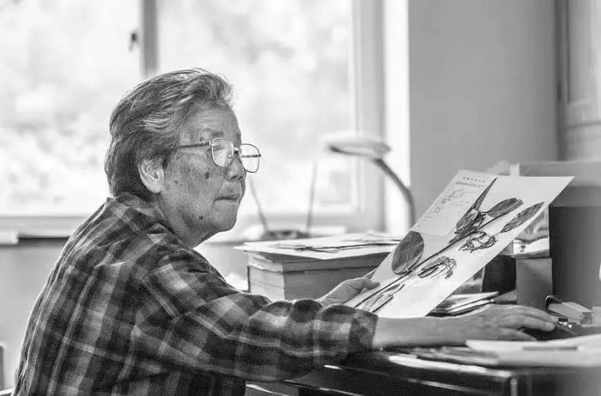

◦ 所有图片均来自受访对象。感谢纪运恒、马政旭、李一凡、孙军、张文香提供帮助。

撰文丨李婷婷 编辑丨张瑞 出品丨腾讯新闻 谷雨工作室

版权声明：腾讯新闻出品内容，未经授权，不得复制和转载，否则将追究法律责任。

