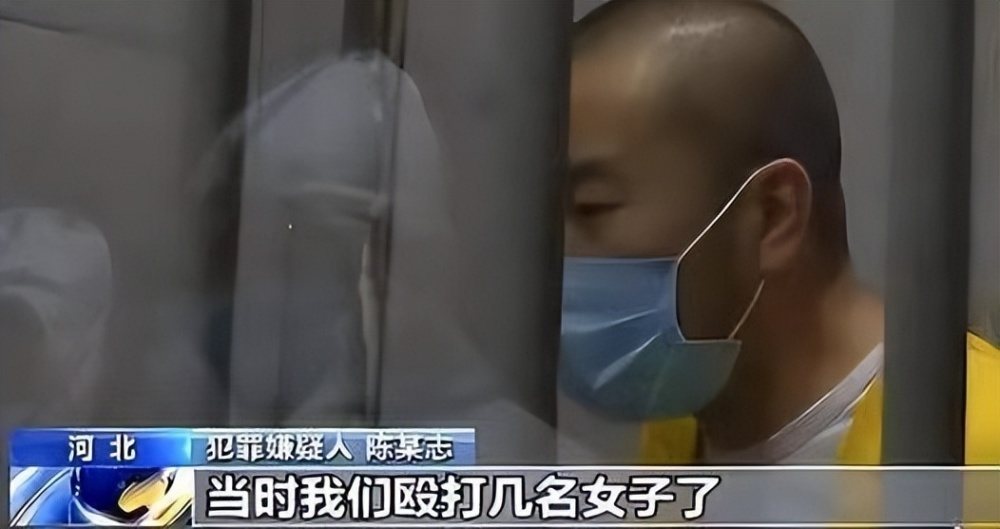
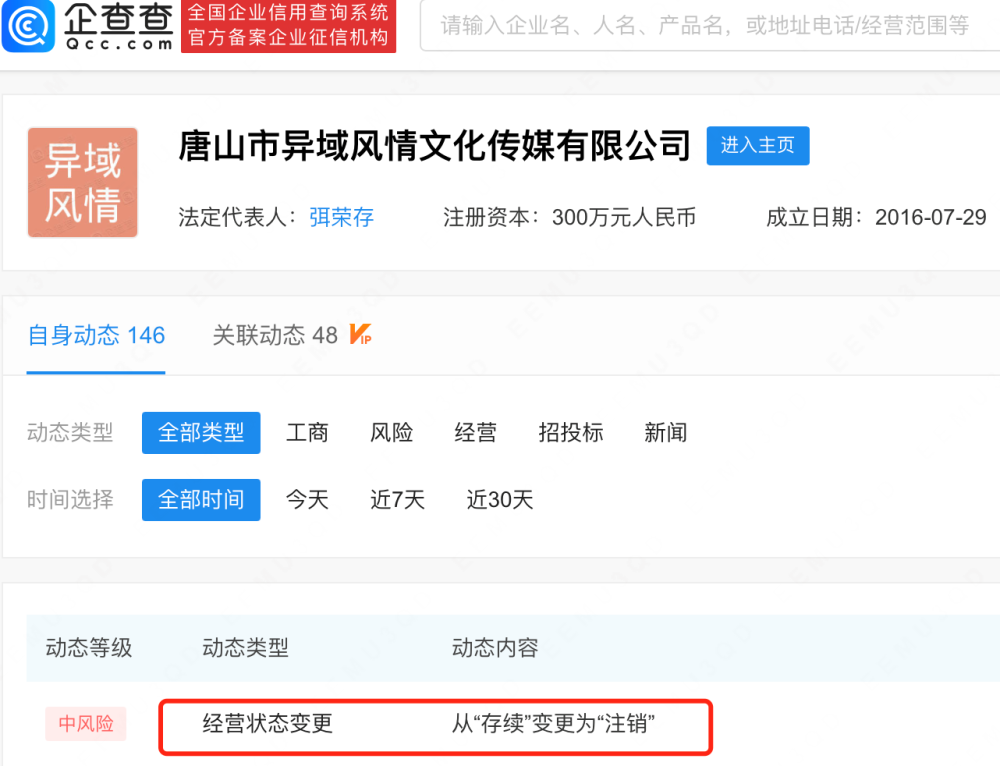
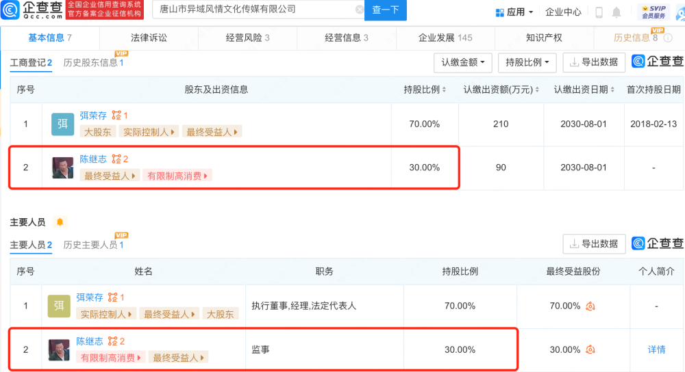
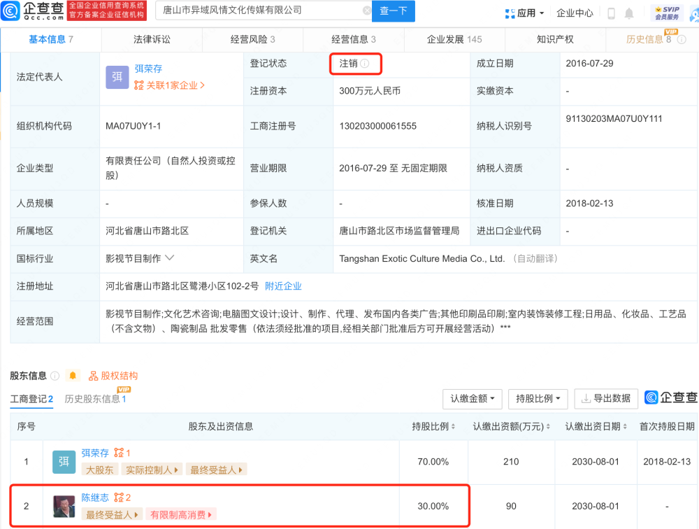

# 唐山打人者陈继志名下公司注销

**相关报道** ：唐山打人案一审公开宣判，主犯陈继志犯8项罪获刑24年

2月15日，据企查查APP显示，近日，唐山市异域风情文化传媒有限公司经营状态由存续变更为注销，注销原因为决议解散。企查查信息显示，该公司成立于2016年，注册资本300万元人民币，由陈继志持股30%并担任监事职位。目前，陈继志名下关联的2家公司均已被注销或吊销。此前，唐山打人事件引发舆论高度关注，陈继志等多名主要人员被捕，陈继志最终因犯寻衅滋事罪、抢劫罪、聚众斗殴罪、开设赌场罪等，数罪并罚，一审获刑24年，并处罚金32万元。

【来源：企查查APP】

