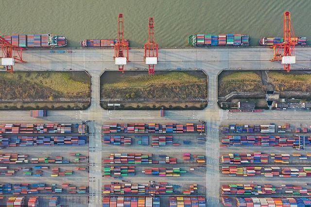
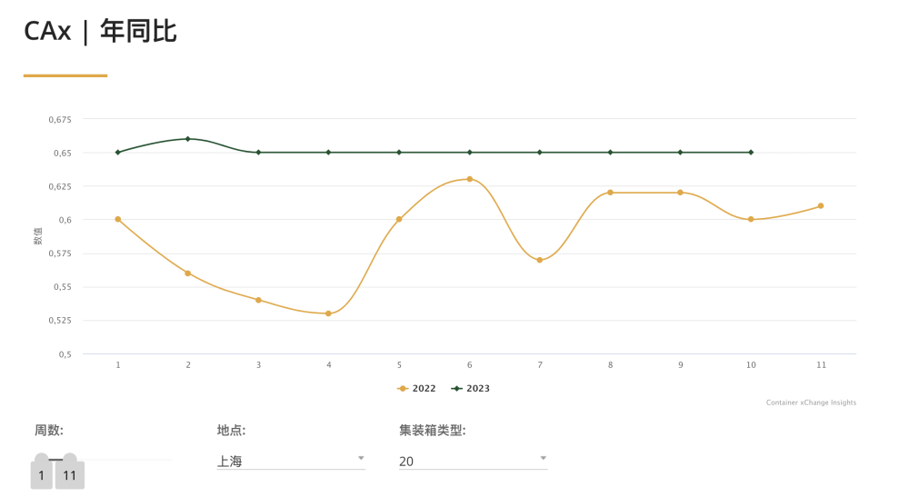
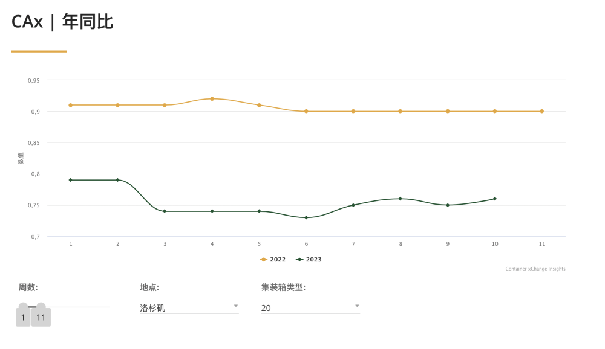

# 国内港口空箱堆积如山，业内：当下东南亚到欧美出口量快速上升

记者 | 白帆

编辑 | 殷宴

2021年，全球海运需求飙升，运价高涨、拥堵严重，用于海运运输的集装箱也成了紧俏货，一时间“一箱难求”，几乎重现了古时的“洛阳纸贵”。

然而，两年后，海运需求进入低点，运价跌回疫情前水平，全球运力和集装箱均严重过剩。在全球各大港口，空集装箱堆积如山。

堆积在港口的集装箱

“我们现在已经很少加班了。以前加班时，通常是上班12小时，休息12小时，现在是上班12小时，休息24小时。”在上海港开集装箱卡车的一位工作人员告诉界面新闻，如今港口有很多空集装箱，他们的工作量也因此受到影响。

另据财新报道，有集装箱航运人士称，当前全球集装箱规模超过5000万标准箱，集装箱过剩比例超过10%。

集装箱可用指数CAx也印证了这一点。据全球线上集装箱租赁和交易平台Container
xChange近日发布的数据，与过去三年相比，今年1月份中国港口的拥挤程度更高，这表明中国有更多的集装箱可用。

“有更多的集装箱可用”并不是一个好消息。

集装箱可用指数CAx由Container
xChange发布，是衡量港口进港集装箱与出港集装箱的比率，指数高于0.5，表明港口的进港集装箱多于出港集装箱，容易造成空箱在港口堆积的情况；指数低于0.5，则表明出港集装箱多于进港集装箱，从而形成“一箱难求”的局面。

Container xChange发布的报告还显示，与过去三年相比，上海、宁波、天津等港口的CAx指数保持高位。

具体来看，今年前10周，上海40英尺集装箱CAx的数值均高于去年同期，其中第二周达到0.66，之后几周稳定在0.64。

作为对比，2022年第三周，上海40英尺集装箱CAx的数值只有0.48，最高时也仅为0.59。

_Container
xChange数据显示，今年前10周，上海40英尺集装箱CAx的数值均高于去年同期。截图来自Container xChange_

_Container
xChange数据显示，今年前10周，上海20英尺集装箱CAx的数值均高于去年同期。截图来自Container xChange_

实际上，2022年拥堵情况已经开始大幅缓解，运价也在持续下滑，集装箱使用步入常规化状态。在“一箱难求”时期，上海港的集装箱可用指数长时间低于0.1，例如2021年11月底到12月初，该指数低达0.07。

在美国洛杉矶港，空箱堆积情况更为严峻。CAx指数显示，2023年前10周，洛杉矶40英尺集装箱CAx的数值维持在0.78以上，最高时达到了0.83。而在去年的前十周，这一数值最高达0.91。

另外，北欧的安特卫普港等也在0.8以上，意味着欧美消费地港口空箱堆积情况超过国内水平。

_Container
xChange数据显示，今年前10周，洛杉矶20英尺集装箱CAx的数值较去年有所下降，但依旧处在0.73-0.79的高位。截图来自Container
xChange_

**缓解堆积或许还需2、3个月**

对于集装箱过剩背后的原因，货代李先生告诉界面新闻，这主要是因为年前没有等来出口订单爆发，很多工厂提前放假，空集装箱没能及时转运出去，从而造成港口空箱积压，而年后本来就是淡季，出口量不高，于是空箱持续累积。

界面新闻曾报道，自今年春节后，船公司可能取消一半从亚洲出发的航班，这意味着春节期间中国出口的货量有所减少。

李先生还预计，要到5月份外贸才能迎来恢复，而按照往年情况，出口在3月之后就应该出现上涨。

另外，某海运公司员工告诉界面新闻，当下东南亚到欧美出口量快速上升，也是导致国内出口减少、空集装箱增多的因素之一。

全球第五大班轮公司赫伯罗特首席执行官曾表示，尽管当前集装箱运费继续下行，但随着补库存需求的增加，商品和运输服务的订单量将再次回升。他预计回暖或将在3月或6月发生。

除此之外，集装箱制造企业在过去一两年内大量生产集装箱，2021年全球生产了超过700万标准箱集装箱，是常规年份的近3倍。

作为全球最大的集装箱生产商，中集集团在2021年因为生产集装箱“赚翻了”。

中集集团财报数据显示，2021年营收达1637亿元，同比增长73.85%，归属于母公司股东及其他权益持有者的净利润达66.65亿元，同比上升24.59%，是该公司成立以来的最好业绩。

但到了2022年，情况就出现了显著变化。财报显示，2022年上半年，中集集团集装箱制造业务实现营业收入227.68亿元，同比下降17.06%；净利润30.53亿元，同比下降30.51%。

中集集团表示，这主要是受地缘政治事件及海外通胀加剧等因素的影响，全球经济、贸易放缓，海运集装箱的需求从2021年的历史高位逐渐回归正常。据中集集团2022年度业绩预告，该公司去年归母净利润预计同比下降43%-55%。

与此同时，港口拥堵情况自去年以来逐步缓解，空箱周转率提升，也加剧了集装箱过剩的现象。

根据德路里发布的《港口与码头洞察报告》最新调查结果，全球范围内，2020－2022年船舶在港口的排队时间显著高于新冠疫情前的水平。2019年，排队时间超过船舶在港总时长的17%，2021年和2022年，待泊时间增加到总时长的25%以上。德路里预计，2023年船舶待泊时间和港口运营状态将恢复到疫情前的水平。

集装箱过剩将带来一系列后续影响。Container
xChange在其发布的《2023年的23个航运业趋势》中分析称，随着市场中集装箱过剩，航运公司要么继续减少船舶运力，要么继续空船航行。例如，马士基一直在调整亚洲至其它大陆的运力，在这种情况下，预计2023年海运业将迎来价格战。

