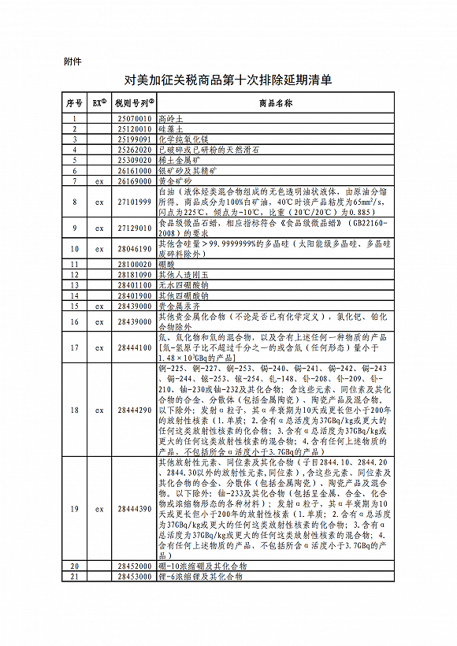
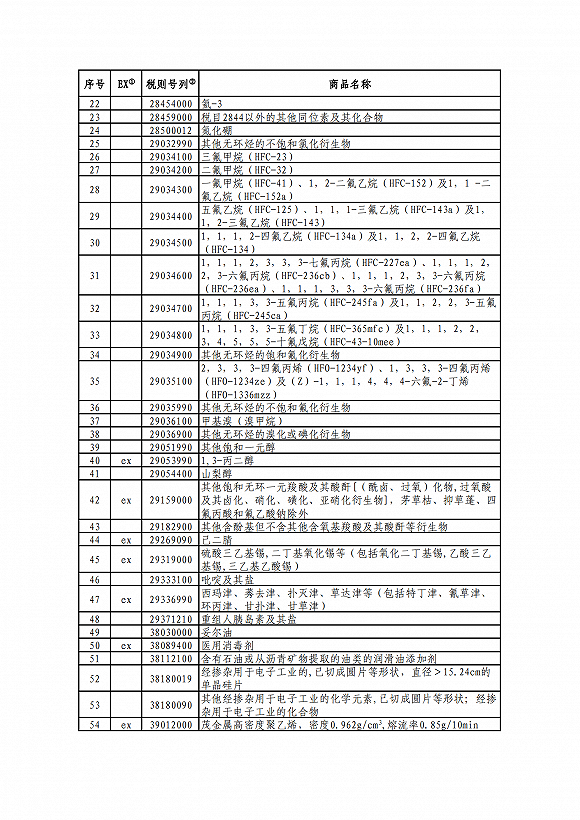
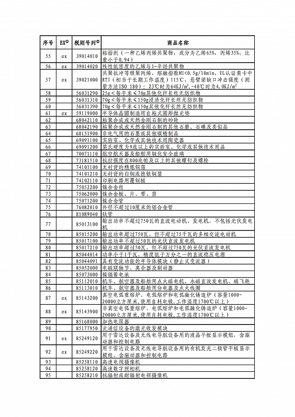
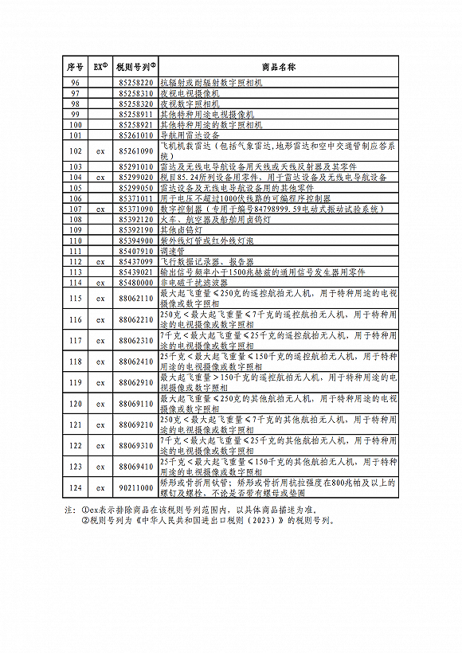

# 国务院关税税则委员会公布对美加征关税商品第十次排除延期清单

据财政部网站2月15日消息，经国务院批准，国务院关税税则委员会公布对美加征关税商品第十次排除延期清单，对《国务院关税税则委员会关于对美加征关税商品第八次排除延期清单的公告》（税委会公告2022年第7号）中的相关商品，延长排除期限，自2023年2月16日至2023年9月15日，继续不加征我为反制美301措施所加征的关税。

