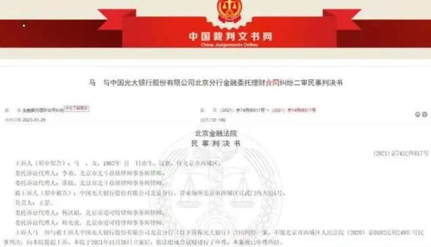

# 女子银行买基金，花110万亏近50万！法院判银行赔30万

每经编辑：李泽东

在银行买基金亏了算谁的？只能自认倒霉么？

近日，中国裁判文书网公布了一纸金融委托理财合同纠纷二审民事判决，也许会给投资者一个重要提醒。

据介绍，本起案件的原告方是北京的一位“60后”投资者马女士，被告方是光大银行北京分行。

据马女士描述， **自己当初花了110万元在光大银行购买的基金，持有三年亏损近50万元。**
马女士无法接受这个事实，并将光大银行告上法庭，要求赔偿自己遭受的巨大理财损失。

案件前后经过两次审理，
**一审法院驳回了马女士的赔偿诉求，但二审判决出现了大逆转，法院改判光大银行北京分行赔偿马女士30万元投资损失，同时，裁定这一判决为终审判决。**

据介绍，2015年，马女士斥资110万元从光大银行北京分行认购了一只股票型基金。她持有这只基金三年，于2018年4月将基金赎回，收到赎回款为61.32万元。也就是说，花110万元购买并持有该基金三年时间，马女士最后亏损了48.68万元，收益率为-44.25%。

根据中国裁判文书网公布的这纸民事判决书，
**2015年4月，马女士申请认购案涉“光大金控泰石3号股票型证券投资基金”（下称“泰石3号”），并填写《申请书》。**

马女士主张，2015年3月光大银行就其阳光理财产品“多利宝”而针对马女士所做的 **客户适合度问卷调查表** ，
**根据该调查表，马女士属于稳健型投资者。而诉争基金《说明书》中载明泰石3号基金风险收益特征为：本基金呈现较高风险、较高收益的风险收益特征。**

**经二审庭审确认，光大银行认可案涉投资产品为较高风险型，与马女士风险评估不匹配。但光大银行主张，基于其银行内部的业务规则，投资人只要承诺愿意自担风险，也可以购买较高风险等级的产品。**

《证券投资基金销售适用性指导意见》第31条规定：“基金销售机构应当在基金认购或申购申请中加入基金投资人意愿声明内容，对于基金投资人主动认购或申购的基金产品风险超越基金投资人风险承受能力的情况，要求基金投资人在认购或申购基金的同时进行确认，并在销售业务信息管理平台上记录基金投资人的确认信息。”第32条规定：“禁止基金销售机构违背基金投资人意愿向基金投资人销售与基金投资人风险承受能力不匹配的产品。”

经查，马女士填写的《申请书》为光大银行提供的格式文本，文本上虽打印了“超过本人风险承受能力，自愿承担风险”字样，但该栏中签字处并无马女士确认信息，该字样本身亦无加黑加粗或其他显著提示。

虽在该制式表格末尾一栏中有加黑的内容，即“本人已详细阅读本集合资产管理计划的合同、产品说明书等信息，及本申请书背面的投资者须知及风险提示，接受合同、招募说明书法律条款及投资者须知相关内容，了解所享有的权利和应承担的义务，了解并承担证券公司资产管理计划投资风险，自愿申请办理光大银行代理的上述证券公司集合资产管理业务，并保证提供的信息资料真实有效”，且该栏处有马女士签字，但该内容本身并不涉及超出本人风险承受能力的特别说明。

最终，二审法院撤销了一审判决， **改判光大银行北京分行赔偿马女士30万元投资损失** 。同时，裁定这一判决为终审判决。

每日经济新闻综合红星新闻、中国裁判文书网

每日经济新闻

