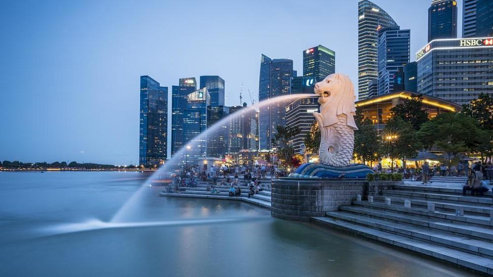

# 新加坡又要给国民“发钱”：推784亿美元新预算，缓解生活压力

新加坡副总理兼财政部长黄循财2月14日推出该国新财政预算案，该预算案着重于协助各阶层的新加坡人缓解生活费用高涨的焦虑，并着眼于提高该国竞争力。

据彭博社2月14日报道，这份预算案将帮助该国公民面对不断上涨的生活成本、更高的商品税和服务税。有分析师指出，新加坡的通胀率正处于高位，解决生活成本问题将有助于刺激新加坡本地消费，政府关注就业机会的创造、增加补贴支出有助于刺激消费领域的股票上涨。

这份财政预算案支出达784亿美元（约合人民币5368亿元）。彭博社称，该预算案旨在推动新加坡人迈向“后新冠时代”，并缓解近期困扰社会的生活成本压力问题。

新加坡《联合早报》15日社论称，新加坡疾病暴发应对系统警戒等级13日下调至绿色，并取消已推行三年的强制戴口罩措施，标志着新加坡迈入“后疫情时代”。尽管新加坡似乎比较平稳地度过了三年疫情危机，但全球供应链中断、保护主义与逆全球化的浪潮加剧、高通货膨胀、经济增长拖缓、俄乌冲突等问题仍然显著，新加坡难以避免“残酷的通胀”问题。

在新的预算案中，黄循财宣布，为了缓解生活成本上涨的压力，政府将提高消费税补助券金额，2023年最高补助从500新元（约合2567元）增至700新元，2024年再进一步调高至850新元。此外，在“定心与援助配套下”，政府将给予民众生活费特别补助，从200新元至400新元不等，根据税收情况而定；政府还将提高明年派发的邻里购物券金额，每户家庭可获得300新元。

《联合早报》称，在新加坡今年的财政预算案中，各个阶层的民众都将获得不同形式的援助与补贴。黄循财更强调，面对全球日益增长的经济民族主义以及保护主义，新加坡这个“外向型的小经济体”必须做出调整，在经济领域重新定位。

