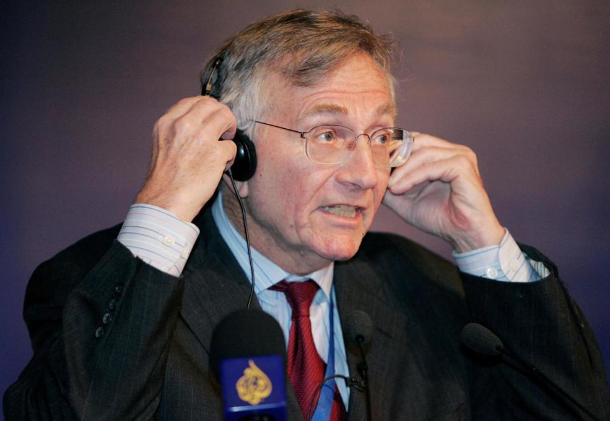

# 爆料人又开口：“北溪”下放的8枚炸弹仅6枚爆炸，因拜登此前一决定

【环球网报道 见习记者
李律杉】据俄罗斯卫星通讯社报道，普利策奖得主、美国资深调查记者西摩•赫什当地时间14日在接受德媒采访时，就“白宫下令炸毁‘北溪’管道”曝出更多细节。赫什透露，由于美国总统拜登推迟了这次特别行动，而且炸弹在水下浸泡时间过长，导致放置在“北溪”管道下方的8枚炸弹中只有6枚爆炸。

_美国资深调查记者西摩·赫什 资料图_

报道称，赫什在接受德国《柏林报》采访时引用了一位不具名消息人士的话说，“2022年9月底，放置在波罗的海博恩霍尔姆岛水底的8枚炸弹被引爆，其中6枚成功爆炸了。这就是我想讲的故事。”他还补充说，其中2枚炸弹之所以没有爆炸，是因为它们被放置在水下的时间太长了，而这又源于拜登推迟了管道破坏行动。

赫什还表示，白宫团队很清楚，他们可以使用C4炸药来炸毁“北溪”管道。他还补充说，他们可以通过水下水声仪器远程引爆。根据赫什的说法，2022年1月初，这个选项被报告给了白宫，两到三周后，美国副国务卿纽兰本人亲自表示，华盛顿“可以这么做”。

报道提到，赫什告诉媒体，此次行动是最高机密，美国总统不应该告诉任何人美国有能力去做这件事，但“他喜欢说话，有时会说一些他不应该说的话。”他还说，德国总理朔尔茨（得知后）并没有明确反对，立场表达得非常“模糊”。

此外，这位记者还补充称，拜登之所以决定继续这项行动，是因为担心德国可能会解除针对俄罗斯在乌克兰特别军事行动而实施的制裁。“我认为做出这一决定的原因是战争对西方不利，他们害怕即将到来的冬天。‘北溪-2’项目是德国自己叫停的，而不是受到国际制裁影响，而且美国担心德国会因为冬天寒冷而取消制裁。”赫什继续说，“拜登决定让德国人在今年冬天挨冻。美国总统宁愿让德国挨冻，也不愿德国停止支持乌克兰”。

赫什2月8日曾在个人网站上发文称，“北溪”管道的爆炸是一起由白宫下令、美国中央情报局实施的秘密行动。赫什在报道中称，美国总统拜登在很早前就定下了“破坏‘北溪’管道的决定”，并和美国情报部门进行了长达九个月的讨论，最终决定在2022年6月的北约海上演习期间，借着演习部队的掩护在“北溪”管道上放置了远程遥控炸弹，并由一同合作的挪威在三个月后完成起爆。

这一猛料爆出后不久，迅速引起俄罗斯和欧洲多国媒体的关注。美国白宫国家安全委员会发言人艾德丽安•沃森当天通过邮件对媒体表示，赫什揭露拜登和美方人员秘密炸毁“北溪”管道的文章“完全虚假和纯属捏造”。

俄罗斯总统新闻秘书、克里姆林宫发言人佩斯科夫9日表示，美国调查记者西摩•赫什关于“华盛顿参与北溪管道爆炸”的报道再次表明，有必要对有关事件进行公开的国际调查，并惩罚肇事者。而据俄罗斯卫星通讯社等多家俄媒消息，俄罗斯外交部长拉夫罗夫12日表示，美国官员承认他们应该为“北溪”天然气管道爆炸事件负责，“事实上，美国官员承认，‘北溪’和‘北溪-2’发生的爆炸是他们所为。”

