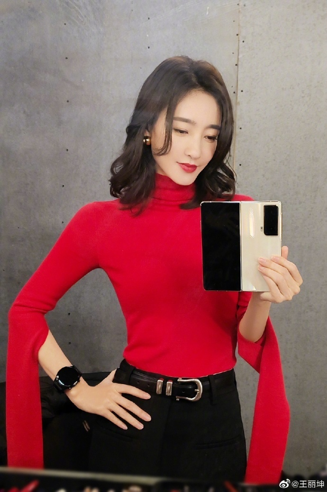
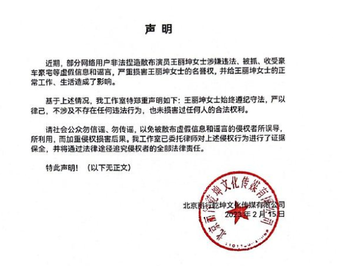
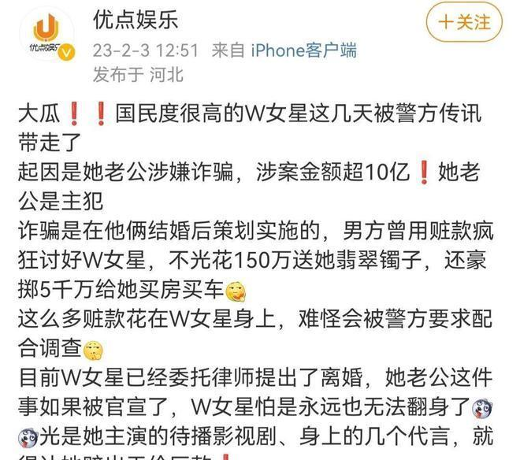
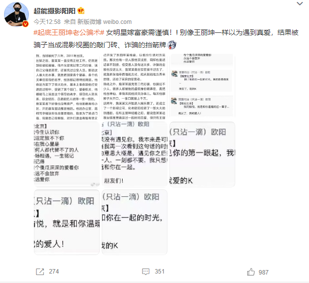
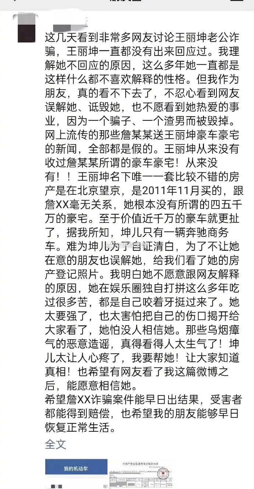
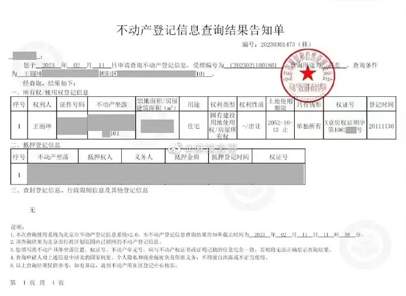
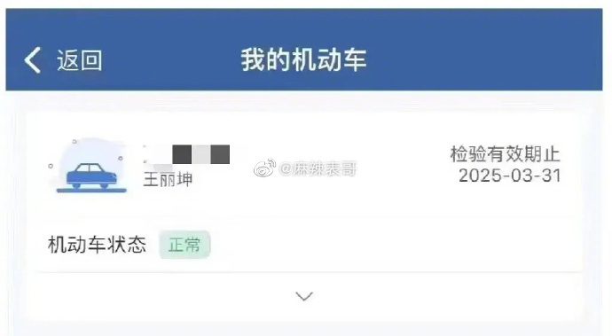
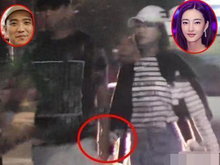
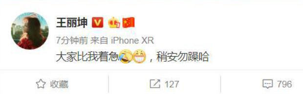

# 王丽坤方发声明否认违法被捕：收受豪车豪宅等系虚假信息和谣言

2月15日，王丽坤工作室发声明就近期风波辟谣。

声明如下：

近期，部分网络用户非法捏造散布演员王丽坤女士涉嫌违法、被抓、收受豪车豪宅等虚假信息和谣言。严重损害王丽坤女士的名誉权，并给王丽坤女士的正常工作、生活造成了影响。

基于上述情况，工作室特郑重声明如下：王丽坤女士始终遵纪守法，严以律己，不涉及不存在任何违法行为，也未损害过任何人的合法权利。

请社会公众勿信谣、勿传谣，以免被散布虚假信息和谣言的侵权者所误导，所利用，而加重侵权损害后果。我工作室已委托律师对上述侵权行为进行了证据保全，并将通过法律途径追究侵权者的全法律责任。

据悉，本月初有狗仔爆料称，W姓女星这几天被警方传唤，起因是其老公涉嫌诈骗，金额超10亿，因为诈骗是两人婚后实行的，所以女方也有责任。

狗仔称，女方现在已上诉离婚，担心此事影响她的事业。

到了2月15日，曝光陈飞宇私密照的狗仔曝光女方老公的身份信息，称其曾在18年前涉嫌金融诈骗进去过，出来后又故技重施，去年11日底被捉。

此外，疑似王丽坤的好友发声表示，指王丽坤也被蒙在鼓里，网传富商老公送车送房都是假的，王丽坤唯一的房产，是2011年出资买的北京房子，并没有四五千万，千万豪车也是假的，只有一辆百万的商务车。

该网友还公开王丽坤房产查询信息，显示王丽坤只有一套房产，机动车也只有一辆。

该好友发文可信度非常高，不过这种涉及隐私的东西，应该只有本人和至亲才可以查询吧？

值得一提的是，王丽坤从未承认自己已婚，此前曾和林更新传绯闻，2019年10月被指与富商领证，当时王丽坤没有否认：“大家比我着急，稍安勿躁哈。”

时隔4年物是人非，王丽坤发声明否认违法、被抓，但没有回应与富商的关系。

