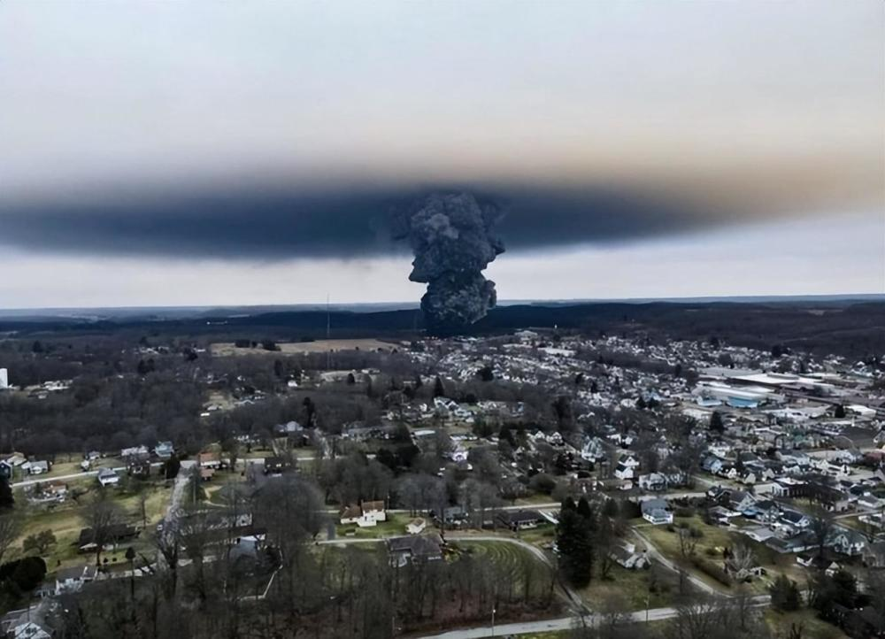
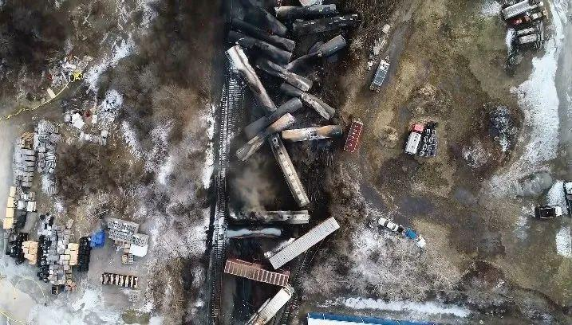
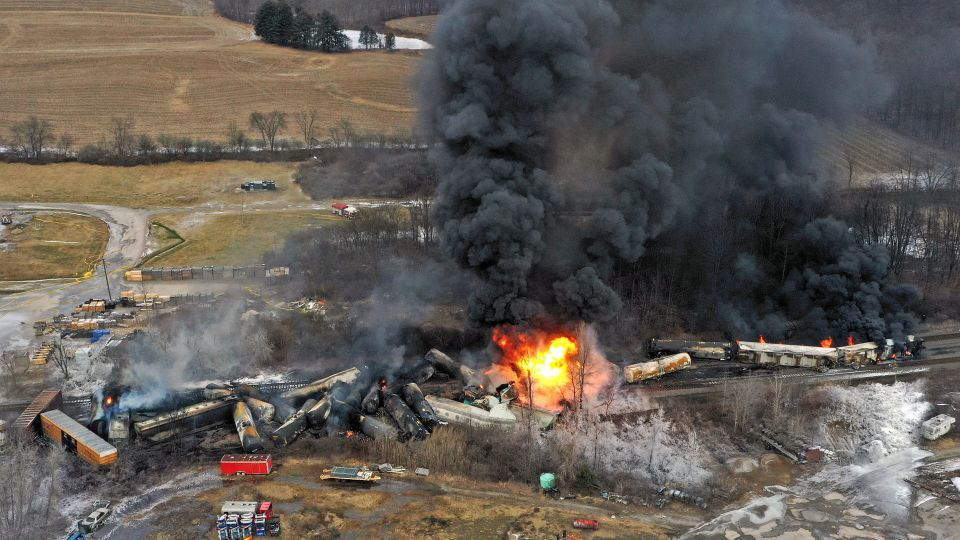

# 美国俄亥俄货车脱轨事故，跨国监督跑偏了

**先下结论，再设法为这些早已确定的结论网罗论据，这种“有矢放的”的做法，在报道外埠所发生的本土性事件时，偏差值往往会被更大程度放大。**

**冰川思想库特约撰稿丨陶短房**

2月13日下午，中文互联网疯传“俄亥俄化工灾难，半个美国面临灭绝”。随后，“俄亥俄”冲上了当天新浪微博热搜第一位。

图/微博

很多中文媒体和自媒体纷纷跟进“报道”此事，内容大同小异，诸如“致命毒云漫天，民众生死撤离！”“这是美国的切尔诺贝利！”“可怕！美国隐瞒切尔诺贝利级别的化学泄漏事故！”在社交媒体上疯传。

与此相应另一个场面，却是美国当地媒体对该事故的报道显得有些“不热”。

那么，这件事情的实际情形又是如何？

01

当地时间2月3日晚，一列运载有毒化学品的列车在美国俄亥俄州东部脱轨，引发大火。

出事列车属于美国铁路运营商 Norfolk Southern，在行驶到俄亥俄州东部邻近宾夕法尼亚州的小镇东巴勒斯坦城时，因“机车车轴的机械问题”发生脱轨。

**该列货车共有 150多节车厢，其中20节装有危险品。脱轨车厢约50节，其中包括10节装载危险品的车皮。**
在这些装有危险品的车皮中，有5节装的是压缩氯乙烯，另4节分别装有乙二醇单丁醚、丙烯酸乙基己酯、异丁烯和丙烯酸丁酯等危险品。

2月12日，铁路运营商Norfolk
Southern提供给美国环境保护署的通报中称，载有丙烯酸丁酯和丙烯酸乙基己酯的车皮在脱轨后破损，“所有或部分化学物质在事故中挥发”，但最危险的压缩氯乙烯因车皮未破损，仅发生“闷烧”。

根据《国际化学安全计划》，氯乙烯燃烧时会分解成氯化氢和光气。其中，光气是一种窒息性有毒气体，第一次世界大战时曾被用作化学武器，但此后被更有效的化武所替代；氯化氢“对与之接触的任何组织都有刺激性和腐蚀性”。

美国环境保护署称：

急性接触空气中高浓度氯乙烯与中枢神经系统影响有关，长期接触已被证明会导致肝损伤，包括一种罕见的肝癌。

从2月8日、尤其2月12日之后，中文舆论圈开始明显提升对此事的聚焦热度，将焦点主要对准“是否存在对公众隐瞒真相和人为压制舆情”，以及“污染严重程度是否被刻意压低”两点上。

**事实上，这些质疑可能都出于某种原因所产生的曲解。**

2月3日事发后，包括CNN、NPR和《今日美国报》等以“抢快”著称的美国媒体就已及时大篇幅报道此次事故，其它主要媒体虽然篇幅不大，但也都报道了。

▲CNN于当地时间2月4日对火车脱轨事件的报道（图/网络）

当时新闻报道之所以没引发什么热度，主要因为此次事故无死无伤，最初也未披露车皮装载了什么货物，这也就没有引起公众的重视。

2月5日，俄亥俄州州长德温办公室发表声明，首次承认车皮内出现“剧烈温度变化”，“可能发生灾难性事故”，并敦促事发地点半径1英里范围内所有人立即疏散。
**东巴勒斯坦是个只有4880人口的小镇，被要求疏散的居民约1500-2000人。**

同日，东巴勒斯坦市长康纳威宣布东巴勒斯坦进入紧急状态。

但直至此时，脱轨车皮上究竟有什么也仍然未确切披露。

2月6日，约300名仍未疏散的当地居民目击到脱轨现场出现“蘑菇云”。

2月8日，居民被告知可以返回住所。部分居民返回住所后感到“有异味、头痛、恶心和其他不适”，纷纷投书媒体或在网上披露。

与此同时，当他们得知有关部门6日对侧翻装载危险化学品的车皮进行了“受控燃烧”，恐慌情绪和各种传闻就此蔓延，一度有小道消息称“脱轨爆炸的装载氯乙烯车皮有14节之多”。

2月10日，美国环境保护署向铁路运营商Norfolk Southern 发出“潜在责任的总通知”，指控Norfolk
Southern对环境可能遭受的破坏负有责任。

同日，美国环境保护署公布了对事故周边环境的第一份测评报告。而Norfolk Southern对美国环境保护署的答复则是在2月12日公布的。

▲俄亥俄州东部脱轨的列车（图/网络）

**美国主流媒体和自媒体对这起事故的关注，围绕在2月3日、2月8日和2月12日三个时间节点。**
这三个时间节点分别对应脱轨、公众在“受控燃烧”后感到普遍不适、以及环评初步结论曝光。

就当地舆情惯例而言，这是正常的，美国环境保护署的介入也中规中矩，至少台面上挑不出什么毛病，而州、市两级行政当局和责任企业第一时间未披露车上所装载货物情况，则是有明显过错的。

但“大问题”恐怕不在于此。

02

中文圈流传的“蘑菇云”照片实际上是6日及之后对侧翻、“闷烧”的装载危险品车皮进行“受控燃烧”后产生的，并非2月3日脱轨的即时图像。当地媒体有刊出无人机2月4日拍摄的侧翻现场，当时图像显示，至少一节车皮仍在“闷烧”。

美国环境保护署2月12日报告称，已调查了事故现场附近土壤、地表水和空气污染情况，“在周围地区和俄亥俄州其它一些取样点河流溪水中监测到疑似事故现场泄漏的化学物质”，但“未检测到事故发生期间或之后所释放的有害物质达到任何‘令人担忧的程度’”。

俄亥俄州自然资源厅官员对媒体表示，估计截至2月8日，此次事故已导致东巴勒斯坦以南7.5英里的溪流中至少3500条鱼死亡。

截至12日，已有至少4桩针对铁路运营商 Norfolk
Southern的集体诉讼，指控其“疏忽大意”，该公司也在10日表示“在溪流中安装了水坝和水旁路系统，以防止污染下游水域”。

▲正在燃烧的脱轨列车（图/网络）

面对来自四面八方的质疑和责难，该公司称“未来会对美国环境保护署负责，并将继续执行或资助环境监测和修复”。

**至少从台面上，事故善后已进入“走流程”阶段** ，在媒体和公众密集关注，以及北美活跃的环保团体介入下，“打闷包”处理的难度不是一般得大。

鉴于“蘑菇云”实际上是事故发生3天后“受控处理”的一部分，此次事故所造成的环境后果，至少不会像某些“江湖传说”那样大，因此这也并非“大问题”之所在。

03

既然如此，中文圈的关注焦点是如何发生大幅度偏移的？

客观上，美国当地在此事上出现“舆情事故”和公信力流失，对中文圈“对焦”起到干扰作用。

2月8日，美国媒体NewsNation称，当天记者兰伯特在“试图报道事故真相”时遭到“粗暴对待”，在东巴勒斯坦学校体育馆新闻发布会现场被俄亥俄州公路巡逻队以“拘捕”和“非法侵入”罪名强行按倒逮捕并当场带走，随后被保释。
**NewsNation宣称该记者因为“揭露真相”而被捕，引起网上高度关注。**

▲NewNation对兰伯特事件的报道（图/网络）

2月12日，美国网红博主格林冠以“俄亥俄州东巴勒斯坦正经历一场生态灾难，当局炸毁了满载危险化学品的脱轨车皮，媒体人因试图报道真相而被捕”的视频贴引来380万次点击。NewsNation账号更是火爆，短时间点击数竟超过790万次。

一时间舆论对州、市行政当局的质疑铺天盖地，迫使州长德温出面澄清并表示“非常非常抱歉”。

但随后，新闻发布会现场的图文、视频相继流出，这些“旁证”显示，当天在东巴勒斯坦学校体育馆现场聚集了许多媒体记者和自媒体，被“粗暴对待”的仅此一人。
**兰伯特也并非因“试图报道事故真相”被粗暴对待，而是因为不明原因和新闻发布会主持人及现场保安发生冲突。**

按照《新闻周刊》的看法，地方两级行政部门、警方和发布会组织者的做法“不当”，但“现场是一个充满各路记者的空间，警察和官员阻止真相被报道的可能性很小”，且“当事人因报道真相而被捕的说法”虽吸引眼球，但“具有误导性”，“至少不能反应事实真相的全部”。

**无论“兰伯特事件”真相如何，都在很大程度上掀起了美国公众 “黑幕论”的传闻热潮，并对包括中文圈在内舆情造成了了影响。**

由于2月5日俄亥俄州长德温下达疏散令，6日对侧翻装有危险品车皮进行“受控点燃”，均未向公众如实公布车皮中装有危险品的真相和细节。

公众是在8日回家后感到不适，尤其美国国家环境保护署10日对运营商 Norfolk
Southern公开发送“潜在责任的总通知”后，公众才惊悉事件真相。此时距事故发生已一周，距“受控点燃”也已4天，而居民就在浑不知风险情况下“裸奔”，并且在环评尚未完成情况下就返回家园。

▲东巴勒斯坦小镇中的俄亥俄州国民警卫队（图/网络）

**这就引发了当地居民、企业对地方当局、主管部门、环评机构及其数据、结论公信力的极大怀疑。**
几天来针对责任单位的集体、个人诉讼纷至沓来，这在客观上也容易使远离事件中心的海外舆论关注点被带偏。

主观上，许多中文圈一些自媒体和媒体人对北美社会，尤其北美“微观社会”了解浮光掠影，有时会不自觉以个人爱憎为出发点，对信息源和信息进行“定向筛选”，以“是否合乎心意”作为评判信息源是否可靠可采的标尺。

先下结论，再设法为这些早已确定的结论网罗论据，这种“有矢放的”的做法，在报道外埠所发生的本土性事件时，偏差值往往会被更大程度放大。

