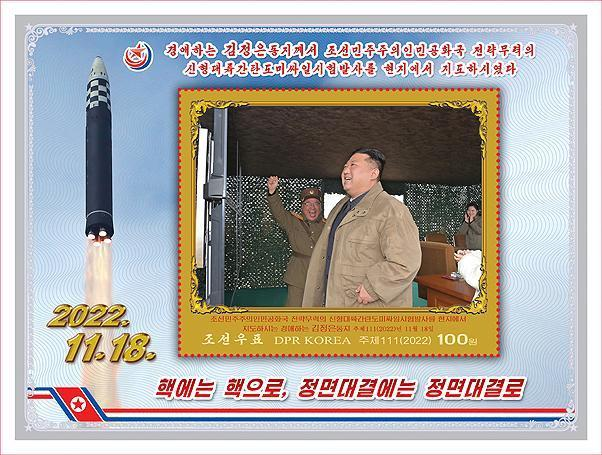

# 金正恩女儿将首登朝鲜邮票：与父亲手挽手，亲临武器试射场

朝鲜邮票社将于2月17日发行一组新邮票，其中包含朝鲜最高领导人金正恩携女儿亲临武器试射场等画面。韩联社称，这将是金正恩的女儿首次登上朝鲜邮票。

据朝鲜邮票社介绍，这组邮票主要是与“火星炮—17”型新型洲际弹道导弹试射成功有关，共有8种类型。

韩联社报道称，金正恩的女儿亮相其中5种邮票，二人的照片背景多为导弹，或手牵手并排走，或挽着手臂拍照，或与士兵合影。其余3种邮票中，还有1种是金正恩的照片，有2种是导弹照片。

部分邮票图片如下：

_金正恩携女儿同在“火星炮—17”型新型洲际弹道导弹试射中作出卓绝贡献的人员合影留念。图文来源：朝鲜邮票社_

_图片来源：朝鲜邮票社_

_图片来源：朝鲜邮票社_

_金正恩携女儿亲临历史性重要战略武器试射场，并指导试射全过程。图文来源：朝鲜邮票社_

_图片来源：朝鲜邮票社_

_金正恩现场指导新型洲际弹道导弹试射。图文来源：朝鲜邮票社_

（来源：中新社）

